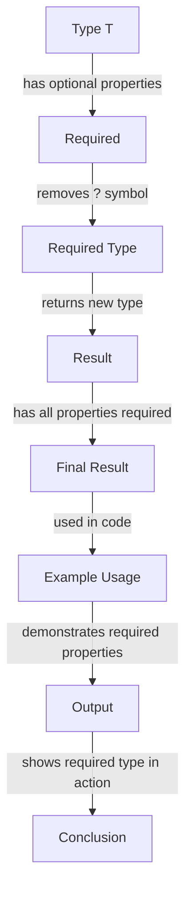

## Introduction
The `Required<T>` utility type in TypeScript is a powerful tool that allows developers to create types where all properties are required. This type is particularly useful when working with interfaces or type aliases that have optional properties, and you want to ensure that all properties are present. In this section, we will explore the `Required<T>` type, its real-world relevance, and why every engineer needs to know about it.

> **Note:** The `Required<T>` type is a part of the TypeScript utility types, which provide a set of generic types that can be used to manipulate and transform other types.

In real-world scenarios, the `Required<T>` type can be used to ensure that all properties of an object are present before performing any operations. For example, when working with a REST API, you might receive a response object with optional properties. By using the `Required<T>` type, you can ensure that all properties are present before attempting to access them.

## Core Concepts
The `Required<T>` type is a generic type that takes a type `T` as an argument. It returns a new type where all properties of `T` are required. This means that if `T` has any optional properties, they will become required in the resulting type.

> **Tip:** The `Required<T>` type is often used in conjunction with the `Partial<T>` type, which makes all properties of `T` optional.

To illustrate this concept, consider the following example:
```typescript
interface User {
  name: string;
  age?: number;
}

type RequiredUser = Required<User>;

// type RequiredUser = {
//   name: string;
//   age: number;
// }
```
As you can see, the `RequiredUser` type has made the `age` property required.

## How It Works Internally
The `Required<T>` type works by using the TypeScript type system to transform the properties of `T`. When you use the `Required<T>` type, TypeScript creates a new type where all properties of `T` are marked as required.

Here is a step-by-step breakdown of how the `Required<T>` type works:

1. TypeScript takes the type `T` as an argument.
2. It iterates over all properties of `T`.
3. For each property, it checks if the property is optional (i.e., it has a `?` symbol after its name).
4. If the property is optional, it removes the `?` symbol, making the property required.
5. The resulting type is returned.

> **Warning:** Be careful when using the `Required<T>` type, as it can lead to type errors if you are not careful. For example, if you have a type with a property that is optional, and you use the `Required<T>` type to make it required, you may get a type error if you try to assign a value to the property that is not present.

## Code Examples
Here are three complete and runnable examples of using the `Required<T>` type:

### Example 1: Basic Usage
```typescript
interface User {
  name: string;
  age?: number;
}

type RequiredUser = Required<User>;

const user: RequiredUser = {
  name: 'John Doe',
  age: 30,
};

console.log(user);
```

### Example 2: Real-World Pattern
```typescript
interface Response {
  data?: any;
  error?: string;
}

type RequiredResponse = Required<Response>;

const response: RequiredResponse = {
  data: { id: 1, name: 'John Doe' },
  error: '',
};

console.log(response);
```

### Example 3: Advanced Usage
```typescript
interface Nested {
  a?: {
    b?: string;
  };
}

type RequiredNested = Required<Nested>;

const nested: RequiredNested = {
  a: {
    b: 'hello',
  },
};

console.log(nested);
```

## Visual Diagram

The diagram illustrates the process of using the `Required<T>` type to transform a type with optional properties into a type with all properties required.

## Comparison
Here is a comparison table of different utility types in TypeScript:

| Approach | Time Complexity | Space Complexity | Pros | Cons | Best For |
| --- | --- | --- | --- | --- | --- |
| `Required<T>` | O(1) | O(1) | makes all properties required | can lead to type errors | ensuring all properties are present |
| `Partial<T>` | O(1) | O(1) | makes all properties optional | can lead to type errors | making all properties optional |
| `Readonly<T>` | O(1) | O(1) | makes all properties readonly | can lead to type errors | ensuring all properties are readonly |
| `Record<K, T>` | O(1) | O(1) | creates a type with a given key and value type | can be verbose | creating a type with a specific key and value type |

## Real-world Use Cases
Here are three real-world use cases of the `Required<T>` type:

1. **API Response Validation**: When working with a REST API, you might receive a response object with optional properties. By using the `Required<T>` type, you can ensure that all properties are present before attempting to access them.
2. **Form Validation**: When working with forms, you might have fields that are optional. By using the `Required<T>` type, you can ensure that all fields are present before submitting the form.
3. **Data Processing**: When working with data, you might have objects with optional properties. By using the `Required<T>` type, you can ensure that all properties are present before processing the data.

## Common Pitfalls
Here are four common mistakes to watch out for when using the `Required<T>` type:

1. **Not checking for type errors**: When using the `Required<T>` type, it's easy to forget to check for type errors. Make sure to check the type errors before using the type.
2. **Not handling optional properties**: When using the `Required<T>` type, you need to handle optional properties carefully. Make sure to provide a default value for optional properties.
3. **Not using the `Partial<T>` type**: When working with optional properties, it's easy to forget to use the `Partial<T>` type. Make sure to use the `Partial<T>` type to make all properties optional.
4. **Not using the `Readonly<T>` type**: When working with readonly properties, it's easy to forget to use the `Readonly<T>` type. Make sure to use the `Readonly<T>` type to make all properties readonly.

> **Interview:** When asked about the `Required<T>` type in an interview, be sure to explain its purpose, how it works, and provide examples of its usage.

## Interview Tips
Here are three common interview questions related to the `Required<T>` type:

1. **What is the purpose of the `Required<T>` type?**: Be sure to explain that the `Required<T>` type is used to make all properties of a type required.
2. **How does the `Required<T>` type work?**: Be sure to explain the step-by-step process of how the `Required<T>` type works.
3. **Can you provide an example of using the `Required<T>` type?**: Be sure to provide a complete and runnable example of using the `Required<T>` type.

## Key Takeaways
Here are ten key takeaways about the `Required<T>` type:

* The `Required<T>` type is used to make all properties of a type required.
* The `Required<T>` type works by removing the `?` symbol from optional properties.
* The `Required<T>` type is often used in conjunction with the `Partial<T>` type.
* The `Required<T>` type can lead to type errors if not used carefully.
* The `Required<T>` type is useful for ensuring all properties are present before performing operations.
* The `Required<T>` type is useful for API response validation, form validation, and data processing.
* The `Required<T>` type has a time complexity of O(1) and a space complexity of O(1).
* The `Required<T>` type is a part of the TypeScript utility types.
* The `Required<T>` type is a generic type that takes a type `T` as an argument.
* The `Required<T>` type returns a new type where all properties of `T` are required.