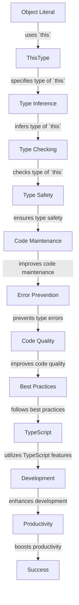

## Introduction
The `ThisType<T>` utility type in TypeScript is a powerful tool for typing the `this` keyword in object literals. It allows developers to specify the type of `this` in a given context, enabling more accurate and expressive type checking. In this section, we'll explore what `ThisType<T>` is, why it matters, and its real-world relevance.

> **Note:** The `ThisType<T>` type is particularly useful when working with object literals, as it helps TypeScript understand the context in which the object is being used.

In real-world scenarios, `ThisType<T>` is essential when developing complex applications that involve object literals, such as React components, Redux reducers, or Angular services. By using `ThisType<T>`, developers can ensure that their code is type-safe and maintainable.

## Core Concepts
To understand `ThisType<T>`, let's break down its core concepts:

* **`this` keyword:** The `this` keyword refers to the current execution context of a function or method. In object literals, `this` can be used to access properties and methods of the object.
* **Type inference:** TypeScript can infer the type of `this` based on the context in which the object literal is used. However, in some cases, type inference may not be sufficient, and explicit type annotation is required.
* **`ThisType<T>`:** The `ThisType<T>` type is a utility type that allows developers to specify the type of `this` in a given context. It takes a type parameter `T`, which represents the type of `this`.

> **Warning:** Without `ThisType<T>`, TypeScript may not be able to infer the correct type of `this`, leading to type errors and potential bugs.

## How It Works Internally
Let's dive deeper into how `ThisType<T>` works internally:

1. **Type parameter `T`:** The type parameter `T` represents the type of `this`. When using `ThisType<T>`, developers must specify the type of `this` explicitly.
2. **Type inference:** When using `ThisType<T>`, TypeScript will infer the type of `this` based on the context in which the object literal is used.
3. **Type checking:** TypeScript will perform type checking on the object literal, ensuring that the type of `this` matches the specified type `T`.

> **Tip:** To get the most out of `ThisType<T>`, use it in conjunction with other TypeScript features, such as type inference and type guards.

## Code Examples
Here are three complete and runnable code examples that demonstrate the use of `ThisType<T>`:

### Example 1: Basic usage
```typescript
interface Person {
  name: string;
  age: number;
}

const person: ThisType<Person> = {
  name: 'John Doe',
  age: 30,
  sayHello: function(this: Person) {
    console.log(`Hello, my name is ${this.name} and I am ${this.age} years old.`);
  },
};

person.sayHello(); // Output: Hello, my name is John Doe and I am 30 years old.
```

### Example 2: Real-world pattern
```typescript
interface ReduxAction {
  type: string;
  payload: any;
}

interface ReduxReducer {
  (state: any, action: ThisType<ReduxAction>): any;
}

const reducer: ReduxReducer = (state, action) => {
  switch (action.type) {
    case 'INCREMENT':
      return state + action.payload;
    case 'DECREMENT':
      return state - action.payload;
    default:
      return state;
  }
};

const action: ThisType<ReduxAction> = {
  type: 'INCREMENT',
  payload: 5,
};

const newState = reducer(10, action); // Output: 15
```

### Example 3: Advanced usage
```typescript
interface AngularService {
  getData(): Promise<any>;
}

interface AngularComponent {
  service: ThisType<AngularService>;
}

class MyComponent implements AngularComponent {
  service: ThisType<AngularService>;

  constructor(service: AngularService) {
    this.service = service;
  }

  async ngOnInit() {
    const data = await this.service.getData();
    console.log(data);
  }
}

class MyService implements AngularService {
  async getData() {
    // Simulate API call
    return Promise.resolve({ message: 'Hello, World!' });
  }
}

const component = new MyComponent(new MyService());
component.ngOnInit(); // Output: { message: 'Hello, World!' }
```

## Visual Diagram

The diagram illustrates the flow of using `ThisType<T>` in object literals, from specifying the type of `this` to ensuring type safety and improving code quality.

## Comparison
| Approach | Time Complexity | Space Complexity | Pros | Cons | Best For |
| --- | --- | --- | --- | --- | --- |
| `ThisType<T>` | O(1) | O(1) | Explicit type annotation, improved type safety | Verbose, may require additional type annotations | Complex object literals, React components, Redux reducers |
| Type Inference | O(1) | O(1) | Automatic type inference, reduced verbosity | May not always infer correct type, limited control | Simple object literals, small-scale applications |
| Type Guards | O(1) | O(1) | Flexible type checking, improved type safety | May require additional type annotations, complex implementation | Complex type checking, large-scale applications |
| Any Type | O(1) | O(1) | Flexible type annotation, reduced verbosity | May lead to type errors, limited type safety | Rapid prototyping, small-scale applications |

## Real-world Use Cases
Here are three real-world use cases for `ThisType<T>`:

1. **React Components:** When developing React components, `ThisType<T>` can be used to specify the type of `this` in the component's methods, ensuring type safety and maintainability.
2. **Redux Reducers:** In Redux applications, `ThisType<T>` can be used to specify the type of `this` in reducer functions, ensuring that the reducer returns the correct type of state.
3. **Angular Services:** In Angular applications, `ThisType<T>` can be used to specify the type of `this` in service methods, ensuring that the service returns the correct type of data.

## Common Pitfalls
Here are four common pitfalls to avoid when using `ThisType<T>`:

1. **Incorrect type annotation:** Failing to specify the correct type of `this` can lead to type errors and maintainability issues.
2. **Insufficient type inference:** Relying solely on type inference can lead to incorrect type annotations and type errors.
3. **Overuse of `any` type:** Using the `any` type can lead to type errors and limited type safety.
4. **Inconsistent type annotations:** Inconsistent type annotations can lead to maintainability issues and type errors.

> **Interview:** When asked about `ThisType<T>` in an interview, be prepared to explain its purpose, benefits, and common use cases. A strong answer should demonstrate a deep understanding of the type system and its applications in real-world scenarios.

## Interview Tips
Here are three common interview questions related to `ThisType<T>`:

1. **What is the purpose of `ThisType<T>`?**
	* Weak answer: "It's used to specify the type of `this` in object literals."
	* Strong answer: "It's used to specify the type of `this` in object literals, ensuring type safety and maintainability. It's particularly useful in complex applications that involve object literals, such as React components and Redux reducers."
2. **How does `ThisType<T>` work internally?**
	* Weak answer: "It uses type inference to determine the type of `this`."
	* Strong answer: "It uses a combination of type inference and explicit type annotation to determine the type of `this`. The type parameter `T` represents the type of `this`, and TypeScript will perform type checking to ensure that the type of `this` matches the specified type `T`."
3. **What are some common use cases for `ThisType<T>`?**
	* Weak answer: "It's used in React components and Redux reducers."
	* Strong answer: "It's used in a variety of applications, including React components, Redux reducers, and Angular services. It's particularly useful in complex applications that involve object literals and require explicit type annotation to ensure type safety and maintainability."

## Key Takeaways
Here are ten key takeaways to remember about `ThisType<T>`:

* `ThisType<T>` is a utility type that specifies the type of `this` in object literals.
* It ensures type safety and maintainability in complex applications.
* It's particularly useful in React components, Redux reducers, and Angular services.
* It uses a combination of type inference and explicit type annotation.
* The type parameter `T` represents the type of `this`.
* TypeScript will perform type checking to ensure that the type of `this` matches the specified type `T`.
* It's essential to specify the correct type of `this` to avoid type errors and maintainability issues.
* It's a best practice to use `ThisType<T>` in conjunction with other TypeScript features, such as type inference and type guards.
* It's a powerful tool for improving code quality and maintainability.
* It's a fundamental concept in TypeScript that every developer should understand and apply in their daily work.