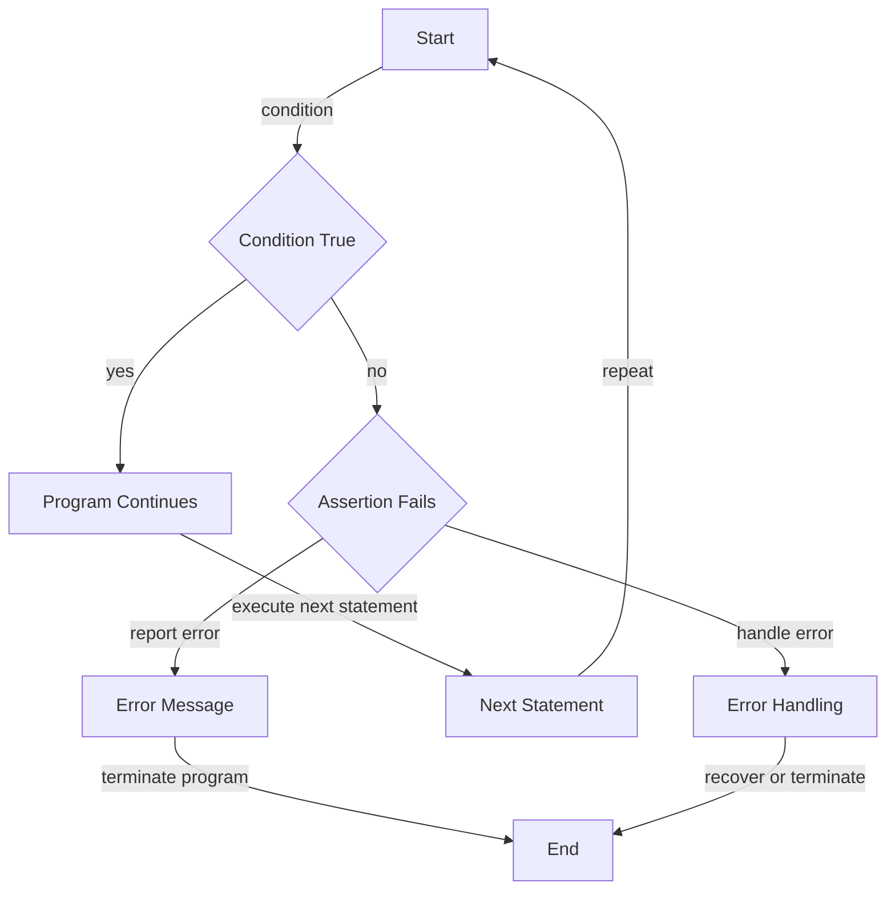

## Introduction
**Assertion functions** are a crucial tool in software development, allowing developers to verify that certain conditions are met during the execution of their code. In essence, an assertion is a statement that checks if a certain condition is true, and if it's not, the program will terminate and report an error. This helps catch bugs early in the development process, making it easier to debug and maintain code. Every engineer needs to know about assertion functions because they are a fundamental building block of robust and reliable software systems. In real-world scenarios, assertion functions are used extensively in various industries, including finance, healthcare, and aerospace, where the correctness of software is paramount.

## Core Concepts
- **Assertion**: A statement that checks if a certain condition is true.
- **Precondition**: A condition that must be true before a function or method is executed.
- **Postcondition**: A condition that must be true after a function or method is executed.
- **Invariant**: A condition that remains true throughout the execution of a program or a part of it.
- **Error handling**: The process of dealing with errors that occur during the execution of a program.

> **Note:** Assertion functions are not a replacement for error handling mechanisms. Instead, they complement error handling by providing an additional layer of protection against bugs and unexpected behavior.

## How It Works Internally
When an assertion is made, the following steps occur:
1. The condition is evaluated.
2. If the condition is true, the program continues executing.
3. If the condition is false, the assertion fails, and the program terminates.
4. An error message is displayed, indicating the location and reason for the assertion failure.

The internal mechanics of assertion functions vary depending on the programming language and implementation. In general, assertion functions are built on top of the language's runtime environment and utilize its error handling mechanisms.

> **Warning:** Overusing assertion functions can lead to performance issues, as they can introduce additional overhead. Therefore, it's essential to use them judiciously and only when necessary.

## Code Examples
### Example 1: Basic Assertion
```typescript
function add(x: number, y: number): number {
    const result = x + y;
    console.assert(result >= x && result >= y, `Result is not greater than or equal to both inputs`);
    return result;
}

console.log(add(2, 3)); // Output: 5
```
In this example, we use the `console.assert` function to verify that the result of the addition is greater than or equal to both inputs.

### Example 2: Precondition and Postcondition
```typescript
function divide(x: number, y: number): number {
    console.assert(y !== 0, `Cannot divide by zero`);
    const result = x / y;
    console.assert(!isNaN(result), `Result is not a number`);
    return result;
}

console.log(divide(10, 2)); // Output: 5
```
Here, we use assertion functions to check the precondition (divisor is not zero) and postcondition (result is a number) of the division operation.

### Example 3: Invariant
```typescript
class BankAccount {
    private balance: number;

    constructor(initialBalance: number) {
        this.balance = initialBalance;
        console.assert(this.balance >= 0, `Initial balance is negative`);
    }

    deposit(amount: number): void {
        this.balance += amount;
        console.assert(this.balance >= 0, `Balance is negative after deposit`);
    }

    withdraw(amount: number): void {
        this.balance -= amount;
        console.assert(this.balance >= 0, `Balance is negative after withdrawal`);
    }
}

const account = new BankAccount(100);
account.deposit(50);
account.withdraw(20);
console.log(account.balance); // Output: 130
```
In this example, we use assertion functions to maintain the invariant that the bank account balance is always non-negative.

## Visual Diagram

This flowchart illustrates the process of assertion and error handling.

> **Tip:** When using assertion functions, it's essential to consider the performance implications and use them only when necessary.

## Comparison
| Approach | Time Complexity | Space Complexity | Pros | Cons | Best For |
| --- | --- | --- | --- | --- | --- |
| Console Assert | O(1) | O(1) | Simple, easy to use | Limited functionality | Debugging, testing |
| Custom Assertion Function | O(1) | O(1) | Flexible, customizable | More complex to implement | Production code, error handling |
| Error Handling Mechanisms | O(1) | O(1) | Robust, flexible | More complex to implement | Production code, error handling |
| Invariant Maintenance | O(1) | O(1) | Ensures program correctness | More complex to implement | Critical systems, safety-critical code |

## Real-world Use Cases
1. **NASA's Space Shuttle Program**: The program used assertion functions to ensure the correctness of its software systems, which were critical to the safety of the astronauts and the success of the missions.
2. **Google's Self-Driving Cars**: The self-driving car project uses assertion functions to verify the correctness of its software systems, which are responsible for controlling the vehicle's movements and ensuring the safety of its passengers.
3. **Microsoft's Windows Operating System**: The Windows operating system uses assertion functions to ensure the correctness of its kernel and device drivers, which are critical to the stability and security of the system.

## Common Pitfalls
1. **Overusing assertion functions**: Using assertion functions excessively can lead to performance issues and make the code more difficult to maintain.
2. **Not handling errors properly**: Failing to handle errors properly can lead to program crashes and data corruption.
3. **Not considering edge cases**: Failing to consider edge cases can lead to bugs and unexpected behavior.
4. **Not testing thoroughly**: Not testing the code thoroughly can lead to bugs and unexpected behavior.

> **Interview:** Can you explain the difference between an assertion and an error handling mechanism? How would you use each in a real-world scenario?

## Interview Tips
1. **What is the purpose of assertion functions?**: The purpose of assertion functions is to verify that certain conditions are met during the execution of the code.
2. **How do you use assertion functions in your code?**: You can use assertion functions to check preconditions, postconditions, and invariants in your code.
3. **What is the difference between an assertion and an error handling mechanism?**: An assertion is a statement that checks if a certain condition is true, while an error handling mechanism is a process that deals with errors that occur during the execution of the code.

## Key Takeaways
* Assertion functions are used to verify that certain conditions are met during the execution of the code.
* Assertion functions can be used to check preconditions, postconditions, and invariants in the code.
* Error handling mechanisms are used to deal with errors that occur during the execution of the code.
* Assertion functions and error handling mechanisms are complementary and should be used together to ensure the correctness and robustness of the code.
* Overusing assertion functions can lead to performance issues and make the code more difficult to maintain.
* Not handling errors properly can lead to program crashes and data corruption.
* Not considering edge cases can lead to bugs and unexpected behavior.
* Not testing the code thoroughly can lead to bugs and unexpected behavior.