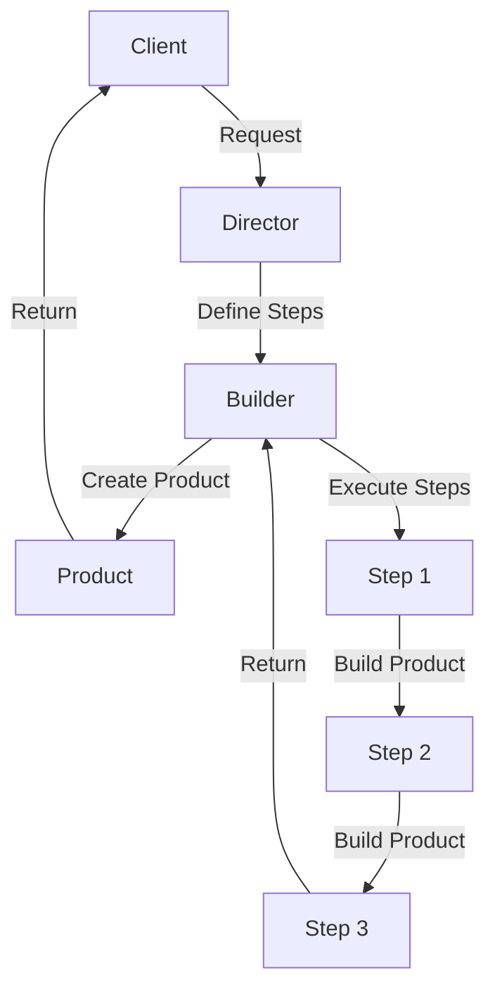

## Introduction
The **Builder Pattern** is a design pattern that allows for the step-by-step creation of complex objects. It separates the construction of an object from its representation, allowing for more flexibility and control over the creation process. In TypeScript, the Builder Pattern is particularly useful when dealing with complex objects that have multiple properties and dependencies. This pattern is widely used in production environments, such as in the creation of database queries, API requests, and UI components.

> **Note:** The Builder Pattern is often confused with the Factory Pattern, but they serve different purposes. The Factory Pattern is used to create objects without specifying the exact class of object that will be created, whereas the Builder Pattern is used to create complex objects step-by-step.

## Core Concepts
The Builder Pattern consists of three main components:
* **Director**: The director is responsible for defining the steps required to create the complex object.
* **Builder**: The builder is responsible for executing the steps defined by the director.
* **Product**: The product is the complex object being created.

The key terminology in the Builder Pattern includes:
* **Separation of Concerns**: The Builder Pattern separates the construction of an object from its representation, allowing for more flexibility and control over the creation process.
* **Step-by-Step Construction**: The Builder Pattern allows for the step-by-step creation of complex objects, making it easier to manage the creation process.

> **Tip:** When implementing the Builder Pattern, it's essential to define the steps required to create the complex object clearly and concisely. This will make it easier to manage the creation process and reduce the risk of errors.

## How It Works Internally
The Builder Pattern works by defining a series of steps required to create the complex object. The director defines these steps, and the builder executes them. The product is created step-by-step, with each step building on the previous one.

Here's a high-level overview of the Builder Pattern:
1. The director defines the steps required to create the complex object.
2. The builder creates a new instance of the product.
3. The builder executes the steps defined by the director, building the product step-by-step.
4. The product is returned to the client.

> **Warning:** One of the common pitfalls of the Builder Pattern is that it can lead to a God Object, where the builder has too many responsibilities and becomes difficult to maintain. To avoid this, it's essential to keep the builder focused on its primary responsibility: creating the complex object.

## Code Examples
### Example 1: Basic Usage
```typescript
// Define the product
class Car {
  private _brand: string;
  private _model: string;
  private _year: number;

  constructor(brand: string, model: string, year: number) {
    this._brand = brand;
    this._model = model;
    this._year = year;
  }

  get brand(): string {
    return this._brand;
  }

  get model(): string {
    return this._model;
  }

  get year(): number {
    return this._year;
  }
}

// Define the builder
class CarBuilder {
  private _brand: string;
  private _model: string;
  private _year: number;

  setBrand(brand: string): CarBuilder {
    this._brand = brand;
    return this;
  }

  setModel(model: string): CarBuilder {
    this._model = model;
    return this;
  }

  setYear(year: number): CarBuilder {
    this._year = year;
    return this;
  }

  build(): Car {
    return new Car(this._brand, this._model, this._year);
  }
}

// Create a new car using the builder
const car = new CarBuilder()
  .setBrand('Toyota')
  .setModel('Camry')
  .setYear(2022)
  .build();

console.log(car.brand); // Output: Toyota
console.log(car.model); // Output: Camry
console.log(car.year); // Output: 2022
```

### Example 2: Real-World Pattern
```typescript
// Define the product
class DatabaseQuery {
  private _tableName: string;
  private _columns: string[];
  private _whereClause: string;

  constructor(tableName: string, columns: string[], whereClause: string) {
    this._tableName = tableName;
    this._columns = columns;
    this._whereClause = whereClause;
  }

  get tableName(): string {
    return this._tableName;
  }

  get columns(): string[] {
    return this._columns;
  }

  get whereClause(): string {
    return this._whereClause;
  }
}

// Define the builder
class DatabaseQueryBuilder {
  private _tableName: string;
  private _columns: string[];
  private _whereClause: string;

  setTableName(tableName: string): DatabaseQueryBuilder {
    this._tableName = tableName;
    return this;
  }

  setColumns(columns: string[]): DatabaseQueryBuilder {
    this._columns = columns;
    return this;
  }

  setWhereClause(whereClause: string): DatabaseQueryBuilder {
    this._whereClause = whereClause;
    return this;
  }

  build(): DatabaseQuery {
    return new DatabaseQuery(this._tableName, this._columns, this._whereClause);
  }
}

// Create a new database query using the builder
const query = new DatabaseQueryBuilder()
  .setTableName('users')
  .setColumns(['id', 'name', 'email'])
  .setWhereClause('age > 18')
  .build();

console.log(query.tableName); // Output: users
console.log(query.columns); // Output: [ 'id', 'name', 'email' ]
console.log(query.whereClause); // Output: age > 18
```

### Example 3: Advanced Usage
```typescript
// Define the product
class UIComponent {
  private _type: string;
  private _label: string;
  private _placeholder: string;

  constructor(type: string, label: string, placeholder: string) {
    this._type = type;
    this._label = label;
    this._placeholder = placeholder;
  }

  get type(): string {
    return this._type;
  }

  get label(): string {
    return this._label;
  }

  get placeholder(): string {
    return this._placeholder;
  }
}

// Define the builder
class UIComponentBuilder {
  private _type: string;
  private _label: string;
  private _placeholder: string;

  setType(type: string): UIComponentBuilder {
    this._type = type;
    return this;
  }

  setLabel(label: string): UIComponentBuilder {
    this._label = label;
    return this;
  }

  setPlaceholder(placeholder: string): UIComponentBuilder {
    this._placeholder = placeholder;
    return this;
  }

  build(): UIComponent {
    return new UIComponent(this._type, this._label, this._placeholder);
  }
}

// Create a new UI component using the builder
const component = new UIComponentBuilder()
  .setType('text')
  .setLabel('Username')
  .setPlaceholder('Enter your username')
  .build();

console.log(component.type); // Output: text
console.log(component.label); // Output: Username
console.log(component.placeholder); // Output: Enter your username
```

## Visual Diagram

The visual diagram illustrates the Builder Pattern, showing how the client requests the director to create a product. The director defines the steps required to create the product and passes them to the builder. The builder creates the product step-by-step, executing each step in sequence.

> **Interview:** When asked to explain the Builder Pattern, be sure to emphasize the separation of concerns between the director and the builder. Explain how the director defines the steps required to create the complex object, and how the builder executes those steps to create the product.

## Comparison
| Pattern | Time Complexity | Space Complexity | Pros | Cons | Best For |
| --- | --- | --- | --- | --- | --- |
| Builder Pattern | O(n) | O(n) | Separates construction from representation, allows for step-by-step creation | Can lead to God Object, complex to implement | Creating complex objects with multiple properties and dependencies |
| Factory Pattern | O(1) | O(1) | Creates objects without specifying exact class, promotes polymorphism | Limited control over creation process, can lead to tight coupling | Creating objects without specifying exact class |
| Singleton Pattern | O(1) | O(1) | Ensures single instance of class, promotes global access | Can lead to tight coupling, difficult to test | Ensuring single instance of class, promoting global access |
| Prototype Pattern | O(n) | O(n) | Creates objects by copying existing objects, promotes cloning | Can lead to complex cloning process, difficult to implement | Creating objects by copying existing objects |

## Real-world Use Cases
1. **Database Query Builder**: The Builder Pattern is used in database query builders to create complex queries step-by-step. For example, the `sequelize` library in Node.js uses the Builder Pattern to create database queries.
2. **UI Component Builder**: The Builder Pattern is used in UI component builders to create complex UI components step-by-step. For example, the `react` library uses the Builder Pattern to create UI components.
3. **API Request Builder**: The Builder Pattern is used in API request builders to create complex API requests step-by-step. For example, the `axios` library in Node.js uses the Builder Pattern to create API requests.

> **Tip:** When using the Builder Pattern in real-world scenarios, be sure to define the steps required to create the complex object clearly and concisely. This will make it easier to manage the creation process and reduce the risk of errors.

## Common Pitfalls
1. **God Object**: One of the common pitfalls of the Builder Pattern is that it can lead to a God Object, where the builder has too many responsibilities and becomes difficult to maintain.
2. **Complex Cloning**: The Builder Pattern can lead to complex cloning processes, making it difficult to implement and maintain.
3. **Tight Coupling**: The Builder Pattern can lead to tight coupling between the director and the builder, making it difficult to change one without affecting the other.
4. **Over-Engineering**: The Builder Pattern can lead to over-engineering, where the creation process becomes too complex and difficult to maintain.

> **Warning:** When implementing the Builder Pattern, be sure to avoid common pitfalls such as God Object, complex cloning, tight coupling, and over-engineering. Keep the builder focused on its primary responsibility: creating the complex object.

## Interview Tips
1. **Explain the Builder Pattern**: Be sure to explain the Builder Pattern clearly and concisely, emphasizing the separation of concerns between the director and the builder.
2. **Define the Steps**: Be sure to define the steps required to create the complex object clearly and concisely, explaining how the builder executes those steps to create the product.
3. **Discuss Common Pitfalls**: Be sure to discuss common pitfalls of the Builder Pattern, such as God Object, complex cloning, tight coupling, and over-engineering.

> **Interview:** When asked to explain the Builder Pattern, be sure to emphasize the separation of concerns between the director and the builder. Explain how the director defines the steps required to create the complex object, and how the builder executes those steps to create the product.

## Key Takeaways
* The Builder Pattern separates the construction of an object from its representation, allowing for more flexibility and control over the creation process.
* The Builder Pattern consists of three main components: director, builder, and product.
* The director defines the steps required to create the complex object, and the builder executes those steps to create the product.
* The Builder Pattern can lead to God Object, complex cloning, tight coupling, and over-engineering if not implemented carefully.
* The Builder Pattern is widely used in production environments, such as in the creation of database queries, API requests, and UI components.
* The Builder Pattern has a time complexity of O(n) and a space complexity of O(n), making it suitable for creating complex objects with multiple properties and dependencies.
* The Builder Pattern promotes polymorphism and allows for the creation of objects without specifying the exact class.
* The Builder Pattern is a design pattern that allows for the step-by-step creation of complex objects, making it easier to manage the creation process and reduce the risk of errors.