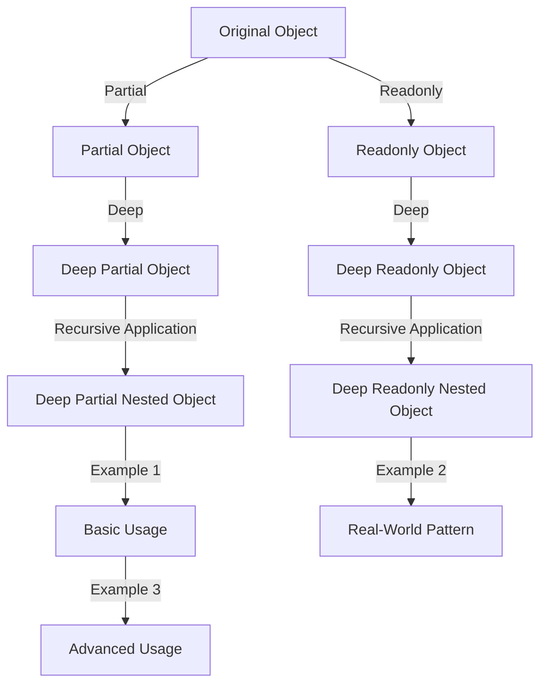

## Introduction
**Deep Partial** and **Deep Readonly** utilities are essential tools in TypeScript, enabling developers to create flexible and secure data structures. These utilities allow for the creation of partial or readonly versions of objects, which is crucial in maintaining data integrity and preventing unintended modifications. In this section, we will delve into the world of Deep Partial and Deep Readonly utilities, exploring their significance, real-world applications, and how they can be utilized to improve code quality.

> **Note:** Deep Partial and Deep Readonly utilities are not limited to TypeScript; they can be applied to various programming languages, including JavaScript. However, TypeScript's strong typing system makes it an ideal candidate for utilizing these utilities.

## Core Concepts
To grasp the concept of Deep Partial and Deep Readonly utilities, it is essential to understand the following key terms:

* **Partial**: A partial object is an object that contains only a subset of the properties of the original object.
* **Readonly**: A readonly object is an object that cannot be modified once it is created.
* **Deep**: Deep refers to the ability of these utilities to traverse nested objects and apply the partial or readonly constraint to all properties, regardless of their depth.

Mental models and analogies can help make these concepts more accessible. Consider a partial object as a subset of a larger set, where only certain properties are included. A readonly object can be thought of as a constant, where any attempt to modify it will result in an error.

## How It Works Internally
The Deep Partial and Deep Readonly utilities in TypeScript work by utilizing the `Partial` and `Readonly` type operators, respectively. These operators are applied to the type of the object, creating a new type that represents the partial or readonly version of the original object.

Here's a step-by-step breakdown of how it works:

1. The `Partial` type operator creates a new type that represents the partial version of the original object. This is done by making all properties of the original object optional.
2. The `Readonly` type operator creates a new type that represents the readonly version of the original object. This is done by making all properties of the original object readonly.
3. The `Deep` aspect of these utilities is achieved by recursively applying the `Partial` or `Readonly` type operator to all nested objects, ensuring that all properties, regardless of their depth, are either optional or readonly.

## Code Examples
### Example 1: Basic Usage of Deep Partial
```typescript
interface User {
  name: string;
  address: {
    street: string;
    city: string;
  };
}

type DeepPartialUser = {
  [P in keyof User]: User[P] extends object ? DeepPartial<User[P]> : User[P] | undefined;
};

const partialUser: DeepPartialUser = {
  name: 'John',
  address: {
    street: '123 Main St',
  },
};

console.log(partialUser); // Output: { name: 'John', address: { street: '123 Main St' } }
```

### Example 2: Real-World Pattern with Deep Readonly
```typescript
interface Config {
  apiEndpoint: string;
  timeout: number;
}

type DeepReadonlyConfig = {
  readonly [P in keyof Config]: Config[P] extends object ? DeepReadonly<Config[P]> : Config[P];
};

const config: DeepReadonlyConfig = {
  apiEndpoint: 'https://api.example.com',
  timeout: 5000,
};

// Attempting to modify the config will result in a TypeScript error
// config.apiEndpoint = 'https://new-api.example.com'; // Error: Cannot assign to 'apiEndpoint' because it is a read-only property.

console.log(config); // Output: { apiEndpoint: 'https://api.example.com', timeout: 5000 }
```

### Example 3: Advanced Usage with Nested Objects
```typescript
interface NestedObject {
  a: {
    b: {
      c: string;
    };
  };
}

type DeepPartialNestedObject = {
  [P in keyof NestedObject]: NestedObject[P] extends object ? DeepPartial<NestedObject[P]> : NestedObject[P] | undefined;
};

const nestedObject: DeepPartialNestedObject = {
  a: {
    b: {
      c: 'value',
    },
  },
};

console.log(nestedObject); // Output: { a: { b: { c: 'value' } } }
```

## Visual Diagram

This diagram illustrates the process of creating partial and readonly objects, as well as the application of the deep aspect to these objects. It also shows how these utilities can be used in various scenarios, from basic usage to real-world patterns and advanced usage.

## Comparison
| Approach | Time Complexity | Space Complexity | Pros | Cons | Best For |
| --- | --- | --- | --- | --- | --- |
| Deep Partial | O(n) | O(n) | Flexible, allows for partial updates | Can lead to errors if not used carefully | Partial updates, data validation |
| Deep Readonly | O(n) | O(n) | Ensures data integrity, prevents unintended modifications | Can be restrictive, may require additional overhead | Data security, API responses |
| Shallow Partial | O(1) | O(1) | Fast, simple to implement | Limited to top-level properties, may not be suitable for complex objects | Simple data structures, prototyping |
| Shallow Readonly | O(1) | O(1) | Fast, simple to implement | Limited to top-level properties, may not be suitable for complex objects | Simple data structures, prototyping |

## Real-world Use Cases
1. **Data Validation**: Deep Partial utilities can be used to validate user input data, ensuring that only valid properties are updated.
2. **API Responses**: Deep Readonly utilities can be used to ensure that API responses are not modified accidentally, maintaining data integrity.
3. **Data Security**: Deep Readonly utilities can be used to protect sensitive data, such as user credentials or encryption keys, from unintended modifications.

## Common Pitfalls
1. **Incorrect Usage**: Using Deep Partial or Deep Readonly utilities incorrectly can lead to errors or unexpected behavior.
```typescript
// Incorrect usage
const user: DeepPartial<User> = {
  name: 'John',
  address: '123 Main St', // Error: Type '{ name: string; address: string; }' is not assignable to type 'DeepPartial<User>'.
};
```
2. **Insufficient Error Handling**: Failing to handle errors properly can lead to unexpected behavior or data corruption.
```typescript
// Insufficient error handling
try {
  const user: DeepPartial<User> = {
    name: 'John',
    address: '123 Main St', // Error: Type '{ name: string; address: string; }' is not assignable to type 'DeepPartial<User>'.
  };
} catch (error) {
  // Handle error
}
```
3. **Overly Restrictive**: Using Deep Readonly utilities too restrictively can lead to unnecessary complexity or overhead.
```typescript
// Overly restrictive
const config: DeepReadonly<Config> = {
  apiEndpoint: 'https://api.example.com',
  timeout: 5000,
};

// Attempting to modify the config will result in a TypeScript error
// config.apiEndpoint = 'https://new-api.example.com'; // Error: Cannot assign to 'apiEndpoint' because it is a read-only property.
```
4. **Underutilization**: Failing to utilize Deep Partial or Deep Readonly utilities can lead to errors or unexpected behavior.
```typescript
// Underutilization
const user: User = {
  name: 'John',
  address: {
    street: '123 Main St',
  },
};

// Modifying the user object can lead to errors or unexpected behavior
user.address.street = '456 Elm St';
```

## Interview Tips
1. **What is the difference between Deep Partial and Deep Readonly utilities?**
	* Weak answer: "Deep Partial is used for partial updates, while Deep Readonly is used for readonly objects."
	* Strong answer: "Deep Partial utilities create a new type that represents the partial version of the original object, making all properties optional. Deep Readonly utilities create a new type that represents the readonly version of the original object, making all properties readonly. The deep aspect of these utilities ensures that all properties, regardless of their depth, are either optional or readonly."
2. **How do you use Deep Partial utilities in a real-world scenario?**
	* Weak answer: "I use Deep Partial utilities to create partial objects."
	* Strong answer: "I use Deep Partial utilities to validate user input data, ensuring that only valid properties are updated. For example, when handling user registration, I use Deep Partial utilities to validate the user's input data, ensuring that only valid properties, such as name and email, are updated."
3. **What are some common pitfalls when using Deep Partial or Deep Readonly utilities?**
	* Weak answer: "I'm not sure."
	* Strong answer: "Some common pitfalls include incorrect usage, insufficient error handling, overly restrictive usage, and underutilization. It's essential to understand the differences between Deep Partial and Deep Readonly utilities and use them correctly to avoid errors or unexpected behavior."

## Key Takeaways
* Deep Partial utilities create a new type that represents the partial version of the original object, making all properties optional.
* Deep Readonly utilities create a new type that represents the readonly version of the original object, making all properties readonly.
* The deep aspect of these utilities ensures that all properties, regardless of their depth, are either optional or readonly.
* Deep Partial utilities are useful for partial updates, data validation, and API responses.
* Deep Readonly utilities are useful for data security, API responses, and maintaining data integrity.
* Incorrect usage, insufficient error handling, overly restrictive usage, and underutilization are common pitfalls when using Deep Partial or Deep Readonly utilities.
* Understanding the differences between Deep Partial and Deep Readonly utilities is essential to using them correctly and avoiding errors or unexpected behavior.