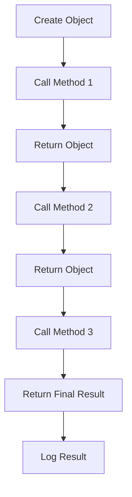

## Introduction
The **Fluent Interface Pattern** is a design pattern that provides a more readable and expressive way of writing code by using method chaining to create a fluid, natural language-like interface. This pattern is also known as a **Method Chaining Pattern** or **Chain of Responsibility Pattern**. The main goal of this pattern is to make the code more readable and easier to understand by reducing the number of lines of code and improving the overall structure of the code. In real-world applications, the Fluent Interface Pattern is widely used in libraries and frameworks such as jQuery, LINQ, and Mockito.

> **Note:** The Fluent Interface Pattern is not a replacement for traditional programming paradigms but rather a complementary approach to improve code readability and maintainability.

## Core Concepts
The core concept of the Fluent Interface Pattern is to create a chain of methods that can be called sequentially to perform a series of operations. This is achieved by returning the object itself from each method, allowing the next method to be called on the same object. The key terminology used in this pattern includes:

* **Method Chaining**: The process of calling multiple methods on the same object in a single statement.
* **Fluent Interface**: The interface that provides a fluid, natural language-like way of writing code.
* **Chain of Responsibility**: The pattern of passing a request through a chain of objects to handle the request.

> **Warning:** Overusing the Fluent Interface Pattern can lead to tight coupling between objects and make the code harder to maintain.

## How It Works Internally
The Fluent Interface Pattern works by using a combination of method overloading and return types to create a chain of methods that can be called sequentially. Here's a step-by-step breakdown of how it works:

1. The object is created and the first method is called on it.
2. The first method performs its operation and returns the object itself.
3. The second method is called on the returned object, which performs its operation and returns the object itself.
4. This process continues until the final method is called, which returns the final result.

> **Tip:** To implement the Fluent Interface Pattern, start by identifying the methods that need to be chained together and then design the interface to return the object itself from each method.

## Code Examples
### Example 1: Basic Usage
```typescript
class Person {
  private name: string;
  private age: number;

  constructor() {
    this.name = "";
    this.age = 0;
  }

  public setName(name: string): Person {
    this.name = name;
    return this;
  }

  public setAge(age: number): Person {
    this.age = age;
    return this;
  }

  public toString(): string {
    return `Name: ${this.name}, Age: ${this.age}`;
  }
}

const person = new Person();
console.log(person.setName("John").setAge(30).toString());
```
### Example 2: Real-World Pattern
```typescript
class Database {
  private host: string;
  private username: string;
  private password: string;

  constructor() {
    this.host = "";
    this.username = "";
    this.password = "";
  }

  public setHost(host: string): Database {
    this.host = host;
    return this;
  }

  public setUsername(username: string): Database {
    this.username = username;
    return this;
  }

  public setPassword(password: string): Database {
    this.password = password;
    return this;
  }

  public connect(): void {
    console.log(`Connecting to ${this.host} with username ${this.username} and password ${this.password}`);
  }
}

const db = new Database();
db.setHost("localhost").setUsername("root").setPassword("password123").connect();
```
### Example 3: Advanced Usage
```typescript
class Logger {
  private logLevel: string;
  private logMessage: string;

  constructor() {
    this.logLevel = "";
    this.logMessage = "";
  }

  public setLogLevel(logLevel: string): Logger {
    this.logLevel = logLevel;
    return this;
  }

  public setLogMessage(logMessage: string): Logger {
    this.logMessage = logMessage;
    return this;
  }

  public log(): void {
    console.log(`${this.logLevel}: ${this.logMessage}`);
  }
}

const logger = new Logger();
logger.setLogLevel("INFO").setLogMessage("This is an info message").log();
```
> **Interview:** Can you explain the benefits of using the Fluent Interface Pattern in a real-world application?

## Visual Diagram

The diagram illustrates the process of creating an object and calling a series of methods on it using the Fluent Interface Pattern.

## Comparison
| Pattern | Time Complexity | Space Complexity | Pros | Cons | Best For |
| --- | --- | --- | --- | --- | --- |
| Fluent Interface | O(1) | O(1) | Improves code readability, reduces number of lines of code | Can lead to tight coupling, harder to maintain | Real-time systems, high-performance applications |
| Chain of Responsibility | O(n) | O(n) | Allows for flexible and dynamic handling of requests | Can be complex to implement, harder to debug | Distributed systems, event-driven systems |
| Command Pattern | O(1) | O(1) | Encapsulates a request as an object, allows for undo and redo | Can be overused, harder to maintain | GUI applications, text editors |
| Observer Pattern | O(n) | O(n) | Allows for loose coupling between objects, improves responsiveness | Can be complex to implement, harder to debug | Real-time systems, distributed systems |

> **Tip:** When choosing a design pattern, consider the trade-offs between time and space complexity, as well as the pros and cons of each pattern.

## Real-world Use Cases
1. **jQuery**: jQuery uses the Fluent Interface Pattern to provide a fluid and expressive way of writing code for DOM manipulation and event handling.
2. **LINQ**: LINQ uses the Fluent Interface Pattern to provide a fluid and expressive way of writing code for querying and manipulating data.
3. **Mockito**: Mockito uses the Fluent Interface Pattern to provide a fluid and expressive way of writing code for mocking and testing objects.

> **Warning:** Overusing the Fluent Interface Pattern can lead to tight coupling between objects and make the code harder to maintain.

## Common Pitfalls
1. **Tight Coupling**: The Fluent Interface Pattern can lead to tight coupling between objects, making it harder to maintain and modify the code.
2. **Method Overloading**: The Fluent Interface Pattern can lead to method overloading, making it harder to understand and maintain the code.
3. **Return Types**: The Fluent Interface Pattern requires careful consideration of return types to ensure that the methods can be chained together correctly.
4. **Error Handling**: The Fluent Interface Pattern can make it harder to handle errors and exceptions, as the methods are chained together and the error may not be immediately apparent.

> **Tip:** To avoid common pitfalls, use the Fluent Interface Pattern judiciously and consider the trade-offs between readability and maintainability.

## Interview Tips
1. **What is the Fluent Interface Pattern?**: The Fluent Interface Pattern is a design pattern that provides a fluid and expressive way of writing code by using method chaining to create a natural language-like interface.
2. **How does the Fluent Interface Pattern work?**: The Fluent Interface Pattern works by using a combination of method overloading and return types to create a chain of methods that can be called sequentially.
3. **What are the benefits of using the Fluent Interface Pattern?**: The benefits of using the Fluent Interface Pattern include improved code readability, reduced number of lines of code, and improved maintainability.

> **Interview:** Can you explain the benefits and drawbacks of using the Fluent Interface Pattern in a real-world application?

## Key Takeaways
* The Fluent Interface Pattern is a design pattern that provides a fluid and expressive way of writing code.
* The Fluent Interface Pattern uses method chaining to create a natural language-like interface.
* The Fluent Interface Pattern requires careful consideration of return types and method overloading.
* The Fluent Interface Pattern can lead to tight coupling between objects and make the code harder to maintain.
* The Fluent Interface Pattern is best used in real-time systems, high-performance applications, and GUI applications.
* The Fluent Interface Pattern has a time complexity of O(1) and a space complexity of O(1).
* The Fluent Interface Pattern is widely used in libraries and frameworks such as jQuery, LINQ, and Mockito.