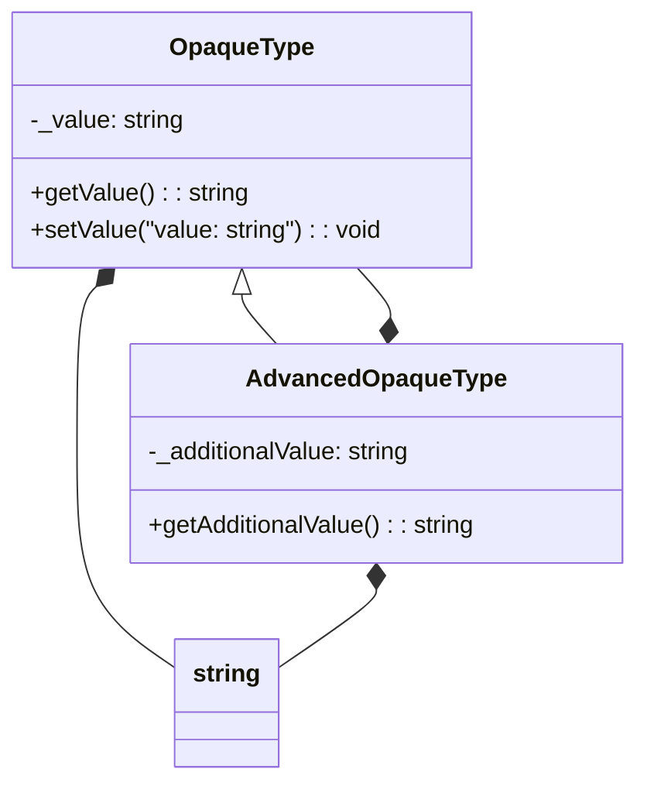

## Introduction
The **Opaque Types Pattern** is a design pattern in TypeScript that allows for the creation of types that are opaque to the outside world, meaning their internal structure is not visible or accessible. This pattern is useful when you want to hide the implementation details of a type and only expose a limited set of methods or properties to the outside world. The Opaque Types Pattern is particularly useful in large-scale applications where you want to ensure that certain types are used in a specific way and avoid unintended modifications or misuse. In this section, we will explore the importance of the Opaque Types Pattern, its real-world relevance, and why every engineer should know about it.

> **Note:** The Opaque Types Pattern is not a new concept in programming, but it has gained significant attention in recent years with the rise of TypeScript and other statically-typed languages.

## Core Concepts
The Opaque Types Pattern is based on the concept of **encapsulation**, which is the idea of hiding the internal implementation details of a type and only exposing a limited set of methods or properties to the outside world. This is achieved through the use of **private** or **protected** members, which can only be accessed within the same class or module. The Opaque Types Pattern also relies on the concept of **abstraction**, which is the idea of representing complex systems in a simplified way, focusing on essential features and behaviors.

> **Tip:** When implementing the Opaque Types Pattern, it's essential to use **private** members to hide the internal implementation details of a type and only expose **public** methods or properties to the outside world.

## How It Works Internally
The Opaque Types Pattern works by creating a type that is opaque to the outside world, meaning its internal structure is not visible or accessible. This is achieved through the use of **private** or **protected** members, which can only be accessed within the same class or module. When a type is created using the Opaque Types Pattern, its internal implementation details are hidden, and only a limited set of methods or properties are exposed to the outside world. This ensures that the type is used in a specific way and avoids unintended modifications or misuse.

> **Warning:** When using the Opaque Types Pattern, it's essential to avoid exposing internal implementation details to the outside world, as this can lead to unintended modifications or misuse.

## Code Examples
### Example 1: Basic Opaque Type
```typescript
class OpaqueType {
  private _value: string;

  constructor(value: string) {
    this._value = value;
  }

  public getValue(): string {
    return this._value;
  }
}

const opaqueType = new OpaqueType('Hello, World!');
console.log(opaqueType.getValue()); // Output: Hello, World!
```
### Example 2: Opaque Type with Methods
```typescript
class OpaqueType {
  private _value: string;

  constructor(value: string) {
    this._value = value;
  }

  public getValue(): string {
    return this._value;
  }

  public setValue(value: string): void {
    this._value = value;
  }
}

const opaqueType = new OpaqueType('Hello, World!');
console.log(opaqueType.getValue()); // Output: Hello, World!
opaqueType.setValue('New Value');
console.log(opaqueType.getValue()); // Output: New Value
```
### Example 3: Advanced Opaque Type with Inheritance
```typescript
class OpaqueType {
  protected _value: string;

  constructor(value: string) {
    this._value = value;
  }

  public getValue(): string {
    return this._value;
  }
}

class AdvancedOpaqueType extends OpaqueType {
  private _additionalValue: string;

  constructor(value: string, additionalValue: string) {
    super(value);
    this._additionalValue = additionalValue;
  }

  public getAdditionalValue(): string {
    return this._additionalValue;
  }
}

const advancedOpaqueType = new AdvancedOpaqueType('Hello, World!', 'Additional Value');
console.log(advancedOpaqueType.getValue()); // Output: Hello, World!
console.log(advancedOpaqueType.getAdditionalValue()); // Output: Additional Value
```
## Visual Diagram

The diagram above illustrates the relationship between the `OpaqueType` and `AdvancedOpaqueType` classes. The `AdvancedOpaqueType` class extends the `OpaqueType` class and adds additional methods and properties.

> **Note:** The Opaque Types Pattern is useful when you want to hide the internal implementation details of a type and only expose a limited set of methods or properties to the outside world.

## Comparison
| Approach | Time Complexity | Space Complexity | Pros | Cons | Best For |
| --- | --- | --- | --- | --- | --- |
| Opaque Types Pattern | O(1) | O(1) | Hides internal implementation details, ensures type safety | Can be over-engineered, may lead to complexity | Large-scale applications, complex systems |
| Public Types | O(1) | O(1) | Simple, easy to implement | Exposes internal implementation details, may lead to misuse | Small-scale applications, simple systems |
| Abstract Classes | O(1) | O(1) | Provides abstraction, ensures type safety | Can be over-engineered, may lead to complexity | Medium-scale applications, complex systems |
| Interfaces | O(1) | O(1) | Provides abstraction, ensures type safety | Limited to method signatures, may not provide full encapsulation | Medium-scale applications, complex systems |

## Real-world Use Cases
1. **Google's Closure Library**: The Closure Library uses the Opaque Types Pattern to ensure that its internal implementation details are hidden from the outside world.
2. **Facebook's React**: React uses the Opaque Types Pattern to ensure that its internal implementation details are hidden from the outside world and to provide a stable API.
3. **Microsoft's TypeScript**: TypeScript uses the Opaque Types Pattern to ensure that its internal implementation details are hidden from the outside world and to provide a stable API.

## Common Pitfalls
1. **Over-engineering**: The Opaque Types Pattern can be over-engineered, leading to complexity and maintenance issues.
2. **Under-engineering**: The Opaque Types Pattern can be under-engineered, leading to exposure of internal implementation details and misuse.
3. **Lack of documentation**: The Opaque Types Pattern requires proper documentation to ensure that users understand how to use the type correctly.
4. **Inconsistent naming conventions**: Inconsistent naming conventions can lead to confusion and misuse of the Opaque Types Pattern.

## Interview Tips
1. **What is the Opaque Types Pattern?**: The Opaque Types Pattern is a design pattern that allows for the creation of types that are opaque to the outside world, meaning their internal structure is not visible or accessible.
2. **How does the Opaque Types Pattern work?**: The Opaque Types Pattern works by creating a type that is opaque to the outside world, meaning its internal structure is not visible or accessible. This is achieved through the use of **private** or **protected** members, which can only be accessed within the same class or module.
3. **What are the benefits of the Opaque Types Pattern?**: The Opaque Types Pattern provides several benefits, including hiding internal implementation details, ensuring type safety, and providing a stable API.

> **Interview:** When asked about the Opaque Types Pattern, be sure to explain its purpose, how it works, and its benefits. Provide examples of how it can be used in real-world applications and discuss its trade-offs.

## Key Takeaways
* The Opaque Types Pattern is a design pattern that allows for the creation of types that are opaque to the outside world.
* The Opaque Types Pattern works by creating a type that is opaque to the outside world, meaning its internal structure is not visible or accessible.
* The Opaque Types Pattern provides several benefits, including hiding internal implementation details, ensuring type safety, and providing a stable API.
* The Opaque Types Pattern can be used in large-scale applications, complex systems, and medium-scale applications.
* The Opaque Types Pattern requires proper documentation and consistent naming conventions to ensure that users understand how to use the type correctly.
* The Opaque Types Pattern has a time complexity of O(1) and a space complexity of O(1).
* The Opaque Types Pattern is useful when you want to hide the internal implementation details of a type and only expose a limited set of methods or properties to the outside world.