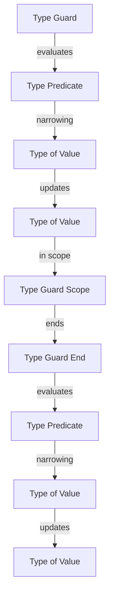

## Introduction
Type guards are a fundamental concept in TypeScript, allowing developers to narrow the type of a value within a specific scope. They are crucial for ensuring type safety and preventing errors at runtime. In this section, we will explore the importance of type guards, their real-world relevance, and why every engineer needs to know about them. 
> **Note:** Type guards are essential for building robust and maintainable applications, as they help catch type-related errors early in the development process.

Type guards are not unique to TypeScript; other programming languages, such as Java and C#, also have similar concepts. However, TypeScript's type guards are more powerful and flexible, thanks to its type system. In real-world scenarios, type guards are used extensively in frameworks like React and Angular, where they help ensure that components receive the correct props and state.

## Core Concepts
Before diving into the details of type guards, it's essential to understand some core concepts:

* **Type narrowing**: The process of reducing the type of a value to a more specific type within a specific scope.
* **Type guard**: A function or expression that narrows the type of a value.
* **User-defined type guard**: A type guard defined by the user using the `typeof` operator or other type predicates.

Some key terminology to keep in mind:

* **Type predicate**: A function that returns a type predicate, which is a type that narrows the type of a value.
* **Type inference**: The process of automatically determining the type of a value based on its usage.

> **Tip:** Understanding type predicates and type inference is crucial for effectively using type guards in TypeScript.

## How It Works Internally
Type guards work by using the `typeof` operator or other type predicates to narrow the type of a value. When the TypeScript compiler encounters a type guard, it uses the type predicate to infer the type of the value within the specific scope.

Here's a step-by-step breakdown of how type guards work internally:

1. The TypeScript compiler encounters a type guard expression, such as `typeof x === 'string'`.
2. The compiler evaluates the type guard expression and determines the type predicate.
3. The compiler uses the type predicate to narrow the type of the value within the specific scope.
4. The compiler updates the type of the value to reflect the narrowed type.

> **Warning:** Incorrectly using type guards can lead to type errors or unexpected behavior at runtime.

## Code Examples
### Example 1: Basic Type Guard
```typescript
function isString(x: any): x is string {
  return typeof x === 'string';
}

const str = 'hello';
if (isString(str)) {
  console.log(str.toUpperCase()); // str is narrowed to string
}
```
In this example, we define a type guard function `isString` that takes an `any` type and returns a type predicate `x is string`. We then use the type guard to narrow the type of the `str` variable.

### Example 2: Advanced Type Guard
```typescript
interface Person {
  name: string;
  age: number;
}

interface Employee {
  name: string;
  age: number;
  department: string;
}

function isEmployee(x: Person | Employee): x is Employee {
  return 'department' in x;
}

const person: Person = { name: 'John', age: 30 };
const employee: Employee = { name: 'Jane', age: 25, department: 'Sales' };

if (isEmployee(person)) {
  console.log(person.department); // person is not narrowed to Employee
} else {
  console.log(person.name); // person is still Person
}

if (isEmployee(employee)) {
  console.log(employee.department); // employee is narrowed to Employee
}
```
In this example, we define two interfaces `Person` and `Employee`, and a type guard function `isEmployee` that takes a union type `Person | Employee` and returns a type predicate `x is Employee`. We then use the type guard to narrow the type of the `employee` variable.

### Example 3: Using the `in` Operator
```typescript
interface Rectangle {
  width: number;
  height: number;
}

interface Circle {
  radius: number;
}

function isRectangle(x: Rectangle | Circle): x is Rectangle {
  return 'width' in x;
}

const rectangle: Rectangle = { width: 10, height: 20 };
const circle: Circle = { radius: 5 };

if (isRectangle(rectangle)) {
  console.log(rectangle.width); // rectangle is narrowed to Rectangle
}

if (isRectangle(circle)) {
  console.log(circle.radius); // circle is still Circle
}
```
In this example, we define two interfaces `Rectangle` and `Circle`, and a type guard function `isRectangle` that takes a union type `Rectangle | Circle` and returns a type predicate `x is Rectangle`. We then use the `in` operator to check if the `width` property exists in the `x` object.

## Visual Diagram

This diagram illustrates the process of type guarding, from evaluating the type guard expression to updating the type of the value within the specific scope.

> **Interview:** When asked to explain type guards, be sure to include the concepts of type narrowing, type predicates, and the `in` operator.

## Comparison
| Approach | Time Complexity | Space Complexity | Pros | Cons | Best For |
| --- | --- | --- | --- | --- | --- |
| Using `typeof` | O(1) | O(1) | Simple, efficient | Limited to primitive types | Basic type checking |
| Using `instanceof` | O(1) | O(1) | Works with objects | Limited to objects | Object type checking |
| Using `in` operator | O(1) | O(1) | Works with objects and primitives | Can be slower than `typeof` | Advanced type checking |
| Using user-defined type guards | O(1) | O(1) | Flexible, customizable | Can be complex to implement | Advanced type checking |

## Real-world Use Cases
1. **React**: React uses type guards to ensure that components receive the correct props and state.
2. **Angular**: Angular uses type guards to ensure that components receive the correct inputs and outputs.
3. **TypeScript**: TypeScript itself uses type guards to narrow the type of values within specific scopes.

> **Tip:** When working with React or Angular, use type guards to ensure that your components receive the correct props and state.

## Common Pitfalls
1. **Incorrectly using type guards**: Using type guards incorrectly can lead to type errors or unexpected behavior at runtime.
2. **Not using type guards**: Not using type guards can lead to type errors or unexpected behavior at runtime.
3. **Using `typeof` with objects**: Using `typeof` with objects can lead to incorrect results, as `typeof` returns `'object'` for all objects.
4. **Not considering the `in` operator**: Not considering the `in` operator can lead to incorrect results, as the `in` operator can be used to check if a property exists in an object.

> **Warning:** Incorrectly using type guards can lead to type errors or unexpected behavior at runtime.

## Interview Tips
1. **Be prepared to explain type guards**: Be prepared to explain the concepts of type guards, type predicates, and the `in` operator.
2. **Be prepared to write code**: Be prepared to write code that demonstrates the use of type guards.
3. **Be prepared to discuss common pitfalls**: Be prepared to discuss common pitfalls when using type guards.

> **Interview:** When asked to explain type guards, be sure to include the concepts of type narrowing, type predicates, and the `in` operator.

## Key Takeaways
* Type guards are essential for building robust and maintainable applications.
* Type guards work by using the `typeof` operator or other type predicates to narrow the type of a value.
* The `in` operator can be used to check if a property exists in an object.
* User-defined type guards can be used to customize the type checking process.
* Type guards can be used with objects and primitives.
* Type guards can help prevent type errors or unexpected behavior at runtime.
* Incorrectly using type guards can lead to type errors or unexpected behavior at runtime.
* Not using type guards can lead to type errors or unexpected behavior at runtime.
* The `typeof` operator returns `'object'` for all objects.
* The `in` operator can be used to check if a property exists in an object.