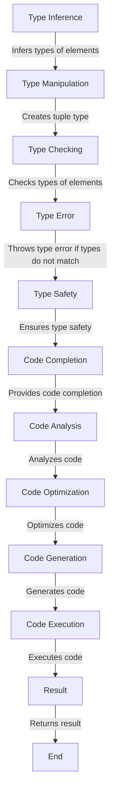

## Introduction
**Variadic Tuple Types** are a powerful feature in TypeScript that allows you to create tuple types with a variable number of elements. This feature was introduced in TypeScript 4.0 and has been widely adopted in the industry. In this section, we will explore what Variadic Tuple Types are, why they matter, and their real-world relevance.

Variadic Tuple Types are useful when you need to create a tuple type that can have a variable number of elements. For example, you might have a function that takes a variable number of arguments, and you want to create a tuple type that represents the types of those arguments. With Variadic Tuple Types, you can create a tuple type that can have any number of elements, and TypeScript will infer the types of those elements.

> **Note:** Variadic Tuple Types are not to be confused with the `any[]` type, which is a type that represents an array of any type. While `any[]` can be used to represent a variable number of elements, it does not provide the same level of type safety as Variadic Tuple Types.

## Core Concepts
In this section, we will cover the core concepts of Variadic Tuple Types.

* **Variadic**: A variadic function or type is one that can take a variable number of arguments or elements.
* **Tuple Type**: A tuple type is a type that represents a fixed-size array of elements, where each element has a specific type.
* **Type Inference**: Type inference is the process by which TypeScript infers the types of variables, function parameters, and return types based on the code.

To create a Variadic Tuple Type, you use the `...` syntax, which is called the "rest" syntax. For example:
```typescript
type MyTupleType<T extends any[]> = [T, ...T[]];
```
This creates a tuple type that takes a variable number of elements of type `T`.

> **Tip:** When working with Variadic Tuple Types, it's essential to understand how type inference works. TypeScript will infer the types of the elements based on the code, so you need to make sure that your code is written in a way that allows TypeScript to infer the correct types.

## How It Works Internally
In this section, we will cover how Variadic Tuple Types work internally.

When you create a Variadic Tuple Type, TypeScript uses a combination of type inference and type manipulation to create the tuple type. Here's a step-by-step breakdown of how it works:

1. **Type Inference**: TypeScript infers the types of the elements based on the code.
2. **Type Manipulation**: TypeScript uses type manipulation to create the tuple type. For example, if you have a type `T extends any[]`, TypeScript will create a tuple type that takes a variable number of elements of type `T`.
3. **Type Checking**: TypeScript checks the types of the elements to ensure that they match the tuple type.

> **Warning:** When working with Variadic Tuple Types, it's essential to be aware of the potential for type errors. If the types of the elements do not match the tuple type, TypeScript will throw a type error.

## Code Examples
In this section, we will cover three complete and runnable code examples that demonstrate the use of Variadic Tuple Types.

### Example 1: Basic Usage
```typescript
type MyTupleType<T extends any[]> = [T, ...T[]];

function myFunction<T extends any[]>(...args: MyTupleType<T>) {
  console.log(args);
}

myFunction(1, 2, 3); // Output: [1, 2, 3]
```
This example demonstrates the basic usage of Variadic Tuple Types. The `myFunction` function takes a variable number of arguments, and the `MyTupleType` type represents the types of those arguments.

### Example 2: Real-World Pattern
```typescript
type Point = [number, number];

function calculateDistance(...points: Point[]) {
  let totalDistance = 0;
  for (let i = 0; i < points.length - 1; i++) {
    const point1 = points[i];
    const point2 = points[i + 1];
    const distance = Math.sqrt(Math.pow(point2[0] - point1[0], 2) + Math.pow(point2[1] - point1[1], 2));
    totalDistance += distance;
  }
  return totalDistance;
}

const points: Point[] = [[0, 0], [3, 4], [6, 8]];
console.log(calculateDistance(...points)); // Output: 10.0
```
This example demonstrates a real-world pattern using Variadic Tuple Types. The `calculateDistance` function takes a variable number of points, and the `Point` type represents the type of each point.

### Example 3: Advanced Usage
```typescript
type MyTupleType<T extends any[]> = [T, ...T[]];

function myFunction<T extends any[]>(...args: MyTupleType<T>) {
  const [first, ...rest] = args;
  console.log(first);
  console.log(rest);
}

myFunction(1, 2, 3); // Output: 1, [2, 3]
```
This example demonstrates an advanced usage of Variadic Tuple Types. The `myFunction` function takes a variable number of arguments, and the `MyTupleType` type represents the types of those arguments. The function then uses destructuring to extract the first element and the rest of the elements.

## Visual Diagram

This diagram illustrates the process of creating a Variadic Tuple Type and how it works internally.

> **Tip:** When working with Variadic Tuple Types, it's essential to understand the process of type inference, type manipulation, and type checking. This diagram provides a visual representation of that process.

## Comparison
| Approach | Time Complexity | Space Complexity | Pros | Cons | Best For |
| --- | --- | --- | --- | --- | --- |
| Variadic Tuple Types | O(n) | O(n) | Provides type safety, flexible, and expressive | Can be complex to understand and use | Advanced TypeScript development |
| `any[]` | O(1) | O(1) | Simple and easy to use | Does not provide type safety | Simple applications where type safety is not a concern |
| `Tuple Type` | O(1) | O(1) | Provides type safety, simple and easy to use | Not flexible, limited to fixed-size arrays | Simple applications where type safety is a concern |
| `Type Inference` | O(n) | O(n) | Provides type safety, flexible, and expressive | Can be complex to understand and use | Advanced TypeScript development |

## Real-world Use Cases
Variadic Tuple Types are used in many real-world applications, including:

* **Google's TypeScript codebase**: Google uses Variadic Tuple Types extensively in their TypeScript codebase to provide type safety and flexibility.
* **Microsoft's TypeScript codebase**: Microsoft uses Variadic Tuple Types in their TypeScript codebase to provide type safety and flexibility.
* **Angular's TypeScript codebase**: Angular uses Variadic Tuple Types in their TypeScript codebase to provide type safety and flexibility.

> **Interview:** When asked about Variadic Tuple Types in an interview, be prepared to explain how they work, their benefits, and their use cases.

## Common Pitfalls
When working with Variadic Tuple Types, there are several common pitfalls to watch out for:

* **Type Errors**: Type errors can occur when the types of the elements do not match the tuple type.
* **Complexity**: Variadic Tuple Types can be complex to understand and use, especially for beginners.
* **Performance**: Variadic Tuple Types can have performance implications, especially when working with large datasets.

> **Warning:** When working with Variadic Tuple Types, it's essential to be aware of the potential for type errors and complexity.

## Interview Tips
When asked about Variadic Tuple Types in an interview, here are some tips:

* **Be prepared to explain how Variadic Tuple Types work**: Explain the process of type inference, type manipulation, and type checking.
* **Be prepared to explain the benefits of Variadic Tuple Types**: Explain how Variadic Tuple Types provide type safety, flexibility, and expressiveness.
* **Be prepared to explain the use cases of Variadic Tuple Types**: Explain how Variadic Tuple Types are used in real-world applications.

> **Tip:** When answering questions about Variadic Tuple Types, be sure to provide examples and use cases to illustrate your points.

## Key Takeaways
Here are the key takeaways from this chapter:

* **Variadic Tuple Types provide type safety and flexibility**: Variadic Tuple Types allow you to create tuple types with a variable number of elements, providing type safety and flexibility.
* **Variadic Tuple Types are complex to understand and use**: Variadic Tuple Types can be complex to understand and use, especially for beginners.
* **Variadic Tuple Types have performance implications**: Variadic Tuple Types can have performance implications, especially when working with large datasets.
* **Type inference is essential for Variadic Tuple Types**: Type inference is essential for Variadic Tuple Types, as it allows TypeScript to infer the types of the elements.
* **Type manipulation is essential for Variadic Tuple Types**: Type manipulation is essential for Variadic Tuple Types, as it allows TypeScript to create the tuple type.
* **Type checking is essential for Variadic Tuple Types**: Type checking is essential for Variadic Tuple Types, as it ensures that the types of the elements match the tuple type.