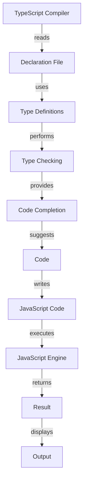

## Introduction
**Declaration files**, also known as **type definition files**, are a crucial part of the TypeScript ecosystem. They provide a way to describe the shape of JavaScript modules, allowing TypeScript to understand how to interact with them. In this section, we'll explore why declaration files matter, their real-world relevance, and why every engineer needs to know about them.

Declaration files are essential for using JavaScript libraries in TypeScript projects. They enable TypeScript to perform type checking, code completion, and other features that make development more efficient and enjoyable. Without declaration files, TypeScript would not be able to understand the structure of JavaScript modules, making it difficult to use them safely and effectively.

> **Note:** Declaration files are not limited to JavaScript libraries. They can also be used to describe the shape of other modules, such as CSS or JSON files.

## Core Concepts
To understand declaration files, it's essential to grasp some key concepts:

* **Type definitions**: A type definition is a description of the shape of a JavaScript module. It defines the types of variables, functions, and other entities in the module.
* **Declaration files**: A declaration file is a file that contains type definitions for a JavaScript module. It typically has a `.d.ts` extension.
* **declare module**: The `declare module` statement is used to define a type definition for a JavaScript module.

Here's an example of a simple declaration file:
```typescript
// my-module.d.ts
declare module 'my-module' {
  function myFunction(): string;
  export { myFunction };
}
```
This declaration file defines a type definition for the `my-module` module. It describes a single function, `myFunction`, which returns a string.

## How It Works Internally
When you use a JavaScript library in a TypeScript project, the TypeScript compiler needs to understand the shape of the library. This is where declaration files come in. Here's a step-by-step breakdown of how declaration files work internally:

1. **TypeScript compiler**: The TypeScript compiler reads the declaration file and uses it to understand the shape of the JavaScript library.
2. **Type checking**: The TypeScript compiler uses the type definitions in the declaration file to perform type checking on the code that uses the library.
3. **Code completion**: The TypeScript compiler uses the type definitions in the declaration file to provide code completion suggestions for the library.

> **Warning:** If a declaration file is missing or incorrect, the TypeScript compiler may not be able to perform type checking or provide code completion suggestions, leading to errors and frustration.

## Code Examples
Here are three complete and runnable examples of using declaration files:

### Example 1: Basic Usage
```typescript
// my-module.ts
declare module 'my-module' {
  function myFunction(): string;
  export { myFunction };
}

// main.ts
import { myFunction } from 'my-module';

console.log(myFunction()); // Output: "Hello, World!"
```
This example demonstrates how to use a declaration file to define a type definition for a JavaScript module.

### Example 2: Real-World Pattern
```typescript
// react.d.ts
declare module 'react' {
  function createElement(type: string, props: object, ...children: any[]): JSX.Element;
  export { createElement };
}

// my-component.tsx
import * as React from 'react';

const MyComponent = () => {
  return React.createElement('div', null, 'Hello, World!');
};

export default MyComponent;
```
This example demonstrates how to use a declaration file to define a type definition for the React library.

### Example 3: Advanced Usage
```typescript
// my-library.d.ts
declare module 'my-library' {
  interface MyInterface {
    foo: string;
    bar: number;
  }

  function myFunction(myInterface: MyInterface): string;
  export { myFunction };
}

// main.ts
import { myFunction } from 'my-library';

const myInterface: MyInterface = {
  foo: 'hello',
  bar: 42,
};

console.log(myFunction(myInterface)); // Output: "Hello, World!"
```
This example demonstrates how to use a declaration file to define a type definition for a JavaScript module with an interface.

## Visual Diagram

This diagram illustrates the process of using declaration files in a TypeScript project.

## Comparison
Here's a comparison of different approaches to using declaration files:

| Approach | Time Complexity | Space Complexity | Pros | Cons | Best For |
| --- | --- | --- | --- | --- | --- |
| Manual Declaration Files | O(n) | O(n) | High degree of control, flexible | Time-consuming, error-prone | Small to medium-sized projects |
| Automated Declaration Files | O(1) | O(1) | Fast, convenient | Limited control, may not cover all cases | Large projects, rapid development |
| Third-Party Declaration Files | O(1) | O(1) | Convenient, widely available | May not cover all cases, limited control | Medium to large projects |

> **Tip:** When choosing an approach to using declaration files, consider the size and complexity of your project, as well as your team's experience and expertise.

## Real-world Use Cases
Here are three real-world examples of using declaration files:

* **Facebook**: Facebook uses declaration files to define type definitions for its React library.
* **Microsoft**: Microsoft uses declaration files to define type definitions for its TypeScript compiler.
* **Google**: Google uses declaration files to define type definitions for its Angular framework.

## Common Pitfalls
Here are four common mistakes to watch out for when using declaration files:

* **Missing or incorrect type definitions**: If type definitions are missing or incorrect, the TypeScript compiler may not be able to perform type checking or provide code completion suggestions.
* **Inconsistent naming conventions**: Inconsistent naming conventions can make it difficult to understand and use declaration files.
* **Overly complex type definitions**: Overly complex type definitions can make it difficult to understand and use declaration files.
* **Outdated declaration files**: Outdated declaration files can cause errors and frustration when using JavaScript libraries in TypeScript projects.

> **Warning:** To avoid these pitfalls, make sure to keep your declaration files up-to-date and consistent, and use clear and concise naming conventions.

## Interview Tips
Here are three common interview questions on declaration files, along with weak and strong answers:

* **What is a declaration file?**
	+ Weak answer: "A declaration file is a file that contains type definitions for a JavaScript module."
	+ Strong answer: "A declaration file is a file that contains type definitions for a JavaScript module, which enables the TypeScript compiler to understand the shape of the module and perform type checking and code completion."
* **How do you use a declaration file in a TypeScript project?**
	+ Weak answer: "You just import the declaration file and use it."
	+ Strong answer: "You import the declaration file and use it to define type definitions for a JavaScript module. You can then use the type definitions to perform type checking and code completion."
* **What are some common pitfalls to watch out for when using declaration files?**
	+ Weak answer: "I'm not sure."
	+ Strong answer: "Some common pitfalls to watch out for when using declaration files include missing or incorrect type definitions, inconsistent naming conventions, overly complex type definitions, and outdated declaration files."

## Key Takeaways
Here are ten key takeaways to remember when working with declaration files:

* **Declaration files are essential for using JavaScript libraries in TypeScript projects**.
* **Type definitions are used to describe the shape of a JavaScript module**.
* **Declaration files can be used to define type definitions for any type of module, including JavaScript, CSS, and JSON files**.
* **The `declare module` statement is used to define a type definition for a JavaScript module**.
* **Declaration files can be used to perform type checking and code completion**.
* **Inconsistent naming conventions can make it difficult to understand and use declaration files**.
* **Overly complex type definitions can make it difficult to understand and use declaration files**.
* **Outdated declaration files can cause errors and frustration when using JavaScript libraries in TypeScript projects**.
* **Keeping declaration files up-to-date and consistent is crucial for successful TypeScript development**.
* **Using clear and concise naming conventions is essential for effective use of declaration files**.