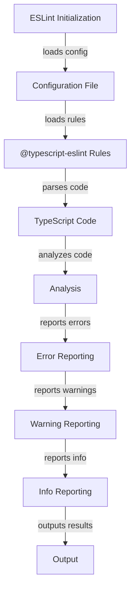

## Introduction
**ESLint** (ECMAScript Lint) is a static code analysis tool used to identify problematic patterns in JavaScript code. When paired with **@typescript-eslint**, it provides a set of TypeScript-specific linting rules to help maintain code quality and consistency. In this section, we will explore the importance of using ESLint with @typescript-eslint in TypeScript projects, and its real-world relevance.

> **Note:** ESLint is widely adopted in the industry, with many companies, including Facebook, Google, and Microsoft, relying on it to ensure code quality.

In real-world scenarios, ESLint with @typescript-eslint is essential for maintaining large-scale TypeScript projects. For instance, when working on a complex application with multiple developers, ESLint helps to enforce coding standards, detect potential errors, and improve code readability.

## Core Concepts
To understand how ESLint with @typescript-eslint works, it's essential to grasp the core concepts:

* **Linting**: The process of analyzing code for potential errors, warnings, and coding standard violations.
* **Rules**: Configurable settings that define what ESLint checks for in the code. @typescript-eslint provides a set of TypeScript-specific rules.
* **Config**: The configuration file that defines the rules, settings, and plugins used by ESLint.
* **Plugins**: Additional functionality that can be integrated into ESLint, such as @typescript-eslint.

> **Tip:** Use the `--init` flag when running ESLint for the first time to generate a basic configuration file.

Key terminology includes:

* **Error**: A critical issue that prevents the code from compiling or running correctly.
* **Warning**: A non-critical issue that may cause problems or affect code quality.
* **Info**: A notification that provides additional information about the code.

## How It Works Internally
Here's a step-by-step breakdown of how ESLint with @typescript-eslint works internally:

1. **Initialization**: ESLint is initialized with a configuration file (usually `.eslintrc.json` or `.eslintrc.js`).
2. **Loading Rules**: ESLint loads the rules defined in the configuration file, including @typescript-eslint rules.
3. **Parsing**: ESLint parses the TypeScript code using the `ts-parser` option.
4. **Analysis**: ESLint analyzes the parsed code against the loaded rules.
5. **Reporting**: ESLint reports any errors, warnings, or info messages found during analysis.

> **Warning:** Failing to configure ESLint correctly can lead to false positives or false negatives, which can negatively impact code quality.

## Code Examples
### Example 1: Basic ESLint Configuration
```typescript
// .eslintrc.json
{
  "extends": ["plugin:@typescript-eslint/recommended"],
  "parserOptions": {
    "project": "tsconfig.json"
  }
}
```
This example demonstrates a basic ESLint configuration that extends the @typescript-eslint recommended rules and uses the `tsconfig.json` file for parser options.

### Example 2: Custom ESLint Rule
```typescript
// custom-rule.ts
import { createRule } from 'eslint';

const customRule = createRule({
  meta: {
    type: 'problem',
    docs: {
      description: 'Disallow console logs',
      category: 'Best Practices',
      recommended: 'error'
    },
    messages: {
      noConsoleLog: 'Unexpected console.log statement.'
    },
    schema: [] // no options
  },
  create(context) {
    return {
      CallExpression(node) {
        if (node.callee.object && node.callee.object.name === 'console' && node.callee.property.name === 'log') {
          context.report({
            node: node,
            messageId: 'noConsoleLog'
          });
        }
      }
    };
  }
});

export const ruleName = 'no-console-log';
export const rule = customRule;
```
This example shows how to create a custom ESLint rule that disallows console logs.

### Example 3: Advanced ESLint Configuration
```typescript
// .eslintrc.json
{
  "extends": ["plugin:@typescript-eslint/recommended"],
  "parserOptions": {
    "project": "tsconfig.json"
  },
  "rules": {
    "@typescript-eslint/explicit-module-boundary-types": "error",
    "@typescript-eslint/no-explicit-any": "warn"
  }
}
```
This example demonstrates an advanced ESLint configuration that extends the @typescript-eslint recommended rules, uses the `tsconfig.json` file for parser options, and defines custom rules for explicit module boundary types and no explicit any types.

## Visual Diagram

This diagram illustrates the ESLint workflow, from initialization to output.

## Comparison
| Approach | Time Complexity | Space Complexity | Pros | Cons | Best For |
| --- | --- | --- | --- | --- | --- |
| @typescript-eslint/recommended | O(n) | O(n) | Provides a set of recommended rules for TypeScript projects | May not cover all possible scenarios | Large-scale TypeScript projects |
| @typescript-eslint/all | O(n) | O(n) | Includes all available @typescript-eslint rules | May generate false positives or false negatives | Small-scale TypeScript projects or custom configurations |
| Custom ESLint Rules | O(n) | O(n) | Allows for custom rule creation | Requires expertise in ESLint and TypeScript | Specific use cases or custom requirements |
| TSLint | O(n) | O(n) | Provides a set of TypeScript-specific linting rules | Deprecation and limited community support | Legacy TypeScript projects |

## Real-world Use Cases
1. **Facebook**: Uses ESLint with @typescript-eslint to maintain code quality and consistency across their large-scale TypeScript projects.
2. **Google**: Employs ESLint with @typescript-eslint to enforce coding standards and detect potential errors in their TypeScript codebase.
3. **Microsoft**: Utilizes ESLint with @typescript-eslint to improve code readability and maintainability in their TypeScript projects.

## Common Pitfalls
1. **Incorrect Configuration**: Failing to configure ESLint correctly can lead to false positives or false negatives.
```typescript
// incorrect configuration
{
  "extends": ["plugin:@typescript-eslint/recommended"],
  "parserOptions": {
    "project": "wrong-tsconfig.json"
  }
}
```
2. **Insufficient Rule Coverage**: Not including all necessary rules can result in undetected errors or warnings.
```typescript
// insufficient rule coverage
{
  "extends": ["plugin:@typescript-eslint/recommended"],
  "rules": {
    "@typescript-eslint/explicit-module-boundary-types": "error"
  }
}
```
3. **Overly Restrictive Rules**: Enforcing too many rules can lead to unnecessary warnings or errors.
```typescript
// overly restrictive rules
{
  "extends": ["plugin:@typescript-eslint/recommended"],
  "rules": {
    "@typescript-eslint/no-explicit-any": "error"
  }
}
```
4. **Inadequate Error Handling**: Failing to handle errors properly can cause issues in the development process.
```typescript
// inadequate error handling
try {
  // code that may throw an error
} catch (error) {
  console.log(error);
}
```

## Interview Tips
1. **What is ESLint, and how does it work?**
	* Weak answer: "ESLint is a tool that checks code for errors."
	* Strong answer: "ESLint is a static code analysis tool that uses a set of rules to identify potential issues in JavaScript code. It works by parsing the code, analyzing it against the loaded rules, and reporting any errors, warnings, or info messages found during analysis."
2. **How do you configure ESLint for a TypeScript project?**
	* Weak answer: "You can use the `--init` flag to generate a basic configuration file."
	* Strong answer: "To configure ESLint for a TypeScript project, you need to create a configuration file (usually `.eslintrc.json` or `.eslintrc.js`) that extends the @typescript-eslint recommended rules, uses the `tsconfig.json` file for parser options, and defines custom rules as needed."
3. **What are some common pitfalls when using ESLint with @typescript-eslint?**
	* Weak answer: "I'm not sure."
	* Strong answer: "Some common pitfalls include incorrect configuration, insufficient rule coverage, overly restrictive rules, and inadequate error handling. It's essential to carefully configure ESLint and @typescript-eslint to ensure accurate and relevant feedback."

## Key Takeaways
* ESLint is a static code analysis tool that uses a set of rules to identify potential issues in JavaScript code.
* @typescript-eslint provides a set of TypeScript-specific linting rules to help maintain code quality and consistency.
* Configuration is crucial when using ESLint with @typescript-eslint, and it's essential to extend the recommended rules, use the correct parser options, and define custom rules as needed.
* Common pitfalls include incorrect configuration, insufficient rule coverage, overly restrictive rules, and inadequate error handling.
* Time complexity for ESLint analysis is O(n), and space complexity is also O(n).
* ESLint with @typescript-eslint is widely adopted in the industry, with many companies relying on it to ensure code quality.
* Custom ESLint rules can be created to address specific use cases or requirements.
* TSLint is deprecated and should not be used for new projects.