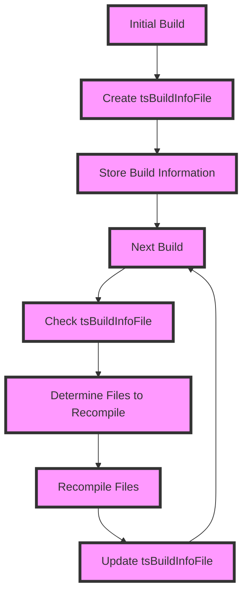

## Introduction
**Incremental compilation** is a technique used by the TypeScript compiler to improve build performance by only recompiling the files that have changed since the last build. This is achieved through the use of a **tsBuildInfoFile**, which stores information about the previous build, allowing the compiler to determine what needs to be recompiled. In this section, we will explore the world of incremental compilation and tsBuildInfoFile, and why it matters in real-world TypeScript development.

> **Note:** Incremental compilation is a crucial feature in TypeScript, as it enables developers to work on large projects with hundreds of files without experiencing significant build times.

## Core Concepts
To understand incremental compilation, we need to define some key terms:

* **tsBuildInfoFile**: a file that stores information about the previous build, including the files that were compiled, their dependencies, and the compilation options used.
* **Incremental compilation**: the process of recompiling only the files that have changed since the last build, using the information stored in the tsBuildInfoFile.
* **Dependency graph**: a graph that represents the dependencies between files in a project, used by the compiler to determine what needs to be recompiled.

> **Warning:** If the tsBuildInfoFile is not properly maintained, incremental compilation can lead to incorrect or incomplete builds.

## How It Works Internally
Here's a step-by-step breakdown of how incremental compilation works:

1. The TypeScript compiler creates a tsBuildInfoFile during the initial build, which stores information about the files that were compiled, their dependencies, and the compilation options used.
2. When the compiler is run again, it checks the tsBuildInfoFile to determine what files need to be recompiled.
3. The compiler uses the dependency graph to determine the dependencies of each file and recompiles only the files that have changed or have dependencies that have changed.
4. The compiler updates the tsBuildInfoFile with the new build information.

> **Tip:** To take full advantage of incremental compilation, make sure to use the `--incremental` flag when running the TypeScript compiler.

## Code Examples
Here are three examples that demonstrate the use of incremental compilation with tsBuildInfoFile:

### Example 1: Basic Usage
```typescript
// tsconfig.json
{
  "compilerOptions": {
    "incremental": true,
    "tsBuildInfoFile": "tsbuildinfo"
  }
}

// main.ts
console.log("Hello, world!");
```
In this example, we enable incremental compilation by setting the `incremental` flag to `true` in the `tsconfig.json` file. We also specify the `tsBuildInfoFile` option to tell the compiler where to store the build information.

### Example 2: Real-world Pattern
```typescript
// tsconfig.json
{
  "compilerOptions": {
    "incremental": true,
    "tsBuildInfoFile": "tsbuildinfo",
    "outDir": "dist"
  }
}

// src/main.ts
import { greet } from "./greet";
console.log(greet("world"));

// src/greet.ts
export function greet(name: string) {
  return `Hello, ${name}!`;
}
```
In this example, we have a more complex project with multiple files and dependencies. We use the `incremental` flag to enable incremental compilation and specify the `tsBuildInfoFile` option to store the build information.

### Example 3: Advanced Usage
```typescript
// tsconfig.json
{
  "compilerOptions": {
    "incremental": true,
    "tsBuildInfoFile": "tsbuildinfo",
    "outDir": "dist",
    "watch": true
  }
}

// src/main.ts
import { greet } from "./greet";
console.log(greet("world"));

// src/greet.ts
export function greet(name: string) {
  return `Hello, ${name}!`;
}

// src/index.ts
import { main } from "./main";
main();
```
In this example, we enable watch mode by setting the `watch` flag to `true`. This allows the compiler to automatically recompile the project when any of the files change.

## Visual Diagram

This diagram illustrates the incremental compilation process, from the initial build to the next build, and how the tsBuildInfoFile is used to determine what files need to be recompiled.

## Comparison
Here's a comparison table of different approaches to incremental compilation:

| Approach | Time Complexity | Space Complexity | Pros | Cons | Best For |
| --- | --- | --- | --- | --- | --- |
| **Incremental Compilation** | O(n) | O(n) | Fast build times, accurate dependency tracking | Requires tsBuildInfoFile maintenance | Large projects with frequent changes |
| **Full Compilation** | O(n^2) | O(n) | Simple to implement, no dependency tracking required | Slow build times, inaccurate dependency tracking | Small projects with infrequent changes |
| **Watch Mode** | O(n) | O(n) | Fast build times, automatic recompilation | Requires watch mode support, can be resource-intensive | Projects with frequent changes and watch mode support |
| **Cache-based Compilation** | O(n) | O(n) | Fast build times, cache-based dependency tracking | Requires cache maintenance, can be complex to implement | Large projects with frequent changes and cache support |

> **Interview:** What are the trade-offs between incremental compilation and full compilation? How would you decide which approach to use in a real-world project?

## Real-world Use Cases
Here are three real-world examples of incremental compilation with tsBuildInfoFile:

* **Microsoft**: Uses incremental compilation with tsBuildInfoFile in their TypeScript-based projects, such as the TypeScript compiler itself.
* **Google**: Uses incremental compilation with tsBuildInfoFile in their Angular framework, which is built on top of TypeScript.
* **Facebook**: Uses incremental compilation with tsBuildInfoFile in their React framework, which is built on top of TypeScript.

## Common Pitfalls
Here are four common mistakes to watch out for when using incremental compilation with tsBuildInfoFile:

* **Incorrect tsBuildInfoFile maintenance**: Failing to update the tsBuildInfoFile after changes to the project can lead to incorrect or incomplete builds.
* **Insufficient dependency tracking**: Failing to track dependencies correctly can lead to incorrect or incomplete builds.
* **Watch mode issues**: Failing to configure watch mode correctly can lead to resource-intensive builds or incorrect builds.
* **Cache maintenance issues**: Failing to maintain the cache correctly can lead to incorrect or incomplete builds.

> **Warning:** Make sure to test your incremental compilation setup thoroughly to avoid common pitfalls.

## Interview Tips
Here are three common interview questions related to incremental compilation with tsBuildInfoFile, along with weak and strong answers:

* **Question 1:** What is incremental compilation, and how does it work?
	+ Weak answer: Incremental compilation is a technique that recompiles only the files that have changed since the last build. It uses a tsBuildInfoFile to store information about the previous build.
	+ Strong answer: Incremental compilation is a technique that recompiles only the files that have changed since the last build, using the information stored in the tsBuildInfoFile. It works by creating a dependency graph of the project files and recompiling only the files that have changed or have dependencies that have changed.
* **Question 2:** How do you decide whether to use incremental compilation or full compilation in a project?
	+ Weak answer: I would use incremental compilation for large projects and full compilation for small projects.
	+ Strong answer: I would consider the project size, frequency of changes, and build time requirements when deciding between incremental compilation and full compilation. Incremental compilation is suitable for large projects with frequent changes, while full compilation is suitable for small projects with infrequent changes.
* **Question 3:** What are the trade-offs between watch mode and incremental compilation?
	+ Weak answer: Watch mode is used for automatic recompilation, while incremental compilation is used for fast build times.
	+ Strong answer: Watch mode and incremental compilation are both used for fast build times, but they have different trade-offs. Watch mode requires watch mode support and can be resource-intensive, while incremental compilation requires tsBuildInfoFile maintenance and can be complex to implement.

## Key Takeaways
Here are ten key takeaways to remember about incremental compilation with tsBuildInfoFile:

* Incremental compilation is a technique that recompiles only the files that have changed since the last build.
* The tsBuildInfoFile stores information about the previous build, including the files that were compiled, their dependencies, and the compilation options used.
* Incremental compilation uses a dependency graph to determine what files need to be recompiled.
* The `--incremental` flag enables incremental compilation in the TypeScript compiler.
* Watch mode can be used with incremental compilation for automatic recompilation.
* Cache-based compilation can be used with incremental compilation for fast build times.
* Incremental compilation is suitable for large projects with frequent changes.
* Full compilation is suitable for small projects with infrequent changes.
* The tsBuildInfoFile requires maintenance to ensure accurate builds.
* Incremental compilation can be complex to implement and requires careful consideration of trade-offs.

> **Tip:** Make sure to test your incremental compilation setup thoroughly to ensure accurate and efficient builds.