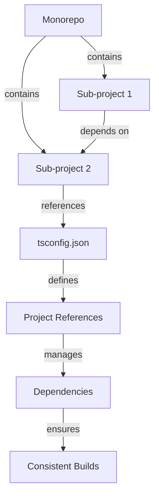

## Introduction
Project references for monorepos are a crucial concept in software development, especially when working with large-scale projects that involve multiple packages or modules. A monorepo is a single repository that contains all the source code for a project, including all its dependencies and sub-projects. Project references allow developers to manage dependencies between these sub-projects, ensuring that changes to one project are properly propagated to other dependent projects. In this section, we will explore the importance of project references, their real-world relevance, and why every engineer needs to know about them.

Project references are essential for maintaining a monorepo because they enable developers to:
* Manage dependencies between sub-projects
* Ensure consistent versions of dependencies across the monorepo
* Simplify the build and deployment process
* Improve code reuse and modularity

> **Note:** Monorepos are widely used in many large-scale projects, including Google, Facebook, and Microsoft. Understanding project references is crucial for working with these types of projects.

## Core Concepts
To understand project references, we need to define some key terms:
* **Monorepo**: A single repository that contains all the source code for a project, including all its dependencies and sub-projects.
* **Project reference**: A reference to a sub-project within a monorepo, which allows developers to manage dependencies between sub-projects.
* **Dependency**: A sub-project that is required by another sub-project to function correctly.

Mental models for project references include:
* Thinking of a monorepo as a tree, where each sub-project is a branch, and project references are the connections between these branches.
* Considering project references as a way to create a graph of dependencies between sub-projects.

Key terminology includes:
* **Project**: A sub-project within a monorepo.
* **Reference**: A project reference that points to a sub-project.
* **Dependency**: A sub-project that is required by another sub-project.

## How It Works Internally
Project references work by creating a reference to a sub-project within a monorepo. This reference is used to manage dependencies between sub-projects, ensuring that changes to one project are properly propagated to other dependent projects.

Here is a step-by-step breakdown of how project references work:
1. A developer creates a new sub-project within a monorepo.
2. The sub-project is added to the monorepo's `tsconfig.json` file, which defines the project references.
3. When a developer makes changes to a sub-project, the project references are updated to reflect the changes.
4. The updated project references are used to build and deploy the sub-projects.

Under-the-hood mechanics include:
* The `tsconfig.json` file is used to define project references and manage dependencies between sub-projects.
* The `tsc` compiler is used to build and deploy the sub-projects.

> **Warning:** Failing to update project references can lead to inconsistent dependencies and broken builds.

## Code Examples
### Example 1: Basic Project Reference
```typescript
// tsconfig.json
{
  "compilerOptions": {
    "target": "es5",
    "module": "commonjs",
    "outDir": "build"
  },
  "references": [
    {
      "path": "./sub-project-1"
    },
    {
      "path": "./sub-project-2"
    }
  ]
}
```
This example shows a basic `tsconfig.json` file that defines two project references to sub-projects `sub-project-1` and `sub-project-2`.

### Example 2: Project Reference with Dependencies
```typescript
// tsconfig.json
{
  "compilerOptions": {
    "target": "es5",
    "module": "commonjs",
    "outDir": "build"
  },
  "references": [
    {
      "path": "./sub-project-1",
      "dependencies": ["sub-project-2"]
    },
    {
      "path": "./sub-project-2"
    }
  ]
}
```
This example shows a `tsconfig.json` file that defines a project reference to `sub-project-1` with a dependency on `sub-project-2`.

### Example 3: Advanced Project Reference with Custom Build
```typescript
// tsconfig.json
{
  "compilerOptions": {
    "target": "es5",
    "module": "commonjs",
    "outDir": "build"
  },
  "references": [
    {
      "path": "./sub-project-1",
      "dependencies": ["sub-project-2"],
      "build": "custom-build.ts"
    },
    {
      "path": "./sub-project-2"
    }
  ]
}
```
This example shows a `tsconfig.json` file that defines a project reference to `sub-project-1` with a dependency on `sub-project-2` and a custom build script `custom-build.ts`.

## Visual Diagram

This diagram shows the relationships between a monorepo, sub-projects, project references, and dependencies.

> **Tip:** Using a visual diagram can help to simplify the complexity of project references and dependencies.

## Comparison
| Approach | Time Complexity | Space Complexity | Pros | Cons | Best For |
| --- | --- | --- | --- | --- | --- |
| Manual Project References | O(1) | O(1) | Easy to implement, flexible | Error-prone, manual updates required | Small projects |
| Automated Project References | O(n) | O(n) | Scalable, automated updates | Complex setup, requires additional tools | Large projects |
| Third-Party Tools | O(n) | O(n) | Easy to use, automated updates | Additional cost, vendor lock-in | Medium to large projects |
| Custom Build Scripts | O(1) | O(1) | Flexible, customizable | Error-prone, manual updates required | Small to medium projects |

## Real-world Use Cases
* Google's monorepo uses project references to manage dependencies between sub-projects.
* Facebook's monorepo uses automated project references to ensure consistent builds.
* Microsoft's monorepo uses third-party tools to manage project references and dependencies.

> **Interview:** Can you explain the benefits and drawbacks of using manual project references vs automated project references?

## Common Pitfalls
* Failing to update project references can lead to inconsistent dependencies and broken builds.
* Not considering the time complexity of automated project references can lead to performance issues.
* Not testing custom build scripts can lead to errors and broken builds.

> **Warning:** Failing to consider the space complexity of automated project references can lead to memory issues.

## Interview Tips
* Be prepared to explain the benefits and drawbacks of using manual project references vs automated project references.
* Be able to describe the time and space complexity of automated project references.
* Be prepared to discuss the pros and cons of using third-party tools for project references.

> **Tip:** Practice explaining the concepts of project references and dependencies to improve your communication skills.

## Key Takeaways
* Project references are essential for managing dependencies between sub-projects in a monorepo.
* Automated project references can simplify the build and deployment process.
* Custom build scripts can be used to customize the build process.
* Considering the time and space complexity of automated project references is crucial for performance and scalability.
* Testing custom build scripts is essential for ensuring correct builds.
* Project references can be used to improve code reuse and modularity.
* Understanding the concepts of project references and dependencies is crucial for working with large-scale projects.
* Using visual diagrams can help to simplify the complexity of project references and dependencies.