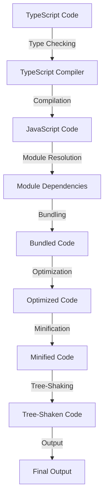

## Introduction
**TypeScript** is a statically typed, multi-paradigm programming language developed by Microsoft. It is designed to help developers catch errors early and improve code maintainability, thus making it a crucial tool for large and complex applications. In this study note, we will explore how to configure and use **TypeScript** with popular build tools like **Vite**, **Webpack**, and **Rollup**. We will delve into the core concepts, internal mechanics, and provide code examples to demonstrate the usage of **TypeScript** with these build tools.

> **Note:** Understanding the basics of **TypeScript** and its ecosystem is essential for getting the most out of this study note.

## Core Concepts
To work effectively with **TypeScript** and build tools, it's essential to understand the following core concepts:
* **Type Checking**: The process of verifying that the types of variables, function parameters, and return types match the expected types.
* **Compilation**: The process of converting **TypeScript** code into JavaScript code that can be executed by web browsers or Node.js.
* **Build Tools**: Tools like **Vite**, **Webpack**, and **Rollup** that help manage and optimize the build process of web applications.
* **Module Resolution**: The process of resolving module dependencies and importing them into the application.

> **Tip:** Familiarize yourself with the **TypeScript** configuration file (`tsconfig.json`) and its various options to customize the compilation process.

## How It Works Internally
When you use **TypeScript** with a build tool, the following process occurs:
1. **Type Checking**: The **TypeScript** compiler checks the code for type errors and reports any issues.
2. **Compilation**: The **TypeScript** compiler converts the **TypeScript** code into JavaScript code.
3. **Module Resolution**: The build tool resolves module dependencies and imports them into the application.
4. **Bundling**: The build tool bundles the compiled JavaScript code and its dependencies into a single file or a set of files.

> **Warning:** Failure to configure the build tool correctly can result in errors during the build process or at runtime.

## Code Examples
### Example 1: Basic **TypeScript** Configuration with **Vite**
```javascript
// tsconfig.json
{
  "compilerOptions": {
    "target": "es6",
    "module": "es6",
    "strict": true,
    "esModuleInterop": true
  }
}

// main.ts
import { createApp } from 'vite';
import App from './App.vue';

createApp(App).mount('#app');
```
This example demonstrates a basic **TypeScript** configuration with **Vite**.

### Example 2: Using **TypeScript** with **Webpack**
```javascript
// webpack.config.js
const path = require('path');

module.exports = {
  entry: './src/main.ts',
  output: {
    path: path.resolve(__dirname, 'dist'),
    filename: 'bundle.js',
  },
  module: {
    rules: [
      {
        test: /\.ts$/,
        use: 'ts-loader',
        exclude: /node_modules/,
      },
    ],
  },
  resolve: {
    extensions: ['.ts', '.js'],
  },
};
```
This example shows how to configure **Webpack** to work with **TypeScript**.

### Example 3: Advanced **TypeScript** Configuration with **Rollup**
```javascript
// rollup.config.js
import { nodeResolve } from '@rollup/plugin-node-resolve';
import { terser } from 'rollup-plugin-terser';
import typescript from 'rollup-plugin-typescript2';

export default {
  input: 'src/main.ts',
  output: {
    file: 'dist/bundle.js',
    format: 'esm',
  },
  plugins: [
    nodeResolve(),
    typescript(),
    terser(),
  ],
};
```
This example demonstrates an advanced **TypeScript** configuration with **Rollup**, including support for tree-shaking and minification.

> **Interview:** Can you explain the difference between **Vite**, **Webpack**, and **Rollup**, and when to use each?

## Visual Diagram

This diagram illustrates the internal mechanics of the build process when using **TypeScript** with a build tool.

## Comparison
| Build Tool | Time Complexity | Space Complexity | Pros | Cons | Best For |
| --- | --- | --- | --- | --- | --- |
| **Vite** | O(n) | O(n) | Fast development server, Hot Module Replacement | Limited support for legacy browsers | Development environments, small to medium-sized applications |
| **Webpack** | O(n^2) | O(n) | Highly customizable, large community support | Steep learning curve, slow build times | Large-scale applications, complex builds |
| **Rollup** | O(n) | O(n) | Tree-shaking, minification, and optimization | Limited support for legacy browsers | Small to medium-sized applications, libraries, and frameworks |

> **Tip:** Choose the build tool that best fits your project's needs, considering factors such as development speed, build complexity, and optimization requirements.

## Real-world Use Cases
* **Google**: Uses **TypeScript** and **Webpack** for its large-scale applications, such as Google Maps and Google Docs.
* **Microsoft**: Employs **TypeScript** and **Vite** for its development environments, such as Visual Studio Code.
* **Facebook**: Utilizes **TypeScript** and **Rollup** for its React-based applications, such as Facebook and Instagram.

> **Note:** These companies have successfully integrated **TypeScript** and build tools into their development workflows, resulting in improved code maintainability and performance.

## Common Pitfalls
* **Incorrectly configured tsconfig.json**: Failing to set up the **TypeScript** configuration file correctly can lead to errors during the build process.
* **Incompatible module versions**: Using incompatible module versions can cause errors during the build process or at runtime.
* **Insufficient optimization**: Failing to optimize the build process can result in large bundle sizes and slow load times.
* **Inadequate error handling**: Not implementing proper error handling can lead to unexpected behavior or crashes.

> **Warning:** Be cautious when configuring the build tool and **TypeScript** compiler to avoid common pitfalls and ensure a smooth development experience.

## Interview Tips
* **What is the difference between **Vite**, **Webpack**, and **Rollup**?**: Explain the core features, strengths, and weaknesses of each build tool.
* **How do you optimize the build process for a large-scale application?**: Discuss techniques such as tree-shaking, minification, and optimization, and explain how to implement them using **TypeScript** and a build tool.
* **What are some common mistakes to avoid when using **TypeScript** and a build tool?**: Identify common pitfalls, such as incorrectly configured **tsconfig.json** files or incompatible module versions, and explain how to avoid them.

> **Interview:** Can you explain how to integrate **TypeScript** with a build tool, and what benefits it provides for large-scale applications?

## Key Takeaways
* **TypeScript** is a statically typed language that helps catch errors early and improve code maintainability.
* **Vite**, **Webpack**, and **Rollup** are popular build tools that can be used with **TypeScript** to manage and optimize the build process.
* **TypeScript** configuration files (`tsconfig.json`) are essential for customizing the compilation process.
* **Module resolution** and **bundling** are critical steps in the build process.
* **Optimization** and **minification** can significantly improve the performance of large-scale applications.
* **Tree-shaking** and **code splitting** can help reduce bundle sizes and improve load times.
* **Error handling** is crucial for ensuring a smooth development experience and preventing unexpected behavior or crashes.