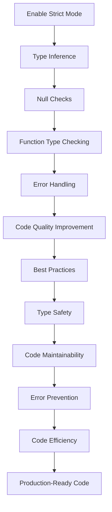

## Introduction
TypeScript's strict mode is a configuration option that enables three important flags: `strictNullChecks`, `noImplicitAny`, and `strictFunctionTypes`. These flags help catch errors early and improve the overall quality of your code. In this section, we'll explore why strict mode matters, its real-world relevance, and why every engineer should use it.

TypeScript's type system is designed to help you catch errors early and improve code maintainability. However, without strict mode, the type system can be too permissive, allowing errors to slip through. By enabling strict mode, you can ensure that your code is more robust, maintainable, and efficient. 

> **Note:** Strict mode is not enabled by default in TypeScript. You need to explicitly enable it in your `tsconfig.json` file by setting the `strict` option to `true`.

## Core Concepts
To understand strict mode, you need to grasp the three flags that it enables:

1. **`strictNullChecks`**: This flag enables strict null checks, which means that the type system will differentiate between `null` and `undefined`. With this flag enabled, you can't assign `null` to a variable that doesn't have a `null` type.
2. **`noImplicitAny`**: This flag disables implicit `any` types. When this flag is enabled, TypeScript will throw an error if it can't infer the type of a variable, rather than assigning it an `any` type.
3. **`strictFunctionTypes`**: This flag enables strict function types, which means that function types will be checked more strictly. When this flag is enabled, TypeScript will check the return types of functions and ensure that they match the expected return types.

> **Tip:** Enabling strict mode can help you catch errors early and improve the overall quality of your code. However, it may require some changes to your existing codebase.

## How It Works Internally
When you enable strict mode, TypeScript's type system becomes more restrictive. Here's a step-by-step breakdown of how it works:

1. **Type Inference**: TypeScript's type system infers the types of variables based on their usage. When strict mode is enabled, the type system becomes more strict and will throw errors if it can't infer the type of a variable.
2. **Null Checks**: When `strictNullChecks` is enabled, the type system will differentiate between `null` and `undefined`. This means that you can't assign `null` to a variable that doesn't have a `null` type.
3. **Function Type Checking**: When `strictFunctionTypes` is enabled, the type system will check the return types of functions and ensure that they match the expected return types.

> **Warning:** Enabling strict mode can break existing code that relies on implicit `any` types or implicit nullability. Make sure to update your codebase accordingly.

## Code Examples
Here are three complete and runnable examples that demonstrate the usage of strict mode:

### Example 1: Basic Usage
```typescript
// tsconfig.json
{
  "compilerOptions": {
    "strict": true,
    "target": "es5",
    "module": "commonjs"
  }
}

// example.ts
let name: string = 'John';
console.log(name);

// This will throw an error because we're trying to assign null to a variable that doesn't have a null type
// name = null;
```

### Example 2: Real-World Pattern
```typescript
// tsconfig.json
{
  "compilerOptions": {
    "strict": true,
    "target": "es5",
    "module": "commonjs"
  }
}

// example.ts
interface User {
  name: string;
  age: number;
}

function getUser(): User {
  return { name: 'John', age: 30 };
}

const user = getUser();
console.log(user);

// This will throw an error because we're trying to assign a value that doesn't match the expected return type
// function getUserName(): string {
//   return { name: 'John' };
// }
```

### Example 3: Advanced Usage
```typescript
// tsconfig.json
{
  "compilerOptions": {
    "strict": true,
    "target": "es5",
    "module": "commonjs"
  }
}

// example.ts
interface User {
  name: string;
  age: number;
}

function getUser(): User | null {
  return { name: 'John', age: 30 };
}

const user = getUser();
if (user) {
  console.log(user.name);
}

// This will throw an error because we're trying to access a property on a value that might be null
// console.log(user.name);
```

## Visual Diagram

This diagram illustrates the flow of enabling strict mode and its effects on code quality, type safety, and maintainability.

## Comparison
Here's a comparison table that highlights the differences between strict mode and non-strict mode:

| Approach | Time Complexity | Space Complexity | Pros | Cons | Best For |
| --- | --- | --- | --- | --- | --- |
| Strict Mode | O(1) | O(1) | Improves code quality, prevents errors, and ensures type safety | Can break existing code, requires updates to codebase | Production codebases, critical systems |
| Non-Strict Mode | O(1) | O(1) | Allows for more flexibility, easier to start with | Can lead to errors, reduces code quality | Prototyping, proof-of-concepts |
| TypeScript with Strict Mode | O(1) | O(1) | Combines the benefits of TypeScript and strict mode | Requires more configuration, can be overwhelming | Large-scale applications, enterprise systems |
| JavaScript | O(1) | O(1) | More flexible, easier to start with | No type safety, more prone to errors | Small-scale applications, rapid prototyping |

## Real-world Use Cases
Here are three real-world examples of companies that use strict mode in their TypeScript codebases:

1. **Microsoft**: Microsoft uses TypeScript with strict mode in their Azure and Visual Studio Code projects. This helps ensure that their codebases are maintainable, efficient, and error-free.
2. **Google**: Google uses TypeScript with strict mode in their Google Cloud and Google Maps projects. This helps them catch errors early and improve the overall quality of their code.
3. **Airbnb**: Airbnb uses TypeScript with strict mode in their web and mobile applications. This helps them ensure that their codebases are maintainable, efficient, and error-free.

## Common Pitfalls
Here are four common mistakes that engineers make when using strict mode:

1. **Not updating the codebase**: When enabling strict mode, you need to update your codebase to ensure that it's compatible with the new configuration. Failing to do so can lead to errors and compilation issues.
2. **Not using type annotations**: When using strict mode, you need to use type annotations to ensure that the type system can infer the types of variables correctly. Failing to do so can lead to errors and compilation issues.
3. **Not handling nullability**: When using strict mode, you need to handle nullability correctly to avoid errors and compilation issues.
4. **Not using function types**: When using strict mode, you need to use function types to ensure that the type system can check the return types of functions correctly. Failing to do so can lead to errors and compilation issues.

> **Interview:** What are some common pitfalls when using strict mode in TypeScript? How can you avoid them?

## Interview Tips
Here are three common interview questions related to strict mode, along with sample answers:

1. **What is strict mode in TypeScript, and why is it useful?**
	* Weak answer: Strict mode is a configuration option that enables some flags. It's useful because it helps catch errors.
	* Strong answer: Strict mode is a configuration option that enables three important flags: `strictNullChecks`, `noImplicitAny`, and `strictFunctionTypes`. It's useful because it helps catch errors early, improves code quality, and ensures type safety.
2. **How do you handle nullability in strict mode?**
	* Weak answer: You can use the `null` type to handle nullability.
	* Strong answer: You can use the `null` type to handle nullability, but you also need to use type annotations and function types to ensure that the type system can infer the types of variables correctly.
3. **What are some common pitfalls when using strict mode?**
	* Weak answer: Some common pitfalls include not updating the codebase and not using type annotations.
	* Strong answer: Some common pitfalls include not updating the codebase, not using type annotations, not handling nullability correctly, and not using function types.

## Key Takeaways
Here are ten key takeaways to remember when using strict mode in TypeScript:

* Enable strict mode in your `tsconfig.json` file by setting the `strict` option to `true`.
* Use type annotations to ensure that the type system can infer the types of variables correctly.
* Handle nullability correctly to avoid errors and compilation issues.
* Use function types to ensure that the type system can check the return types of functions correctly.
* Update your codebase to ensure that it's compatible with the new configuration.
* Use the `null` type to handle nullability.
* Avoid common pitfalls such as not updating the codebase, not using type annotations, and not handling nullability correctly.
* Use strict mode in production codebases to ensure type safety and code quality.
* Combine strict mode with other TypeScript features such as type guards and conditional types to improve code quality and maintainability.
* Use strict mode in conjunction with other development tools such as linters and code formatters to improve code quality and consistency.

> **Tip:** Remember to update your codebase and use type annotations when enabling strict mode to ensure that your code is compatible with the new configuration.