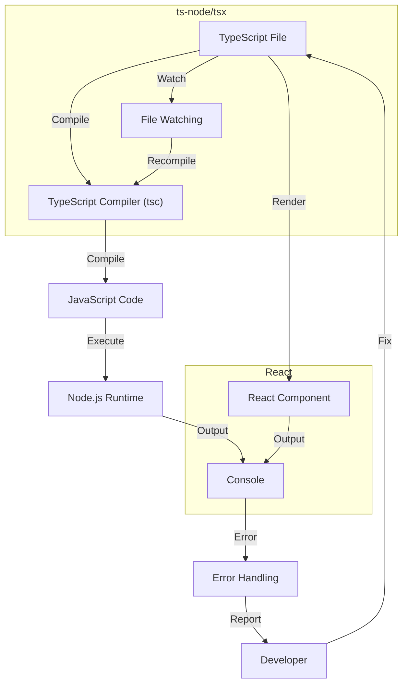

## Introduction
**TypeScript** is a statically typed, multi-paradigm programming language developed by Microsoft as a superset of **JavaScript**. While TypeScript is designed to help developers catch errors early and improve code maintainability, it still requires compilation to JavaScript before it can be executed by a JavaScript engine. This is where **ts-node** and **tsx** come into play, allowing developers to run TypeScript directly without the need for a separate compilation step. In this article, we will explore the world of ts-node and tsx, delving into their core concepts, internal mechanics, and real-world applications.

## Core Concepts
- **ts-node**: A TypeScript execution environment that allows you to run TypeScript files directly. It uses the TypeScript compiler to compile your code on the fly, enabling features like auto-reloading and improved debugging.
- **tsx**: A command-line interface for running TypeScript files, similar to ts-node. The key difference is that tsx is designed specifically for executing TypeScript files that contain JSX syntax, commonly used in React applications.
- **TypeScript Compiler (tsc)**: The official TypeScript compiler, responsible for compiling TypeScript code into JavaScript. Both ts-node and tsx rely on tsc under the hood to perform the compilation.

> **Note:** ts-node and tsx are not meant to replace the traditional compilation step entirely but rather to provide a more streamlined development experience.

## How It Works Internally
When you run a TypeScript file using ts-node or tsx, the following steps occur:
1. **File Watching**: ts-node and tsx watch for changes to your TypeScript files, allowing for automatic recompilation and reloading.
2. **Compilation**: The TypeScript compiler (tsc) is invoked to compile the TypeScript code into JavaScript. This step involves type checking, syntax analysis, and code generation.
3. **Execution**: The compiled JavaScript code is executed by the Node.js runtime.
4. **Error Handling**: Any errors encountered during compilation or execution are reported back to the developer, providing valuable feedback for debugging purposes.

## Code Examples
### Example 1: Basic ts-node Usage
```typescript
// hello.ts
console.log('Hello, World!');
```
To run this file using ts-node, simply execute:
```bash
npx ts-node hello.ts
```
This will compile and run the `hello.ts` file, outputting "Hello, World!" to the console.

### Example 2: Using tsx with React
```typescript
// App.tsx
import * as React from 'react';

const App = () => {
  return <div>Hello, World!</div>;
};

export default App;
```
To run this file using tsx, execute:
```bash
npx tsx App.tsx
```
This will compile and run the `App.tsx` file, rendering the React component to the console.

### Example 3: Advanced ts-node Configuration
```typescript
// tsconfig.json
{
  "compilerOptions": {
    "target": "es6",
    "module": "commonjs",
    "outDir": "build",
    "sourceMap": true
  }
}
```
```typescript
// main.ts
import { greet } from './greet';

console.log(greet('World'));
```
To run this file using ts-node with a custom `tsconfig.json` file, execute:
```bash
npx ts-node --project tsconfig.json main.ts
```
This will compile and run the `main.ts` file, using the configuration specified in `tsconfig.json`.

## Visual Diagram

The diagram illustrates the internal workflow of ts-node and tsx, from file watching and compilation to execution and error handling.

## Comparison
| Approach | Time Complexity | Space Complexity | Pros | Cons | Best For |
| --- | --- | --- | --- | --- | --- |
| ts-node | O(n) | O(n) | Fast development cycle, auto-reloading | Overhead of compilation step | Development, testing |
| tsx | O(n) | O(n) | Supports JSX syntax, ideal for React applications | Limited to React applications | React development |
| Traditional Compilation | O(n) | O(n) | No overhead, better performance | Separate compilation step required | Production environments |
| Babel | O(n) | O(n) | Supports transpilation, polyfills | Overhead of transpilation step | Legacy browser support |

> **Warning:** While ts-node and tsx provide a convenient development experience, they may introduce performance overhead due to the compilation step.

## Real-world Use Cases
- **Microsoft**: Uses TypeScript and ts-node extensively in their development workflow for building scalable and maintainable applications.
- **Airbnb**: Employs tsx for running React applications, taking advantage of the improved development experience and auto-reloading features.
- **Google**: Utilizes TypeScript and ts-node for building Angular applications, leveraging the benefits of static type checking and auto-completion.

## Common Pitfalls
- **Incorrect tsconfig.json**: Failing to configure the `tsconfig.json` file correctly can lead to compilation errors or unexpected behavior.
```json
// WRONG
{
  "compilerOptions": {
    "target": "es5"
  }
}
// RIGHT
{
  "compilerOptions": {
    "target": "es6"
  }
}
```
- **Missing Type Definitions**: Forgetting to install or import type definitions for third-party libraries can result in type errors.
```bash
// WRONG
npm install express
// RIGHT
npm install --save-dev @types/express
```
- **Inconsistent Code Style**: Failing to maintain a consistent code style throughout the project can lead to confusion and maintainability issues.
```typescript
// WRONG
function greet(name: string): void {
  console.log('Hello, ' + name);
}
// RIGHT
function greet(name: string): void {
  console.log(`Hello, ${name}`);
}
```
> **Tip:** Use a linter and code formatter to enforce consistent code style and catch errors early.

## Interview Tips
- **What is the difference between ts-node and tsx?**: A strong answer would highlight the key differences between ts-node and tsx, including their support for JSX syntax and React applications.
- **How does ts-node handle compilation?**: A weak answer might focus solely on the compilation step, while a strong answer would discuss the entire workflow, including file watching and auto-reloading.
- **What are the benefits of using TypeScript with ts-node?**: A strong answer would emphasize the advantages of using TypeScript, such as improved code maintainability and type safety, and how ts-node enhances the development experience.

## Key Takeaways
* ts-node and tsx allow for running TypeScript files directly, providing a streamlined development experience.
* The TypeScript compiler (tsc) is responsible for compiling TypeScript code into JavaScript.
* ts-node and tsx watch for file changes, enabling auto-reloading and improved debugging.
* The choice between ts-node and tsx depends on the specific use case, such as React applications or general TypeScript development.
* Correct configuration of the `tsconfig.json` file is crucial for successful compilation and execution.
* Consistent code style and linting are essential for maintaining readable and maintainable codebases.
* TypeScript and ts-node can be used in conjunction with other tools, such as Babel and Webpack, to create a robust development workflow.