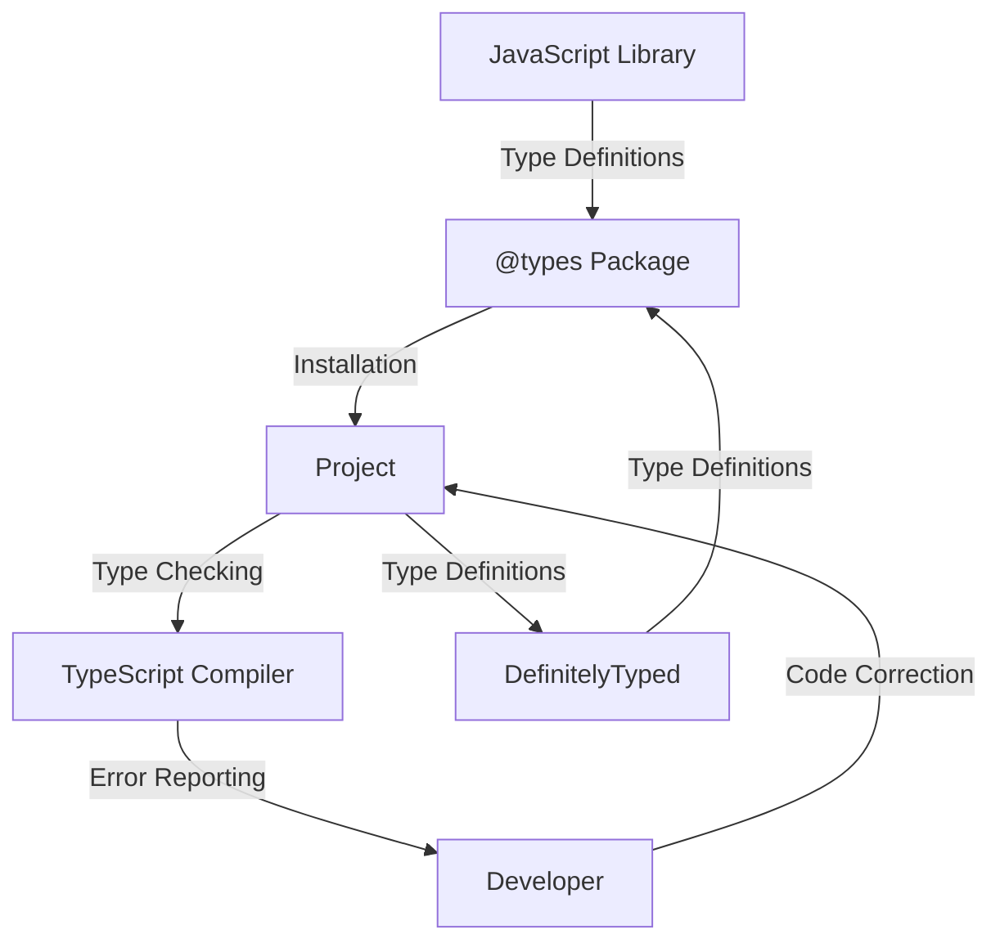

## Introduction
**TypeScript** is a statically typed, multi-paradigm programming language developed by Microsoft as a superset of **JavaScript**. One of the key features of TypeScript is its ability to use **type definitions** for existing JavaScript libraries, allowing developers to take advantage of static typing and other TypeScript features when working with these libraries. This is where **@types packages** and **DefinitelyTyped** come into play. In this section, we will explore what @types packages and DefinitelyTyped are, why they matter, and their real-world relevance.

**@types packages** are TypeScript type definitions for popular JavaScript libraries, allowing developers to use these libraries with TypeScript. These packages are typically maintained by the community and are published on npm. **DefinitelyTyped**, on the other hand, is a repository of high-quality TypeScript type definitions for a wide range of JavaScript libraries. It is a central location where developers can find and contribute type definitions for their favorite libraries.

> **Note:** @types packages and DefinitelyTyped are essential for using TypeScript with existing JavaScript libraries, as they provide the necessary type definitions for these libraries.

## Core Concepts
In this section, we will cover the core concepts related to @types packages and DefinitelyTyped.

* **Type Definitions**: A type definition is a file that contains information about the types of a JavaScript library. It defines the types of functions, classes, and variables in the library, allowing TypeScript to check the types of code that uses the library.
* **@types Packages**: @types packages are npm packages that contain type definitions for JavaScript libraries. They are typically named after the library they provide type definitions for, with the prefix `@types/`.
* **DefinitelyTyped**: DefinitelyTyped is a repository of high-quality TypeScript type definitions for a wide range of JavaScript libraries. It is a central location where developers can find and contribute type definitions for their favorite libraries.

> **Tip:** When using a JavaScript library with TypeScript, it is a good practice to install the corresponding @types package to get the type definitions for the library.

## How It Works Internally
In this section, we will explore how @types packages and DefinitelyTyped work internally.

When you install an @types package, you are installing a set of type definitions for a JavaScript library. These type definitions are used by the TypeScript compiler to check the types of your code. The TypeScript compiler uses the type definitions to infer the types of variables, function parameters, and return types, allowing it to catch type-related errors at compile-time.

Here is a step-by-step breakdown of how it works:

1. You install an @types package using npm or yarn.
2. The @types package is installed in your project's `node_modules` directory.
3. The TypeScript compiler uses the type definitions in the @types package to check the types of your code.
4. The TypeScript compiler reports any type-related errors it finds.

> **Warning:** If you don't install the corresponding @types package for a JavaScript library, you may get type-related errors when using the library with TypeScript.

## Code Examples
In this section, we will provide three complete and runnable code examples that demonstrate how to use @types packages and DefinitelyTyped.

### Example 1: Basic Usage
```typescript
// Install the @types/jquery package
npm install --save-dev @types/jquery

// Use jQuery with TypeScript
import $ from 'jquery';

// Use jQuery to select an element
const element = $('#my-element');
```

### Example 2: Real-World Pattern
```typescript
// Install the @types/react package
npm install --save-dev @types/react

// Use React with TypeScript
import React from 'react';
import ReactDOM from 'react-dom';

// Define a React component
interface Props {
  name: string;
}

const Hello: React.FC<Props> = ({ name }) => {
  return <div>Hello, {name}!</div>;
};

// Render the component
ReactDOM.render(<Hello name="World" />, document.getElementById('root'));
```

### Example 3: Advanced Usage
```typescript
// Install the @types/lodash package
npm install --save-dev @types/lodash

// Use Lodash with TypeScript
import _ from 'lodash';

// Use Lodash to filter an array
const numbers = [1, 2, 3, 4, 5];
const evenNumbers = _.filter(numbers, (num) => num % 2 === 0);

console.log(evenNumbers); // [2, 4]
```

> **Interview:** Can you explain the difference between @types packages and DefinitelyTyped? How do you use them in your projects?

## Visual Diagram


The diagram shows the relationship between a JavaScript library, an @types package, a project, the TypeScript compiler, and DefinitelyTyped. The @types package provides type definitions for the JavaScript library, which are used by the TypeScript compiler to check the types of the code in the project. The developer uses the type definitions to correct any type-related errors in the code. DefinitelyTyped is a central location where developers can find and contribute type definitions for their favorite libraries.

## Comparison
| Approach | Time Complexity | Space Complexity | Pros | Cons | Best For |
| --- | --- | --- | --- | --- | --- |
| @types Packages | O(1) | O(1) | Provides type definitions for popular libraries, easy to use | May not be available for all libraries, can be outdated | Small to medium-sized projects |
| DefinitelyTyped | O(n) | O(n) | Central location for type definitions, high-quality definitions | Can be overwhelming, requires manual installation | Large projects, enterprise environments |
| Manual Type Definitions | O(n) | O(n) | Customizable, flexible | Time-consuming, requires expertise | Complex projects, custom libraries |
| No Type Definitions | O(1) | O(1) | Fast, easy to set up | No type checking, prone to errors | Prototyping, proof-of-concept projects |

> **Note:** The time and space complexity columns refer to the time and space required to install and use the approach, respectively.

## Real-world Use Cases
Here are three real-world use cases for @types packages and DefinitelyTyped:

1. **Google**: Google uses @types packages and DefinitelyTyped to provide type definitions for their popular JavaScript libraries, such as Google Maps and Google Analytics.
2. **Microsoft**: Microsoft uses @types packages and DefinitelyTyped to provide type definitions for their JavaScript libraries, such as React and ASP.NET.
3. **Airbnb**: Airbnb uses @types packages and DefinitelyTyped to provide type definitions for their JavaScript libraries, such as React and Redux.

> **Tip:** When using a JavaScript library with TypeScript, it is a good practice to check if an @types package is available for the library before creating your own type definitions.

## Common Pitfalls
Here are four common pitfalls to watch out for when using @types packages and DefinitelyTyped:

1. **Outdated Type Definitions**: Using outdated type definitions can lead to type-related errors and inconsistencies.
```typescript
// Wrong
import _ from 'lodash';
const numbers = [1, 2, 3, 4, 5];
const evenNumbers = _.filter(numbers, (num) => num % 2 === 0); // Error: _.filter is not a function

// Right
import _ from 'lodash';
const numbers = [1, 2, 3, 4, 5];
const evenNumbers = _.filter(numbers, (num) => num % 2 === 0); // OK
```

2. **Missing Type Definitions**: Failing to install the corresponding @types package for a JavaScript library can lead to type-related errors.
```typescript
// Wrong
import $ from 'jquery';
const element = $('#my-element'); // Error: $ is not defined

// Right
import $ from 'jquery';
const element = $('#my-element'); // OK
```

3. **Incorrect Type Definitions**: Using incorrect type definitions can lead to type-related errors and inconsistencies.
```typescript
// Wrong
interface Props {
  name: number;
}

const Hello: React.FC<Props> = ({ name }) => {
  return <div>Hello, {name}!</div>;
}; // Error: name is not a number

// Right
interface Props {
  name: string;
}

const Hello: React.FC<Props> = ({ name }) => {
  return <div>Hello, {name}!</div>;
}; // OK
```

4. **Overriding Type Definitions**: Overriding type definitions can lead to type-related errors and inconsistencies.
```typescript
// Wrong
interface Props {
  name: string;
}

const Hello: React.FC<Props> = ({ name }) => {
  return <div>Hello, {name}!</div>;
};

interface Props {
  name: number;
} // Error: Props is already defined

// Right
interface Props {
  name: string;
}

const Hello: React.FC<Props> = ({ name }) => {
  return <div>Hello, {name}!</div>;
};
```

> **Warning:** When using @types packages and DefinitelyTyped, it is essential to keep your type definitions up-to-date and accurate to avoid type-related errors and inconsistencies.

## Interview Tips
Here are three common interview questions related to @types packages and DefinitelyTyped, along with weak and strong answers:

1. **What is the difference between @types packages and DefinitelyTyped?**

Weak answer: "Uh, I think they're the same thing? Maybe one is for React and the other is for Angular?"

Strong answer: "@types packages are npm packages that contain type definitions for specific JavaScript libraries, while DefinitelyTyped is a central repository of high-quality type definitions for a wide range of JavaScript libraries. @types packages are typically maintained by the community, while DefinitelyTyped is maintained by Microsoft."

2. **How do you use @types packages in your projects?**

Weak answer: "Uh, I just install them using npm? I'm not really sure how they work."

Strong answer: "I use @types packages to provide type definitions for popular JavaScript libraries in my projects. I install them using npm or yarn, and then use the type definitions to catch type-related errors at compile-time. I also make sure to keep my type definitions up-to-date and accurate to avoid type-related errors and inconsistencies."

3. **What are some common pitfalls to watch out for when using @types packages and DefinitelyTyped?**

Weak answer: "Uh, I'm not really sure? Maybe something about outdated type definitions?"

Strong answer: "Some common pitfalls to watch out for when using @types packages and DefinitelyTyped include outdated type definitions, missing type definitions, incorrect type definitions, and overriding type definitions. To avoid these pitfalls, I make sure to keep my type definitions up-to-date and accurate, and I use tools like TypeScript and DefinitelyTyped to help me catch type-related errors and inconsistencies."

> **Interview:** Can you explain the difference between @types packages and DefinitelyTyped? How do you use them in your projects?

## Key Takeaways
Here are ten key takeaways to remember when using @types packages and DefinitelyTyped:

* **@types packages** are npm packages that contain type definitions for specific JavaScript libraries.
* **DefinitelyTyped** is a central repository of high-quality type definitions for a wide range of JavaScript libraries.
* **Type definitions** are essential for using JavaScript libraries with TypeScript.
* **@types packages** are typically maintained by the community, while **DefinitelyTyped** is maintained by Microsoft.
* **Keep your type definitions up-to-date and accurate** to avoid type-related errors and inconsistencies.
* **Use tools like TypeScript and DefinitelyTyped** to help you catch type-related errors and inconsistencies.
* **Outdated type definitions** can lead to type-related errors and inconsistencies.
* **Missing type definitions** can lead to type-related errors and inconsistencies.
* **Incorrect type definitions** can lead to type-related errors and inconsistencies.
* **Overriding type definitions** can lead to type-related errors and inconsistencies.

> **Tip:** When using @types packages and DefinitelyTyped, it is essential to keep your type definitions up-to-date and accurate to avoid type-related errors and inconsistencies.