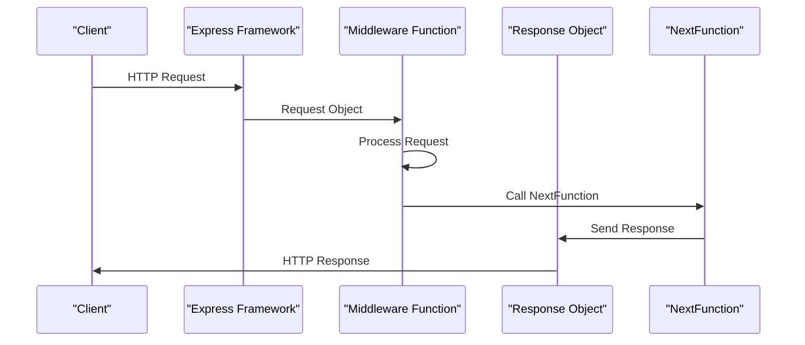

## Introduction
TypeScript with Express is a powerful combination for building robust and scalable web applications. **TypeScript** is a superset of JavaScript that adds optional static typing and other features to improve the development experience. **Express** is a popular Node.js web framework that provides a flexible and modular way to build web applications. Together, they offer a robust and maintainable way to build complex web applications. In this article, we will explore the fundamentals of using TypeScript with Express, including the request, response, and NextFunction objects.

## Core Concepts
To work with TypeScript and Express, you need to understand the core concepts of the framework. Here are the key terms and definitions:
* **Request**: The request object represents the HTTP request sent by the client. It contains properties such as `method`, `url`, `headers`, and `body`.
* **Response**: The response object represents the HTTP response sent by the server. It contains properties such as `statusCode`, `headers`, and `body`.
* **NextFunction**: The NextFunction is a callback function that is called when the current middleware function is complete. It is used to pass control to the next middleware function in the chain.

> **Note:** Understanding the request, response, and NextFunction objects is crucial for building robust and scalable web applications with TypeScript and Express.

## How It Works Internally
When a request is made to an Express application, the framework uses a pipeline of middleware functions to process the request. Each middleware function has access to the request, response, and NextFunction objects. Here is a step-by-step breakdown of how it works:
1. The client sends an HTTP request to the server.
2. The Express framework receives the request and creates a new request object.
3. The request object is passed to the first middleware function in the chain.
4. The middleware function processes the request and calls the NextFunction to pass control to the next middleware function in the chain.
5. The process continues until the response is sent back to the client.

> **Warning:** If a middleware function does not call the NextFunction, the request will hang and the client will not receive a response.

## Code Examples
Here are three complete and runnable code examples that demonstrate the use of TypeScript with Express:
### Example 1: Basic Usage
```typescript
import express, { Request, Response, NextFunction } from 'express';

const app = express();

app.get('/', (req: Request, res: Response, next: NextFunction) => {
  // **Request** object
  console.log(req.method); // GET
  console.log(req.url); // /
  console.log(req.headers); // { host: 'localhost:3000', ... }

  // **Response** object
  res.statusCode = 200;
  res.setHeader('Content-Type', 'text/plain');
  res.send('Hello World!');
});

app.listen(3000, () => {
  console.log('Server started on port 3000');
});
```
### Example 2: Real-World Pattern
```typescript
import express, { Request, Response, NextFunction } from 'express';
import { User } from './models/User';

const app = express();

app.get('/users', async (req: Request, res: Response, next: NextFunction) => {
  try {
    const users = await User.findAll();
    res.json(users);
  } catch (error) {
    next(error);
  }
});

app.use((err: Error, req: Request, res: Response, next: NextFunction) => {
  console.error(err);
  res.status(500).send('Internal Server Error');
});

app.listen(3000, () => {
  console.log('Server started on port 3000');
});
```
### Example 3: Advanced Usage
```typescript
import express, { Request, Response, NextFunction } from 'express';
import { authenticate } from './middleware/authenticate';

const app = express();

app.get('/protected', authenticate, (req: Request, res: Response, next: NextFunction) => {
  // Only authenticated users can access this route
  res.send('Hello Protected!');
});

app.listen(3000, () => {
  console.log('Server started on port 3000');
});
```
> **Tip:** Use middleware functions to separate concerns and make your code more modular and reusable.

## Visual Diagram

This diagram illustrates the sequence of events when a client sends an HTTP request to an Express application. The request is passed to the first middleware function in the chain, which processes the request and calls the NextFunction to pass control to the next middleware function. The process continues until the response is sent back to the client.

## Comparison
Here is a comparison of different approaches to building web applications with TypeScript and Express:
| Approach | Time Complexity | Space Complexity | Pros | Cons | Best For |
| --- | --- | --- | --- | --- | --- |
| **TypeScript with Express** | O(1) | O(1) | Robust and maintainable, scalable | Steep learning curve | Complex web applications |
| **JavaScript with Express** | O(1) | O(1) | Easy to learn, fast development | Less robust and maintainable | Simple web applications |
| **TypeScript with React** | O(n) | O(n) | Client-side rendering, fast development | Less scalable | Single-page applications |
| **JavaScript with Angular** | O(n) | O(n) | Client-side rendering, fast development | Less scalable | Single-page applications |

> **Interview:** What is the difference between TypeScript and JavaScript? Answer: TypeScript is a superset of JavaScript that adds optional static typing and other features to improve the development experience.

## Real-world Use Cases
Here are three real-world examples of companies that use TypeScript with Express:
* **Airbnb**: Airbnb uses TypeScript with Express to build their web application. They have a large team of developers who work on the application, and TypeScript helps them maintain a consistent codebase.
* **Microsoft**: Microsoft uses TypeScript with Express to build their web applications, including the Azure portal. They have a large team of developers who work on the application, and TypeScript helps them maintain a consistent codebase.
* **Google**: Google uses TypeScript with Express to build some of their web applications, including the Google Cloud Console. They have a large team of developers who work on the application, and TypeScript helps them maintain a consistent codebase.

## Common Pitfalls
Here are four common mistakes that developers make when using TypeScript with Express:
* **Not calling the NextFunction**: If a middleware function does not call the NextFunction, the request will hang and the client will not receive a response.
* **Not handling errors**: If a middleware function does not handle errors, the application will crash and the client will receive a 500 error.
* **Not validating user input**: If a middleware function does not validate user input, the application may be vulnerable to security attacks.
* **Not using asynchronous programming**: If a middleware function does not use asynchronous programming, the application may block and the client may receive a timeout error.

> **Warning:** Always call the NextFunction in a middleware function to pass control to the next middleware function in the chain.

## Interview Tips
Here are three common interview questions that are asked when interviewing for a position that uses TypeScript with Express:
* **What is the difference between TypeScript and JavaScript?** Answer: TypeScript is a superset of JavaScript that adds optional static typing and other features to improve the development experience.
* **How do you handle errors in a TypeScript with Express application?** Answer: Use try-catch blocks to catch errors and pass them to the NextFunction.
* **How do you validate user input in a TypeScript with Express application?** Answer: Use middleware functions to validate user input and throw errors if the input is invalid.

## Key Takeaways
Here are ten key takeaways from this article:
* **TypeScript is a superset of JavaScript**: TypeScript adds optional static typing and other features to improve the development experience.
* **Express is a popular Node.js web framework**: Express provides a flexible and modular way to build web applications.
* **The request object represents the HTTP request**: The request object contains properties such as `method`, `url`, `headers`, and `body`.
* **The response object represents the HTTP response**: The response object contains properties such as `statusCode`, `headers`, and `body`.
* **The NextFunction is a callback function**: The NextFunction is called when the current middleware function is complete.
* **Use middleware functions to separate concerns**: Middleware functions can be used to separate concerns and make your code more modular and reusable.
* **Always call the NextFunction in a middleware function**: The NextFunction must be called to pass control to the next middleware function in the chain.
* **Use try-catch blocks to catch errors**: Try-catch blocks can be used to catch errors and pass them to the NextFunction.
* **Validate user input**: User input must be validated to prevent security attacks.
* **Use asynchronous programming**: Asynchronous programming can be used to prevent the application from blocking and to improve performance.