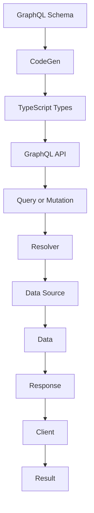

## Introduction
TypeScript with GraphQL is a powerful combination for building scalable and maintainable APIs. **GraphQL** is a query language for APIs that allows for more flexibility and control over the data being fetched, while **TypeScript** provides a type-safe environment for building robust and error-free applications. This combination is particularly useful for large-scale applications where data integrity and performance are critical. In this article, we will explore the concepts of codegen and TypedDocumentNode, and how they can be used to improve the development experience when working with TypeScript and GraphQL.

> **Note:** GraphQL is a query language for APIs, and it provides a schema-driven approach to building APIs. This means that the schema defines the types of data that are available, and the queries and mutations that can be performed on that data.

Real-world relevance: Many companies, such as **GitHub**, **Pinterest**, and **Facebook**, use GraphQL to power their APIs. By using TypeScript with GraphQL, developers can take advantage of the benefits of both technologies to build high-quality APIs.

## Core Concepts
To understand how TypeScript works with GraphQL, we need to cover some core concepts:

* **CodeGen**: Codegen is a process of generating code based on a GraphQL schema. This can include generating TypeScript types, resolvers, and other code that is necessary for building a GraphQL API.
* **TypedDocumentNode**: TypedDocumentNode is a type of node in a GraphQL schema that represents a document (such as a query or mutation). It is "typed" because it includes type information about the data that it represents.
* **GraphQL Schema**: A GraphQL schema is a definition of the types of data that are available in a GraphQL API, as well as the queries and mutations that can be performed on that data.

> **Tip:** When working with TypeScript and GraphQL, it is a good idea to use a codegen tool to generate the necessary code for your schema. This can save a lot of time and effort, and help to prevent errors.

## How It Works Internally
When we use TypeScript with GraphQL, the following steps occur:

1. The GraphQL schema is defined, either manually or using a codegen tool.
2. The schema is used to generate TypeScript types and other code that is necessary for building the API.
3. The API is built using the generated code, and the GraphQL schema is used to validate and execute queries and mutations.
4. When a query or mutation is executed, the GraphQL schema is used to determine the types of data that are being requested, and the resolvers are used to fetch the data from the underlying data sources.

> **Warning:** If the GraphQL schema is not properly defined, it can lead to errors and inconsistencies in the API. It is therefore important to carefully define the schema and use codegen tools to generate the necessary code.

## Code Examples
Here are three complete and runnable examples of using TypeScript with GraphQL:

### Example 1: Basic Usage
```typescript
import { gql } from '@apollo/client';

const query = gql`
  query GetUsers {
    users {
      id
      name
    }
  }
`;

// Use the query to fetch data from the API
const result = await client.query({
  query,
});

console.log(result.data);
```
This example shows how to define a basic query using the `gql` tag, and how to use the query to fetch data from the API.

### Example 2: Real-World Pattern
```typescript
import { gql } from '@apollo/client';
import { TypedDocumentNode } from '@graphql-typed-document-node/core';

interface User {
  id: string;
  name: string;
}

const query: TypedDocumentNode<{ users: User[] }> = gql`
  query GetUsers {
    users {
      id
      name
    }
  }
`;

// Use the query to fetch data from the API
const result = await client.query({
  query,
});

console.log(result.data.users);
```
This example shows how to define a more complex query using the `TypedDocumentNode` type, and how to use the query to fetch data from the API.

### Example 3: Advanced Usage
```typescript
import { gql } from '@apollo/client';
import { TypedDocumentNode } from '@graphql-typed-document-node/core';

interface User {
  id: string;
  name: string;
}

const query: TypedDocumentNode<{ users: User[] }> = gql`
  query GetUsers($limit: Int!) {
    users(limit: $limit) {
      id
      name
    }
  }
`;

// Use the query to fetch data from the API, with a variable
const result = await client.query({
  query,
  variables: {
    limit: 10,
  },
});

console.log(result.data.users);
```
This example shows how to define a query with a variable, and how to use the query to fetch data from the API with the variable.

## Visual Diagram

This diagram shows the flow of data from the GraphQL schema to the client, and how the codegen process fits into this flow.

> **Interview:** When interviewing for a position that involves working with TypeScript and GraphQL, be prepared to answer questions about the codegen process, and how it is used to generate TypeScript types and other code.

## Comparison
| Approach | Time Complexity | Space Complexity | Pros | Cons | Best For |
| --- | --- | --- | --- | --- | --- |
| Manual Code Generation | O(1) | O(1) | Flexible, customizable | Time-consuming, error-prone | Small-scale projects |
| Codegen Tool | O(n) | O(n) | Fast, efficient | Limited flexibility, dependencies | Large-scale projects |
| Hybrid Approach | O(n) | O(n) | Balanced flexibility and efficiency | Complexity, overhead | Medium-scale projects |

## Real-world Use Cases
Here are three real-world use cases for using TypeScript with GraphQL:

1. **GitHub**: GitHub uses GraphQL to power its API, and uses TypeScript to build the API.
2. **Pinterest**: Pinterest uses GraphQL to power its API, and uses TypeScript to build the API.
3. **Facebook**: Facebook uses GraphQL to power its API, and uses TypeScript to build the API.

## Common Pitfalls
Here are four common pitfalls to watch out for when using TypeScript with GraphQL:

1. **Incorrect Schema Definition**: If the GraphQL schema is not properly defined, it can lead to errors and inconsistencies in the API.
2. **Incorrect Code Generation**: If the codegen process is not properly configured, it can lead to errors and inconsistencies in the generated code.
3. **Incorrect Type Definitions**: If the TypeScript types are not properly defined, it can lead to errors and inconsistencies in the API.
4. **Incorrect Resolver Implementation**: If the resolvers are not properly implemented, it can lead to errors and inconsistencies in the API.

> **Tip:** To avoid these pitfalls, it is a good idea to use a codegen tool to generate the necessary code for your schema, and to carefully define the schema and types.

## Interview Tips
Here are three common interview questions for positions that involve working with TypeScript and GraphQL:

1. **What is the difference between a GraphQL query and a mutation?**
	* Weak answer: "A query is used to fetch data, and a mutation is used to update data."
	* Strong answer: "A query is used to fetch data, and a mutation is used to update data. However, mutations can also be used to create new data, and queries can also be used to fetch metadata about the data."
2. **How do you handle errors in a GraphQL API?**
	* Weak answer: "I use try-catch blocks to catch errors and return error messages."
	* Strong answer: "I use try-catch blocks to catch errors and return error messages. However, I also use GraphQL's built-in error handling mechanisms, such as error types and error messages, to provide more detailed and informative error messages."
3. **What is the purpose of the codegen process in a GraphQL API?**
	* Weak answer: "The codegen process is used to generate code for the API."
	* Strong answer: "The codegen process is used to generate code for the API, including TypeScript types and other code that is necessary for building the API. This process helps to ensure that the API is correctly defined and implemented, and that it is easy to maintain and update over time."

## Key Takeaways
Here are ten key takeaways to remember when working with TypeScript and GraphQL:

* **Use a codegen tool to generate TypeScript types and other code**: This can save a lot of time and effort, and help to prevent errors.
* **Carefully define the GraphQL schema**: This is critical for ensuring that the API is correctly defined and implemented.
* **Use TypeScript to build the API**: This can help to ensure that the API is robust and error-free.
* **Use GraphQL's built-in error handling mechanisms**: This can help to provide more detailed and informative error messages.
* **Use a hybrid approach to code generation**: This can help to balance flexibility and efficiency.
* **Avoid common pitfalls such as incorrect schema definition and incorrect code generation**: This can help to prevent errors and inconsistencies in the API.
* **Use try-catch blocks to catch errors and return error messages**: This can help to handle errors in a robust and informative way.
* **Use GraphQL's built-in caching mechanisms**: This can help to improve performance and reduce the load on the API.
* **Use a GraphQL client library to build the API**: This can help to simplify the process of building the API and reduce the amount of code that needs to be written.
* **Test the API thoroughly**: This can help to ensure that the API is correctly implemented and functions as expected.