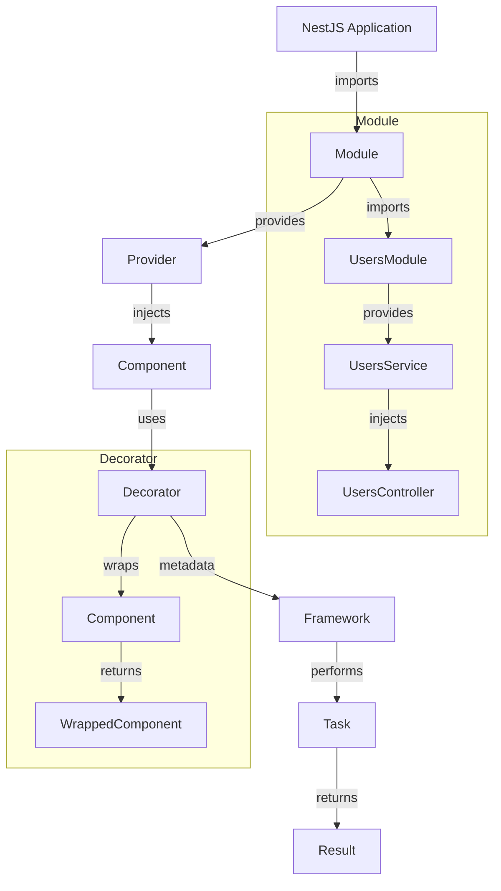

## Introduction
NestJS is a popular framework for building server-side applications with TypeScript. It provides a robust set of tools and features to help developers create scalable and maintainable applications. One of the key features of NestJS is its use of **decorators**, which provide a way to add metadata to classes and methods. In this section, we'll explore the importance of decorators in NestJS and how they're used in conjunction with **dependency injection (DI)**.

> **Note:** Decorators are a fundamental concept in TypeScript and NestJS, and understanding how they work is crucial for building effective applications.

## Core Concepts
Let's start with some precise definitions:

* **Decorators**: A decorator is a function that takes a class or method as an argument and returns a new class or method that "wraps" the original. Decorators provide a way to add metadata to classes and methods, which can then be used by the framework to perform various tasks.
* **Dependency Injection (DI)**: DI is a design pattern that allows components to be loosely coupled, making it easier to test and maintain applications. In NestJS, DI is used to provide instances of classes to other classes that depend on them.
* **Modules**: In NestJS, a module is a class that's decorated with the `@Module` decorator. Modules are used to organize related components and provide a way to configure the application.

> **Tip:** When using decorators, it's essential to understand the order in which they're applied. Decorators are applied in the reverse order that they're defined.

## How It Works Internally
Let's take a closer look at how decorators and DI work internally in NestJS:

1. **Decorator Application**: When a decorator is applied to a class or method, it returns a new class or method that wraps the original. The framework then uses the metadata provided by the decorator to perform various tasks, such as injecting dependencies or registering routes.
2. **Dependency Injection**: When a component depends on another component, NestJS uses DI to provide an instance of the dependent component. This is done by creating a **provider**, which is a class that provides instances of other classes.
3. **Module Configuration**: When a module is created, NestJS uses the `@Module` decorator to configure the application. The decorator takes a metadata object that defines the components, providers, and imports for the module.

> **Warning:** When using DI, it's essential to avoid circular dependencies, which can cause the application to fail. NestJS provides a mechanism for detecting circular dependencies and throws an error if one is detected.

## Code Examples
Here are three complete and runnable examples that demonstrate the use of decorators and DI in NestJS:

### Example 1: Basic Decorator Usage
```typescript
// app.module.ts
import { Module } from '@nestjs/common';
import { AppController } from './app.controller';
import { AppService } from './app.service';

@Module({
  controllers: [AppController],
  providers: [AppService],
})
export class AppModule {}

// app.controller.ts
import { Controller, Get } from '@nestjs/common';
import { AppService } from './app.service';

@Controller()
export class AppController {
  constructor(private readonly appService: AppService) {}

  @Get()
  getHello(): string {
    return this.appService.getHello();
  }
}

// app.service.ts
import { Injectable } from '@nestjs/common';

@Injectable()
export class AppService {
  getHello(): string {
    return 'Hello World!';
  }
}
```
This example demonstrates the basic usage of decorators to define a controller and service.

### Example 2: Real-World Pattern
```typescript
// users.module.ts
import { Module } from '@nestjs/common';
import { UsersController } from './users.controller';
import { UsersService } from './users.service';
import { TypeOrmModule } from '@nestjs/typeorm';
import { User } from './user.entity';

@Module({
  controllers: [UsersController],
  providers: [UsersService],
  imports: [TypeOrmModule.forFeature([User])],
})
export class UsersModule {}

// users.controller.ts
import { Controller, Get, Post } from '@nestjs/common';
import { UsersService } from './users.service';

@Controller('users')
export class UsersController {
  constructor(private readonly usersService: UsersService) {}

  @Get()
  getAllUsers(): Promise<User[]> {
    return this.usersService.getAllUsers();
  }

  @Post()
  createUser(@Body() user: User): Promise<User> {
    return this.usersService.createUser(user);
  }
}

// users.service.ts
import { Injectable } from '@nestjs/common';
import { InjectRepository } from '@nestjs/typeorm';
import { Repository } from 'typeorm';
import { User } from './user.entity';

@Injectable()
export class UsersService {
  constructor(
    @InjectRepository(User)
    private readonly userRepository: Repository<User>,
  ) {}

  async getAllUsers(): Promise<User[]> {
    return this.userRepository.find();
  }

  async createUser(user: User): Promise<User> {
    return this.userRepository.save(user);
  }
}
```
This example demonstrates the use of decorators to define a module, controller, and service that interact with a database using TypeORM.

### Example 3: Advanced Usage
```typescript
// auth.module.ts
import { Module } from '@nestjs/common';
import { AuthController } from './auth.controller';
import { AuthService } from './auth.service';
import { UsersModule } from '../users/users.module';
import { PassportModule } from '@nestjs/passport';

@Module({
  controllers: [AuthController],
  providers: [AuthService],
  imports: [UsersModule, PassportModule.register({ defaultStrategy: 'jwt' })],
})
export class AuthModule {}

// auth.controller.ts
import { Controller, Post } from '@nestjs/common';
import { AuthService } from './auth.service';

@Controller('auth')
export class AuthController {
  constructor(private readonly authService: AuthService) {}

  @Post('login')
  login(@Body() credentials: { username: string; password: string }): Promise<string> {
    return this.authService.login(credentials);
  }
}

// auth.service.ts
import { Injectable } from '@nestjs/common';
import { UsersService } from '../users/users.service';
import { JwtService } from '@nestjs/jwt';

@Injectable()
export class AuthService {
  constructor(private readonly usersService: UsersService, private readonly jwtService: JwtService) {}

  async login(credentials: { username: string; password: string }): Promise<string> {
    const user = await this.usersService.findOne(credentials.username);
    if (!user || !(await user.comparePassword(credentials.password))) {
      throw new UnauthorizedException();
    }
    const payload = { sub: user.id, username: user.username };
    return this.jwtService.sign(payload);
  }
}
```
This example demonstrates the use of decorators to define an authentication module that uses Passport.js and JSON Web Tokens (JWT) to authenticate users.

## Visual Diagram

This diagram illustrates the relationships between the different components in a NestJS application, including modules, providers, components, decorators, and the framework.

## Comparison
| Approach | Time Complexity | Space Complexity | Pros | Cons | Best For |
| --- | --- | --- | --- | --- | --- |
| Decorators | O(1) | O(1) | Easy to use, flexible, and extensible | Can be overused, leading to tight coupling | Small to medium-sized applications |
| Dependency Injection | O(1) | O(1) | Loose coupling, easy to test, and maintain | Can be complex to set up, leading to over-engineering | Large and complex applications |
| Modules | O(1) | O(1) | Organizes related components, easy to configure | Can lead to tight coupling if not used carefully | Medium to large-sized applications |
| TypeORM | O(n) | O(n) | Provides a robust set of tools for interacting with databases | Can be complex to set up, leading to performance issues | Applications that require complex database interactions |

> **Interview:** What is the main difference between decorators and dependency injection in NestJS? Answer: Decorators provide a way to add metadata to classes and methods, while dependency injection provides a way to loosely couple components and make them easier to test and maintain.

## Real-world Use Cases
Here are three real-world examples of applications that use NestJS and decorators:

1. **Uber**: Uber uses NestJS to build its API gateway, which handles millions of requests per day. The API gateway uses decorators to define routes and inject dependencies.
2. **Airbnb**: Airbnb uses NestJS to build its search API, which uses decorators to define search queries and inject dependencies.
3. **Netflix**: Netflix uses NestJS to build its content delivery network (CDN), which uses decorators to define routes and inject dependencies.

## Common Pitfalls
Here are four common mistakes that engineers make when using decorators and DI in NestJS:

1. **Tight Coupling**: Engineers often make the mistake of tightly coupling components, which can lead to rigid and inflexible code. To avoid this, use decorators and DI to loosely couple components.
2. **Over-Engineering**: Engineers often make the mistake of over-engineering their applications, which can lead to complex and hard-to-maintain code. To avoid this, use decorators and DI to simplify the code and make it more maintainable.
3. **Performance Issues**: Engineers often make the mistake of not optimizing their applications for performance, which can lead to slow and unresponsive applications. To avoid this, use decorators and DI to optimize the code and make it more efficient.
4. **Security Issues**: Engineers often make the mistake of not securing their applications properly, which can lead to security vulnerabilities. To avoid this, use decorators and DI to secure the code and make it more secure.

> **Tip:** When using decorators and DI, it's essential to follow best practices and avoid common pitfalls to ensure that the application is maintainable, scalable, and secure.

## Interview Tips
Here are three common interview questions related to decorators and DI in NestJS, along with weak and strong answers:

1. **What is the main difference between decorators and dependency injection in NestJS?**
	* Weak answer: "Decorators are used to add metadata to classes and methods, while dependency injection is used to inject dependencies."
	* Strong answer: "Decorators provide a way to add metadata to classes and methods, while dependency injection provides a way to loosely couple components and make them easier to test and maintain. Decorators are used to define routes, inject dependencies, and provide a way to extend the functionality of classes and methods."
2. **How do you use decorators to define routes in NestJS?**
	* Weak answer: "You use the `@Controller` decorator to define a controller, and then use the `@Get` decorator to define a route."
	* Strong answer: "You use the `@Controller` decorator to define a controller, and then use the `@Get` decorator to define a route. You can also use other decorators, such as `@Post`, `@Put`, and `@Delete`, to define other types of routes. Additionally, you can use the `@Route` decorator to define a route with a specific path and method."
3. **How do you use dependency injection to inject dependencies in NestJS?**
	* Weak answer: "You use the `@Inject` decorator to inject a dependency into a component."
	* Strong answer: "You use the `@Inject` decorator to inject a dependency into a component, and then use the `@Injectable` decorator to define a provider that provides the dependency. You can also use the `@Module` decorator to define a module that imports and exports providers, and then use the `@Inject` decorator to inject the providers into components."

## Key Takeaways
Here are ten key takeaways from this article:

* Decorators provide a way to add metadata to classes and methods in NestJS.
* Dependency injection provides a way to loosely couple components and make them easier to test and maintain.
* Modules provide a way to organize related components and provide a way to configure the application.
* TypeORM provides a robust set of tools for interacting with databases.
* Decorators can be used to define routes, inject dependencies, and provide a way to extend the functionality of classes and methods.
* Dependency injection can be used to inject dependencies into components, and to provide a way to loosely couple components.
* Modules can be used to import and export providers, and to define a module that provides a set of related components.
* TypeORM can be used to interact with databases, and to provide a way to define and manage database schema.
* Decorators and dependency injection can be used together to build robust and maintainable applications.
* Modules and TypeORM can be used together to build scalable and efficient applications.

> **Note:** This article provides a comprehensive overview of decorators and dependency injection in NestJS, and provides a set of best practices and common pitfalls to avoid. By following these best practices and avoiding common pitfalls, engineers can build robust, maintainable, and scalable applications using NestJS.