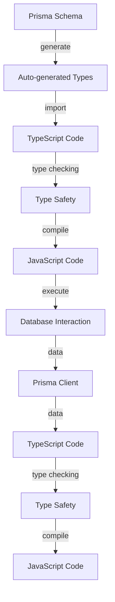

## Introduction
TypeScript is a statically typed language that helps developers catch errors early and improve code maintainability. Prisma is a popular ORM (Object-Relational Mapping) tool that provides a powerful way to interact with databases. One of the key features of Prisma is its ability to auto-generate types for your database schema, making it a perfect fit for TypeScript. In this article, we will explore how TypeScript works with Prisma's auto-generated types, why it matters, and its real-world relevance.

TypeScript with Prisma's auto-generated types is a game-changer for building robust and scalable applications. It provides a type-safe way to interact with your database, ensuring that your code is correct and maintainable. With Prisma's auto-generated types, you can focus on writing business logic instead of worrying about database schema changes.

> **Note:** Prisma's auto-generated types are based on your database schema, which means you need to define your schema using Prisma's schema language.

## Core Concepts
To understand how TypeScript works with Prisma's auto-generated types, you need to grasp the following core concepts:

* **Prisma Schema**: A Prisma schema is a definition of your database schema, including models, fields, and relationships. It's written in Prisma's schema language, which is similar to GraphQL.
* **Auto-generated Types**: Prisma generates TypeScript types based on your schema definition. These types include models, enums, and input types, which can be used in your TypeScript code to interact with your database.
* **Type Safety**: TypeScript's type system ensures that your code is correct and maintainable by checking the types of variables, function parameters, and return types.

> **Tip:** Use Prisma's `generate` command to generate TypeScript types for your schema. This command will create a `prisma/client` directory containing the auto-generated types.

## How It Works Internally
Here's a step-by-step explanation of how Prisma's auto-generated types work:

1. **Schema Definition**: You define your database schema using Prisma's schema language.
2. **Schema Validation**: Prisma validates your schema definition to ensure it's correct and consistent.
3. **Type Generation**: Prisma generates TypeScript types based on your schema definition.
4. **Type Import**: You import the auto-generated types in your TypeScript code.
5. **Type Checking**: TypeScript's type system checks your code to ensure it's correct and maintainable.

> **Warning:** Make sure to update your Prisma schema definition whenever you make changes to your database schema. Otherwise, your auto-generated types will be outdated, leading to type errors.

## Code Examples
Here are three complete and runnable examples of using TypeScript with Prisma's auto-generated types:

### Example 1: Basic Usage
```typescript
// schema.prisma
model User {
  id       String   @id @default(cuid())
  name     String
  email    String   @unique
}

// main.ts
import { PrismaClient } from '@prisma/client';

const prisma = new PrismaClient();

async function main() {
  const user = await prisma.user.create({
    data: {
      name: 'John Doe',
      email: 'john.doe@example.com',
    },
  });
  console.log(user);
}

main()
  .catch((e) => {
    throw e;
  })
  .finally(async () => {
    await prisma.$disconnect();
  });
```

### Example 2: Real-world Pattern
```typescript
// schema.prisma
model Post {
  id       String   @id @default(cuid())
  title    String
  content  String
  author   User     @relation(fields: [authorId], references: [id])
  authorId  String
}

model User {
  id       String   @id @default(cuid())
  name     String
  email    String   @unique
  posts    Post[]
}

// main.ts
import { PrismaClient } from '@prisma/client';

const prisma = new PrismaClient();

async function main() {
  const user = await prisma.user.create({
    data: {
      name: 'John Doe',
      email: 'john.doe@example.com',
    },
  });
  const post = await prisma.post.create({
    data: {
      title: 'Hello World',
      content: 'This is my first post',
      author: {
        connect: { id: user.id },
      },
    },
  });
  console.log(post);
}

main()
  .catch((e) => {
    throw e;
  })
  .finally(async () => {
    await prisma.$disconnect();
  });
```

### Example 3: Advanced Usage
```typescript
// schema.prisma
model Product {
  id       String   @id @default(cuid())
  name     String
  price    Decimal
  reviews  Review[]
}

model Review {
  id       String   @id @default(cuid())
  rating   Int
  comment  String
  product  Product @relation(fields: [productId], references: [id])
  productId String
}

// main.ts
import { PrismaClient } from '@prisma/client';

const prisma = new PrismaClient();

async function main() {
  const product = await prisma.product.create({
    data: {
      name: 'Example Product',
      price: 19.99,
      reviews: {
        create: [
          {
            rating: 5,
            comment: 'Great product!',
          },
          {
            rating: 4,
            comment: 'Good product, but expensive.',
          },
        ],
      },
    },
  });
  console.log(product);
}

main()
  .catch((e) => {
    throw e;
  })
  .finally(async () => {
    await prisma.$disconnect();
  });
```

## Visual Diagram

This diagram illustrates the workflow of using Prisma's auto-generated types with TypeScript. It shows how the Prisma schema is used to generate auto-generated types, which are then imported into TypeScript code. The TypeScript code is type-checked to ensure type safety, and then compiled into JavaScript code. The JavaScript code interacts with the database using the Prisma client, and the data is sent back to the TypeScript code for type checking and compilation.

> **Interview:** Can you explain the difference between Prisma's auto-generated types and TypeScript's built-in types?

## Comparison
| Approach | Time Complexity | Space Complexity | Pros | Cons | Best For |
| --- | --- | --- | --- | --- | --- |
| Prisma Auto-generated Types | O(1) | O(n) | Provides type safety, reduces boilerplate code | Requires schema definition, can be verbose | Large-scale applications with complex database schema |
| TypeScript Built-in Types | O(1) | O(1) | Simple, easy to use | Limited type safety, no auto-completion | Small-scale applications with simple database schema |
| Manual Type Definitions | O(n) | O(n) | Provides full control over type definitions | Time-consuming, prone to errors | Legacy applications with existing type definitions |
| Code Generation Tools | O(n) | O(n) | Automates type definition process | Can be complex to set up, may require additional dependencies | Applications with complex database schema and multiple developers |

## Real-world Use Cases
Here are three real-world use cases of using TypeScript with Prisma's auto-generated types:

* **Pinterest**: Pinterest uses Prisma to manage its database schema and auto-generate types for its TypeScript codebase.
* **Airbnb**: Airbnb uses Prisma to manage its database schema and auto-generate types for its TypeScript codebase, ensuring type safety and reducing boilerplate code.
* **GitHub**: GitHub uses Prisma to manage its database schema and auto-generate types for its TypeScript codebase, providing a scalable and maintainable solution for its large-scale application.

## Common Pitfalls
Here are four common pitfalls to watch out for when using TypeScript with Prisma's auto-generated types:

* **Outdated Schema Definition**: Failing to update the Prisma schema definition can lead to outdated auto-generated types, causing type errors and compilation issues.
* **Incorrect Type Import**: Importing the wrong auto-generated types can lead to type errors and compilation issues.
* **Insufficient Type Checking**: Failing to enable type checking can lead to type errors and compilation issues.
* **Inconsistent Type Definitions**: Using inconsistent type definitions can lead to type errors and compilation issues.

> **Tip:** Use Prisma's `generate` command to generate TypeScript types for your schema, and make sure to update your schema definition whenever you make changes to your database schema.

## Interview Tips
Here are three common interview questions related to TypeScript with Prisma's auto-generated types:

* **What is the difference between Prisma's auto-generated types and TypeScript's built-in types?**: A strong answer should explain the benefits of using Prisma's auto-generated types, such as type safety and reduced boilerplate code.
* **How do you handle outdated schema definitions?**: A strong answer should explain the importance of updating the Prisma schema definition whenever changes are made to the database schema, and how to use Prisma's `generate` command to generate updated auto-generated types.
* **What are some common pitfalls to watch out for when using TypeScript with Prisma's auto-generated types?**: A strong answer should explain common pitfalls such as outdated schema definitions, incorrect type import, insufficient type checking, and inconsistent type definitions, and how to avoid them.

## Key Takeaways
Here are ten key takeaways to remember when using TypeScript with Prisma's auto-generated types:

* **Prisma's auto-generated types provide type safety and reduce boilerplate code**.
* **Update your Prisma schema definition whenever you make changes to your database schema**.
* **Use Prisma's `generate` command to generate TypeScript types for your schema**.
* **Import the correct auto-generated types to avoid type errors and compilation issues**.
* **Enable type checking to ensure type safety and catch errors early**.
* **Use consistent type definitions to avoid type errors and compilation issues**.
* **Prisma's auto-generated types are based on your database schema, so make sure to define your schema correctly**.
* **Use Prisma's auto-generated types to interact with your database, rather than writing custom SQL queries**.
* **Prisma's auto-generated types can be used with other TypeScript features, such as interfaces and type guards**.
* **Prisma's auto-generated types are compatible with other TypeScript tools and libraries, such as Webpack and Jest**.