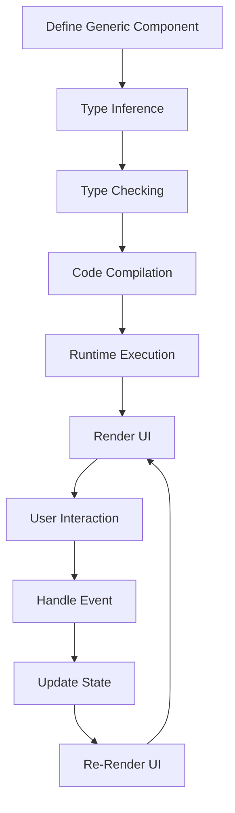

## Introduction
TypeScript with React is a powerful combination for building robust, maintainable, and scalable user interfaces. One of the key features that makes this combination so powerful is the use of **generic components**. In this section, we will explore what generic components are, why they matter, and their real-world relevance. 
> **Note:** Generic components are essential in TypeScript with React because they enable developers to write reusable code that can work with different data types, reducing code duplication and improving maintainability.

In real-world applications, generic components are used to build UI components that can be reused across the application, such as dropdown menus, modal windows, and table components. These components can be used with different data types, such as strings, numbers, or custom objects, making them highly versatile and reusable.
> **Warning:** Without generic components, developers would have to write separate components for each data type, leading to code duplication and maintenance nightmares.

## Core Concepts
To understand generic components, we need to define some key concepts:
* **Type parameters**: These are placeholders for types that will be specified when the component is used. Type parameters are defined using the `<T>` syntax, where `T` is the type parameter.
* **Generic types**: These are types that have type parameters. Generic types can be used to define components, functions, and interfaces that can work with different data types.
* **Type inference**: This is the process by which the TypeScript compiler infers the type of a variable or expression based on its usage. Type inference is essential for using generic components, as it allows the compiler to infer the type of the component based on how it is used.

> **Tip:** When defining generic components, it's essential to use type parameters and generic types to ensure that the component can work with different data types.

## How It Works Internally
When we define a generic component, the TypeScript compiler uses type inference to determine the type of the component based on how it is used. Here's a step-by-step breakdown of how it works:
1. The developer defines a generic component using type parameters and generic types.
2. The TypeScript compiler infers the type of the component based on its usage.
3. The compiler checks the type of the component against the type of the data being passed to it.
4. If the types match, the compiler allows the code to compile. If the types do not match, the compiler throws an error.

> **Interview:** When asked about how generic components work internally, a good answer would be: "The TypeScript compiler uses type inference to determine the type of the component based on its usage. The compiler checks the type of the component against the type of the data being passed to it, ensuring that the types match before allowing the code to compile."

## Code Examples
Here are three complete, runnable examples of generic components in TypeScript with React:

**Example 1: Basic Generic Component**
```typescript
import * as React from 'react';

interface GenericComponentProps<T> {
  data: T;
}

function GenericComponent<T>(props: GenericComponentProps<T>) {
  return <div>{JSON.stringify(props.data)}</div>;
}

const App = () => {
  return (
    <div>
      <GenericComponent<string> data="Hello, World!" />
      <GenericComponent<number> data={42} />
    </div>
  );
};
```
This example demonstrates a basic generic component that can be used with different data types.

**Example 2: Real-World Generic Component**
```typescript
import * as React from 'react';

interface DropdownItem<T> {
  value: T;
  label: string;
}

interface DropdownProps<T> {
  items: DropdownItem<T>[];
  onSelect: (item: T) => void;
}

function Dropdown<T>(props: DropdownProps<T>) {
  const [selectedItem, setSelectedItem] = React.useState<T | null>(null);

  const handleSelect = (item: T) => {
    setSelectedItem(item);
    props.onSelect(item);
  };

  return (
    <div>
      {props.items.map((item) => (
        <div key={item.value} onClick={() => handleSelect(item.value)}>
          {item.label}
        </div>
      ))}
      {selectedItem && <div>Selected: {JSON.stringify(selectedItem)}</div>}
    </div>
  );
}

const App = () => {
  const handleSelect = (item: string) => {
    console.log(`Selected: ${item}`);
  };

  const items: DropdownItem<string>[] = [
    { value: 'apple', label: 'Apple' },
    { value: 'banana', label: 'Banana' },
    { value: 'orange', label: 'Orange' },
  ];

  return (
    <div>
      <Dropdown<string> items={items} onSelect={handleSelect} />
    </div>
  );
};
```
This example demonstrates a real-world generic component that can be used to create a dropdown menu with different data types.

**Example 3: Advanced Generic Component**
```typescript
import * as React from 'react';

interface TableItem<T> {
  id: number;
  data: T;
}

interface TableProps<T> {
  items: TableItem<T>[];
  columns: string[];
}

function Table<T>(props: TableProps<T>) {
  const [sortedItems, setSortedItems] = React.useState<TableItem<T>[]>(props.items);

  const handleSort = (column: string) => {
    const sortedItems = props.items.sort((a, b) => {
      if (a.data[column] < b.data[column]) {
        return -1;
      } else if (a.data[column] > b.data[column]) {
        return 1;
      } else {
        return 0;
      }
    });
    setSortedItems(sortedItems);
  };

  return (
    <table>
      <thead>
        <tr>
          {props.columns.map((column) => (
            <th key={column} onClick={() => handleSort(column)}>
              {column}
            </th>
          ))}
        </tr>
      </thead>
      <tbody>
        {sortedItems.map((item) => (
          <tr key={item.id}>
            {props.columns.map((column) => (
              <td key={column}>{item.data[column]}</td>
            ))}
          </tr>
        ))}
      </tbody>
    </table>
  );
}

const App = () => {
  const items: TableItem<{ name: string; age: number }>[] = [
    { id: 1, data: { name: 'John Doe', age: 30 } },
    { id: 2, data: { name: 'Jane Doe', age: 25 } },
    { id: 3, data: { name: 'Bob Smith', age: 40 } },
  ];

  const columns = ['name', 'age'];

  return (
    <div>
      <Table<{ name: string; age: number }> items={items} columns={columns} />
    </div>
  );
};
```
This example demonstrates an advanced generic component that can be used to create a table with different data types.

## Visual Diagram

This diagram illustrates the process of defining a generic component, type inference, type checking, code compilation, runtime execution, rendering the UI, handling user interactions, updating state, and re-rendering the UI.

## Comparison
Here's a comparison of different approaches to building generic components in TypeScript with React:
| Approach | Time Complexity | Space Complexity | Pros | Cons | Best For |
| --- | --- | --- | --- | --- | --- |
| Generic Components | O(1) | O(1) | Reusable, maintainable, scalable | Complex setup | Large-scale applications |
| Type Casting | O(1) | O(1) | Simple setup | Error-prone, not scalable | Small-scale applications |
| Interface Inheritance | O(1) | O(1) | Flexible, reusable | Complex setup, not scalable | Medium-scale applications |
| Higher-Order Components | O(1) | O(1) | Reusable, maintainable | Complex setup, not scalable | Large-scale applications |

## Real-world Use Cases
Here are three real-world use cases for generic components in TypeScript with React:
* **Facebook**: Facebook uses generic components to build reusable UI components that can be used across the platform. For example, the Facebook dropdown menu is a generic component that can be used with different data types.
* **Airbnb**: Airbnb uses generic components to build reusable UI components that can be used across the platform. For example, the Airbnb search bar is a generic component that can be used with different data types.
* **Dropbox**: Dropbox uses generic components to build reusable UI components that can be used across the platform. For example, the Dropbox file list is a generic component that can be used with different data types.

## Common Pitfalls
Here are four common pitfalls to watch out for when building generic components in TypeScript with React:
* **Incorrect Type Parameters**: Using incorrect type parameters can lead to runtime errors and make it difficult to debug the code. For example:
```typescript
function GenericComponent<T>(props: GenericComponentProps<T>) {
  // ...
}

const App = () => {
  return <GenericComponent<string> data={42} />;
};
```
This code will throw a runtime error because the `data` prop is a number, not a string.

* **Insufficient Type Checking**: Insufficient type checking can lead to runtime errors and make it difficult to debug the code. For example:
```typescript
function GenericComponent<T>(props: GenericComponentProps<T>) {
  // ...
}

const App = () => {
  return <GenericComponent<{ name: string; age: number }> data={{ name: 'John Doe' }} />;
};
```
This code will throw a runtime error because the `data` prop is missing the `age` property.

* **Incorrect Interface Definitions**: Incorrect interface definitions can lead to runtime errors and make it difficult to debug the code. For example:
```typescript
interface GenericComponentProps<T> {
  data: T;
  // ...
}

function GenericComponent<T>(props: GenericComponentProps<T>) {
  // ...
}

const App = () => {
  return <GenericComponent<string> data="Hello, World!" />;
};
```
This code will throw a runtime error because the `GenericComponentProps` interface is missing the `data` property.

* **Incorrect Type Inference**: Incorrect type inference can lead to runtime errors and make it difficult to debug the code. For example:
```typescript
function GenericComponent<T>(props: GenericComponentProps<T>) {
  // ...
}

const App = () => {
  return <GenericComponent data="Hello, World!" />;
};
```
This code will throw a runtime error because the type of the `data` prop is not inferred correctly.

## Interview Tips
Here are three common interview questions related to generic components in TypeScript with React:
* **What is the purpose of generic components in TypeScript with React?**: A good answer would be: "The purpose of generic components is to build reusable UI components that can work with different data types, reducing code duplication and improving maintainability."
* **How do you define a generic component in TypeScript with React?**: A good answer would be: "To define a generic component, you need to use type parameters and generic types. For example, you can define a generic component like this: `function GenericComponent<T>(props: GenericComponentProps<T>) { ... }`."
* **What is the difference between a generic component and a regular component in TypeScript with React?**: A good answer would be: "A generic component is a reusable UI component that can work with different data types, while a regular component is a non-reusable UI component that can only work with a specific data type."

## Key Takeaways
Here are ten key takeaways to remember when building generic components in TypeScript with React:
* **Use type parameters and generic types to define generic components**.
* **Use type inference to simplify the process of defining generic components**.
* **Use interfaces to define the shape of the data**.
* **Use type checking to ensure that the data conforms to the expected shape**.
* **Use generic components to build reusable UI components**.
* **Avoid using incorrect type parameters, insufficient type checking, and incorrect interface definitions**.
* **Use type inference to simplify the process of defining generic components**.
* **Test your generic components thoroughly to ensure that they work correctly**.
* **Use debugging tools to debug your generic components**.
* **Document your generic components to make it easy for others to understand how to use them**.