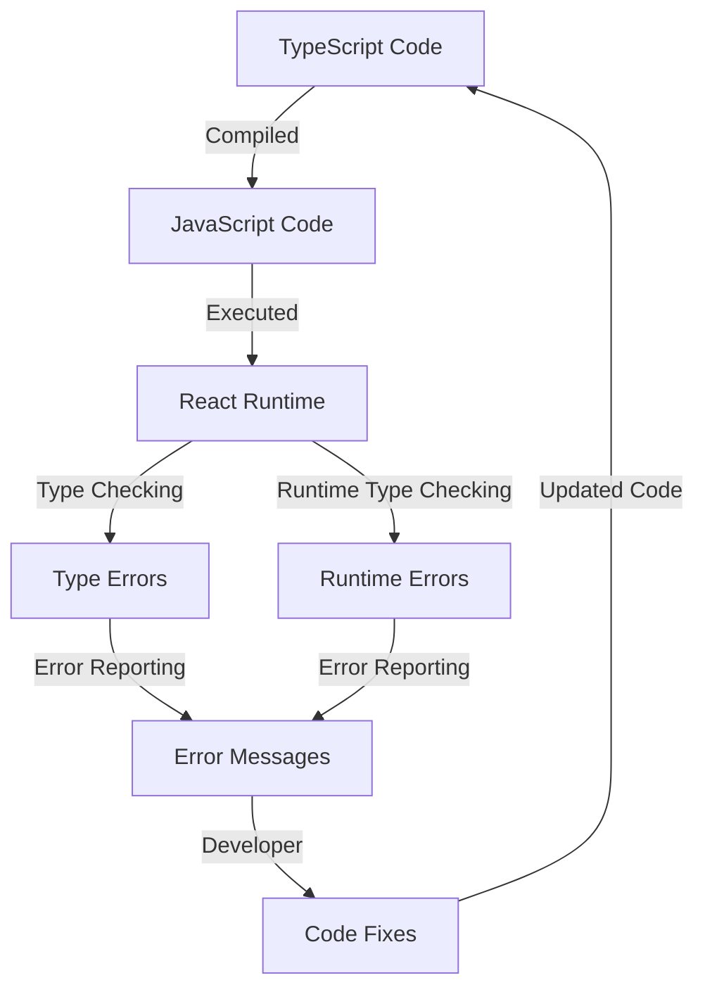

## Introduction
TypeScript with React is a powerful combination for building robust, maintainable, and scalable applications. **TypeScript** is a statically typed language that helps catch errors at compile-time, while **React** is a popular JavaScript library for building user interfaces. By combining the two, developers can create efficient, type-safe, and well-maintained applications. In this section, we will explore the importance of typing props, state, events, and refs in React applications using TypeScript.

> **Note:** TypeScript is a superset of JavaScript, which means that any valid JavaScript code is also valid TypeScript code. However, TypeScript provides additional features such as static typing, interfaces, and type checking, which help catch errors and improve code maintainability.

## Core Concepts
To work with TypeScript and React, it's essential to understand the following core concepts:

* **Props**: Short for "properties," props are immutable values passed from a parent component to a child component. In TypeScript, props can be typed using interfaces or type aliases.
* **State**: State refers to the internal state of a component, which can change over time. In TypeScript, state can be typed using interfaces or type aliases.
* **Events**: Events are functions that handle user interactions, such as clicks, keyboard input, or mouse movements. In TypeScript, event handlers can be typed using function types.
* **Refs**: Refs are references to DOM nodes or instances of components. In TypeScript, refs can be typed using the `Ref` type or `React.RefObject` type.

> **Tip:** When working with TypeScript and React, it's a good practice to use the `--strict` flag to enable strict type checking. This helps catch errors and improves code maintainability.

## How It Works Internally
When you create a React component using TypeScript, the following steps occur:

1. **Type Checking**: TypeScript checks the types of props, state, events, and refs to ensure that they match the expected types.
2. **Type Inference**: TypeScript infers the types of variables, function parameters, and return types based on the code.
3. **Compilation**: The TypeScript code is compiled to JavaScript, which is then executed by the browser or Node.js.
4. **Runtime Type Checking**: React performs runtime type checking on props, state, and events to ensure that they match the expected types.

> **Warning:** If you're using an older version of TypeScript or React, you may encounter compatibility issues. Make sure to use the latest versions to ensure smooth integration.

## Code Examples
Here are three complete and runnable examples of using TypeScript with React:

### Example 1: Basic Props Typing
```typescript
// greeter.tsx
import * as React from 'react';

interface Props {
  name: string;
}

const Greeter: React.FC<Props> = ({ name }) => {
  return <div>Hello, {name}!</div>;
};

export default Greeter;
```

```typescript
// app.tsx
import * as React from 'react';
import Greeter from './greeter';

const App: React.FC = () => {
  return <Greeter name="John" />;
};

export default App;
```

### Example 2: State and Events Typing
```typescript
// counter.tsx
import * as React from 'react';

interface State {
  count: number;
}

interface Props {
  initialValue: number;
}

class Counter extends React.Component<Props, State> {
  state: State = {
    count: this.props.initialValue,
  };

  handleIncrement = () => {
    this.setState((prevState) => ({ count: prevState.count + 1 }));
  };

  render() {
    return (
      <div>
        <p>Count: {this.state.count}</p>
        <button onClick={this.handleIncrement}>Increment</button>
      </div>
    );
  }
}

export default Counter;
```

### Example 3: Refs Typing
```typescript
// input.tsx
import * as React from 'react';

interface Props {
  placeholder: string;
}

class Input extends React.Component<Props> {
  inputRef: React.RefObject<HTMLInputElement>;

  constructor(props: Props) {
    super(props);
    this.inputRef = React.createRef();
  }

  focusInput = () => {
    if (this.inputRef.current) {
      this.inputRef.current.focus();
    }
  };

  render() {
    return (
      <div>
        <input ref={this.inputRef} type="text" placeholder={this.props.placeholder} />
        <button onClick={this.focusInput}>Focus Input</button>
      </div>
    );
  }
}

export default Input;
```

## Visual Diagram

This diagram illustrates the flow of TypeScript code compilation, execution, and type checking in a React application.

> **Interview:** When asked about the benefits of using TypeScript with React, you can mention the improved code maintainability, reduced runtime errors, and enhanced developer experience.

## Comparison
Here is a comparison table of different approaches to typing props, state, events, and refs in React applications:

| Approach | Time Complexity | Space Complexity | Pros | Cons | Best For |
| --- | --- | --- | --- | --- | --- |
| TypeScript | O(1) | O(1) | Statically typed, improved code maintainability | Steeper learning curve | Large-scale applications |
| PropTypes | O(n) | O(n) | Runtime type checking, easy to use | Limited type safety | Small-scale applications |
| Flow | O(1) | O(1) | Statically typed, similar to TypeScript | Limited community support | Experimental projects |
| JavaScript | O(n) | O(n) | Dynamic typing, easy to use | Limited type safety | Quick prototyping |

> **Tip:** When choosing a typing approach, consider the size and complexity of your application, as well as the experience level of your development team.

## Real-world Use Cases
Here are three real-world examples of using TypeScript with React:

* **Microsoft**: Uses TypeScript for its Azure DevOps platform, which provides a suite of services for software development, testing, and deployment.
* **Airbnb**: Uses TypeScript for its web and mobile applications, which provide a platform for booking accommodations and experiences.
* **Pinterest**: Uses TypeScript for its web and mobile applications, which provide a platform for discovering and saving ideas.

> **Warning:** When integrating TypeScript with React, be aware of potential compatibility issues with third-party libraries or dependencies.

## Common Pitfalls
Here are four common mistakes to avoid when using TypeScript with React:

* **Incorrect Prop Types**: Failing to specify the correct prop types can lead to runtime errors or unexpected behavior.
* **Uninitialized State**: Failing to initialize state properly can lead to runtime errors or unexpected behavior.
* **Unbound Event Handlers**: Failing to bind event handlers correctly can lead to runtime errors or unexpected behavior.
* **Incorrect Ref Types**: Failing to specify the correct ref types can lead to runtime errors or unexpected behavior.

> **Note:** To avoid these pitfalls, make sure to follow best practices for typing props, state, events, and refs in your React applications.

## Interview Tips
Here are three common interview questions related to TypeScript and React:

* **What are the benefits of using TypeScript with React?**: A strong answer should mention improved code maintainability, reduced runtime errors, and enhanced developer experience.
* **How do you handle type errors in a React application?**: A strong answer should describe the process of identifying and fixing type errors, including using type checking tools and debugging techniques.
* **What are some best practices for typing props, state, events, and refs in a React application?**: A strong answer should describe the importance of using interfaces, type aliases, and function types to ensure type safety and code maintainability.

> **Interview:** When answering these questions, be sure to provide specific examples and anecdotes to demonstrate your experience and expertise.

## Key Takeaways
Here are ten key takeaways for using TypeScript with React:

* **Use interfaces and type aliases to define prop types**: This helps ensure type safety and code maintainability.
* **Initialize state properly**: This helps prevent runtime errors and unexpected behavior.
* **Bind event handlers correctly**: This helps prevent runtime errors and unexpected behavior.
* **Use the correct ref types**: This helps prevent runtime errors and unexpected behavior.
* **Follow best practices for typing props, state, events, and refs**: This helps ensure type safety and code maintainability.
* **Use type checking tools and debugging techniques**: This helps identify and fix type errors.
* **Test your application thoroughly**: This helps ensure that your application works as expected and catches any runtime errors.
* **Stay up-to-date with the latest TypeScript and React versions**: This helps ensure that you have access to the latest features and bug fixes.
* **Use a consistent coding style**: This helps improve code readability and maintainability.
* **Document your code thoroughly**: This helps improve code understandability and maintainability.