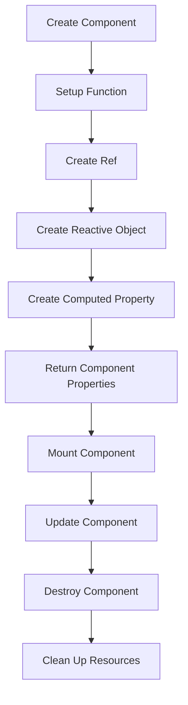

## Introduction
TypeScript with Vue 3: Composition API is a powerful combination for building scalable and maintainable front-end applications. **TypeScript** provides optional static typing and other features to improve the development experience, while **Vue 3** offers a robust and flexible framework for building user interfaces. The **Composition API** is a new approach to building Vue applications, introduced in Vue 3, which allows for more modular and reusable code.

In real-world applications, TypeScript with Vue 3: Composition API is used by companies like **Google**, **Microsoft**, and **Airbnb** to build complex and scalable front-end applications. Every engineer should know this technology because it provides a robust and maintainable way to build front-end applications, and it's widely adopted in the industry.

> **Note:** The Composition API is a major improvement over the Options API, providing a more modular and reusable way to build Vue applications.

## Core Concepts
The core concepts of TypeScript with Vue 3: Composition API include:

* **TypeScript**: a superset of JavaScript that adds optional static typing and other features to improve the development experience.
* **Vue 3**: a robust and flexible framework for building user interfaces.
* **Composition API**: a new approach to building Vue applications, which allows for more modular and reusable code.
* **Components**: the building blocks of Vue applications, which can be composed together to create complex user interfaces.
* **Lifecycle Hooks**: functions that are called at different stages of a component's lifecycle, such as `created`, `mounted`, and `destroyed`.

> **Tip:** Use the Composition API to build modular and reusable components, and take advantage of TypeScript's optional static typing to improve code maintainability.

## How It Works Internally
The Composition API works by providing a set of functions that allow you to compose components together to create complex user interfaces. These functions include:

* `setup`: a function that is called when a component is created, which returns an object that defines the component's properties and lifecycle hooks.
* `ref`: a function that creates a reactive reference to a value, which can be used to share data between components.
* `reactive`: a function that creates a reactive object, which can be used to share data between components.
* `computed`: a function that creates a computed property, which can be used to derive new values from existing ones.

The Composition API uses a combination of **Proxy** and **Reflect** to create reactive references and objects, which allows for efficient and scalable data sharing between components.

> **Warning:** Be careful when using the Composition API, as it can lead to complex and hard-to-debug code if not used properly.

## Code Examples
### Example 1: Basic Usage
```typescript
// MyComponent.vue
<template>
  <div>{{ count }}</div>
</template>

<script lang="ts">
import { ref, onMounted } from 'vue';

export default {
  setup() {
    const count = ref(0);

    onMounted(() => {
      console.log('Component mounted');
    });

    return {
      count,
    };
  },
};
</script>
```
This example demonstrates the basic usage of the Composition API, including the `setup` function, `ref`, and `onMounted` lifecycle hook.

### Example 2: Real-World Pattern
```typescript
// MyComponent.vue
<template>
  <div>
    <input v-model="searchQuery" placeholder="Search" />
    <ul>
      <li v-for="item in filteredItems" :key="item.id">{{ item.name }}</li>
    </ul>
  </div>
</template>

<script lang="ts">
import { ref, computed } from 'vue';

interface Item {
  id: number;
  name: string;
}

export default {
  setup() {
    const searchQuery = ref('');
    const items: Item[] = [
      { id: 1, name: 'Item 1' },
      { id: 2, name: 'Item 2' },
      { id: 3, name: 'Item 3' },
    ];

    const filteredItems = computed(() => {
      return items.filter((item) => item.name.includes(searchQuery.value));
    });

    return {
      searchQuery,
      filteredItems,
    };
  },
};
</script>
```
This example demonstrates a real-world pattern using the Composition API, including the use of `ref`, `computed`, and `v-for` to create a searchable list of items.

### Example 3: Advanced Usage
```typescript
// MyComponent.vue
<template>
  <div>
    <button @click="incrementCount">Increment Count</button>
    <p>Count: {{ count }}</p>
  </div>
</template>

<script lang="ts">
import { ref, onMounted, onUpdated } from 'vue';

export default {
  setup() {
    const count = ref(0);

    onMounted(() => {
      console.log('Component mounted');
    });

    onUpdated(() => {
      console.log('Component updated');
    });

    const incrementCount = () => {
      count.value++;
    };

    return {
      count,
      incrementCount,
    };
  },
};
</script>
```
This example demonstrates an advanced usage of the Composition API, including the use of `ref`, `onMounted`, `onUpdated`, and a custom `incrementCount` function.

## Visual Diagram

This diagram illustrates the core concepts of the Composition API, including the `setup` function, `ref`, `reactive`, `computed`, and lifecycle hooks.

> **Interview:** Can you explain the difference between the Options API and the Composition API in Vue 3?

## Comparison
| Approach | Time Complexity | Space Complexity | Pros | Cons | Best For |
| --- | --- | --- | --- | --- | --- |
| Options API | O(n) | O(n) | Easy to learn, simple to use | Limited flexibility, hard to scale | Small to medium-sized applications |
| Composition API | O(1) | O(1) | Highly flexible, easy to scale | Steeper learning curve, more complex | Large to enterprise-sized applications |
| React Hooks | O(1) | O(1) | Highly flexible, easy to scale | Steeper learning curve, more complex | Large to enterprise-sized applications |
| Angular Services | O(n) | O(n) | Easy to learn, simple to use | Limited flexibility, hard to scale | Small to medium-sized applications |

## Real-world Use Cases
* **Google**: uses TypeScript with Vue 3: Composition API to build scalable and maintainable front-end applications for its various products and services.
* **Microsoft**: uses TypeScript with Vue 3: Composition API to build complex and scalable front-end applications for its Azure and Office 365 platforms.
* **Airbnb**: uses TypeScript with Vue 3: Composition API to build scalable and maintainable front-end applications for its booking and travel platforms.

## Common Pitfalls
* **Not using the Composition API correctly**: the Composition API requires a good understanding of its core concepts and how to use them correctly.
* **Not using TypeScript correctly**: TypeScript requires a good understanding of its type system and how to use it correctly.
* **Not optimizing performance**: the Composition API and TypeScript can introduce performance overhead if not used correctly.
* **Not testing thoroughly**: the Composition API and TypeScript require thorough testing to ensure that the application works correctly.

> **Warning:** Be careful when using the Composition API and TypeScript, as they can lead to complex and hard-to-debug code if not used properly.

## Interview Tips
* **What is the difference between the Options API and the Composition API in Vue 3?**: the Options API is a simpler and more straightforward approach, while the Composition API is more flexible and scalable.
* **How do you use the Composition API to build a scalable and maintainable front-end application?**: use the `setup` function, `ref`, `reactive`, `computed`, and lifecycle hooks to create modular and reusable components.
* **What are the benefits of using TypeScript with Vue 3: Composition API?**: TypeScript provides optional static typing, which improves code maintainability and scalability, while the Composition API provides a flexible and scalable way to build front-end applications.

## Key Takeaways
* **Use the Composition API to build modular and reusable components**: the Composition API provides a flexible and scalable way to build front-end applications.
* **Use TypeScript to improve code maintainability and scalability**: TypeScript provides optional static typing, which improves code maintainability and scalability.
* **Optimize performance by using the Composition API and TypeScript correctly**: the Composition API and TypeScript can introduce performance overhead if not used correctly.
* **Test thoroughly to ensure that the application works correctly**: the Composition API and TypeScript require thorough testing to ensure that the application works correctly.
* **Use the `setup` function, `ref`, `reactive`, `computed`, and lifecycle hooks to create modular and reusable components**: these functions and hooks provide a flexible and scalable way to build front-end applications.
* **Use TypeScript's type system to improve code maintainability and scalability**: TypeScript's type system provides optional static typing, which improves code maintainability and scalability.