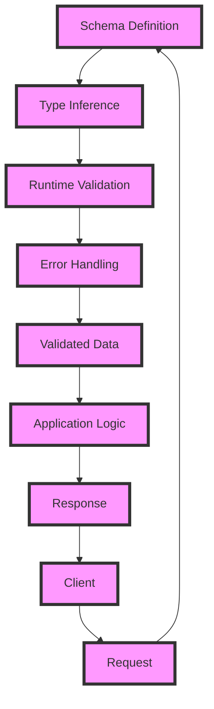

## Introduction
TypeScript with Zod is a powerful combination for building robust and maintainable applications. **TypeScript** is a statically typed language that helps catch type-related errors at compile-time, while **Zod** is a runtime validation library that ensures data conforms to a specific schema. Together, they provide a comprehensive validation system that covers both compile-time and runtime validation. This is particularly important in modern web development, where data is often received from external sources and needs to be validated before being processed. In this article, we will delve into the world of TypeScript with Zod, exploring its core concepts, internal mechanics, and practical applications.

## Core Concepts
At its core, Zod is built around the concept of **schemas**, which define the structure and constraints of data. A schema can be thought of as a blueprint for data, specifying the types, shapes, and relationships between different pieces of data. Zod provides a range of built-in schema types, including **z.string()**, **z.number()**, and **z.object()**, which can be combined to create complex schemas. **TypeScript**, on the other hand, is a statically typed language that helps catch type-related errors at compile-time. By integrating Zod with TypeScript, developers can leverage the power of both worlds to create robust and maintainable applications.

> **Note:** The key benefit of using Zod with TypeScript is that it provides a seamless way to validate data at both compile-time and runtime, ensuring that data is correct and consistent throughout the application.

## How It Works Internally
When using Zod with TypeScript, the validation process involves several steps:

1. **Schema Definition**: The developer defines a schema using Zod's API, specifying the structure and constraints of the data.
2. **Type Inference**: TypeScript infers the types of the data based on the schema definition, allowing for compile-time type checking.
3. **Runtime Validation**: When the application receives data, Zod validates it against the schema at runtime, ensuring that the data conforms to the expected structure and constraints.
4. **Error Handling**: If the data fails validation, Zod returns an error object that provides detailed information about the validation failure.

> **Warning:** Failing to properly validate data can lead to runtime errors, security vulnerabilities, and data corruption. Using Zod with TypeScript helps mitigate these risks by providing a comprehensive validation system.

## Code Examples
### Example 1: Basic Validation
```typescript
import { z } from 'zod';

const userSchema = z.object({
  name: z.string(),
  age: z.number(),
});

const userData = {
  name: 'John Doe',
  age: 30,
};

try {
  const validatedData = userSchema.parse(userData);
  console.log(validatedData);
} catch (error) {
  console.error(error);
}
```
This example demonstrates basic validation using Zod's **z.object()** schema type.

### Example 2: Advanced Validation
```typescript
import { z } from 'zod';

const addressSchema = z.object({
  street: z.string(),
  city: z.string(),
  state: z.string(),
  zip: z.string().regex(/^\d{5}$/),
});

const addressData = {
  street: '123 Main St',
  city: 'Anytown',
  state: 'CA',
  zip: '12345',
};

try {
  const validatedAddress = addressSchema.parse(addressData);
  console.log(validatedAddress);
} catch (error) {
  console.error(error);
}
```
This example shows how to use Zod's **z.string()** schema type with a regular expression to validate a zip code.

### Example 3: Nested Validation
```typescript
import { z } from 'zod';

const orderSchema = z.object({
  customer: z.object({
    name: z.string(),
    email: z.string().email(),
  }),
  items: z.array(
    z.object({
      product: z.string(),
      quantity: z.number(),
    })
  ),
});

const orderData = {
  customer: {
    name: 'John Doe',
    email: 'johndoe@example.com',
  },
  items: [
    {
      product: 'Product A',
      quantity: 2,
    },
    {
      product: 'Product B',
      quantity: 1,
    },
  ],
};

try {
  const validatedOrder = orderSchema.parse(orderData);
  console.log(validatedOrder);
} catch (error) {
  console.error(error);
}
```
This example demonstrates nested validation using Zod's **z.object()** and **z.array()** schema types.

## Visual Diagram

This diagram illustrates the validation process using Zod with TypeScript, from schema definition to response.

> **Tip:** Using a visual diagram can help developers understand the flow of data and the validation process, making it easier to identify and fix issues.

## Comparison
| Approach | Time Complexity | Space Complexity | Pros | Cons | Best For |
| --- | --- | --- | --- | --- | --- |
| Manual Validation | O(n) | O(1) | Flexible, customizable | Error-prone, time-consuming | Small applications |
| Zod Validation | O(n) | O(1) | Robust, scalable, maintainable | Steeper learning curve | Large applications |
| TypeScript Type Checking | O(1) | O(1) | Fast, efficient, type-safe | Limited to compile-time validation | Small to medium applications |
| Combination of Zod and TypeScript | O(n) | O(1) | Comprehensive, robust, maintainable | Complex setup, steeper learning curve | Large, complex applications |

## Real-world Use Cases
1. **Airbnb**: Uses Zod to validate user input and ensure data consistency across their platform.
2. **Uber**: Employs a combination of Zod and TypeScript to validate data and ensure type safety in their applications.
3. **Dropbox**: Utilizes Zod to validate file metadata and ensure data integrity in their cloud storage system.

> **Interview:** When asked about data validation, be sure to mention the importance of using a combination of compile-time and runtime validation, and how Zod with TypeScript provides a comprehensive solution.

## Common Pitfalls
1. **Insufficient Validation**: Failing to validate data properly can lead to runtime errors, security vulnerabilities, and data corruption.
2. **Incorrect Schema Definition**: Defining an incorrect schema can result in false positives or false negatives, leading to incorrect validation results.
3. **Inadequate Error Handling**: Failing to handle validation errors properly can lead to poor user experience and make it difficult to debug issues.
4. **Overly Complex Schemas**: Creating overly complex schemas can lead to performance issues and make it difficult to maintain and update the validation system.

> **Warning:** Be aware of these common pitfalls and take steps to avoid them when implementing data validation using Zod with TypeScript.

## Interview Tips
1. **Be prepared to explain the difference between compile-time and runtime validation**.
2. **Be able to describe the benefits of using Zod with TypeScript**.
3. **Be familiar with common pitfalls and be able to provide examples of how to avoid them**.

## Key Takeaways
* Use a combination of compile-time and runtime validation to ensure data consistency and integrity.
* Zod provides a robust and scalable validation system that can be used with TypeScript.
* Define schemas carefully to ensure accurate validation results.
* Handle validation errors properly to provide a good user experience.
* Avoid overly complex schemas to maintain performance and simplicity.
* Use visual diagrams to illustrate the validation process and identify potential issues.
* Be aware of common pitfalls and take steps to avoid them.
* Be prepared to explain the benefits and trade-offs of using Zod with TypeScript in an interview setting.