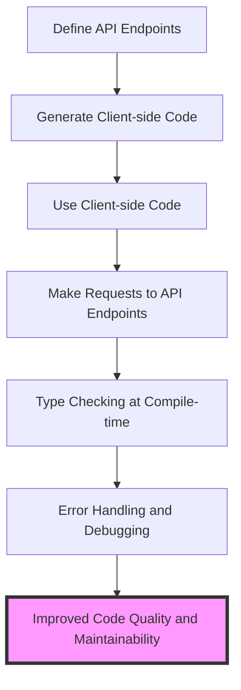

## Introduction
**TypeScript with tRPC** is a powerful combination for building scalable, maintainable, and type-safe APIs. tRPC is a lightweight, open-source framework that provides end-to-end type safety for APIs, allowing developers to define types for their API endpoints and automatically generate client-side code. This combination is particularly relevant in today's fast-paced software development landscape, where API-first development and type safety are becoming increasingly important. In this section, we will explore the benefits of using TypeScript with tRPC and why it matters for real-world applications.

> **Note:** TypeScript is a superset of JavaScript that adds optional static typing and other features to improve the development experience. tRPC is a framework that provides a simple and efficient way to build APIs with end-to-end type safety.

## Core Concepts
To understand how TypeScript with tRPC works, we need to define some core concepts:

* **Type Safety**: The idea that the types of variables, function parameters, and return types are checked at compile-time to prevent type-related errors at runtime.
* **API-first Development**: The approach of designing and building APIs before implementing the client-side code.
* **tRPC**: A lightweight, open-source framework that provides end-to-end type safety for APIs.
* **TypeScript**: A superset of JavaScript that adds optional static typing and other features to improve the development experience.

> **Tip:** Using TypeScript with tRPC allows developers to define types for their API endpoints and automatically generate client-side code, reducing the likelihood of type-related errors and improving overall code quality.

## How It Works Internally
To understand how TypeScript with tRPC works internally, let's break down the process step-by-step:

1. **Define API Endpoints**: Developers define API endpoints using tRPC's `@trpc/server` package, specifying the types for each endpoint.
2. **Generate Client-side Code**: tRPC generates client-side code based on the defined API endpoints, including the types for each endpoint.
3. **Use Client-side Code**: Developers use the generated client-side code to make requests to the API endpoints, with the types being checked at compile-time.

> **Warning:** If the types are not correctly defined, it can lead to type-related errors at runtime, which can be difficult to debug.

## Code Examples
Here are three complete and runnable code examples that demonstrate the use of TypeScript with tRPC:

### Example 1: Basic Usage
```typescript
// server.ts
import * as trpc from '@trpc/server';
import * as trpcNext from '@trpc/server/adapters/next';

export const appRouter = trpc.router()
  .query('getHello', {
    async resolve() {
      return 'Hello World!';
    },
  });

export default trpcNext.createNextApiHandler({
  router: appRouter,
  createContext: () => null,
});
```

```typescript
// client.ts
import { createTRPCClient } from '@trpc/client';
import { fetch } from '@trpc/client-fetch';

const client = createTRPCClient({
  url: '/api/trpc',
  fetch,
});

async function main() {
  const result = await client.query('getHello');
  console.log(result); // Output: "Hello World!"
}

main();
```

### Example 2: Real-world Pattern
```typescript
// server.ts
import * as trpc from '@trpc/server';
import * as trpcNext from '@trpc/server/adapters/next';

export const appRouter = trpc.router()
  .query('getUser', {
    async resolve({ input }) {
      // Simulate a database query
      const user = { id: 1, name: 'John Doe' };
      return user;
    },
  });

export default trpcNext.createNextApiHandler({
  router: appRouter,
  createContext: () => null,
});
```

```typescript
// client.ts
import { createTRPCClient } from '@trpc/client';
import { fetch } from '@trpc/client-fetch';

const client = createTRPCClient({
  url: '/api/trpc',
  fetch,
});

async function main() {
  const result = await client.query('getUser');
  console.log(result); // Output: { id: 1, name: "John Doe" }
}

main();
```

### Example 3: Advanced Usage
```typescript
// server.ts
import * as trpc from '@trpc/server';
import * as trpcNext from '@trpc/server/adapters/next';

export const appRouter = trpc.router()
  .query('getUsers', {
    async resolve({ input }) {
      // Simulate a database query
      const users = [
        { id: 1, name: 'John Doe' },
        { id: 2, name: 'Jane Doe' },
      ];
      return users;
    },
  });

export default trpcNext.createNextApiHandler({
  router: appRouter,
  createContext: () => null,
});
```

```typescript
// client.ts
import { createTRPCClient } from '@trpc/client';
import { fetch } from '@trpc/client-fetch';

const client = createTRPCClient({
  url: '/api/trpc',
  fetch,
});

async function main() {
  const result = await client.query('getUsers');
  console.log(result); // Output: [{ id: 1, name: "John Doe" }, { id: 2, name: "Jane Doe" }]
}

main();
```

## Visual Diagram


> **Tip:** The visual diagram illustrates the process of using TypeScript with tRPC, from defining API endpoints to making requests to the API endpoints and handling errors.

## Comparison
| Approach | Time Complexity | Space Complexity | Pros | Cons | Best For |
| --- | --- | --- | --- | --- | --- |
| tRPC | O(1) | O(1) | End-to-end type safety, automatic client-side code generation | Steep learning curve, requires TypeScript | Building scalable, maintainable, and type-safe APIs |
| REST | O(n) | O(n) | Wide adoption, easy to implement | Lack of type safety, manual client-side code generation | Building simple, small-scale APIs |
| GraphQL | O(n) | O(n) | Flexible schema, strong typing | Complex schema definition, steep learning curve | Building complex, data-driven APIs |
| gRPC | O(1) | O(1) | High-performance, efficient | Steep learning curve, requires protocol buffer definition | Building high-performance, efficient APIs |

> **Warning:** The comparison table highlights the pros and cons of different approaches to building APIs. While tRPC provides end-to-end type safety and automatic client-side code generation, it requires TypeScript and has a steep learning curve.

## Real-world Use Cases
Here are three real-world use cases for TypeScript with tRPC:

1. **Building a scalable e-commerce API**: A company like Amazon can use TypeScript with tRPC to build a scalable e-commerce API that provides end-to-end type safety and automatic client-side code generation.
2. **Creating a maintainable social media API**: A company like Facebook can use TypeScript with tRPC to create a maintainable social media API that provides end-to-end type safety and automatic client-side code generation.
3. **Developing a high-performance gaming API**: A company like Epic Games can use TypeScript with tRPC to develop a high-performance gaming API that provides end-to-end type safety and automatic client-side code generation.

> **Interview:** When asked about the benefits of using TypeScript with tRPC, a good answer would be: "TypeScript with tRPC provides end-to-end type safety and automatic client-side code generation, making it ideal for building scalable, maintainable, and type-safe APIs."

## Common Pitfalls
Here are four common pitfalls to watch out for when using TypeScript with tRPC:

1. **Incorrect type definitions**: Incorrect type definitions can lead to type-related errors at runtime.
2. **Insufficient error handling**: Insufficient error handling can make it difficult to debug and resolve issues.
3. **Inconsistent API endpoint naming**: Inconsistent API endpoint naming can make it difficult to maintain and understand the API.
4. **Lack of testing**: Lack of testing can lead to bugs and issues that are difficult to resolve.

> **Tip:** To avoid these pitfalls, it's essential to define types correctly, implement sufficient error handling, use consistent API endpoint naming, and write comprehensive tests.

## Interview Tips
Here are three common interview questions related to TypeScript with tRPC, along with weak and strong answers:

1. **What are the benefits of using TypeScript with tRPC?**
	* Weak answer: "I'm not sure, but I think it's something about type safety."
	* Strong answer: "TypeScript with tRPC provides end-to-end type safety and automatic client-side code generation, making it ideal for building scalable, maintainable, and type-safe APIs."
2. **How do you handle errors in a TypeScript with tRPC application?**
	* Weak answer: "I'm not sure, but I think you can just use try-catch blocks."
	* Strong answer: "I use a combination of try-catch blocks, error handlers, and logging to handle errors in a TypeScript with tRPC application, ensuring that errors are properly handled and resolved."
3. **What are some best practices for building a TypeScript with tRPC API?**
	* Weak answer: "I'm not sure, but I think it's something about using TypeScript and tRPC."
	* Strong answer: "Some best practices for building a TypeScript with tRPC API include defining types correctly, implementing sufficient error handling, using consistent API endpoint naming, and writing comprehensive tests to ensure the API is maintainable, scalable, and type-safe."

> **Warning:** When answering interview questions, it's essential to provide strong, confident answers that demonstrate your knowledge and understanding of the topic.

## Key Takeaways
Here are ten key takeaways to remember when using TypeScript with tRPC:

* **TypeScript with tRPC provides end-to-end type safety and automatic client-side code generation**.
* **Define types correctly to avoid type-related errors**.
* **Implement sufficient error handling to ensure errors are properly handled and resolved**.
* **Use consistent API endpoint naming to maintain and understand the API**.
* **Write comprehensive tests to ensure the API is maintainable, scalable, and type-safe**.
* **Use try-catch blocks, error handlers, and logging to handle errors**.
* **Test the API thoroughly to ensure it meets requirements and is free of bugs**.
* **Use a combination of TypeScript and tRPC to build scalable, maintainable, and type-safe APIs**.
* **Follow best practices for building a TypeScript with tRPC API**.
* **Stay up-to-date with the latest developments and updates in the TypeScript and tRPC ecosystems**.

> **Note:** By following these key takeaways, you can ensure that your TypeScript with tRPC application is maintainable, scalable, and type-safe, and that you are well-prepared for common interview questions and challenges.