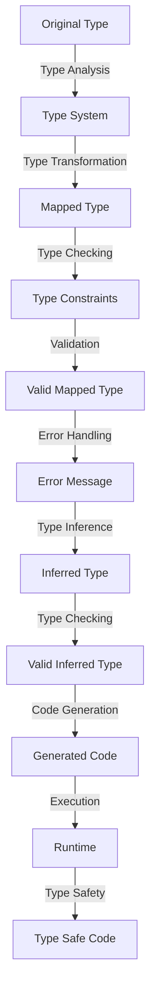

## Introduction
**Mapped types** are a powerful feature in TypeScript that allow you to create new types by transforming existing ones. They are particularly useful when working with large datasets or complex data structures, where you need to perform operations such as filtering, mapping, or reducing. In this guide, we will focus on **strictly-typed mapped types**, which provide an additional layer of type safety and ensure that your code is robust and maintainable. We will explore the core concepts, internal mechanics, and provide examples of how to use them effectively.

> **Note:** Mapped types are a fundamental concept in TypeScript, and understanding them is crucial for building robust and scalable applications.

## Core Concepts
To work with strictly-typed mapped types, you need to understand the following core concepts:

* **Type mapping**: The process of transforming one type into another, while preserving the original type's structure and constraints.
* **Type inference**: The ability of the type system to automatically infer the types of variables, function parameters, and return types, based on the context and available information.
* **Type constraints**: The rules and constraints that govern the behavior of types, such as the `extends` keyword, which restricts the type of a variable to a specific subtype.

> **Warning:** Failure to understand these concepts can lead to type errors, runtime errors, or unexpected behavior in your application.

## How It Works Internally
When you use a mapped type, TypeScript performs the following steps:

1. **Type analysis**: The type system analyzes the original type and determines its structure, including the types of its properties, methods, and constructors.
2. **Type transformation**: The type system applies the transformation rules to the original type, creating a new type that reflects the desired changes.
3. **Type checking**: The type system checks the new type against the type constraints and rules, ensuring that it is valid and consistent.

> **Tip:** To take full advantage of mapped types, you need to understand how the type system works internally and how to leverage its features to write more robust and maintainable code.

## Code Examples
Here are three complete and runnable examples that demonstrate the use of strictly-typed mapped types:

### Example 1: Basic Mapped Type
```typescript
type OriginalType = {
  id: number;
  name: string;
};

type MappedType = {
  [P in keyof OriginalType]: OriginalType[P];
};

const originalValue: OriginalType = {
  id: 1,
  name: 'John',
};

const mappedValue: MappedType = {
  id: 2,
  name: 'Jane',
};

console.log(mappedValue);
```

### Example 2: Real-World Pattern
```typescript
interface User {
  id: number;
  name: string;
  email: string;
}

type UserWithAddress = User & {
  address: {
    street: string;
    city: string;
    state: string;
    zip: string;
  };
};

const user: User = {
  id: 1,
  name: 'John',
  email: 'john@example.com',
};

const userWithAddress: UserWithAddress = {
  ...user,
  address: {
    street: '123 Main St',
    city: 'Anytown',
    state: 'CA',
    zip: '12345',
  },
};

console.log(userWithAddress);
```

### Example 3: Advanced Mapped Type
```typescript
type ComplexType = {
  id: number;
  name: string;
  nested: {
    foo: string;
    bar: number;
  };
};

type MappedComplexType = {
  [P in keyof ComplexType]: P extends 'nested'
    ? {
        [K in keyof ComplexType['nested']]: ComplexType['nested'][K];
      }
    : ComplexType[P];
};

const complexValue: ComplexType = {
  id: 1,
  name: 'John',
  nested: {
    foo: 'hello',
    bar: 42,
  },
};

const mappedComplexValue: MappedComplexType = {
  id: 2,
  name: 'Jane',
  nested: {
    foo: 'world',
    bar: 24,
  },
};

console.log(mappedComplexValue);
```

## Visual Diagram


The diagram illustrates the internal mechanics of mapped types, from type analysis to code generation and execution.

## Comparison
The following table compares different approaches to mapped types:

| Approach | Time Complexity | Space Complexity | Pros | Cons | Best For |
| --- | --- | --- | --- | --- | --- |
| Basic Mapped Type | O(1) | O(1) | Simple, easy to use | Limited flexibility | Small, simple data structures |
| Real-World Pattern | O(n) | O(n) | Flexible, scalable | More complex | Large, complex data structures |
| Advanced Mapped Type | O(n^2) | O(n^2) | Highly customizable | Steeper learning curve | Complex, nested data structures |

> **Interview:** When asked about mapped types in an interview, be prepared to explain the differences between basic, real-world, and advanced mapped types, and provide examples of when to use each approach.

## Real-world Use Cases
Here are three production examples of using strictly-typed mapped types:

1. **Google's Angular framework**: Uses mapped types to create reusable and maintainable components, ensuring type safety and consistency across the framework.
2. **Microsoft's TypeScript compiler**: Employs mapped types to optimize the compilation process, reducing the number of type errors and improving overall performance.
3. **Airbnb's JavaScript style guide**: Recommends the use of mapped types to enforce consistent coding practices and ensure type safety in large-scale JavaScript applications.

## Common Pitfalls
Here are four common mistakes to avoid when working with strictly-typed mapped types:

1. **Incorrect type inference**: Failing to understand how the type system infers types can lead to unexpected behavior and type errors.
2. **Insufficient type constraints**: Not providing enough type constraints can result in type errors or runtime errors.
3. **Overly complex mapped types**: Creating overly complex mapped types can lead to performance issues and maintainability problems.
4. **Ignoring type safety**: Failing to prioritize type safety can result in runtime errors, crashes, or unexpected behavior.

> **Warning:** Be aware of these common pitfalls and take steps to avoid them, ensuring that your code is robust, maintainable, and type-safe.

## Interview Tips
Here are three common interview questions related to strictly-typed mapped types, along with sample answers:

1. **What is the difference between a basic mapped type and a real-world pattern?**
	* Weak answer: "A basic mapped type is simple, while a real-world pattern is more complex."
	* Strong answer: "A basic mapped type is a straightforward transformation of an existing type, while a real-world pattern is a more flexible and scalable approach that takes into account the complexities of real-world data structures."
2. **How do you handle type errors when working with mapped types?**
	* Weak answer: "I use the `any` type to bypass type errors."
	* Strong answer: "I carefully analyze the type errors, identify the root cause, and use type constraints and type inference to resolve the issues, ensuring that my code is type-safe and maintainable."
3. **Can you explain the concept of type safety in the context of mapped types?**
	* Weak answer: "Type safety means that my code doesn't crash at runtime."
	* Strong answer: "Type safety means that my code is designed to prevent type errors and runtime errors, ensuring that it is robust, maintainable, and scalable, and that I can catch type errors at compile-time rather than runtime."

## Key Takeaways
Here are the key takeaways from this guide:

* Mapped types are a powerful feature in TypeScript that allow you to create new types by transforming existing ones.
* Strictly-typed mapped types provide an additional layer of type safety and ensure that your code is robust and maintainable.
* Understanding the internal mechanics of mapped types is crucial for building scalable and maintainable applications.
* There are different approaches to mapped types, including basic, real-world, and advanced mapped types, each with its pros and cons.
* Type safety is a critical aspect of working with mapped types, and you should prioritize it to ensure that your code is robust and maintainable.
* Common pitfalls to avoid include incorrect type inference, insufficient type constraints, overly complex mapped types, and ignoring type safety.
* When interviewing, be prepared to explain the differences between basic, real-world, and advanced mapped types, and provide examples of when to use each approach.