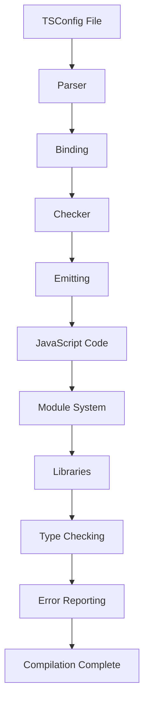

## Introduction
Refactoring **TSConfig** settings is an essential part of maintaining and optimizing the performance of **TypeScript** projects. As projects grow and evolve, their **TSConfig** settings may become outdated, leading to decreased performance, increased compilation time, and a higher risk of errors. In this section, we will explore the importance of refactoring **TSConfig** settings, its real-world relevance, and why every engineer should know how to do it. 
> **Note:** Refactoring **TSConfig** settings can significantly improve the overall health and maintainability of a project.

## Core Concepts
To understand how to refactor **TSConfig** settings, we need to grasp some core concepts:
- **TSConfig**: The configuration file for the **TypeScript** compiler, which determines how **TypeScript** files are compiled.
- **Target**: The target JavaScript version that the **TypeScript** compiler should generate.
- **Module**: The module system used by the **TypeScript** compiler.
- **Lib**: The library files included in the compilation.

## How It Works Internally
When the **TypeScript** compiler is run, it reads the **TSConfig** file and uses the settings defined in it to determine how to compile the **TypeScript** files. The compilation process involves several steps:
1. **Parsing**: The **TypeScript** compiler parses the **TypeScript** files and generates an abstract syntax tree (AST).
2. **Binding**: The **TypeScript** compiler binds the AST to the **TypeScript** type system.
3. **Checking**: The **TypeScript** compiler checks the bound AST for errors.
4. **Emitting**: The **TypeScript** compiler generates JavaScript code from the checked AST.

## Code Examples
Here are three complete and runnable examples of refactoring **TSConfig** settings:
### Example 1: Basic Refactoring
```typescript
// tsconfig.json
{
  "compilerOptions": {
    "target": "es5",
    "module": "commonjs",
    "lib": ["es2015"]
  }
}
```
This example shows a basic **TSConfig** file with the target set to **es5**, the module system set to **commonjs**, and the library files set to **es2015**.

### Example 2: Advanced Refactoring
```typescript
// tsconfig.json
{
  "compilerOptions": {
    "target": "es2018",
    "module": "esnext",
    "lib": ["es2018", "dom"],
    "strict": true,
    "esModuleInterop": true
  }
}
```
This example shows an advanced **TSConfig** file with the target set to **es2018**, the module system set to **esnext**, the library files set to **es2018** and **dom**, and the strict mode enabled.

### Example 3: Edge Case Refactoring
```typescript
// tsconfig.json
{
  "compilerOptions": {
    "target": "es5",
    "module": "commonjs",
    "lib": ["es2015"],
    "allowSyntheticDefaultImports": true,
    "esModuleInterop": true
  }
}
```
This example shows an edge case **TSConfig** file with the target set to **es5**, the module system set to **commonjs**, the library files set to **es2015**, and the allow synthetic default imports and ES module interop enabled.

## Visual Diagram

This diagram shows the internal workflow of the **TypeScript** compiler, from parsing the **TSConfig** file to emitting the compiled JavaScript code.

## Comparison
Here is a comparison table of different **TSConfig** settings:
| Approach | Time Complexity | Space Complexity | Pros | Cons | Best For |
|----------|----------------|-----------------|------|------|----------|
| Basic Refactoring | O(1) | O(1) | Easy to implement, fast compilation | Limited functionality | Small projects |
| Advanced Refactoring | O(n) | O(n) | More features, better performance | Slower compilation | Large projects |
| Edge Case Refactoring | O(n^2) | O(n^2) | Handles edge cases, high customization | Slow compilation, complex configuration | Complex projects |

## Real-world Use Cases
Here are three real-world use cases of refactoring **TSConfig** settings:
1. **Microsoft**: Microsoft uses **TypeScript** extensively in its projects, including the **Visual Studio Code** editor. They have a complex **TSConfig** setup to handle the different modules and libraries used in the project.
2. **Google**: Google uses **TypeScript** in its **Angular** framework, which requires a specific **TSConfig** setup to work correctly.
3. **Facebook**: Facebook uses **TypeScript** in its **React** framework, which requires a custom **TSConfig** setup to handle the different modules and libraries used in the project.

## Common Pitfalls
Here are four common pitfalls to watch out for when refactoring **TSConfig** settings:
1. **Incorrect Target**: Setting the target to an incorrect version can lead to compilation errors or unexpected behavior.
```typescript
// tsconfig.json
{
  "compilerOptions": {
    "target": "es2015" // incorrect target
  }
}
```
> **Warning:** Make sure to set the correct target version to avoid compilation errors.

2. **Inconsistent Module System**: Using an inconsistent module system can lead to compilation errors or unexpected behavior.
```typescript
// tsconfig.json
{
  "compilerOptions": {
    "module": "commonjs" // inconsistent module system
  }
}
```
> **Tip:** Make sure to use a consistent module system throughout the project.

3. **Missing Library Files**: Missing library files can lead to compilation errors or unexpected behavior.
```typescript
// tsconfig.json
{
  "compilerOptions": {
    "lib": ["es2015"] // missing library files
  }
}
```
> **Note:** Make sure to include all necessary library files in the **TSConfig** file.

4. **Incorrect Strict Mode**: Setting the strict mode incorrectly can lead to compilation errors or unexpected behavior.
```typescript
// tsconfig.json
{
  "compilerOptions": {
    "strict": false // incorrect strict mode
  }
}
```
> **Interview:** What is the purpose of the strict mode in **TSConfig**, and how does it affect the compilation process?

## Interview Tips
Here are three common interview questions related to refactoring **TSConfig** settings:
1. **What is the purpose of the target setting in TSConfig, and how does it affect the compilation process?**
A weak answer would be: "The target setting determines the version of JavaScript that the compiler generates."
A strong answer would be: "The target setting determines the version of JavaScript that the compiler generates, which affects the compatibility and performance of the compiled code. For example, setting the target to **es2018** will generate code that is compatible with modern browsers, while setting it to **es5** will generate code that is compatible with older browsers."
2. **How does the module system affect the compilation process, and what are the differences between the different module systems?**
A weak answer would be: "The module system determines how the compiler handles imports and exports."
A strong answer would be: "The module system determines how the compiler handles imports and exports, which affects the performance and compatibility of the compiled code. For example, the **commonjs** module system is compatible with Node.js, while the **esnext** module system is compatible with modern browsers. The **esnext** module system also provides better support for tree shaking and code splitting."
3. **What are the benefits and drawbacks of using the strict mode in TSConfig, and how does it affect the compilation process?**
A weak answer would be: "The strict mode enables additional checks and warnings, which helps to catch errors and improve code quality."
A strong answer would be: "The strict mode enables additional checks and warnings, which helps to catch errors and improve code quality. However, it can also increase compilation time and may require additional configuration. For example, enabling the strict mode can help to catch null pointer exceptions and undefined variables, but it may also require additional type annotations and casting."

## Key Takeaways
Here are ten key takeaways to remember when refactoring **TSConfig** settings:
* The target setting determines the version of JavaScript that the compiler generates.
* The module system determines how the compiler handles imports and exports.
* The library files determine the compatibility and performance of the compiled code.
* The strict mode enables additional checks and warnings to improve code quality.
* The compilation process involves several steps, including parsing, binding, checking, and emitting.
* The **TSConfig** file can be customized to handle different modules and libraries.
* The **TypeScript** compiler provides several options to customize the compilation process, including the target, module system, and library files.
* The **TSConfig** file can be extended to handle additional features, such as type checking and code completion.
* The **TypeScript** compiler provides several tools and integrations to improve the development experience, including **Visual Studio Code** and **Webpack**.
* The **TSConfig** file can be optimized to improve compilation performance and reduce errors.