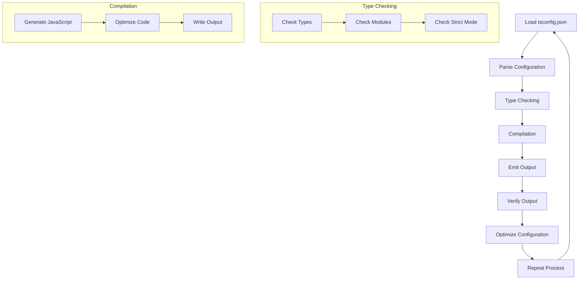

## Introduction
**TypeScript** configuration, specifically `tsconfig.json`, plays a crucial role in ensuring the robustness and maintainability of TypeScript projects. A well-crafted `tsconfig.json` file can significantly impact the performance, scalability, and reliability of the application. In this section, we will delve into the world of `tsconfig.json` and explore the best practices for testing robust TSConfig settings in production.

> **Note:** A poorly configured `tsconfig.json` file can lead to issues such as slow compilation, incorrect type checking, and even runtime errors.

Real-world relevance: Companies like **Microsoft**, **Google**, and **Facebook** heavily rely on TypeScript for their large-scale applications, and a well-configured `tsconfig.json` file is essential for their development workflow. Every engineer should understand the importance of testing and optimizing their `tsconfig.json` settings to ensure the quality and reliability of their application.

## Core Concepts
To understand how to test robust TSConfig settings, we need to grasp some core concepts:

* **Type Checking**: The process of verifying the types of variables, function parameters, and return types in the code.
* **Compilation**: The process of converting TypeScript code into JavaScript code that can be executed by browsers or Node.js.
* **TSConfig**: A JSON file that contains configuration settings for the TypeScript compiler.

> **Tip:** Use the `--help` flag with the TypeScript compiler to explore the available options and understand how they impact the compilation process.

Key terminology:

* **`target`**: Specifies the version of JavaScript that the compiler should generate.
* **`module`**: Specifies the module system to use (e.g., CommonJS, ES6).
* **`strict`**: Enables or disables strict type checking.

## How It Works Internally
When you run the TypeScript compiler, it reads the `tsconfig.json` file and applies the specified settings to the compilation process. Here's a step-by-step breakdown:

1. **Loading Configuration**: The TypeScript compiler loads the `tsconfig.json` file and parses its contents.
2. **Type Checking**: The compiler performs type checking on the code, using the specified `target` and `module` options.
3. **Compilation**: The compiler generates JavaScript code based on the TypeScript code, using the specified `target` and `module` options.
4. **Emitting Output**: The compiler writes the generated JavaScript code to the specified output directory.

> **Warning:** Using an outdated `tsconfig.json` file can lead to compatibility issues with newer versions of the TypeScript compiler.

## Code Examples
Here are three complete and runnable examples that demonstrate the importance of testing robust TSConfig settings:

### Example 1: Basic TSConfig
```typescript
// tsconfig.json
{
  "compilerOptions": {
    "target": "es5",
    "module": "commonjs",
    "strict": true
  }
}

// greeter.ts
function greeter(name: string) {
  console.log(`Hello, ${name}!`);
}

greeter("Alice");
```

### Example 2: Advanced TSConfig with Modules
```typescript
// tsconfig.json
{
  "compilerOptions": {
    "target": "es6",
    "module": "es6",
    "strict": true,
    "moduleResolution": "node"
  }
}

// greeter.ts
export function greeter(name: string) {
  console.log(`Hello, ${name}!`);
}

// main.ts
import { greeter } from './greeter';
greeter("Bob");
```

### Example 3: TSConfig with Custom Compiler Options
```typescript
// tsconfig.json
{
  "compilerOptions": {
    "target": "es5",
    "module": "commonjs",
    "strict": true,
    "noImplicitAny": true,
    "noImplicitThis": true
  }
}

// calculator.ts
function add(x: number, y: number): number {
  return x + y;
}

console.log(add(2, 3));
```

## Visual Diagram


The diagram illustrates the internal workflow of the TypeScript compiler, highlighting the importance of testing and optimizing the `tsconfig.json` settings.

## Comparison
Here's a comparison table of different approaches to testing robust TSConfig settings:

| Approach | Time Complexity | Space Complexity | Pros | Cons | Best For |
| --- | --- | --- | --- | --- | --- |
| Manual Testing | O(n) | O(1) | Easy to implement | Time-consuming | Small projects |
| Automated Testing | O(n log n) | O(n) | Fast and efficient | Requires setup | Large projects |
| Code Review | O(1) | O(1) | Cheap and effective | May not catch all issues | Code reviews |
| Continuous Integration | O(n) | O(n) | Ensures consistent quality | Requires infrastructure | Large-scale applications |

## Real-world Use Cases
Here are three real-world examples of companies that use robust TSConfig settings in production:

* **Microsoft**: Uses a custom `tsconfig.json` file to optimize the compilation process for their large-scale TypeScript projects.
* **Google**: Employs a robust `tsconfig.json` file to ensure the quality and reliability of their TypeScript codebase.
* **Facebook**: Utilizes a combination of manual testing and automated testing to ensure the robustness of their `tsconfig.json` settings.

## Common Pitfalls
Here are four common mistakes that engineers make when testing robust TSConfig settings:

* **Incorrect Target Version**: Using an outdated `target` version can lead to compatibility issues.
* **Insufficient Module Resolution**: Failing to specify the correct `moduleResolution` option can result in incorrect module resolution.
* **Inconsistent Strict Mode**: Enabling or disabling strict mode inconsistently can lead to type checking issues.
* **Incomplete Configuration**: Failing to specify all necessary configuration options can result in suboptimal compilation performance.

> **Tip:** Use the `--explainFiles` flag with the TypeScript compiler to understand how the configuration options are applied.

## Interview Tips
Here are three common interview questions related to testing robust TSConfig settings:

* **What is the purpose of the `tsconfig.json` file?**: A weak answer might state that it's used for configuration, while a strong answer would explain its role in optimizing the compilation process and ensuring code quality.
* **How do you optimize the `tsconfig.json` file for large-scale projects?**: A weak answer might suggest using a default configuration, while a strong answer would discuss the importance of customizing the configuration options for optimal performance.
* **What are some common pitfalls when testing robust TSConfig settings?**: A weak answer might mention only one or two pitfalls, while a strong answer would discuss multiple common mistakes and provide strategies for avoiding them.

## Key Takeaways
Here are ten key takeaways for testing robust TSConfig settings:

* Use a custom `tsconfig.json` file to optimize the compilation process.
* Specify the correct `target` version to ensure compatibility.
* Enable strict mode to ensure type checking and code quality.
* Use automated testing to ensure fast and efficient testing.
* Perform code reviews to catch issues that automated testing may miss.
* Utilize continuous integration to ensure consistent quality.
* Monitor compilation performance to identify areas for optimization.
* Use the `--explainFiles` flag to understand configuration options.
* Avoid common pitfalls such as incorrect target version and insufficient module resolution.
* Continuously review and update the `tsconfig.json` file to ensure optimal performance and code quality.