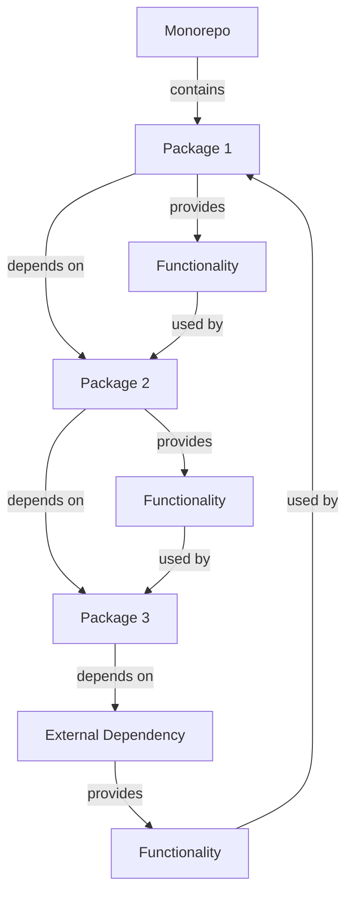

## Introduction
A **monorepo** is a software development strategy where all projects and packages are stored in a single repository. This approach has gained popularity in recent years due to its ability to simplify dependency management, improve code reuse, and enhance collaboration among developers. In this article, we will delve into the world of monorepo setups, exploring the common pitfalls that developers face when structuring their repositories. We will also discuss the benefits of using a monorepo, including improved **code organization**, **reduced duplication**, and **easier maintenance**. As a senior engineer, understanding the intricacies of monorepo setups is crucial for building scalable and maintainable software systems.

> **Note:** A well-structured monorepo can significantly improve the overall development experience, but a poorly designed one can lead to a multitude of issues, including slow build times, complex dependency management, and decreased productivity.

## Core Concepts
Before diving into the common pitfalls of monorepo setups, it's essential to understand the core concepts involved. A monorepo typically consists of multiple **packages**, each representing a separate project or module. These packages are often organized into a hierarchical structure, with **subpackages** and **dependencies** between them. The key terminology to keep in mind includes:
* **Monorepo**: A single repository containing all projects and packages.
* **Package**: A separate project or module within the monorepo.
* **Subpackage**: A subset of a package, often representing a specific feature or component.
* **Dependency**: A relationship between packages, where one package relies on another for functionality.

> **Tip:** When setting up a monorepo, it's crucial to establish a clear naming convention and organizational structure to ensure that packages and subpackages are easily identifiable and navigable.

## How It Works Internally
Under the hood, a monorepo setup relies on a combination of **package managers**, **build tools**, and **version control systems**. The package manager is responsible for managing dependencies between packages, while the build tool handles the compilation and packaging of individual packages. The version control system, typically **Git**, manages the overall repository structure and history.

Here's a step-by-step breakdown of how a monorepo setup works:
1. **Package creation**: A new package is created within the monorepo, with its own set of dependencies and subpackages.
2. **Dependency resolution**: The package manager resolves dependencies between packages, ensuring that each package has access to the necessary dependencies.
3. **Build and compilation**: The build tool compiles and packages each package, taking into account the resolved dependencies.
4. **Version control**: The version control system manages the repository structure and history, including commits, branches, and merges.

> **Warning:** A poorly configured monorepo setup can lead to **slow build times**, **complex dependency management**, and ** decreased productivity**. It's essential to carefully plan and optimize the setup to avoid these issues.

## Code Examples
Here are three complete and runnable code examples demonstrating different aspects of monorepo setups:
### Example 1: Basic Monorepo Setup
```typescript
// packages/package1/index.ts
export function add(a: number, b: number): number {
  return a + b;
}

// packages/package2/index.ts
import { add } from 'package1';

export function multiply(a: number, b: number): number {
  return add(a, b) * 2;
}
```
This example demonstrates a basic monorepo setup with two packages, `package1` and `package2`, where `package2` depends on `package1`.

### Example 2: Advanced Monorepo Setup with Subpackages
```typescript
// packages/package1/subpackage1/index.ts
export function subtract(a: number, b: number): number {
  return a - b;
}

// packages/package1/subpackage2/index.ts
import { subtract } from '../subpackage1';

export function divide(a: number, b: number): number {
  return subtract(a, b) / 2;
}
```
This example demonstrates an advanced monorepo setup with subpackages, where `subpackage2` depends on `subpackage1`.

### Example 3: Monorepo Setup with External Dependencies
```typescript
// packages/package1/index.ts
import * as chalk from 'chalk';

export function logMessage(message: string): void {
  console.log(chalk.green(message));
}
```
This example demonstrates a monorepo setup with external dependencies, where `package1` depends on the `chalk` library.

## Visual Diagram

This diagram illustrates the relationships between packages and dependencies within a monorepo setup.

> **Note:** A well-structured monorepo setup should have a clear and concise dependency graph, making it easy to navigate and understand the relationships between packages.

## Comparison
Here's a comparison table highlighting different monorepo setup approaches:
| Approach | Time Complexity | Space Complexity | Pros | Cons | Best For |
| --- | --- | --- | --- | --- | --- |
| **Single Repository** | O(1) | O(n) | Simplified dependency management, improved code reuse | Slow build times, complex dependency management | Small to medium-sized projects |
| **Multi-Repository** | O(n) | O(1) | Faster build times, simpler dependency management | Increased complexity, reduced code reuse | Large-scale projects with many dependencies |
| **Hybrid Approach** | O(log n) | O(n) | Balanced trade-off between build time and complexity | Requires careful planning and optimization | Medium to large-sized projects with complex dependencies |

## Real-world Use Cases
Here are three real-world examples of monorepo setups:
* **Google**: Google uses a massive monorepo setup to manage its vast array of projects and packages, including the Android operating system and Google Chrome.
* **Facebook**: Facebook employs a monorepo setup to manage its various projects, including the Facebook platform, Instagram, and WhatsApp.
* **Microsoft**: Microsoft uses a hybrid approach, combining elements of monorepo and multi-repository setups to manage its diverse range of projects and packages.

> **Tip:** When setting up a monorepo, it's essential to consider the specific needs and requirements of your project, including the number of packages, dependencies, and developers involved.

## Common Pitfalls
Here are four common mistakes to avoid when setting up a monorepo:
* **Insufficient planning**: Failing to plan and optimize the monorepo setup can lead to slow build times, complex dependency management, and decreased productivity.
* **Inadequate naming conventions**: Poor naming conventions can make it difficult to navigate and understand the relationships between packages and dependencies.
* **Inconsistent dependency management**: Inconsistent dependency management can lead to version conflicts, slow build times, and decreased productivity.
* **Inadequate testing**: Inadequate testing can lead to bugs and issues that are difficult to identify and resolve.

> **Warning:** A poorly configured monorepo setup can have significant consequences, including decreased productivity, increased maintenance costs, and reduced overall quality of the software system.

## Interview Tips
Here are three common interview questions related to monorepo setups, along with sample answers:
* **What is a monorepo, and how does it work?**
	+ Weak answer: "A monorepo is a single repository that contains all projects and packages. It's like a big box that holds everything."
	+ Strong answer: "A monorepo is a software development strategy where all projects and packages are stored in a single repository. It works by using a combination of package managers, build tools, and version control systems to manage dependencies, build, and compile individual packages."
* **How do you optimize a monorepo setup for performance?**
	+ Weak answer: "I would just use a faster build tool or add more resources to the build process."
	+ Strong answer: "To optimize a monorepo setup for performance, I would first analyze the dependency graph to identify bottlenecks and areas for improvement. Then, I would apply techniques such as parallelization, caching, and incremental building to reduce build times and improve overall performance."
* **What are some common pitfalls to avoid when setting up a monorepo?**
	+ Weak answer: "I'm not sure, but I think it's just a matter of following best practices and using the right tools."
	+ Strong answer: "Some common pitfalls to avoid when setting up a monorepo include insufficient planning, inadequate naming conventions, inconsistent dependency management, and inadequate testing. To avoid these pitfalls, it's essential to carefully plan and optimize the monorepo setup, establish clear naming conventions, and implement robust testing and validation mechanisms."

## Key Takeaways
Here are ten key takeaways to remember when working with monorepo setups:
* A monorepo is a software development strategy where all projects and packages are stored in a single repository.
* A well-structured monorepo setup can simplify dependency management, improve code reuse, and enhance collaboration among developers.
* A poorly configured monorepo setup can lead to slow build times, complex dependency management, and decreased productivity.
* It's essential to plan and optimize the monorepo setup carefully to avoid common pitfalls.
* Establishing clear naming conventions and organizational structures is crucial for navigating and understanding the relationships between packages and dependencies.
* Inconsistent dependency management can lead to version conflicts, slow build times, and decreased productivity.
* Inadequate testing can lead to bugs and issues that are difficult to identify and resolve.
* Parallelization, caching, and incremental building can be used to optimize monorepo setups for performance.
* A hybrid approach can be used to balance trade-offs between build time and complexity.
* Careful planning and optimization are essential for achieving a successful monorepo setup.