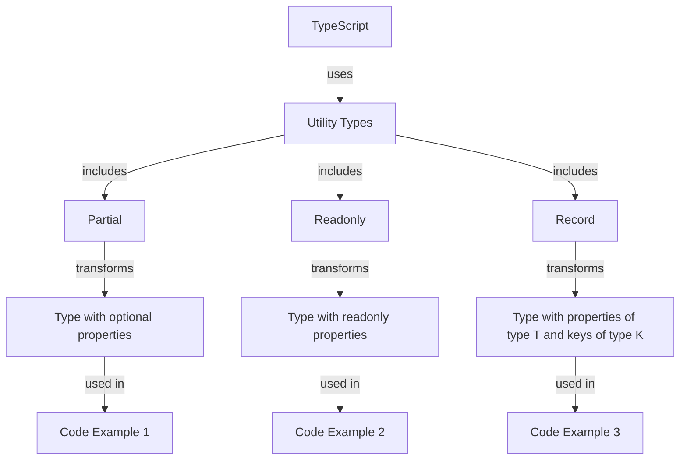

## Introduction
TypeScript is a statically typed language that offers various utility types to make coding more efficient and type-safe. However, when using these utility types, developers can fall into common pitfalls that can lead to bugs, performance issues, or even compilation errors. In this section, we will explore the importance of understanding common pitfalls when typing utility types in TypeScript, their real-world relevance, and why every engineer needs to know this.

TypeScript's utility types, such as `Partial<T>`, `Readonly<T>`, and `Record<K, T>`, provide a way to manipulate types in a flexible and reusable manner. However, their misuse can have severe consequences, including runtime errors, type inconsistencies, and decreased code maintainability. Therefore, it is crucial to understand the common pitfalls associated with these utility types and learn how to use them effectively.

> **Note:** Understanding common pitfalls when typing utility types is essential for any TypeScript developer, as it can help prevent bugs, improve code quality, and reduce development time.

## Core Concepts
Before diving into the common pitfalls, let's review the core concepts of TypeScript's utility types. The main utility types in TypeScript are:

* `Partial<T>`: Represents a type with all properties of `T` set to optional.
* `Readonly<T>`: Represents a type with all properties of `T` set to readonly.
* `Record<K, T>`: Represents a type with all properties of type `T` and keys of type `K`.

To understand these concepts better, let's consider a simple example:

```typescript
interface Person {
  name: string;
  age: number;
}

type PartialPerson = Partial<Person>;
type ReadonlyPerson = Readonly<Person>;
type PersonRecord = Record<string, Person>;
```

In this example, `PartialPerson` represents a type with all properties of `Person` set to optional, `ReadonlyPerson` represents a type with all properties of `Person` set to readonly, and `PersonRecord` represents a type with all properties of type `Person` and keys of type `string`.

> **Tip:** When using utility types, it's essential to understand the underlying type structure and how it will be transformed.

## How It Works Internally
To understand how utility types work internally, let's take a closer look at the implementation of `Partial<T>`:

```typescript
type Partial<T> = {
  [P in keyof T]?: T[P];
}
```

In this implementation, the `Partial<T>` type uses the `keyof T` operator to get the keys of type `T`, and then uses a mapped type to create a new type with all properties set to optional.

Similarly, the `Readonly<T>` type is implemented as:

```typescript
type Readonly<T> = {
  readonly [P in keyof T]: T[P];
}
```

In this implementation, the `Readonly<T>` type uses the `keyof T` operator to get the keys of type `T`, and then uses a mapped type to create a new type with all properties set to readonly.

> **Warning:** When using utility types, it's essential to understand the underlying implementation and how it will affect the resulting type.

## Code Examples
Here are three complete and runnable code examples that demonstrate the use of utility types in TypeScript:

### Example 1: Basic Usage
```typescript
interface Person {
  name: string;
  age: number;
}

type PartialPerson = Partial<Person>;

const person: PartialPerson = {
  name: 'John',
};

console.log(person); // { name: 'John' }
```

In this example, we use the `Partial<T>` type to create a new type `PartialPerson` with all properties of `Person` set to optional. We then create an object `person` of type `PartialPerson` with only the `name` property.

### Example 2: Real-World Pattern
```typescript
interface User {
  id: number;
  name: string;
  email: string;
}

type UserRecord = Record<number, User>;

const users: UserRecord = {
  1: { id: 1, name: 'John', email: 'john@example.com' },
  2: { id: 2, name: 'Jane', email: 'jane@example.com' },
};

console.log(users); // { 1: { id: 1, name: 'John', email: 'john@example.com' }, 2: { id: 2, name: 'Jane', email: 'jane@example.com' } }
```

In this example, we use the `Record<K, T>` type to create a new type `UserRecord` with all properties of type `User` and keys of type `number`. We then create an object `users` of type `UserRecord` with multiple users.

### Example 3: Advanced Usage
```typescript
interface Config {
  host: string;
  port: number;
}

type ConfigRecord = Record<string, Config>;

const configs: ConfigRecord = {
  dev: { host: 'localhost', port: 3000 },
  prod: { host: 'example.com', port: 80 },
};

console.log(configs); // { dev: { host: 'localhost', port: 3000 }, prod: { host: 'example.com', port: 80 } }
```

In this example, we use the `Record<K, T>` type to create a new type `ConfigRecord` with all properties of type `Config` and keys of type `string`. We then create an object `configs` of type `ConfigRecord` with multiple configurations.

## Visual Diagram


This diagram illustrates the relationship between TypeScript, utility types, and the resulting types. It shows how utility types transform the original type into a new type with the desired properties.

> **Tip:** Visual diagrams can help illustrate complex concepts and relationships between types.

## Comparison
Here is a comparison table that summarizes the different utility types in TypeScript:

| Utility Type | Description | Time Complexity | Space Complexity | Pros | Cons |
| --- | --- | --- | --- | --- | --- |
| `Partial<T>` | Represents a type with all properties of `T` set to optional. | O(1) | O(1) | Flexible, reusable | May lead to type inconsistencies |
| `Readonly<T>` | Represents a type with all properties of `T` set to readonly. | O(1) | O(1) | Ensures data integrity, prevents unintended modifications | May limit flexibility |
| `Record<K, T>` | Represents a type with all properties of type `T` and keys of type `K`. | O(1) | O(1) | Flexible, reusable | May lead to type inconsistencies |

> **Warning:** When choosing a utility type, consider the trade-offs between flexibility, reusability, and type safety.

## Real-world Use Cases
Here are three real-world use cases that demonstrate the use of utility types in TypeScript:

1. **Configuration Management**: In a web application, you can use the `Record<K, T>` type to manage different configurations for different environments. For example, you can create a `ConfigRecord` type with all properties of type `Config` and keys of type `string`, and then create an object `configs` of type `ConfigRecord` with multiple configurations.
2. **Data Validation**: In a data validation library, you can use the `Partial<T>` type to validate partial data. For example, you can create a `PartialUser` type with all properties of `User` set to optional, and then use it to validate user data.
3. **API Response Handling**: In an API client library, you can use the `Readonly<T>` type to ensure that API responses are not modified unintentionally. For example, you can create a `ReadonlyApiResponse` type with all properties of `ApiResponse` set to readonly, and then use it to handle API responses.

> **Note:** Utility types can be used in a variety of real-world scenarios to improve code quality, flexibility, and maintainability.

## Common Pitfalls
Here are four common pitfalls to watch out for when using utility types in TypeScript:

1. **Inconsistent Type Usage**: When using utility types, it's essential to ensure that the resulting type is consistent with the original type. For example, if you use the `Partial<T>` type to create a new type with all properties set to optional, you should ensure that the resulting type is still compatible with the original type.
2. **Type Inconsistencies**: When using utility types, it's essential to ensure that the resulting type is consistent with the original type. For example, if you use the `Record<K, T>` type to create a new type with all properties of type `T` and keys of type `K`, you should ensure that the resulting type is still compatible with the original type.
3. **Unintended Modifications**: When using utility types, it's essential to ensure that the resulting type does not allow unintended modifications. For example, if you use the `Readonly<T>` type to create a new type with all properties set to readonly, you should ensure that the resulting type does not allow modifications.
4. **Type Conflicts**: When using utility types, it's essential to ensure that the resulting type does not conflict with other types. For example, if you use the `Partial<T>` type to create a new type with all properties set to optional, you should ensure that the resulting type does not conflict with other types that require all properties to be present.

> **Warning:** When using utility types, it's essential to be aware of these common pitfalls to ensure that your code is type-safe and maintainable.

## Interview Tips
Here are three common interview questions related to utility types in TypeScript, along with sample answers:

1. **What is the difference between `Partial<T>` and `Readonly<T>`?**
	* Weak answer: "I'm not sure, but I think they're similar."
	* Strong answer: "The `Partial<T>` type represents a type with all properties of `T` set to optional, while the `Readonly<T>` type represents a type with all properties of `T` set to readonly. The main difference is that `Partial<T>` allows for optional properties, while `Readonly<T>` ensures that all properties are present and cannot be modified."
2. **How do you use the `Record<K, T>` type in TypeScript?**
	* Weak answer: "I'm not sure, but I think it's used for something."
	* Strong answer: "The `Record<K, T>` type is used to create a new type with all properties of type `T` and keys of type `K`. For example, you can use it to create a configuration object with multiple configurations, where each configuration has a specific type and key."
3. **What are some common pitfalls to watch out for when using utility types in TypeScript?**
	* Weak answer: "I'm not sure, but I think there are some pitfalls."
	* Strong answer: "Some common pitfalls to watch out for when using utility types in TypeScript include inconsistent type usage, type inconsistencies, unintended modifications, and type conflicts. It's essential to be aware of these pitfalls to ensure that your code is type-safe and maintainable."

> **Interview:** When answering interview questions related to utility types in TypeScript, be sure to provide clear and concise explanations of the concepts and their usage.

## Key Takeaways
Here are six key takeaways to remember when using utility types in TypeScript:

* **Use utility types to manipulate types in a flexible and reusable manner.**
* **Understand the underlying implementation of each utility type to ensure correct usage.**
* **Be aware of common pitfalls, such as inconsistent type usage, type inconsistencies, unintended modifications, and type conflicts.**
* **Use the `Partial<T>` type to create a new type with all properties set to optional.**
* **Use the `Readonly<T>` type to create a new type with all properties set to readonly.**
* **Use the `Record<K, T>` type to create a new type with all properties of type `T` and keys of type `K`.**

> **Note:** By following these key takeaways, you can effectively use utility types in TypeScript to improve code quality, flexibility, and maintainability.