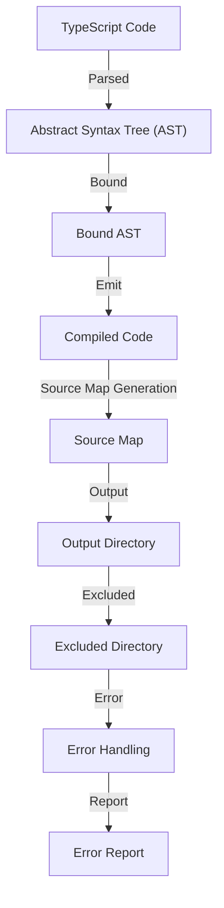

## Introduction
**Compiling TSConfig settings** is a crucial step in the TypeScript development process. It allows developers to customize the compilation process, ensuring that their code is compiled according to their specific needs. In this section, we will delve into the world of TSConfig settings, exploring what they are, why they matter, and their real-world relevance. **TypeScript** is a statically typed, multi-paradigm programming language developed by Microsoft as a superset of JavaScript. It is designed to help developers catch errors early and improve code maintainability, thus making it an ideal choice for large-scale applications.

> **Note:** TSConfig settings are used to configure the TypeScript compiler, allowing developers to customize the compilation process. This includes settings such as target language version, module system, and source map generation.

In real-world scenarios, TSConfig settings are used by companies like Microsoft, Google, and Amazon to ensure that their TypeScript code is compiled consistently and efficiently. For instance, Microsoft uses TSConfig settings to compile the TypeScript code for their Visual Studio Code editor. **Compiling TSConfig settings** is an essential part of the development process, as it enables developers to optimize their code for performance, readability, and maintainability.

## Core Concepts
To understand TSConfig settings, it is essential to grasp the core concepts involved. These include:

* **Target**: The target language version that the TypeScript code will be compiled to. This can be set to ES3, ES5, ES6, or ESNext.
* **Module**: The module system used by the TypeScript code. This can be set to CommonJS, AMD, UMD, or ES6.
* **Source Map**: A source map is a file that maps the compiled code to its original source code. This is useful for debugging purposes.
* **Out Dir**: The output directory where the compiled code will be saved.

> **Tip:** When working with TSConfig settings, it is essential to understand the different options available and how they impact the compilation process. For instance, setting the target to ES6 will compile the code to ES6 syntax, while setting the module to CommonJS will compile the code to use the CommonJS module system.

## How It Works Internally
When the TypeScript compiler is run, it reads the TSConfig settings file and uses the settings to configure the compilation process. The compilation process involves the following steps:

1. **Parsing**: The TypeScript code is parsed into an abstract syntax tree (AST).
2. **Binding**: The AST is bound to the TypeScript type system, which checks for type errors.
3. **Emit**: The bound AST is then emitted to the target language version.
4. **Source Map Generation**: A source map is generated, which maps the compiled code to its original source code.

> **Warning:** If the TSConfig settings file is not properly configured, it can lead to compilation errors or unexpected behavior. For instance, setting the target to ES3 but using ES6 syntax in the code will result in compilation errors.

## Code Examples
Here are three complete and runnable examples of TSConfig settings:

### Example 1: Basic TSConfig Settings
```typescript
// tsconfig.json
{
  "compilerOptions": {
    "target": "es6",
    "module": "commonjs",
    "outDir": "dist",
    "sourceMap": true
  }
}
```
This example sets the target to ES6, the module to CommonJS, and the output directory to `dist`. It also generates source maps.

### Example 2: Advanced TSConfig Settings
```typescript
// tsconfig.json
{
  "compilerOptions": {
    "target": "esnext",
    "module": "es6",
    "outDir": "dist",
    "sourceMap": true,
    "strict": true,
    "noImplicitAny": true
  }
}
```
This example sets the target to ESNext, the module to ES6, and the output directory to `dist`. It also generates source maps, enables strict type checking, and disables implicit any types.

### Example 3: TSConfig Settings with Exclude
```typescript
// tsconfig.json
{
  "compilerOptions": {
    "target": "es6",
    "module": "commonjs",
    "outDir": "dist",
    "sourceMap": true,
    "exclude": ["node_modules"]
  }
}
```
This example sets the target to ES6, the module to CommonJS, and the output directory to `dist`. It also generates source maps and excludes the `node_modules` directory from compilation.

## Visual Diagram

This diagram illustrates the compilation process, from parsing the TypeScript code to generating the source map and outputting the compiled code to the output directory.

## Comparison
| Approach | Time Complexity | Space Complexity | Pros | Cons | Best For |
| --- | --- | --- | --- | --- | --- |
| ES6 | O(n) | O(n) | Modern syntax, efficient | Limited browser support | Modern web applications |
| ES5 | O(n) | O(n) | Wide browser support, compatible | Outdated syntax, less efficient | Legacy web applications |
| CommonJS | O(n) | O(n) | Module system, efficient | Limited browser support | Node.js applications |
| UMD | O(n) | O(n) | Universal module system, efficient | Complex setup, less efficient | Universal web applications |

> **Interview:** What is the difference between ES6 and ES5? How would you choose between them for a project?

## Real-world Use Cases
Here are three real-world use cases for TSConfig settings:

1. **Microsoft Visual Studio Code**: Microsoft uses TSConfig settings to compile the TypeScript code for their Visual Studio Code editor.
2. **Google Angular**: Google uses TSConfig settings to compile the TypeScript code for their Angular framework.
3. **Amazon AWS**: Amazon uses TSConfig settings to compile the TypeScript code for their AWS SDK.

## Common Pitfalls
Here are four common pitfalls when working with TSConfig settings:

1. **Incorrect Target**: Setting the target to an incorrect version can result in compilation errors or unexpected behavior.
2. **Incorrect Module**: Setting the module to an incorrect system can result in compilation errors or unexpected behavior.
3. **Missing Source Map**: Failing to generate source maps can make debugging more difficult.
4. **Incorrect Exclude**: Excluding the wrong directories can result in compilation errors or unexpected behavior.

> **Tip:** To avoid these pitfalls, it is essential to understand the different options available in TSConfig settings and how they impact the compilation process.

## Interview Tips
Here are three common interview questions related to TSConfig settings:

1. **What is the difference between ES6 and ES5?**: A strong answer would explain the differences in syntax and features between the two versions, as well as the trade-offs between modern syntax and browser support.
2. **How would you choose between CommonJS and ES6 modules?**: A strong answer would explain the differences between the two module systems, as well as the trade-offs between compatibility and efficiency.
3. **What is the purpose of source maps in TSConfig settings?**: A strong answer would explain the purpose of source maps, as well as how they are generated and used in debugging.

## Key Takeaways
Here are ten key takeaways from this article:

* **TSConfig settings** are used to configure the TypeScript compiler.
* **Target** refers to the language version that the TypeScript code will be compiled to.
* **Module** refers to the module system used by the TypeScript code.
* **Source Map** refers to a file that maps the compiled code to its original source code.
* **Out Dir** refers to the output directory where the compiled code will be saved.
* **Exclude** refers to directories that should be excluded from compilation.
* **ES6** is a modern syntax with efficient features, but limited browser support.
* **ES5** is an outdated syntax with wide browser support, but less efficient.
* **CommonJS** is a module system with efficient features, but limited browser support.
* **UMD** is a universal module system with efficient features, but complex setup and less efficient.