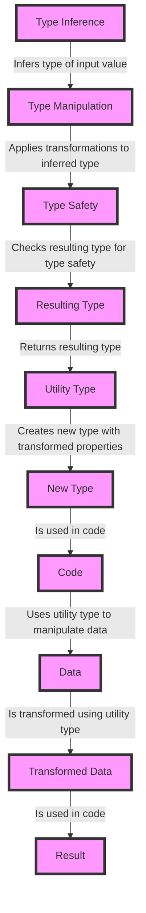

## Introduction
**Utility types** are a set of predefined types in TypeScript that help developers create more robust and maintainable code. They provide a way to manipulate and transform existing types, making it easier to work with complex data structures. In this section, we will explore the world of utility types, their importance, and how they can be used to design robust systems.

> **Note:** Utility types are not a new concept in programming, but they have gained significant attention in recent years due to their ability to simplify complex code and improve code readability.

Utility types are essential in modern software development because they allow developers to write more concise and expressive code. By using utility types, developers can avoid creating custom types for every specific use case, which can lead to code duplication and maintenance issues. Moreover, utility types provide a way to decouple data structures from their underlying implementation, making it easier to change or replace them as needed.

## Core Concepts
To understand utility types, it is essential to grasp the following core concepts:

* **Type inference**: The ability of the compiler to automatically determine the type of a variable or expression based on its context.
* **Type manipulation**: The process of transforming existing types into new ones using utility types.
* **Type safety**: The guarantee that the type system provides to prevent type-related errors at runtime.

Key terminology includes:

* **Partial**: A utility type that creates a new type with all properties of the original type set to optional.
* **Readonly**: A utility type that creates a new type with all properties of the original type set to readonly.
* **Pick**: A utility type that creates a new type with a subset of properties from the original type.
* **Omit**: A utility type that creates a new type with all properties of the original type except for the ones specified.

## How It Works Internally
Utility types work by using a combination of type inference, type manipulation, and type safety. When a utility type is applied to an existing type, the compiler generates a new type that reflects the transformed properties.

Here is a step-by-step breakdown of how utility types work:

1. **Type inference**: The compiler infers the type of the input value or expression.
2. **Type manipulation**: The utility type applies the necessary transformations to the inferred type.
3. **Type safety**: The resulting type is checked for type safety to ensure that it is consistent with the original type.

> **Warning:** Utility types can lead to complex type hierarchies if not used carefully, which can negatively impact code readability and maintainability.

## Code Examples
### Example 1: Basic Usage of Utility Types
```typescript
// Define a basic type
type Person = {
  name: string;
  age: number;
};

// Use the Partial utility type to create a new type with optional properties
type OptionalPerson = Partial<Person>;

// Use the Readonly utility type to create a new type with readonly properties
type ReadonlyPerson = Readonly<Person>;

// Use the Pick utility type to create a new type with a subset of properties
type NameOnly = Pick<Person, 'name'>;

// Use the Omit utility type to create a new type with all properties except for the ones specified
type AgeOnly = Omit<Person, 'name'>;

console.log(OptionalPerson); // { name?: string; age?: number; }
console.log(ReadonlyPerson); // { readonly name: string; readonly age: number; }
console.log(NameOnly); // { name: string; }
console.log(AgeOnly); // { age: number; }
```

### Example 2: Real-World Pattern Using Utility Types
```typescript
// Define a type for a user
type User = {
  id: number;
  name: string;
  email: string;
};

// Use the Partial utility type to create a new type for updating a user
type UpdateUser = Partial<User>;

// Use the Omit utility type to create a new type for creating a new user
type CreateUser = Omit<User, 'id'>;

// Define a function to update a user
function updateUser(user: UpdateUser) {
  // Update the user
}

// Define a function to create a new user
function createUser(user: CreateUser) {
  // Create a new user
}

// Use the functions
updateUser({ name: 'John Doe', email: 'john@example.com' });
createUser({ name: 'Jane Doe', email: 'jane@example.com' });
```

### Example 3: Advanced Usage of Utility Types
```typescript
// Define a type for a complex data structure
type ComplexData = {
  id: number;
  name: string;
  address: {
    street: string;
    city: string;
    state: string;
    zip: string;
  };
};

// Use the Partial utility type to create a new type with optional properties
type OptionalComplexData = Partial<ComplexData>;

// Use the Readonly utility type to create a new type with readonly properties
type ReadonlyComplexData = Readonly<ComplexData>;

// Use the Pick utility type to create a new type with a subset of properties
type NameAndAddress = Pick<ComplexData, 'name' | 'address'>;

// Use the Omit utility type to create a new type with all properties except for the ones specified
type IdAndName = Omit<ComplexData, 'address'>;

console.log(OptionalComplexData); // { id?: number; name?: string; address?: { street?: string; city?: string; state?: string; zip?: string; }; }
console.log(ReadonlyComplexData); // { readonly id: number; readonly name: string; readonly address: { readonly street: string; readonly city: string; readonly state: string; readonly zip: string; }; }
console.log(NameAndAddress); // { name: string; address: { street: string; city: string; state: string; zip: string; }; }
console.log(IdAndName); // { id: number; name: string; }
```

## Visual Diagram

The diagram illustrates the process of using utility types to manipulate data. The process starts with type inference, which infers the type of the input value. The inferred type is then transformed using type manipulation, which applies transformations to the inferred type. The resulting type is then checked for type safety to ensure that it is consistent with the original type.

## Comparison
| Approach | Time Complexity | Space Complexity | Pros | Cons | Best For |
| --- | --- | --- | --- | --- | --- |
| Utility Types | O(1) | O(1) | Simplifies complex code, improves code readability | Can lead to complex type hierarchies if not used carefully | Complex data structures, robust systems |
| Custom Types | O(n) | O(n) | Provides more control over type structure, can be used for simple data structures | Can lead to code duplication, maintenance issues | Simple data structures, small-scale applications |
| Type Guards | O(1) | O(1) | Provides a way to narrow the type of a value, can be used for conditional logic | Can lead to complex type hierarchies if not used carefully | Conditional logic, type narrowing |
| Type Assertions | O(1) | O(1) | Provides a way to override the type of a value, can be used for type casting | Can lead to type-related errors if not used carefully | Type casting, type overriding |

## Real-world Use Cases
1. **Google**: Uses utility types to simplify complex code and improve code readability in their Angular framework.
2. **Microsoft**: Uses utility types to provide a robust and maintainable type system for their TypeScript compiler.
3. **Facebook**: Uses utility types to simplify complex code and improve code readability in their React framework.

## Common Pitfalls
1. **Overusing utility types**: Can lead to complex type hierarchies and negatively impact code readability.
2. **Not using type safety**: Can lead to type-related errors and negatively impact code maintainability.
3. **Not using type inference**: Can lead to code duplication and maintenance issues.
4. **Not using type manipulation**: Can lead to complex code and negatively impact code readability.

> **Tip:** Use utility types carefully and only when necessary to avoid complex type hierarchies and improve code readability.

## Interview Tips
1. **What are utility types and how do they work?**: A strong answer should include a brief explanation of utility types and how they work, including type inference, type manipulation, and type safety.
2. **How do you use utility types to simplify complex code?**: A strong answer should include an example of how to use utility types to simplify complex code, including the use of type inference, type manipulation, and type safety.
3. **What are some common pitfalls when using utility types?**: A strong answer should include a list of common pitfalls when using utility types, including overusing utility types, not using type safety, not using type inference, and not using type manipulation.

> **Interview:** Can you explain the difference between the `Partial` and `Readonly` utility types and provide an example of how to use them?

## Key Takeaways
* Utility types simplify complex code and improve code readability.
* Utility types provide a way to manipulate and transform existing types.
* Type inference, type manipulation, and type safety are essential concepts when using utility types.
* Utility types can lead to complex type hierarchies if not used carefully.
* Custom types provide more control over type structure but can lead to code duplication and maintenance issues.
* Type guards provide a way to narrow the type of a value but can lead to complex type hierarchies if not used carefully.
* Type assertions provide a way to override the type of a value but can lead to type-related errors if not used carefully.
* Google, Microsoft, and Facebook use utility types in their frameworks and compilers.
* Overusing utility types, not using type safety, not using type inference, and not using type manipulation are common pitfalls when using utility types.