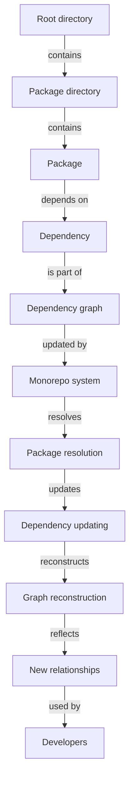

## Introduction
A **monorepo** is a software development strategy where all projects and packages are stored in a single repository. This approach has gained popularity in recent years due to its ability to simplify dependency management, improve code reuse, and enhance collaboration among developers. In this article, we will dive deep into the internal workings of monorepo setups, exploring their core concepts, under-the-hood mechanics, and real-world applications.

> **Note:** Monorepos are not a new concept, but their adoption has increased significantly with the rise of JavaScript and TypeScript ecosystems.

Monorepos are particularly relevant in the context of TypeScript, as they enable developers to manage complex projects with multiple dependencies and packages. By understanding how monorepos work internally, developers can better appreciate the benefits and challenges of this approach and make informed decisions about when to use it.

## Core Concepts
To understand monorepos, it's essential to grasp the following core concepts:

* **Repository**: A centralized location where all projects and packages are stored.
* **Package**: A self-contained piece of code that can be reused across multiple projects.
* **Dependency**: A relationship between packages, where one package relies on another to function.
* **Module**: A self-contained piece of code that can be imported and used by other packages.

> **Tip:** When working with monorepos, it's crucial to establish a clear naming convention for packages and modules to avoid confusion and ensure easy discovery.

## How It Works Internally
A monorepo setup typically consists of the following components:

1. **Root directory**: The top-level directory that contains all projects and packages.
2. **Package directory**: A subdirectory that contains a single package and its dependencies.
3. **Dependency graph**: A data structure that represents the relationships between packages.

When a developer makes a change to a package, the monorepo system updates the dependency graph to reflect the new relationships. This process involves the following steps:

1. **Package resolution**: The monorepo system resolves the dependencies of the changed package.
2. **Dependency updating**: The monorepo system updates the dependencies of the changed package.
3. **Graph reconstruction**: The monorepo system rebuilds the dependency graph to reflect the new relationships.

> **Warning:** Monorepos can become complex and difficult to manage if not properly maintained. It's essential to establish a clear governance model and automate tasks where possible.

## Code Examples
### Example 1: Basic Monorepo Setup
```typescript
// packages/math/index.ts
export function add(a: number, b: number): number {
  return a + b;
}

// packages/main/index.ts
import { add } from '../math';

console.log(add(2, 3)); // Output: 5
```
This example demonstrates a basic monorepo setup with two packages: `math` and `main`. The `math` package exports an `add` function, which is imported and used by the `main` package.

### Example 2: Real-World Monorepo Pattern
```typescript
// packages/ui/components/Button.tsx
import React from 'react';

interface ButtonProps {
  onClick: () => void;
}

const Button: React.FC<ButtonProps> = ({ onClick }) => {
  return <button onClick={onClick}>Click me!</button>;
};

export default Button;

// packages/main/components/App.tsx
import React from 'react';
import Button from '../ui/components/Button';

const App = () => {
  return <Button onClick={() => console.log('Button clicked!')} />;
};

export default App;
```
This example demonstrates a real-world monorepo pattern, where a `ui` package exports a `Button` component, which is imported and used by a `main` package.

### Example 3: Advanced Monorepo Setup
```typescript
// packages/api/index.ts
import express from 'express';
import { getProducts } from '../database';

const app = express();

app.get('/products', async (req, res) => {
  const products = await getProducts();
  res.json(products);
});

export default app;

// packages/main/index.ts
import app from '../api';

app.listen(3000, () => {
  console.log('Server started on port 3000');
});
```
This example demonstrates an advanced monorepo setup, where an `api` package exports an Express.js app, which is imported and used by a `main` package.

## Visual Diagram

This diagram illustrates the internal workings of a monorepo setup, showing how packages, dependencies, and the dependency graph interact with each other.

## Comparison
| Approach | Time Complexity | Space Complexity | Pros | Cons | Best For |
| --- | --- | --- | --- | --- | --- |
| Monorepo | O(n) | O(n) | Simplifies dependency management, improves code reuse | Can become complex, requires governance model | Large-scale projects with multiple dependencies |
| Multirepo | O(1) | O(1) | Easy to manage, simple dependency graph | Requires manual dependency management, can lead to duplication | Small-scale projects with few dependencies |
| Hybrid | O(n) | O(n) | Balances simplicity and complexity, flexible dependency management | Requires careful planning, can be difficult to maintain | Medium-scale projects with moderate dependencies |

## Real-world Use Cases
1. **Google**: Google uses a monorepo setup to manage its vast codebase, which includes thousands of packages and dependencies.
2. **Facebook**: Facebook uses a hybrid approach, combining elements of monorepos and multirepos to manage its codebase.
3. **Microsoft**: Microsoft uses a monorepo setup to manage its Azure cloud platform, which includes hundreds of packages and dependencies.

> **Tip:** When implementing a monorepo setup, it's essential to establish a clear governance model and automate tasks where possible to ensure scalability and maintainability.

## Common Pitfalls
1. **Insufficient governance**: Failing to establish a clear governance model can lead to complexity and maintainability issues.
2. **Inadequate dependency management**: Failing to manage dependencies properly can lead to version conflicts and compatibility issues.
3. **Inconsistent naming conventions**: Failing to establish a clear naming convention can lead to confusion and difficulty in discovering packages and modules.
4. **Inadequate testing**: Failing to test packages and dependencies thoroughly can lead to bugs and errors.

> **Warning:** Monorepos can become complex and difficult to manage if not properly maintained. It's essential to establish a clear governance model and automate tasks where possible.

## Interview Tips
1. **What is a monorepo, and how does it work?**: A weak answer might focus on the surface-level benefits of monorepos, while a strong answer would delve into the internal mechanics and governance models.
2. **How do you manage dependencies in a monorepo?**: A weak answer might focus on manual dependency management, while a strong answer would discuss automated tools and governance models.
3. **What are some common pitfalls when implementing a monorepo?**: A weak answer might focus on surface-level issues, while a strong answer would discuss deeper challenges and strategies for overcoming them.

> **Interview:** Be prepared to discuss the trade-offs between monorepos and multirepos, as well as the challenges and benefits of implementing a monorepo setup.

## Key Takeaways
* Monorepos simplify dependency management and improve code reuse.
* Monorepos require a clear governance model and automated tasks to ensure scalability and maintainability.
* Monorepos can become complex and difficult to manage if not properly maintained.
* Time complexity: O(n)
* Space complexity: O(n)
* Monorepos are best for large-scale projects with multiple dependencies.
* Establishing a clear naming convention is crucial for package and module discovery.
* Testing packages and dependencies thoroughly is essential for preventing bugs and errors.
* Monorepos can be combined with multirepos to create a hybrid approach.