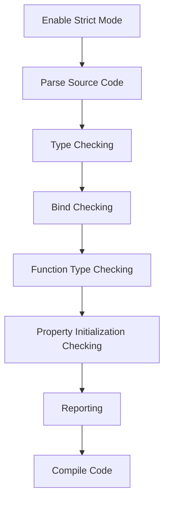

## Introduction
**Strict Mode** is a feature in TypeScript that helps developers catch errors and improve code quality by enabling additional checks and warnings. It is a crucial concept in TypeScript, as it allows developers to write more robust and maintainable code. In this article, we will delve into the internal workings of Strict Mode, exploring its core concepts, under-the-hood mechanics, and providing code examples to illustrate its usage.

## Core Concepts
**Strict Mode** is enabled by adding the `"strict": true` option to the `tsconfig.json` file. This enables a set of additional checks and warnings, including:
* **No implicit any**: TypeScript will not infer the `any` type for variables, functions, or parameters.
* **No implicit null**: TypeScript will not allow `null` or `undefined` values to be assigned to variables or parameters.
* **Strict bind**: TypeScript will check the types of `this` and `super` in classes and interfaces.
* **Strict function types**: TypeScript will check the types of function parameters and return types.
* **Strict property initialization**: TypeScript will check that class properties are initialized before they are used.

> **Note:** Enabling Strict Mode can help catch errors early in the development process, reducing the likelihood of runtime errors and improving overall code quality.

## How It Works Internally
When Strict Mode is enabled, the TypeScript compiler performs additional checks and warnings during the compilation process. Here is a step-by-step breakdown of how it works:
1. **Parsing**: The TypeScript compiler parses the source code into an abstract syntax tree (AST).
2. **Type checking**: The TypeScript compiler performs type checking on the AST, including checks for implicit `any` and `null` types.
3. **Bind checking**: The TypeScript compiler checks the types of `this` and `super` in classes and interfaces.
4. **Function type checking**: The TypeScript compiler checks the types of function parameters and return types.
5. **Property initialization checking**: The TypeScript compiler checks that class properties are initialized before they are used.
6. **Reporting**: The TypeScript compiler reports any errors or warnings found during the checking process.

## Code Examples
### Example 1: Basic Strict Mode
```typescript
// tsconfig.json
{
  "compilerOptions": {
    "strict": true
  }
}

// example.ts
let x: number = 10;
console.log(x);
```
In this example, we enable Strict Mode in the `tsconfig.json` file and define a simple `example.ts` file. The TypeScript compiler will perform additional checks and warnings on this code, including checking for implicit `any` and `null` types.

### Example 2: Strict Mode with Classes
```typescript
// tsconfig.json
{
  "compilerOptions": {
    "strict": true
  }
}

// example.ts
class Person {
  private name: string;

  constructor(name: string) {
    this.name = name;
  }

  public getName(): string {
    return this.name;
  }
}

const person = new Person('John Doe');
console.log(person.getName());
```
In this example, we define a `Person` class with a `name` property and a `getName` method. The TypeScript compiler will perform additional checks and warnings on this code, including checking for implicit `any` and `null` types, as well as checking the types of `this` and `super`.

### Example 3: Strict Mode with Function Types
```typescript
// tsconfig.json
{
  "compilerOptions": {
    "strict": true
  }
}

// example.ts
function add(x: number, y: number): number {
  return x + y;
}

console.log(add(10, 20));
```
In this example, we define an `add` function with `number` parameters and a `number` return type. The TypeScript compiler will perform additional checks and warnings on this code, including checking the types of function parameters and return types.

## Visual Diagram

> **Tip:** Enabling Strict Mode can help improve code quality and reduce the likelihood of runtime errors.

## Comparison
| Approach | Time Complexity | Space Complexity | Pros | Cons | Best For |
| --- | --- | --- | --- | --- | --- |
| Strict Mode | O(n) | O(n) | Improves code quality, reduces runtime errors | Can be verbose, requires additional configuration | Large-scale applications, enterprise development |
| Linting | O(n) | O(n) | Improves code style, detects potential issues | Can be noisy, requires additional configuration | Small-scale applications, personal projects |
| Code Review | O(n) | O(1) | Improves code quality, detects potential issues | Can be time-consuming, requires human effort | Critical components, high-risk applications |
| Testing | O(n) | O(1) | Improves code quality, detects potential issues | Can be time-consuming, requires additional infrastructure | Critical components, high-risk applications |

## Real-world Use Cases
* **Microsoft**: Uses TypeScript with Strict Mode for large-scale applications, such as Visual Studio Code.
* **Google**: Uses TypeScript with Strict Mode for large-scale applications, such as Google Cloud Platform.
* **Airbnb**: Uses TypeScript with Strict Mode for large-scale applications, such as their web platform.

> **Warning:** Disabling Strict Mode can lead to runtime errors and decreased code quality.

## Common Pitfalls
* **Implicit any**: Forgetting to specify types for variables, functions, or parameters can lead to implicit `any` types.
* **Implicit null**: Forgetting to specify null checks for variables or parameters can lead to runtime errors.
* **Strict bind**: Forgetting to specify `this` and `super` types in classes and interfaces can lead to runtime errors.
* **Strict function types**: Forgetting to specify function parameter and return types can lead to runtime errors.

```typescript
// Wrong: Implicit any
let x = 10;

// Right: Explicit type
let x: number = 10;
```

## Interview Tips
* **What is Strict Mode?**: A feature in TypeScript that enables additional checks and warnings to improve code quality.
* **How does Strict Mode work?**: Enables additional checks and warnings during the compilation process, including type checking, bind checking, function type checking, and property initialization checking.
* **Why is Strict Mode important?**: Improves code quality, reduces runtime errors, and improves maintainability.

> **Interview:** Be prepared to explain the benefits and drawbacks of using Strict Mode in TypeScript, as well as how to enable and configure it.

## Key Takeaways
* **Enable Strict Mode**: To improve code quality and reduce runtime errors.
* **Understand core concepts**: Including implicit `any` and `null` types, bind checking, function type checking, and property initialization checking.
* **Use type annotations**: To specify explicit types for variables, functions, and parameters.
* **Use interfaces**: To define contracts for classes and objects.
* **Use classes**: To define reusable, modular code.
* **Test and review code**: To ensure code quality and detect potential issues.
* **Use linters and code formatters**: To improve code style and detect potential issues.
* **Follow best practices**: To write maintainable, efficient code.