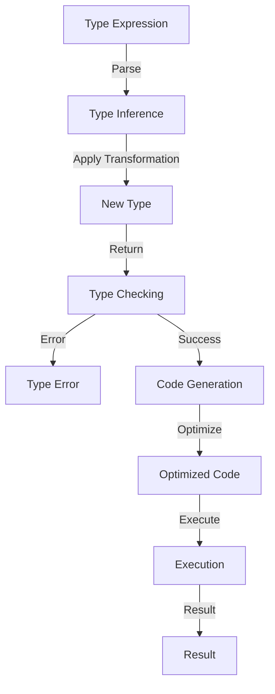

## Introduction
**Utility Types** are a powerful feature in TypeScript that enables developers to create reusable type transformations. They are essential in any TypeScript project, as they help simplify complex type definitions and improve code maintainability. In this article, we will delve into the world of utility types, exploring their core concepts, internal mechanics, and performance comparisons with alternative approaches. We will also examine real-world use cases, common pitfalls, and interview tips to help you master utility types.

> **Note:** Utility types are not unique to TypeScript; other programming languages, such as Scala and Rust, also have similar concepts.

## Core Concepts
At its core, a utility type is a type that takes another type as an argument and returns a new type. This allows developers to create reusable type transformations that can be applied to various types. The most common utility types in TypeScript are:
* `Partial<T>`: Returns a type with all properties of `T` set to optional.
* `Readonly<T>`: Returns a type with all properties of `T` set to readonly.
* `Pick<T, K>`: Returns a type with a subset of properties from `T`, selected by `K`.

> **Tip:** Utility types can be combined to create more complex type transformations. For example, `Partial<Readonly<T>>` returns a type with all properties of `T` set to readonly and optional.

## How It Works Internally
When you use a utility type, TypeScript creates a new type by applying the transformation to the original type. This process is called **type inference**. The type inference algorithm works as follows:
1. Parse the type expression: TypeScript breaks down the type expression into its constituent parts, such as the utility type and the type argument.
2. Apply the transformation: TypeScript applies the transformation defined by the utility type to the type argument.
3. Return the new type: The resulting type is returned and can be used in the code.

> **Warning:** Type inference can be computationally expensive, especially for complex type expressions. This can lead to performance issues in large projects.

## Code Examples
### Example 1: Basic Usage
```typescript
// Define a type
type Person = {
  name: string;
  age: number;
};

// Use the Partial utility type
type PartialPerson = Partial<Person>;

// Create an object with partial properties
const partialPerson: PartialPerson = {
  name: 'John',
};

console.log(partialPerson); // Output: { name: 'John' }
```
### Example 2: Real-World Pattern
```typescript
// Define a type for a user
type User = {
  id: number;
  name: string;
  email: string;
};

// Create a readonly version of the User type
type ReadonlyUser = Readonly<User>;

// Create an array of readonly users
const users: ReadonlyUser[] = [
  { id: 1, name: 'John', email: 'john@example.com' },
  { id: 2, name: 'Jane', email: 'jane@example.com' },
];

// Attempt to modify a user (will result in a TypeScript error)
// users[0].name = 'Jim';
```
### Example 3: Advanced Usage
```typescript
// Define a type for a rectangle
type Rectangle = {
  x: number;
  y: number;
  width: number;
  height: number;
};

// Create a type for a rectangle with optional properties
type OptionalRectangle = Partial<Rectangle>;

// Create an object with optional properties
const optionalRectangle: OptionalRectangle = {
  x: 10,
  y: 20,
};

console.log(optionalRectangle); // Output: { x: 10, y: 20 }
```
## Visual Diagram

The diagram illustrates the type inference process, from parsing the type expression to executing the optimized code.

## Comparison
| Approach | Time Complexity | Space Complexity | Pros | Cons | Best For |
| --- | --- | --- | --- | --- | --- |
| Utility Types | O(1) | O(1) | Reusable, maintainable, and efficient | Limited flexibility, may require additional type definitions | Simple type transformations |
| Type Guards | O(n) | O(n) | Flexible and powerful | Verbose, may require additional type definitions | Complex type transformations |
| Type Assertions | O(1) | O(1) | Simple and efficient | May lead to type errors, limited flexibility | Simple type transformations |
| Interface Extensions | O(n) | O(n) | Flexible and powerful | Verbose, may require additional type definitions | Complex type transformations |

> **Interview:** Can you explain the difference between utility types and type guards? How would you choose between them in a real-world project?

## Real-world Use Cases
1. **Google's Angular Framework**: Uses utility types to define reusable type transformations for Angular components.
2. **Microsoft's TypeScript**: Uses utility types to define reusable type transformations for TypeScript itself.
3. **Facebook's React**: Uses utility types to define reusable type transformations for React components.

## Common Pitfalls
1. **Incorrect Type Argument**: Passing an incorrect type argument to a utility type can result in a type error.
```typescript
// Incorrect type argument
type IncorrectType = Partial<number>;
```
2. **Missing Type Definitions**: Failing to define a type definition for a utility type can result in a type error.
```typescript
// Missing type definition
type MissingType = Readonly<T>;
```
3. **Type Inference Issues**: Type inference can be computationally expensive and may lead to performance issues.
```typescript
// Type inference issue
type ComplexType = Partial<Readonly<T>>;
```
4. **Utility Type Overuse**: Overusing utility types can lead to complex and maintainability issues.
```typescript
// Utility type overuse
type OverusedType = Partial<Readonly<Pick<T, 'x' | 'y'>>>;
```
## Interview Tips
1. **Explain the difference between utility types and type guards**. Utility types are reusable type transformations, while type guards are functions that narrow the type of a value.
2. **Describe a real-world use case for utility types**. For example, using utility types to define reusable type transformations for a web application.
3. **Write an example of a utility type**. For example, defining a `Partial<T>` utility type to create a type with all properties of `T` set to optional.

## Key Takeaways
* Utility types are reusable type transformations that can simplify complex type definitions.
* Type inference is the process of applying a transformation to a type, and it can be computationally expensive.
* Utility types have a time complexity of O(1) and a space complexity of O(1).
* Type guards have a time complexity of O(n) and a space complexity of O(n).
* Utility types are best used for simple type transformations, while type guards are best used for complex type transformations.
* Incorrect type arguments, missing type definitions, type inference issues, and utility type overuse are common pitfalls to avoid when using utility types.
* Real-world use cases for utility types include Google's Angular Framework, Microsoft's TypeScript, and Facebook's React.