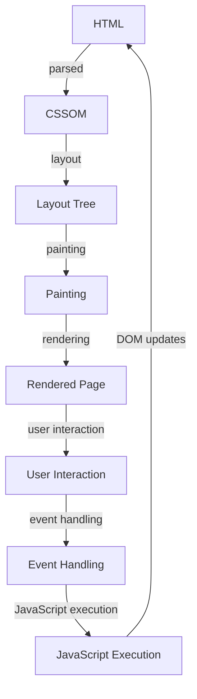

## Introduction
**CSS (Cascading Style Sheets)** is a styling language used to control the layout and presentation of web pages. It is a crucial component of the web development process, allowing developers to separate the presentation layer from the content layer (HTML) and behavior layer (JavaScript). CSS is essential for creating visually appealing, user-friendly, and responsive web applications. Every engineer should have a solid understanding of CSS, as it is a fundamental building block of the web.

> **Note:** CSS is not a programming language, but rather a styling language that provides a way to describe the presentation of a document written in a markup language, such as HTML or XML.

## Core Concepts
To understand CSS, it is essential to grasp the following core concepts:
* **Selectors**: Used to target specific elements on a web page, such as `h1`, `p`, or `.class`.
* **Properties**: Define the characteristics of an element, such as `color`, `font-size`, or `background-color`.
* **Values**: Specify the value of a property, such as `red`, `16px`, or `#ffffff`.
* **Rules**: Consist of a selector and a declaration block, which contains one or more property-value pairs.
* **Box Model**: Describes the structure of an HTML element, including its content, padding, border, and margin.

> **Warning:** Not understanding the box model can lead to layout issues and difficulty in positioning elements on a web page.

## How It Works Internally
When a web page is loaded, the browser's rendering engine (such as Blink or Gecko) parses the HTML and CSS files. The CSS parser breaks down the CSS rules into individual selectors, properties, and values. The browser then applies these styles to the corresponding HTML elements.

Here is a step-by-step breakdown of the process:
1. **Parsing**: The browser parses the HTML and CSS files.
2. **Tokenization**: The CSS parser breaks down the CSS rules into individual tokens, such as selectors, properties, and values.
3. **Tree construction**: The browser constructs a tree-like data structure, known as the **CSS Object Model (CSSOM)**, which represents the CSS rules and their relationships.
4. **Layout**: The browser calculates the layout of each element, taking into account the CSS styles, element sizes, and positioning.
5. **Painting**: The browser paints the elements on the screen, using the calculated layout and CSS styles.

> **Tip:** Understanding how CSS works internally can help you optimize your CSS code and improve page performance.

## Code Examples
### Example 1: Basic CSS
```css
/* Basic CSS example */
body {
  /* Set the background color to light gray */
  background-color: #f2f2f2;
}

h1 {
  /* Set the font size to 36px and color to dark blue */
  font-size: 36px;
  color: #03055b;
}
```
This example demonstrates basic CSS syntax and selectors.

### Example 2: Responsive Design
```css
/* Responsive design example */
@media (max-width: 768px) {
  /* On small screens, set the font size to 24px */
  body {
    font-size: 24px;
  }
}

@media (min-width: 1024px) {
  /* On large screens, set the font size to 36px */
  body {
    font-size: 36px;
  }
}
```
This example shows how to use media queries to create responsive designs.

### Example 3: Advanced CSS (Grid Layout)
```css
/* Advanced CSS example (grid layout) */
.grid-container {
  /* Create a grid container with 3 columns and 2 rows */
  display: grid;
  grid-template-columns: repeat(3, 1fr);
  grid-template-rows: repeat(2, 1fr);
  gap: 10px;
}

.grid-item {
  /* Style each grid item */
  background-color: #cccccc;
  padding: 20px;
  border: 1px solid #aaaaaa;
}
```
This example demonstrates advanced CSS techniques, such as grid layout.

## Visual Diagram

This diagram illustrates the process of how CSS is applied to an HTML document, from parsing to rendering.

> **Interview:** Can you explain how CSS is applied to an HTML document? What is the difference between the CSSOM and the DOM?

## Comparison
| CSS Framework | Time Complexity | Space Complexity | Pros | Cons | Best For |
| --- | --- | --- | --- | --- | --- |
| Bootstrap | O(1) | O(n) | Easy to use, responsive, large community | Steep learning curve, large bundle size | Large-scale applications |
| Tailwind CSS | O(n) | O(1) | Highly customizable, utility-first approach | Limited support for older browsers | Small to medium-sized applications |
| CSS Grid | O(1) | O(1) | Powerful layout system, easy to use | Limited support for older browsers | Complex layouts, responsive designs |
| Flexbox | O(1) | O(1) | Flexible layout system, easy to use | Limited support for older browsers | Simple layouts, responsive designs |

## Real-world Use Cases
1. **Google**: Uses a custom CSS framework to style their web applications, including Google Search and Google Maps.
2. **Facebook**: Uses a combination of CSS frameworks, including Bootstrap and React CSS, to style their web applications.
3. **Airbnb**: Uses a custom CSS framework, built on top of CSS Grid and Flexbox, to style their web application.

> **Tip:** Use a CSS framework or a combination of frameworks to simplify your styling process and improve maintainability.

## Common Pitfalls
1. **Overusing `!important`**: Using `!important` can make it difficult to override styles and lead to specificity issues.
```css
/* Wrong way */
body {
  background-color: #f2f2f2 !important;
}

/* Right way */
body {
  background-color: #f2f2f2;
}
```
2. **Not using a preprocessor**: Not using a preprocessor, such as Sass or Less, can make it difficult to manage complex CSS codebases.
```css
/* Wrong way */
.css {
  background-color: #f2f2f2;
  padding: 20px;
  border: 1px solid #aaaaaa;
}

/* Right way (using Sass) */
.css {
  @include background-color(#f2f2f2);
  @include padding(20px);
  @include border(1px, solid, #aaaaaa);
}
```
3. **Not optimizing CSS for performance**: Not optimizing CSS for performance can lead to slow page loads and poor user experience.
```css
/* Wrong way */
.css {
  background-image: url('large-image.jpg');
}

/* Right way */
.css {
  background-image: url('small-image.jpg');
  background-size: cover;
}
```
4. **Not using CSS best practices**: Not using CSS best practices, such as using meaningful class names and avoiding inline styles, can make it difficult to maintain and update CSS codebases.
```css
/* Wrong way */
<div style="background-color: #f2f2f2; padding: 20px;">Hello World!</div>

/* Right way */
<div class="hello-world">Hello World!</div>
```
## Interview Tips
1. **What is the difference between `display: block` and `display: inline`?**: A strong answer would explain the difference between block-level and inline elements, including how they affect layout and spacing.
2. **How do you optimize CSS for performance?**: A strong answer would discuss techniques such as minifying CSS, using CSS sprites, and optimizing images.
3. **What is the difference between `position: absolute` and `position: relative`?**: A strong answer would explain the difference between absolute and relative positioning, including how they affect the layout and positioning of elements.

> **Interview:** Can you explain the difference between `display: block` and `display: inline`? How would you optimize CSS for performance?

## Key Takeaways
* **CSS is a styling language**: Used to control the layout and presentation of web pages.
* **Selectors are used to target elements**: Such as `h1`, `p`, or `.class`.
* **Properties define characteristics**: Such as `color`, `font-size`, or `background-color`.
* **Values specify the value of a property**: Such as `red`, `16px`, or `#ffffff`.
* **The box model describes the structure of an element**: Including content, padding, border, and margin.
* **CSS frameworks can simplify styling**: Such as Bootstrap, Tailwind CSS, or CSS Grid.
* **Optimizing CSS for performance is crucial**: Techniques include minifying CSS, using CSS sprites, and optimizing images.
* **Using meaningful class names and avoiding inline styles is best practice**: For maintainable and updateable CSS codebases.
* **Understanding CSS best practices is essential**: For creating efficient, maintainable, and scalable CSS codebases.