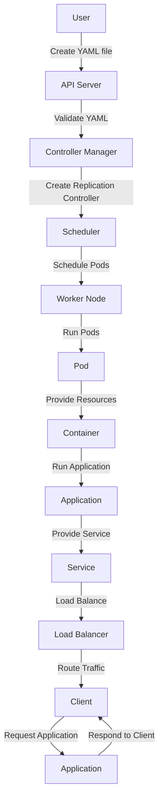

## Introduction
**Container Orchestration**, also known as **Kubernetes**, is a crucial concept in modern software development. It refers to the process of managing and coordinating the deployment, scaling, and maintenance of containers in a distributed system. In other words, it's a way to automate the deployment, scaling, and management of applications that are packaged in containers. This is particularly important in today's cloud-native and microservices-based architectures, where multiple containers need to work together to provide a seamless user experience.

> **Note:** Container Orchestration is not limited to Kubernetes alone, but Kubernetes is the most widely used and popular container orchestration tool.

Kubernetes provides a platform-agnostic way to deploy, manage, and scale applications. It supports a wide range of container runtimes, including Docker, rkt, and cri-o. With Kubernetes, you can deploy your application on a variety of environments, including on-premises, cloud, and hybrid environments.

## Core Concepts
To understand Kubernetes, you need to grasp some key concepts:

* **Pods**: The basic execution unit in Kubernetes. A pod represents a logical host for one or more containers.
* **ReplicaSets**: Ensure a specified number of replicas (i.e., copies) of a pod are running at any given time.
* **Deployments**: Manage the rollout of new versions of an application.
* **Services**: Provide a network identity and load balancing for accessing a group of pods.
* **Persistent Volumes**: Provide persistent storage for data that needs to be preserved across pod restarts.

> **Warning:** Understanding these core concepts is crucial to successfully deploying and managing applications with Kubernetes.

## How It Works Internally
Kubernetes consists of several components that work together to manage the lifecycle of containers:

1. **API Server**: The central component that handles all REST requests to the Kubernetes cluster.
2. **Controller Manager**: Runs and manages the control plane components, such as the replication controller and the deployment controller.
3. **Scheduler**: Responsible for scheduling pods on available nodes in the cluster.
4. **Worker Nodes**: Run the pods and provide the necessary resources, such as CPU and memory.

Here's a step-by-step overview of how Kubernetes works internally:

1. The user creates a deployment YAML file that defines the desired state of the application.
2. The user applies the YAML file to the Kubernetes cluster using the `kubectl` command-line tool.
3. The API server receives the request and validates the YAML file.
4. The controller manager creates a replication controller to manage the desired number of replicas.
5. The scheduler schedules the pods on available nodes in the cluster.
6. The worker nodes run the pods and provide the necessary resources.

## Code Examples
### Example 1: Basic Deployment
```yml
# deployment.yaml
apiVersion: apps/v1
kind: Deployment
metadata:
  name: hello-world
spec:
  replicas: 3
  selector:
    matchLabels:
      app: hello-world
  template:
    metadata:
      labels:
        app: hello-world
    spec:
      containers:
      - name: hello-world
        image: gcr.io/google-samples/node-hello:1.0
        ports:
        - containerPort: 8080
```
This YAML file defines a basic deployment with 3 replicas of a pod running the `node-hello` image.

### Example 2: Real-World Deployment
```yml
# deployment.yaml
apiVersion: apps/v1
kind: Deployment
metadata:
  name: web-server
spec:
  replicas: 5
  selector:
    matchLabels:
      app: web-server
  template:
    metadata:
      labels:
        app: web-server
    spec:
      containers:
      - name: web-server
        image: nginx:latest
        ports:
        - containerPort: 80
        volumeMounts:
        - name: config
          mountPath: /etc/nginx/conf.d
      volumes:
      - name: config
        configMap:
          name: nginx-config
```
This YAML file defines a deployment with 5 replicas of a pod running the `nginx` image, with a volume mounted for configuration files.

### Example 3: Advanced Deployment with Rolling Update
```yml
# deployment.yaml
apiVersion: apps/v1
kind: Deployment
metadata:
  name: web-server
spec:
  replicas: 5
  selector:
    matchLabels:
      app: web-server
  template:
    metadata:
      labels:
        app: web-server
    spec:
      containers:
      - name: web-server
        image: nginx:latest
        ports:
        - containerPort: 80
        volumeMounts:
        - name: config
          mountPath: /etc/nginx/conf.d
      volumes:
      - name: config
        configMap:
          name: nginx-config
  strategy:
    type: RollingUpdate
    rollingUpdate:
      maxSurge: 1
      maxUnavailable: 1
```
This YAML file defines a deployment with a rolling update strategy, which allows for zero-downtime updates.

## Visual Diagram

This diagram illustrates the high-level workflow of Kubernetes, from the user creating a YAML file to the application responding to client requests.

## Comparison
| Orchestration Tool | Time Complexity | Space Complexity | Pros | Cons | Best For |
| --- | --- | --- | --- | --- | --- |
| Kubernetes | O(n) | O(n) | Highly scalable, flexible, and extensible | Steep learning curve, complex to manage | Large-scale, distributed applications |
| Docker Swarm | O(n) | O(n) | Easy to use, simple to manage | Limited scalability, less flexible | Small-scale, containerized applications |
| Apache Mesos | O(n) | O(n) | Highly scalable, flexible, and fault-tolerant | Complex to manage, resource-intensive | Large-scale, distributed applications |
| Amazon ECS | O(n) | O(n) | Highly scalable, secure, and managed | Limited flexibility, vendor lock-in | Large-scale, containerized applications on AWS |

## Real-world Use Cases
1. **Netflix**: Uses Kubernetes to manage and orchestrate its containerized applications, ensuring high availability and scalability.
2. **Google**: Uses Kubernetes to manage and orchestrate its containerized applications, including Google Search and Google Maps.
3. **Red Hat**: Uses Kubernetes to manage and orchestrate its containerized applications, including OpenShift and Red Hat Enterprise Linux.

## Common Pitfalls
1. **Insufficient Resources**: Failing to provide sufficient resources (e.g., CPU, memory) to the worker nodes, leading to performance issues and crashes.
2. **Incorrect Configuration**: Incorrectly configuring the deployment YAML file, leading to errors and misbehaviors.
3. **Inadequate Monitoring**: Failing to monitor the application and cluster, leading to undetected issues and downtime.
4. **Insecure Configuration**: Failing to secure the cluster and application, leading to security vulnerabilities and breaches.

## Interview Tips
1. **What is Kubernetes?**: A weak answer might simply define Kubernetes as a container orchestration tool, while a strong answer would explain its purpose, benefits, and use cases.
2. **How does Kubernetes work?**: A weak answer might provide a high-level overview, while a strong answer would explain the internal mechanics, including the API server, controller manager, and scheduler.
3. **What are some common use cases for Kubernetes?**: A weak answer might list a few examples, while a strong answer would provide detailed explanations of real-world use cases, including Netflix and Google.

## Key Takeaways
* Kubernetes is a container orchestration tool that automates the deployment, scaling, and management of containerized applications.
* Kubernetes consists of several components, including the API server, controller manager, and scheduler.
* Kubernetes provides a platform-agnostic way to deploy and manage applications, supporting a wide range of container runtimes and environments.
* Kubernetes is highly scalable, flexible, and extensible, making it suitable for large-scale, distributed applications.
* Kubernetes has a steep learning curve and can be complex to manage, requiring careful planning and configuration.
* Kubernetes is widely used in production environments, including Netflix, Google, and Red Hat.
* Kubernetes provides a range of features, including rolling updates, self-healing, and resource management.
* Kubernetes has a large and active community, with many resources available for learning and troubleshooting.