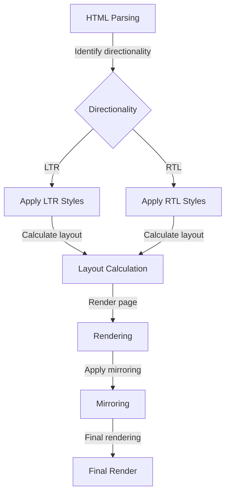

## Introduction
The direction of text and layout is a crucial aspect of web development, particularly when it comes to supporting multiple languages and regions. **Right-to-Left (RTL)** and **Left-to-Right (LTR)** are two fundamental concepts that determine how text and other elements are arranged on a web page. In this section, we will delve into the world of RTL and LTR, exploring their differences, importance, and real-world relevance. 
> **Note:** Understanding the basics of RTL and LTR is essential for developing websites that cater to a global audience, as it directly impacts the user experience and accessibility.

## Core Concepts
To grasp the concept of RTL and LTR, it's essential to understand the following key terms:
- **Directionality**: Refers to the direction in which text is written, either from left to right (LTR) or right to left (RTL).
- **Text alignment**: The way text is aligned within its container, which can be left, right, center, or justified.
- **Mirroring**: The process of flipping the layout of an element or a group of elements to accommodate RTL languages.
- **Bidi** (Bidirectional): A term used to describe the ability of a system to handle both LTR and RTL text simultaneously.

## How It Works Internally
When a web page is rendered, the browser follows a series of steps to determine the directionality of the text:
1. **HTML parsing**: The browser parses the HTML document and identifies the directionality of the text based on the `dir` attribute or the language specified in the `lang` attribute.
2. **CSS styling**: The browser applies CSS styles to the elements, taking into account the directionality of the text.
3. **Layout calculation**: The browser calculates the layout of the elements, considering factors like text alignment, padding, and margin.
4. **Rendering**: The final step, where the browser renders the web page, applying the calculated layout and directionality.

## Code Examples
### Example 1: Basic RTL Support
```html
<!-- index.html -->
<!DOCTYPE html>
<html dir="rtl" lang="ar">
<head>
    <title>RTL Example</title>
</head>
<body>
    <h1>مرحبا بالعالم</h1>
</body>
</html>
```
This example demonstrates how to create a basic RTL web page using the `dir` attribute.

### Example 2: Using CSS for RTL Support
```css
/* styles.css */
body {
    direction: rtl;
    text-align: right;
}

/* Override for LTR elements */
.ltr {
    direction: ltr;
    text-align: left;
}
```
```html
<!-- index.html -->
<!DOCTYPE html>
<html>
<head>
    <title>RTL Example</title>
    <link rel="stylesheet" href="styles.css">
</head>
<body>
    <h1>مرحبا بالعالم</h1>
    <p class="ltr">This is an LTR paragraph</p>
</body>
</html>
```
This example shows how to use CSS to apply RTL styles to a web page and override them for specific elements.

### Example 3: Advanced RTL Support with JavaScript
```javascript
// script.js
function applyRtlStyles() {
    const rtlElements = document.querySelectorAll('[dir="rtl"]');
    rtlElements.forEach((element) => {
        element.style.direction = 'rtl';
        element.style.textAlign = 'right';
    });
}

applyRtlStyles();
```
```html
<!-- index.html -->
<!DOCTYPE html>
<html>
<head>
    <title>RTL Example</title>
</head>
<body>
    <h1 dir="rtl">مرحبا بالعالم</h1>
    <script src="script.js"></script>
</body>
</html>
```
This example demonstrates how to use JavaScript to dynamically apply RTL styles to elements with the `dir` attribute set to "rtl".

## Visual Diagram

This diagram illustrates the internal process of rendering a web page with RTL support.

## Comparison
| Approach | Time Complexity | Space Complexity | Pros | Cons | Best For |
| --- | --- | --- | --- | --- | --- |
| Using `dir` attribute | O(1) | O(1) | Simple and straightforward | Limited control over styling | Basic RTL support |
| Using CSS | O(n) | O(n) | More control over styling | Can be verbose | Advanced RTL support |
| Using JavaScript | O(n) | O(n) | Dynamic styling and control | Can be complex | Complex RTL scenarios |

## Real-world Use Cases
1. **Google Translate**: Google Translate supports RTL languages, allowing users to translate text from LTR languages to RTL languages and vice versa.
2. **Facebook**: Facebook provides RTL support for its interface, allowing users to switch between LTR and RTL languages.
3. **Wikipedia**: Wikipedia supports RTL languages, allowing users to create and edit articles in RTL languages.

## Common Pitfalls
1. **Insufficient testing**: Failing to test RTL support thoroughly can lead to broken layouts and usability issues.
2. **Inconsistent styling**: Using inconsistent styling for RTL elements can result in a disjointed user experience.
3. **Lack of mirroring**: Failing to apply mirroring to RTL elements can cause layout issues and usability problems.
4. **Incorrect directionality**: Incorrectly setting the directionality of text can lead to readability issues and confusion.

## Interview Tips
1. **What is the difference between RTL and LTR?**: A strong answer should explain the fundamental difference between RTL and LTR, including directionality and text alignment.
2. **How do you implement RTL support in a web page?**: A weak answer might only mention using the `dir` attribute, while a strong answer should discuss using CSS and JavaScript for more control over styling.
3. **What are some common pitfalls when implementing RTL support?**: A strong answer should highlight the importance of testing, consistent styling, and correct directionality.

## Key Takeaways
* **RTL and LTR are fundamental concepts** in web development, impacting text directionality and layout.
* **Directionality is determined** by the `dir` attribute, `lang` attribute, or CSS styling.
* **Mirroring is essential** for RTL support, ensuring correct layout and usability.
* **Testing is crucial** for ensuring RTL support works correctly and consistently.
* **CSS and JavaScript** can be used to apply RTL styles and control directionality dynamically.
* **Common pitfalls** include insufficient testing, inconsistent styling, lack of mirroring, and incorrect directionality.
* **Real-world use cases** include Google Translate, Facebook, and Wikipedia, which all support RTL languages.