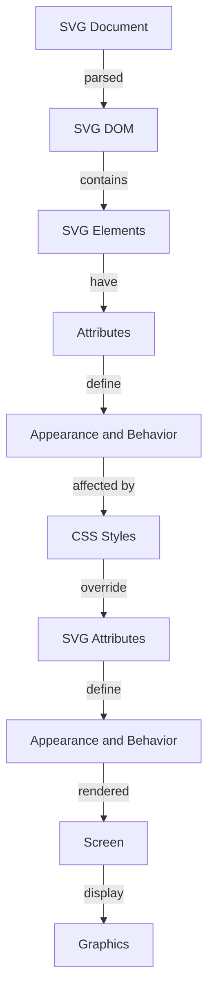

## Introduction
**SVG (Scalable Vector Graphics)** is a markup language used to create two-dimensional vector graphics. It's based on XML and can be used to create a wide range of graphics, from simple icons to complex diagrams. SVG is widely used on the web due to its scalability, flexibility, and ability to be manipulated using JavaScript. In this section, we'll explore the basics of SVG and its relevance in web development.

> **Note:** SVG is not a replacement for raster graphics (like PNG or JPEG), but rather a complementary technology that offers unique advantages.

## Core Concepts
To work with SVG, you need to understand the following core concepts:

* **SVG Elements**: These are the basic building blocks of SVG, such as `circle`, `rect`, `path`, and `text`. Each element has its own set of attributes that define its appearance and behavior.
* **SVG Attributes**: These are used to customize the appearance and behavior of SVG elements. For example, the `fill` attribute sets the fill color of an element, while the `stroke` attribute sets the color of its outline.
* **SVG DOM**: The SVG DOM (Document Object Model) is a programming interface that allows you to manipulate SVG elements and attributes using JavaScript.

> **Warning:** When working with SVG, it's essential to understand the difference between SVG elements and HTML elements. While both can be manipulated using JavaScript, they have distinct APIs and behaviors.

## How It Works Internally
When an SVG document is loaded into a web page, the browser parses the SVG markup and creates a DOM representation of the graphics. The SVG DOM is a hierarchical structure that reflects the relationships between SVG elements. For example, an `svg` element may contain multiple `circle` elements, each with its own set of attributes.

Here's a step-by-step overview of how the SVG DOM works:

1. **Parsing**: The browser parses the SVG markup and creates a DOM representation of the graphics.
2. **Element creation**: The browser creates SVG elements, such as `circle` or `rect`, and adds them to the DOM.
3. **Attribute setting**: The browser sets the attributes of each SVG element, such as `fill` or `stroke`.
4. **Layout and rendering**: The browser lays out the SVG elements and renders them on the screen.

> **Tip:** To optimize SVG rendering, use the `viewBox` attribute to define the coordinate system of the SVG document. This can help improve performance and reduce the amount of computation required to render the graphics.

## Code Examples
Here are three complete and runnable code examples that demonstrate basic to advanced SVG DOM manipulation:

### Example 1: Basic SVG DOM manipulation
```javascript
// Create an SVG element
const svg = document.createElementNS("http://www.w3.org/2000/svg", "svg");
svg.setAttribute("width", "100");
svg.setAttribute("height", "100");

// Create a circle element
const circle = document.createElementNS("http://www.w3.org/2000/svg", "circle");
circle.setAttribute("cx", "50");
circle.setAttribute("cy", "50");
circle.setAttribute("r", "40");
circle.setAttribute("fill", "red");

// Add the circle to the SVG element
svg.appendChild(circle);

// Add the SVG element to the page
document.body.appendChild(svg);
```

### Example 2: Real-world SVG DOM manipulation
```javascript
// Create an SVG element
const svg = document.createElementNS("http://www.w3.org/2000/svg", "svg");
svg.setAttribute("width", "400");
svg.setAttribute("height", "200");

// Create a rectangle element
const rect = document.createElementNS("http://www.w3.org/2000/svg", "rect");
rect.setAttribute("x", "10");
rect.setAttribute("y", "10");
rect.setAttribute("width", "100");
rect.setAttribute("height", "50");
rect.setAttribute("fill", "blue");

// Create a text element
const text = document.createElementNS("http://www.w3.org/2000/svg", "text");
text.setAttribute("x", "120");
text.setAttribute("y", "30");
text.textContent = "Hello World!";

// Add the rectangle and text to the SVG element
svg.appendChild(rect);
svg.appendChild(text);

// Add the SVG element to the page
document.body.appendChild(svg);
```

### Example 3: Advanced SVG DOM manipulation
```javascript
// Create an SVG element
const svg = document.createElementNS("http://www.w3.org/2000/svg", "svg");
svg.setAttribute("width", "600");
svg.setAttribute("height", "400");

// Create a path element
const path = document.createElementNS("http://www.w3.org/2000/svg", "path");
path.setAttribute("d", "M 100 100 L 200 200 L 300 100 Z");
path.setAttribute("fill", "green");
path.setAttribute("stroke", "black");
path.setAttribute("stroke-width", "2");

// Create a circle element
const circle = document.createElementNS("http://www.w3.org/2000/svg", "circle");
circle.setAttribute("cx", "250");
circle.setAttribute("cy", "150");
circle.setAttribute("r", "50");
circle.setAttribute("fill", "yellow");

// Add the path and circle to the SVG element
svg.appendChild(path);
svg.appendChild(circle);

// Add the SVG element to the page
document.body.appendChild(svg);
```

## Visual Diagram

The diagram illustrates the relationship between the SVG document, SVG DOM, SVG elements, attributes, and CSS styles. It shows how the SVG DOM is created by parsing the SVG document and how the attributes of SVG elements define their appearance and behavior.

## Comparison
| Approach | Time Complexity | Space Complexity | Pros | Cons | Best For |
| --- | --- | --- | --- | --- | --- |
| SVG DOM manipulation | O(1) | O(n) | Flexible, dynamic, and interactive | Steeper learning curve, may require additional libraries | Complex graphics and animations |
| Canvas API | O(1) | O(n) | Fast, efficient, and easy to use | Limited functionality, less flexible | Simple graphics and games |
| CSS animations | O(1) | O(1) | Easy to use, simple, and efficient | Limited functionality, may not be suitable for complex graphics | Simple animations and transitions |
| Raster graphics | O(1) | O(1) | Easy to use, simple, and efficient | Limited scalability, may not be suitable for complex graphics | Simple graphics and icons |

## Real-world Use Cases
Here are three real-world examples of SVG DOM manipulation in production:

1. **Google Maps**: Google Maps uses SVG to render maps and display interactive graphics.
2. **Facebook**: Facebook uses SVG to display interactive graphics and animations on its platform.
3. **Wikipedia**: Wikipedia uses SVG to display interactive diagrams and graphics in its articles.

> **Interview:** Can you explain the difference between SVG and Canvas? How would you choose between the two for a particular project?

## Common Pitfalls
Here are four common mistakes to avoid when working with SVG DOM manipulation:

1. **Not using the correct namespace**: When creating SVG elements, it's essential to use the correct namespace (`http://www.w3.org/2000/svg`) to avoid errors.
2. **Not setting the `viewBox` attribute**: The `viewBox` attribute defines the coordinate system of the SVG document. Not setting it can lead to unexpected behavior and rendering issues.
3. **Not using the `preserveAspectRatio` attribute**: The `preserveAspectRatio` attribute defines how the SVG document should be scaled and aligned within its container. Not using it can lead to distorted graphics.
4. **Not using the `xmlns` attribute**: The `xmlns` attribute defines the namespace of the SVG document. Not using it can lead to errors and rendering issues.

## Interview Tips
Here are three common interview questions related to SVG DOM manipulation, along with weak and strong answers:

1. **What is the difference between SVG and Canvas?**
	* Weak answer: "SVG is for graphics, and Canvas is for games."
	* Strong answer: "SVG is a markup language used for creating two-dimensional vector graphics, while Canvas is a JavaScript API used for creating dynamic graphics. SVG is better suited for complex graphics and animations, while Canvas is better suited for simple graphics and games."
2. **How do you optimize SVG rendering?**
	* Weak answer: "I use a library to optimize SVG rendering."
	* Strong answer: "I use the `viewBox` attribute to define the coordinate system of the SVG document, and I also use CSS styles to optimize rendering. Additionally, I minimize the number of SVG elements and use caching to reduce the computational overhead of rendering."
3. **Can you explain the SVG DOM?**
	* Weak answer: "The SVG DOM is like the HTML DOM, but for SVG."
	* Strong answer: "The SVG DOM is a programming interface that allows you to manipulate SVG elements and attributes using JavaScript. It's a hierarchical structure that reflects the relationships between SVG elements, and it provides a powerful way to create dynamic and interactive graphics."

## Key Takeaways
Here are 10 key takeaways to remember when working with SVG DOM manipulation:

* **SVG is a markup language**: SVG is a markup language used for creating two-dimensional vector graphics.
* **SVG DOM is a programming interface**: The SVG DOM is a programming interface that allows you to manipulate SVG elements and attributes using JavaScript.
* **Use the correct namespace**: When creating SVG elements, use the correct namespace (`http://www.w3.org/2000/svg`) to avoid errors.
* **Set the `viewBox` attribute**: The `viewBox` attribute defines the coordinate system of the SVG document. Set it to avoid unexpected behavior and rendering issues.
* **Use CSS styles**: Use CSS styles to optimize rendering and customize the appearance of SVG elements.
* **Minimize SVG elements**: Minimize the number of SVG elements to reduce the computational overhead of rendering.
* **Use caching**: Use caching to reduce the computational overhead of rendering and improve performance.
* **Test and iterate**: Test and iterate your SVG graphics to ensure they are rendering correctly and performing well.
* **Use libraries and tools**: Use libraries and tools to simplify the process of creating and manipulating SVG graphics.
* **Learn and practice**: Learn and practice SVG DOM manipulation to become proficient and create complex and interactive graphics.