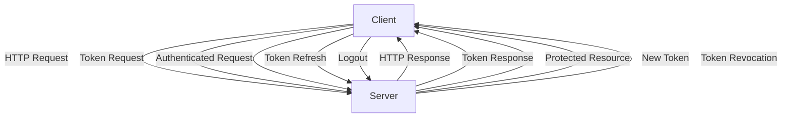

## Introduction
The **statelessness of HTTP** is a fundamental concept in web development that refers to the fact that each HTTP request contains all the information necessary to complete the request, without relying on any stored context or state from previous requests. This means that each request is independent and self-contained, making it easier to scale and distribute web applications. However, this statelessness can also make it challenging to implement features that require maintaining user sessions or tracking user interactions. In this article, we will explore the statelessness of HTTP, its implications, and how to overcome it using tokens.

## Core Concepts
To understand the statelessness of HTTP, it's essential to grasp the following key concepts:
* **HTTP Request**: A message sent by a client (e.g., web browser) to a server to request a resource.
* **HTTP Response**: A message sent by a server to a client in response to an HTTP request.
* **Stateless Protocol**: A protocol that does not maintain any information about previous requests or interactions.
* **Token-based Authentication**: A method of authentication that uses tokens to verify user identity and authorize access to protected resources.

> **Note:** The statelessness of HTTP is a design choice that allows for greater scalability and flexibility in web applications. However, it requires careful consideration of how to manage user sessions and track user interactions.

## How It Works Internally
When a client sends an HTTP request to a server, the request contains all the necessary information to complete the request, including:
1. **HTTP Method** (e.g., GET, POST, PUT, DELETE): Specifies the action to be taken on the requested resource.
2. **Request Headers**: Provide additional metadata about the request, such as authentication credentials or content type.
3. **Request Body**: Contains the payload of the request, such as form data or JSON data.

The server processes the request and returns an HTTP response, which includes:
1. **HTTP Status Code**: Indicates the outcome of the request (e.g., 200 OK, 404 Not Found, 500 Internal Server Error).
2. **Response Headers**: Provide additional metadata about the response, such as caching instructions or authentication tokens.
3. **Response Body**: Contains the payload of the response, such as HTML content or JSON data.

> **Tip:** Understanding the internal workings of HTTP requests and responses is crucial for building robust and scalable web applications.

## Code Examples
### Example 1: Basic HTTP Request
```python
import requests

# Send a GET request to a server
response = requests.get('https://example.com')

# Print the HTTP status code and response body
print(response.status_code)
print(response.text)
```
### Example 2: Token-based Authentication
```javascript
const express = require('express');
const jwt = require('jsonwebtoken');

// Create an Express.js server
const app = express();

// Define a route that requires token-based authentication
app.get('/protected', (req, res) => {
  // Verify the authentication token
  const token = req.headers['authorization'];
  if (!token) {
    return res.status(401).send('Unauthorized');
  }

  // Decode the token and verify its validity
  const decoded = jwt.verify(token, 'secret-key');
  if (!decoded) {
    return res.status(401).send('Invalid token');
  }

  // Return the protected resource
  res.send('Hello, authenticated user!');
});

// Start the server
app.listen(3000, () => {
  console.log('Server started on port 3000');
});
```
### Example 3: Advanced Token Management
```java
import io.jsonwebtoken.JwtBuilder;
import io.jsonwebtoken.Jwts;
import io.jsonwebtoken.SignatureAlgorithm;

// Create a JWT token with custom claims
JwtBuilder builder = Jwts.builder();
builder.setId("12345");
builder.setSubject("John Doe");
builder.setIssuedAt(new Date());
builder.setExpiration(new Date(System.currentTimeMillis() + 3600000));
builder.signWith(SignatureAlgorithm.HS256, "secret-key");

// Get the encoded token
String token = builder.compact();

// Print the token
System.out.println(token);
```
> **Warning:** In a real-world application, you should use a secure secret key for token signing and verification.

## Visual Diagram

The diagram illustrates the flow of HTTP requests and responses between a client and a server, including token-based authentication and token refresh.

## Comparison
| Approach | Time Complexity | Space Complexity | Pros | Cons | Best For |
| --- | --- | --- | --- | --- | --- |
| Session-based Authentication | O(1) | O(n) | Easy to implement, good for small-scale applications | Scalability issues, security concerns | Small-scale applications |
| Token-based Authentication | O(1) | O(1) | Scalable, secure, flexible | More complex to implement, requires token management | Large-scale applications |
| OAuth 2.0 | O(1) | O(n) | Standardized, widely adopted, flexible | Complex to implement, requires client registration | Third-party applications |
| OpenID Connect | O(1) | O(n) | Simple to implement, widely adopted, secure | Limited flexibility, requires OpenID Connect server | Single sign-on applications |

> **Interview:** Can you explain the difference between session-based authentication and token-based authentication? How would you implement token-based authentication in a real-world application?

## Real-world Use Cases
1. **Google Authentication**: Google uses token-based authentication to authenticate users across its services, including Gmail, Google Drive, and Google Calendar.
2. **Facebook OAuth**: Facebook uses OAuth 2.0 to authenticate users and authorize access to protected resources, such as user profiles and friend lists.
3. **Amazon Web Services (AWS)**: AWS uses token-based authentication to authenticate users and authorize access to protected resources, such as EC2 instances and S3 buckets.

## Common Pitfalls
1. **Insecure Token Storage**: Storing tokens insecurely, such as in plain text or in an unsecured cookie.
2. **Token Leakage**: Allowing tokens to leak, such as through an insecure API or a compromised client.
3. **Insufficient Token Validation**: Failing to validate tokens properly, such as by not checking the token's signature or expiration.
4. **Token Replay Attacks**: Allowing an attacker to replay a valid token to gain unauthorized access.

> **Tip:** Use a secure token storage mechanism, such as a secure cookie or a token storage service, to protect tokens from unauthorized access.

## Interview Tips
1. **What is the difference between session-based authentication and token-based authentication?**: Explain the pros and cons of each approach and how they are used in real-world applications.
2. **How would you implement token-based authentication in a real-world application?**: Describe the steps involved in implementing token-based authentication, including token generation, token validation, and token storage.
3. **What are some common pitfalls to avoid when using token-based authentication?**: Discuss the importance of secure token storage, token validation, and token revocation to prevent unauthorized access.

## Key Takeaways
* **Statelessness of HTTP**: Each HTTP request contains all the necessary information to complete the request, without relying on any stored context or state from previous requests.
* **Token-based Authentication**: A method of authentication that uses tokens to verify user identity and authorize access to protected resources.
* **Token Generation**: The process of generating a token, including setting the token's claims, signature, and expiration.
* **Token Validation**: The process of verifying a token's validity, including checking the token's signature, expiration, and claims.
* **Token Storage**: The process of storing tokens securely, such as in a secure cookie or a token storage service.
* **Token Revocation**: The process of revoking a token, such as when a user logs out or a token is compromised.
* **OAuth 2.0**: A standardized authorization framework that provides a secure way to authenticate users and authorize access to protected resources.
* **OpenID Connect**: A simple identity layer on top of the OAuth 2.0 protocol that provides a standardized way to authenticate users and authorize access to protected resources.