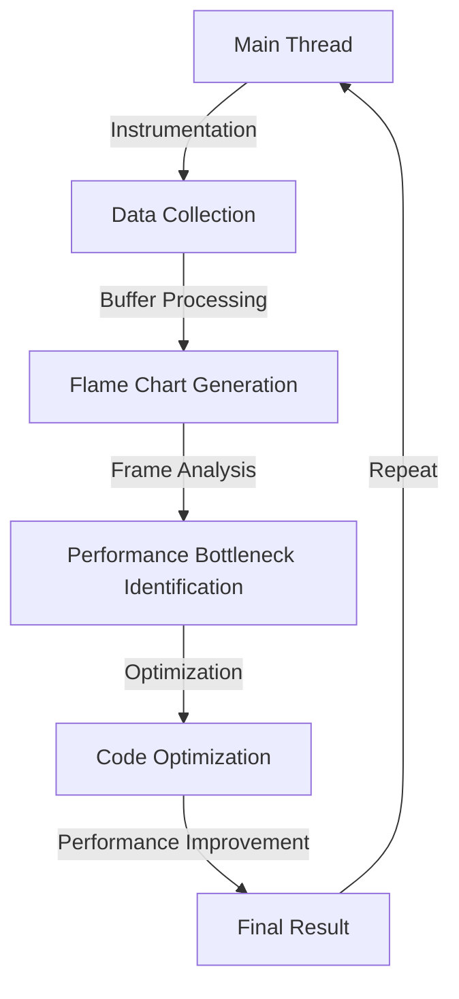

## Introduction
The Chrome DevTools Performance Timeline is a powerful tool for analyzing the performance of web applications. It provides a detailed view of the browser's main thread, allowing developers to identify bottlenecks and optimize their code. In this section, we will explore what the Performance Timeline is, why it matters, and its real-world relevance. 

The Performance Timeline is a critical component of the Chrome DevTools, providing a visual representation of the browser's performance. It is essential for web developers to understand how to use the Performance Timeline to identify and fix performance issues in their applications. 

> **Note:** The Performance Timeline is not just a tool for debugging; it is also an essential tool for optimizing the performance of web applications.

## Core Concepts
To effectively use the Performance Timeline, it is crucial to understand the core concepts of the tool. The Performance Timeline is based on the concept of a **flame chart**, which is a graphical representation of the call stack over time. The flame chart shows the execution time of each function, allowing developers to identify performance bottlenecks. 

The key terminology related to the Performance Timeline includes:
- **Main thread**: The main thread is the primary thread of the browser, responsible for executing JavaScript code, rendering the UI, and handling events.
- **Call stack**: The call stack is a data structure that keeps track of the functions that are currently being executed.
- **Frame**: A frame is a single execution of a function, represented by a rectangle in the flame chart.

> **Tip:** To get the most out of the Performance Timeline, it is essential to understand the concepts of the main thread, call stack, and frames.

## How It Works Internally
The Performance Timeline works by instrumenting the browser's main thread, allowing it to collect data on the execution time of each function. The data is then used to generate the flame chart, which provides a visual representation of the call stack over time. 

Here is a step-by-step breakdown of how the Performance Timeline works internally:
1. **Instrumentation**: The browser's main thread is instrumented to collect data on the execution time of each function.
2. **Data collection**: The data is collected and stored in a buffer.
3. **Buffer processing**: The buffer is processed to generate the flame chart.
4. **Flame chart generation**: The flame chart is generated based on the data collected.

> **Warning:** The Performance Timeline can be affected by the complexity of the application, the number of frames, and the execution time of each function.

## Code Examples
Here are three complete and runnable code examples that demonstrate how to use the Performance Timeline:

### Example 1: Basic Usage
```javascript
// Create a simple function to test the Performance Timeline
function testPerformance() {
  for (let i = 0; i < 100000; i++) {
    // Do some work
  }
}

// Call the function to test the Performance Timeline
testPerformance();
```
This example demonstrates the basic usage of the Performance Timeline. The `testPerformance` function is called, and the Performance Timeline is used to analyze the execution time of the function.

### Example 2: Real-World Pattern
```javascript
// Create a real-world example with multiple functions
function calculateArea(width, height) {
  return width * height;
}

function calculatePerimeter(width, height) {
  return 2 * (width + height);
}

function testPerformance() {
  for (let i = 0; i < 100; i++) {
    const area = calculateArea(10, 20);
    const perimeter = calculatePerimeter(10, 20);
  }
}

// Call the function to test the Performance Timeline
testPerformance();
```
This example demonstrates a real-world pattern with multiple functions. The `calculateArea` and `calculatePerimeter` functions are called within the `testPerformance` function, and the Performance Timeline is used to analyze the execution time of each function.

### Example 3: Advanced Usage
```javascript
// Create an advanced example with nested functions
function calculateArea(width, height) {
  return width * height;
}

function calculatePerimeter(width, height) {
  return 2 * (width + height);
}

function testPerformance() {
  for (let i = 0; i < 100; i++) {
    const area = calculateArea(10, 20);
    const perimeter = calculatePerimeter(10, 20);
    // Call a nested function
    nestedFunction(area, perimeter);
  }
}

function nestedFunction(area, perimeter) {
  for (let i = 0; i < 10; i++) {
    // Do some work
  }
}

// Call the function to test the Performance Timeline
testPerformance();
```
This example demonstrates an advanced usage of the Performance Timeline with nested functions. The `nestedFunction` is called within the `testPerformance` function, and the Performance Timeline is used to analyze the execution time of each function.

## Visual Diagram

This diagram illustrates the internal workings of the Performance Timeline. The main thread is instrumented to collect data, which is then processed to generate the flame chart. The flame chart is used to analyze the execution time of each function and identify performance bottlenecks. 

> **Interview:** Can you explain the internal workings of the Performance Timeline and how it is used to identify performance bottlenecks?

## Comparison
| Approach | Time Complexity | Space Complexity | Pros | Cons | Best For |
|----------|----------------|-----------------|------|------|----------|
| Manual Profiling | O(n) | O(1) | Simple to implement, low overhead | Time-consuming, prone to errors | Small applications |
| Automated Profiling | O(n log n) | O(n) | Fast, accurate, and scalable | High overhead, complex to implement | Large applications |
| Performance Timeline | O(n) | O(1) | Visual representation, easy to use | Limited to Chrome, may not work with complex applications | Web applications |
| JavaScript Profiler | O(n log n) | O(n) | Detailed information, easy to use | Limited to JavaScript, may not work with complex applications | JavaScript applications |

## Real-world Use Cases
The Performance Timeline is widely used in production environments to optimize the performance of web applications. Here are three real-world examples:
1. **Google**: Google uses the Performance Timeline to optimize the performance of its web applications, including Google Search and Google Maps.
2. **Facebook**: Facebook uses the Performance Timeline to optimize the performance of its web application, including the news feed and messaging.
3. **Netflix**: Netflix uses the Performance Timeline to optimize the performance of its web application, including the video player and user interface.

> **Tip:** The Performance Timeline is an essential tool for optimizing the performance of web applications, and it is widely used in production environments.

## Common Pitfalls
Here are four common pitfalls to avoid when using the Performance Timeline:
1. **Incorrect instrumentation**: Incorrect instrumentation can lead to inaccurate results, making it difficult to identify performance bottlenecks.
2. **Insufficient data**: Insufficient data can make it difficult to analyze the performance of the application, leading to incorrect conclusions.
3. **Over-optimization**: Over-optimization can lead to premature optimization, which can result in wasted time and resources.
4. **Lack of understanding**: A lack of understanding of the Performance Timeline and its internal workings can lead to incorrect conclusions and poor optimization decisions.

> **Warning:** It is essential to avoid these common pitfalls when using the Performance Timeline to ensure accurate results and effective optimization.

## Interview Tips
Here are three common interview questions related to the Performance Timeline:
1. **What is the Performance Timeline, and how does it work?**: A strong answer should include a detailed explanation of the internal workings of the Performance Timeline and its use cases.
2. **How do you optimize the performance of a web application using the Performance Timeline?**: A strong answer should include a step-by-step explanation of how to use the Performance Timeline to identify performance bottlenecks and optimize the application.
3. **What are some common pitfalls to avoid when using the Performance Timeline?**: A strong answer should include a list of common pitfalls and how to avoid them.

> **Interview:** Can you explain how to use the Performance Timeline to optimize the performance of a web application?

## Key Takeaways
Here are ten key takeaways to remember:
* The Performance Timeline is a powerful tool for analyzing the performance of web applications.
* The Performance Timeline provides a visual representation of the call stack over time.
* The flame chart is a graphical representation of the call stack over time.
* The main thread is the primary thread of the browser, responsible for executing JavaScript code, rendering the UI, and handling events.
* The call stack is a data structure that keeps track of the functions that are currently being executed.
* The Performance Timeline can be affected by the complexity of the application, the number of frames, and the execution time of each function.
* The Performance Timeline is widely used in production environments to optimize the performance of web applications.
* It is essential to avoid common pitfalls when using the Performance Timeline to ensure accurate results and effective optimization.
* The Performance Timeline is an essential tool for web developers to optimize the performance of their applications.
* The Performance Timeline provides a detailed view of the browser's main thread, allowing developers to identify bottlenecks and optimize their code.

> **Note:** These key takeaways provide a summary of the essential concepts and best practices related to the Performance Timeline.