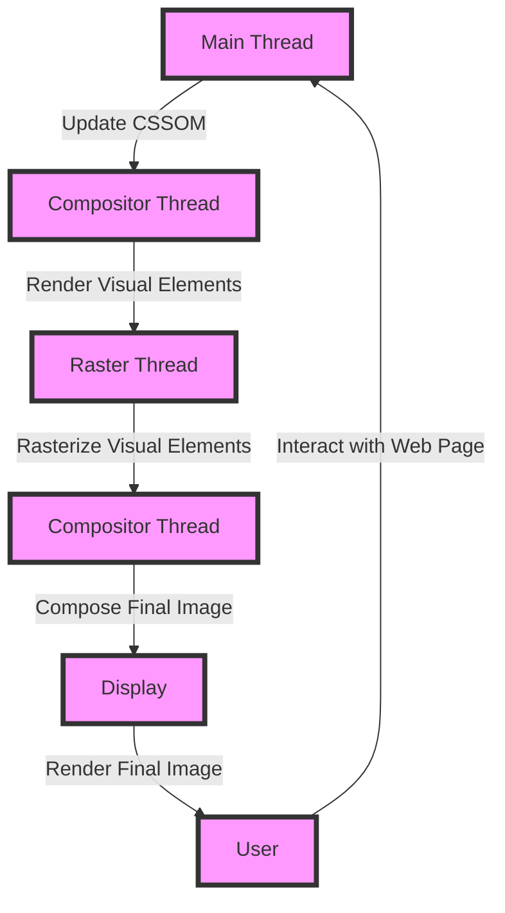

## Introduction
Compositor-only properties are a set of CSS properties that can be animated and composited by the browser's compositor thread, which is responsible for rendering and composing the visual elements of a web page. These properties include `transform`, `opacity`, and `filter`, among others. Compositor-only properties are important because they allow for smooth and efficient animations, which can improve the user experience and overall performance of a web application. In this section, we will explore the concept of compositor-only properties, their importance, and real-world relevance.

> **Note:** Compositor-only properties are a key concept in web performance optimization, as they can help reduce the load on the main thread and improve the overall rendering performance of a web page.

Compositor-only properties are particularly relevant in modern web development, where smooth animations and transitions are becoming increasingly important for creating engaging and interactive user experiences. By understanding how compositor-only properties work and how to use them effectively, developers can create high-performance web applications that deliver a seamless and enjoyable user experience.

## Core Concepts
To understand compositor-only properties, it's essential to grasp the basics of how the browser's rendering engine works. The rendering engine is responsible for rendering and composing the visual elements of a web page, and it consists of several threads, including the main thread, the compositor thread, and the raster thread.

* **Main thread:** The main thread is responsible for handling user input, parsing HTML and CSS, and executing JavaScript code. It's also responsible for updating the DOM and CSSOM, which can trigger layout and paint operations.
* **Compositor thread:** The compositor thread is responsible for rendering and composing the visual elements of a web page. It takes the output from the main thread and uses it to render the final image that is displayed on the screen.
* **Raster thread:** The raster thread is responsible for rasterizing the visual elements of a web page, which involves converting the vector graphics into pixel data that can be displayed on the screen.

Compositor-only properties are properties that can be animated and composited by the compositor thread, without requiring the main thread to update the layout or paint the elements. These properties include:

* `transform`
* `opacity`
* `filter`
* `backface-visibility`
* `perspective`
* `perspective-origin`

> **Warning:** Not all CSS properties are compositor-only properties. Properties like `width`, `height`, `margin`, and `padding` require the main thread to update the layout, which can cause performance issues if animated.

## How It Works Internally
When a compositor-only property is animated, the browser's compositor thread is responsible for rendering and composing the visual elements of the web page. The compositor thread uses the GPU to accelerate the rendering process, which can significantly improve performance.

Here's a step-by-step breakdown of how compositor-only properties work internally:

1. The main thread updates the CSSOM with the new values for the compositor-only property.
2. The compositor thread receives the updated CSSOM and uses it to render the visual elements of the web page.
3. The compositor thread uses the GPU to accelerate the rendering process, which involves converting the vector graphics into pixel data.
4. The raster thread rasterizes the visual elements of the web page, which involves converting the vector graphics into pixel data that can be displayed on the screen.
5. The compositor thread composes the final image that is displayed on the screen, using the output from the raster thread.

> **Tip:** To improve performance, it's essential to use compositor-only properties whenever possible, especially when animating elements. This can help reduce the load on the main thread and improve the overall rendering performance of the web page.

## Code Examples
Here are three complete and runnable code examples that demonstrate how to use compositor-only properties:

### Example 1: Basic `transform` Animation
```javascript
// Create a div element
const div = document.createElement('div');
div.style.width = '100px';
div.style.height = '100px';
div.style.background = 'red';
div.style.position = 'absolute';
div.style.top = '50%';
div.style.left = '50%';
div.style.transform = 'translate(-50%, -50%)';

// Add the div element to the body
document.body.appendChild(div);

// Animate the div element using the transform property
function animate() {
  div.style.transform = 'translate(-50%, -50%) rotate(360deg)';
  requestAnimationFrame(animate);
}
animate();
```

### Example 2: Real-World `opacity` Animation
```javascript
// Create a button element
const button = document.createElement('button');
button.textContent = 'Click me!';
button.style.position = 'absolute';
button.style.top = '50%';
button.style.left = '50%';
button.style.transform = 'translate(-50%, -50%)';

// Add the button element to the body
document.body.appendChild(button);

// Animate the button element using the opacity property
function animate() {
  button.style.opacity = 0.5;
  setTimeout(() => {
    button.style.opacity = 1;
    requestAnimationFrame(animate);
  }, 1000);
}
animate();
```

### Example 3: Advanced `filter` Animation
```javascript
// Create a div element
const div = document.createElement('div');
div.style.width = '100px';
div.style.height = '100px';
div.style.background = 'red';
div.style.position = 'absolute';
div.style.top = '50%';
div.style.left = '50%';
div.style.transform = 'translate(-50%, -50%)';

// Add the div element to the body
document.body.appendChild(div);

// Animate the div element using the filter property
function animate() {
  div.style.filter = 'blur(10px)';
  requestAnimationFrame(() => {
    div.style.filter = 'blur(0px)';
    requestAnimationFrame(animate);
  });
}
animate();
```

## Visual Diagram

The diagram illustrates the flow of how compositor-only properties work internally. The main thread updates the CSSOM, which triggers the compositor thread to render the visual elements. The raster thread rasterizes the visual elements, and the compositor thread composes the final image that is displayed on the screen.

> **Interview:** What is the difference between the main thread and the compositor thread? How do compositor-only properties improve performance?

## Comparison
| Property | Time Complexity | Space Complexity | Pros | Cons | Best For |
| --- | --- | --- | --- | --- | --- |
| `transform` | O(1) | O(1) | Smooth animations, efficient rendering | Can be slow on low-end devices | Animating elements, creating interactive effects |
| `opacity` | O(1) | O(1) | Smooth animations, efficient rendering | Can be slow on low-end devices | Animating elements, creating interactive effects |
| `filter` | O(n) | O(n) | Advanced image processing, creative effects | Can be slow on low-end devices, resource-intensive | Image processing, creative effects |
| `width` | O(n) | O(n) | Changing element size, layout updates | Can be slow on low-end devices, layout updates | Changing element size, layout updates |

## Real-world Use Cases
1. **Google Maps**: Google Maps uses compositor-only properties to animate the map when the user interacts with it. The map is rendered using the `transform` property, which provides smooth and efficient animations.
2. **Facebook**: Facebook uses compositor-only properties to animate the news feed when the user scrolls through it. The news feed is rendered using the `opacity` property, which provides smooth and efficient animations.
3. **Pinterest**: Pinterest uses compositor-only properties to animate the images when the user interacts with them. The images are rendered using the `filter` property, which provides advanced image processing and creative effects.

## Common Pitfalls
1. **Not using compositor-only properties**: Not using compositor-only properties can lead to performance issues, as the main thread is responsible for updating the layout and painting the elements.
2. **Using `width` and `height` for animations**: Using `width` and `height` for animations can lead to performance issues, as these properties require the main thread to update the layout.
3. **Not using `requestAnimationFrame`**: Not using `requestAnimationFrame` can lead to performance issues, as the animation may not be smooth and efficient.
4. **Not using `will-change`**: Not using `will-change` can lead to performance issues, as the browser may not optimize the rendering of the element.

> **Warning:** Not using compositor-only properties can lead to performance issues, as the main thread is responsible for updating the layout and painting the elements.

## Interview Tips
1. **What is the difference between the main thread and the compositor thread?**: The main thread is responsible for handling user input, parsing HTML and CSS, and executing JavaScript code, while the compositor thread is responsible for rendering and composing the visual elements of the web page.
2. **How do compositor-only properties improve performance?**: Compositor-only properties improve performance by allowing the compositor thread to render and compose the visual elements of the web page, without requiring the main thread to update the layout or paint the elements.
3. **What is the best way to animate elements?**: The best way to animate elements is to use compositor-only properties, such as `transform` and `opacity`, and to use `requestAnimationFrame` to ensure smooth and efficient animations.

## Key Takeaways
* Compositor-only properties are a set of CSS properties that can be animated and composited by the browser's compositor thread.
* Compositor-only properties include `transform`, `opacity`, and `filter`, among others.
* Using compositor-only properties can improve performance, as they allow the compositor thread to render and compose the visual elements of the web page.
* Not using compositor-only properties can lead to performance issues, as the main thread is responsible for updating the layout and painting the elements.
* `requestAnimationFrame` should be used to ensure smooth and efficient animations.
* `will-change` should be used to optimize the rendering of elements.
* Compositor-only properties are particularly relevant in modern web development, where smooth animations and transitions are becoming increasingly important for creating engaging and interactive user experiences.