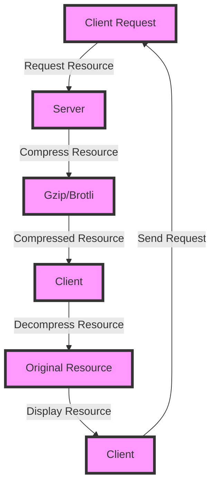

## Introduction
**Compression** is a crucial aspect of web development, as it enables faster data transfer between servers and clients. Two popular compression algorithms used in web development are **Gzip** and **Brotli**. In this section, we will explore the importance of compression, its real-world relevance, and why every engineer needs to know about it. Compression is essential for reducing the size of data being transferred, which in turn reduces the time it takes for data to be sent and received. This is particularly important for web applications, where faster load times can significantly improve user experience.

> **Note:** According to Google, a 1-second delay in page load time can result in a 7% reduction in conversions.

## Core Concepts
To understand compression, we need to grasp some key concepts:
* **Lossless compression**: a type of compression that reduces the size of data without losing any information.
* **Gzip**: a lossless compression algorithm that uses a combination of LZ77 and Huffman coding to compress data.
* **Brotli**: a lossless compression algorithm developed by Google, which uses a combination of LZ77 and Huffman coding, as well as 2nd order context modeling.
* **Compression ratio**: the ratio of the original size of the data to the compressed size of the data.

> **Warning:** Using the wrong compression algorithm can result in larger file sizes, which can negatively impact page load times.

## How It Works Internally
When a client requests a resource from a server, the server compresses the resource using a compression algorithm such as Gzip or Brotli. The compressed resource is then sent to the client, which decompresses the resource using the same algorithm. The compression process involves the following steps:
1. **Data preparation**: the data to be compressed is prepared by converting it into a format that can be compressed.
2. **LZ77 compression**: the data is compressed using the LZ77 algorithm, which replaces repeated patterns in the data with a reference to the previous occurrence.
3. **Huffman coding**: the compressed data is then encoded using Huffman coding, which assigns shorter codes to more frequently occurring patterns.
4. **Compression**: the encoded data is then compressed using a combination of LZ77 and Huffman coding.

> **Tip:** Using a combination of LZ77 and Huffman coding can result in better compression ratios than using either algorithm alone.

## Code Examples
### Example 1: Basic Gzip Compression
```python
import gzip
import io

# Create a string to compress
data = "Hello, World!" * 100

# Create a bytes buffer
buf = io.BytesIO()

# Create a gzip compressor
with gzip.GzipFile(fileobj=buf, mode='w') as gzip_file:
    # Write the data to the compressor
    gzip_file.write(data.encode('utf-8'))

# Get the compressed data
compressed_data = buf.getvalue()

print(f"Original size: {len(data.encode('utf-8'))} bytes")
print(f"Compressed size: {len(compressed_data)} bytes")
```

### Example 2: Brotli Compression
```javascript
const brotli = require('brotli');

// Create a string to compress
const data = "Hello, World!" * 100;

// Compress the data using Brotli
const compressedData = brotli.compress(data, {
  mode: 0, // mode 0: general compression
  quality: 11, // quality 11: maximum compression
});

console.log(`Original size: ${Buffer.byteLength(data, 'utf8')} bytes`);
console.log(`Compressed size: ${compressedData.length} bytes`);
```

### Example 3: Advanced Compression using Gzip and Brotli
```java
import java.io.*;
import java.util.zip.GZIPOutputStream;

public class Main {
    public static void main(String[] args) throws Exception {
        // Create a string to compress
        String data = "Hello, World!" * 100;

        // Create a bytes buffer
        ByteArrayOutputStream buf = new ByteArrayOutputStream();

        // Create a gzip compressor
        GZIPOutputStream gzip = new GZIPOutputStream(buf);

        // Write the data to the compressor
        gzip.write(data.getBytes("utf-8"));

        // Close the compressor
        gzip.close();

        // Get the compressed data
        byte[] compressedData = buf.toByteArray();

        System.out.println("Original size: " + data.getBytes("utf-8").length + " bytes");
        System.out.println("Compressed size: " + compressedData.length + " bytes");

        // Use Brotli compression
        ByteArrayOutputStream brotliBuf = new ByteArrayOutputStream();
        BrotliCompressorOutputStream brotli = new BrotliCompressorOutputStream(brotliBuf);
        brotli.write(data.getBytes("utf-8"));
        brotli.close();
        byte[] brotliCompressedData = brotliBuf.toByteArray();
        System.out.println("Brotli compressed size: " + brotliCompressedData.length + " bytes");
    }
}
```

## Visual Diagram

The diagram illustrates the client-server interaction, where the client requests a resource, the server compresses the resource using Gzip or Brotli, and the client decompresses the resource.

## Comparison
| Compression Algorithm | Time Complexity | Space Complexity | Pros | Cons | Best For |
| --- | --- | --- | --- | --- | --- |
| Gzip | O(n) | O(n) | Fast compression, widely supported | Not as efficient as Brotli | General-purpose compression |
| Brotli | O(n) | O(n) | Better compression ratio than Gzip | Slower compression than Gzip | Web compression, especially for text-based resources |
| LZ77 | O(n) | O(n) | Fast compression, simple implementation | Not as efficient as Gzip or Brotli | Real-time compression, embedded systems |
| Huffman coding | O(n) | O(n) | Fast compression, simple implementation | Not as efficient as Gzip or Brotli | Real-time compression, embedded systems |

> **Interview:** What is the main difference between Gzip and Brotli compression? Answer: Brotli compression has a better compression ratio than Gzip, especially for text-based resources.

## Real-world Use Cases
1. **Google**: uses Brotli compression for its web pages, resulting in a significant reduction in page load times.
2. **Facebook**: uses Gzip compression for its web pages, resulting in faster page load times.
3. **Amazon**: uses a combination of Gzip and Brotli compression for its web pages, resulting in improved page load times.

> **Tip:** Using a combination of Gzip and Brotli compression can result in better compression ratios than using either algorithm alone.

## Common Pitfalls
1. **Incorrect compression algorithm**: using the wrong compression algorithm can result in larger file sizes, which can negatively impact page load times.
2. **Insufficient compression**: not compressing resources sufficiently can result in larger file sizes, which can negatively impact page load times.
3. **Incorrect decompression**: decompressing resources incorrectly can result in corrupted data, which can negatively impact page functionality.
4. **Not using compression at all**: not using compression at all can result in larger file sizes, which can negatively impact page load times.

> **Warning:** Not using compression can result in larger file sizes, which can negatively impact page load times.

## Interview Tips
1. **What is the main difference between Gzip and Brotli compression?**: Answer: Brotli compression has a better compression ratio than Gzip, especially for text-based resources.
2. **How does compression work?**: Answer: Compression works by replacing repeated patterns in data with a reference to the previous occurrence, and then encoding the compressed data using Huffman coding.
3. **What is the time complexity of Gzip compression?**: Answer: The time complexity of Gzip compression is O(n), where n is the size of the data being compressed.

> **Interview:** What is the space complexity of Brotli compression? Answer: The space complexity of Brotli compression is O(n), where n is the size of the data being compressed.

## Key Takeaways
* **Compression is essential for web development**: compression reduces the size of data being transferred, resulting in faster page load times.
* **Gzip and Brotli are popular compression algorithms**: Gzip and Brotli are widely used compression algorithms, with Brotli having a better compression ratio than Gzip.
* **Compression has a time complexity of O(n)**: the time complexity of compression is O(n), where n is the size of the data being compressed.
* **Compression has a space complexity of O(n)**: the space complexity of compression is O(n), where n is the size of the data being compressed.
* **Using a combination of Gzip and Brotli compression can result in better compression ratios**: using a combination of Gzip and Brotli compression can result in better compression ratios than using either algorithm alone.
* **Not using compression can result in larger file sizes**: not using compression can result in larger file sizes, which can negatively impact page load times.
* **Incorrect compression algorithm can result in larger file sizes**: using the wrong compression algorithm can result in larger file sizes, which can negatively impact page load times.
* **Insufficient compression can result in larger file sizes**: not compressing resources sufficiently can result in larger file sizes, which can negatively impact page load times.
* **Incorrect decompression can result in corrupted data**: decompressing resources incorrectly can result in corrupted data, which can negatively impact page functionality.