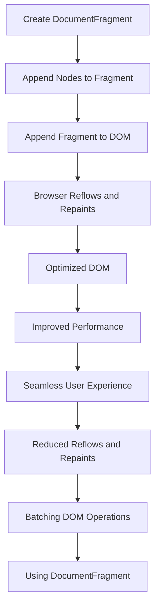

## Introduction
The **DOM `DocumentFragment`** is a crucial concept in web development, particularly when it comes to optimizing browser performance. It provides a way to batch multiple DOM insertions together, reducing the number of reflows and repaints, and ultimately improving the overall user experience. In this section, we will explore what a `DocumentFragment` is, why it matters, and its real-world relevance.

A `DocumentFragment` is a lightweight container that can hold a collection of DOM nodes. It is not a part of the DOM tree itself but can be used to manipulate the DOM without causing multiple reflows and repaints. By using a `DocumentFragment`, you can group multiple DOM operations together and apply them to the DOM in a single step, reducing the number of times the browser needs to recalculate the layout and repaint the screen.

> **Note:** The `DocumentFragment` is not a new concept, but its importance has grown with the increasing demand for fast and seamless user experiences. Modern web applications often involve complex DOM manipulations, and using a `DocumentFragment` can significantly improve performance.

## Core Concepts
To understand how a `DocumentFragment` works, it's essential to grasp some core concepts:

* **DOM (Document Object Model)**: The DOM is a tree-like structure that represents the HTML document. It consists of nodes, such as elements, attributes, and text nodes.
* **Reflooding and Repainting**: When the DOM changes, the browser needs to recalculate the layout (reflow) and redraw the screen (repaint). These processes can be expensive and may cause performance issues if not optimized.
* **Batching**: Grouping multiple DOM operations together to reduce the number of reflows and repaints.

A good mental model for understanding `DocumentFragment` is to think of it as a container that can hold a collection of DOM nodes. When you append a `DocumentFragment` to the DOM, the browser will only reflow and repaint once, rather than for each individual node.

## How It Works Internally
When you create a `DocumentFragment`, it is not inserted into the DOM tree. Instead, it exists as a separate entity that can hold a collection of DOM nodes. When you append a `DocumentFragment` to the DOM, the browser will:

1. Create a copy of the `DocumentFragment` and its contents.
2. Insert the copied nodes into the DOM tree.
3. Update the DOM tree to reflect the changes.

This process is more efficient than appending each node individually, as it reduces the number of reflows and repaints.

```javascript
// Create a DocumentFragment
const fragment = document.createDocumentFragment();

// Append nodes to the fragment
const node1 = document.createElement('div');
const node2 = document.createElement('span');
fragment.appendChild(node1);
fragment.appendChild(node2);

// Append the fragment to the DOM
document.body.appendChild(fragment);
```

## Code Examples
### Example 1: Basic Usage
In this example, we create a `DocumentFragment` and append two nodes to it. We then append the `DocumentFragment` to the DOM.

```javascript
// Create a DocumentFragment
const fragment = document.createDocumentFragment();

// Append nodes to the fragment
const node1 = document.createElement('div');
node1.textContent = 'Hello';
const node2 = document.createElement('span');
node2.textContent = 'World';
fragment.appendChild(node1);
fragment.appendChild(node2);

// Append the fragment to the DOM
document.body.appendChild(fragment);
```

### Example 2: Real-World Pattern
In this example, we use a `DocumentFragment` to batch multiple DOM insertions together. We create an array of nodes and append them to the `DocumentFragment`. We then append the `DocumentFragment` to the DOM.

```javascript
// Create an array of nodes
const nodes = [];
for (let i = 0; i < 10; i++) {
  const node = document.createElement('div');
  node.textContent = `Node ${i}`;
  nodes.push(node);
}

// Create a DocumentFragment
const fragment = document.createDocumentFragment();

// Append nodes to the fragment
nodes.forEach(node => {
  fragment.appendChild(node);
});

// Append the fragment to the DOM
document.body.appendChild(fragment);
```

### Example 3: Advanced Usage
In this example, we use a `DocumentFragment` to optimize a complex DOM manipulation. We create a `DocumentFragment` and append multiple nodes to it. We then use the `fragment` to replace a portion of the DOM.

```javascript
// Create a DocumentFragment
const fragment = document.createDocumentFragment();

// Append nodes to the fragment
const node1 = document.createElement('div');
node1.textContent = 'New Node 1';
const node2 = document.createElement('span');
node2.textContent = 'New Node 2';
fragment.appendChild(node1);
fragment.appendChild(node2);

// Replace a portion of the DOM with the fragment
const oldNode = document.querySelector('#old-node');
oldNode.parentNode.replaceChild(fragment, oldNode);
```

## Visual Diagram

The diagram illustrates the process of creating a `DocumentFragment`, appending nodes to it, and appending the `DocumentFragment` to the DOM. This process optimizes the DOM and reduces the number of reflows and repaints, ultimately improving performance and providing a seamless user experience.

## Comparison
| Approach | Time Complexity | Space Complexity | Pros | Cons | Best For |
| --- | --- | --- | --- | --- | --- |
| Appending Nodes Individually | O(n) | O(1) | Simple to implement | Inefficient, causes multiple reflows and repaints | Small-scale DOM manipulations |
| Using a DocumentFragment | O(1) | O(n) | Efficient, reduces reflows and repaints | More complex to implement | Large-scale DOM manipulations, performance-critical code |
| Using a Template Element | O(1) | O(n) | Efficient, reduces reflows and repaints | Limited browser support | Modern browsers, performance-critical code |
| Using a Virtual DOM | O(1) | O(n) | Efficient, reduces reflows and repaints | Complex to implement, adds overhead | Complex, data-driven applications |

## Real-world Use Cases
1. **Facebook's News Feed**: Facebook uses a `DocumentFragment` to batch multiple DOM insertions together, reducing the number of reflows and repaints, and ultimately improving performance.
2. **Google's Search Results**: Google uses a `DocumentFragment` to optimize the rendering of search results, reducing the number of reflows and repaints, and providing a seamless user experience.
3. **Twitter's Timeline**: Twitter uses a `DocumentFragment` to batch multiple DOM insertions together, reducing the number of reflows and repaints, and ultimately improving performance.

## Common Pitfalls
1. **Incorrectly Using a DocumentFragment**: A common mistake is to append a `DocumentFragment` to the DOM and then try to access its child nodes. This will not work, as the `DocumentFragment` is not a part of the DOM tree.
2. **Not Understanding the Browser's Reflow and Repaint Process**: Many developers do not understand how the browser's reflow and repaint process works, leading to inefficient DOM manipulations.
3. **Not Using a DocumentFragment When Necessary**: Failing to use a `DocumentFragment` when performing large-scale DOM manipulations can lead to performance issues and a poor user experience.
4. **Using a DocumentFragment Incorrectly**: Using a `DocumentFragment` incorrectly can lead to unexpected behavior and performance issues.

```javascript
// Incorrect usage
const fragment = document.createDocumentFragment();
const node = document.createElement('div');
fragment.appendChild(node);
document.body.appendChild(fragment);
console.log(fragment.childNodes); // This will not work as expected
```

```javascript
// Correct usage
const fragment = document.createDocumentFragment();
const node = document.createElement('div');
fragment.appendChild(node);
document.body.appendChild(fragment);
console.log(document.body.childNodes); // This will work as expected
```

## Interview Tips
1. **What is a DocumentFragment, and why is it useful?**: A `DocumentFragment` is a lightweight container that can hold a collection of DOM nodes. It is useful for batching multiple DOM insertions together, reducing the number of reflows and repaints, and ultimately improving performance.
2. **How does a DocumentFragment work internally?**: A `DocumentFragment` is not inserted into the DOM tree. Instead, it exists as a separate entity that can hold a collection of DOM nodes. When you append a `DocumentFragment` to the DOM, the browser will create a copy of the `DocumentFragment` and its contents, insert the copied nodes into the DOM tree, and update the DOM tree to reflect the changes.
3. **What are some common use cases for a DocumentFragment?**: A `DocumentFragment` is commonly used in large-scale DOM manipulations, such as rendering a list of items or updating a complex UI component.

> **Interview:** When asked about `DocumentFragment`, be sure to explain its purpose, how it works internally, and its common use cases. Provide examples of how you have used a `DocumentFragment` in your own code, and discuss the benefits and trade-offs of using a `DocumentFragment`.

## Key Takeaways
* A `DocumentFragment` is a lightweight container that can hold a collection of DOM nodes.
* Using a `DocumentFragment` can reduce the number of reflows and repaints, improving performance and providing a seamless user experience.
* A `DocumentFragment` is not inserted into the DOM tree; instead, it exists as a separate entity that can hold a collection of DOM nodes.
* When appending a `DocumentFragment` to the DOM, the browser will create a copy of the `DocumentFragment` and its contents, insert the copied nodes into the DOM tree, and update the DOM tree to reflect the changes.
* A `DocumentFragment` is commonly used in large-scale DOM manipulations, such as rendering a list of items or updating a complex UI component.
* The time complexity of using a `DocumentFragment` is O(1), and the space complexity is O(n).
* A `DocumentFragment` can be used to optimize the rendering of search results, reducing the number of reflows and repaints, and providing a seamless user experience.
* A `DocumentFragment` can be used to batch multiple DOM insertions together, reducing the number of reflows and repaints, and ultimately improving performance.