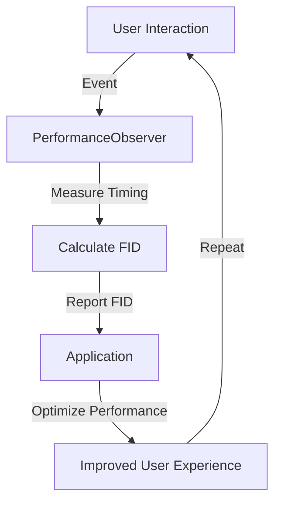

## Introduction
The **Event Timing API** is a web performance API that provides a way to measure the time it takes for a user's input to be processed by a web application. This is also known as **First Input Delay (FID)**. FID is an important metric because it directly affects the user experience. A high FID can make a web application feel sluggish and unresponsive, while a low FID can make it feel fast and responsive. In this article, we will dive deep into the Event Timing API and explore how it works, how to use it, and what benefits it provides.

> **Note:** The Event Timing API is a part of the Web Performance API, which provides a set of APIs for measuring and optimizing web performance.

## Core Concepts
The Event Timing API is based on the concept of **events** and **timings**. An event is a user interaction, such as a click or a key press, while a timing is a measurement of the time it takes for the event to be processed. The API provides a way to measure the timing of events, which can be used to calculate the FID.

* **Event**: A user interaction, such as a click or a key press.
* **Timing**: A measurement of the time it takes for an event to be processed.
* **First Input Delay (FID)**: The time it takes for a user's input to be processed by a web application.

> **Warning:** A high FID can negatively impact the user experience and should be optimized for.

## How It Works Internally
The Event Timing API works by listening for events on the document and measuring the time it takes for the event to be processed. The API uses the **PerformanceObserver** interface to observe the events and measure the timings. The **PerformanceObserver** interface provides a way to observe performance events, such as events and timings, and report them to the application.

Here is a step-by-step breakdown of how the Event Timing API works internally:

1. The application creates a **PerformanceObserver** instance and sets up an event listener for the events it wants to measure.
2. When an event occurs, the **PerformanceObserver** instance measures the time it takes for the event to be processed and reports it to the application.
3. The application uses the reported timings to calculate the FID.

> **Tip:** The Event Timing API can be used in conjunction with other web performance APIs, such as the **Performance Navigation** API and the **Performance Resource** API, to get a more complete picture of web performance.

## Code Examples
Here are three complete and runnable code examples that demonstrate how to use the Event Timing API:

### Example 1: Basic Usage
```javascript
// Create a PerformanceObserver instance
const observer = new PerformanceObserver((list) => {
  // Get the first entry in the list
  const entry = list.getEntries()[0];
  
  // Get the FID
  const fid = entry.processingStart - entry.startTime;
  
  // Log the FID
  console.log(`FID: ${fid}ms`);
});

// Observe the events
observer.observe({ entryTypes: ['first-input'] });

// Disconnect the observer when the page is unloaded
window.addEventListener('unload', () => {
  observer.disconnect();
});
```
This example creates a **PerformanceObserver** instance and sets up an event listener for the **first-input** event. When the event occurs, it measures the FID and logs it to the console.

### Example 2: Real-World Pattern
```javascript
// Create a function to calculate the FID
function calculateFID(entry) {
  return entry.processingStart - entry.startTime;
}

// Create a PerformanceObserver instance
const observer = new PerformanceObserver((list) => {
  // Get the first entry in the list
  const entry = list.getEntries()[0];
  
  // Calculate the FID
  const fid = calculateFID(entry);
  
  // Log the FID
  console.log(`FID: ${fid}ms`);
});

// Observe the events
observer.observe({ entryTypes: ['first-input'] });

// Disconnect the observer when the page is unloaded
window.addEventListener('unload', () => {
  observer.disconnect();
});
```
This example creates a function to calculate the FID and uses it to log the FID to the console.

### Example 3: Advanced Usage
```javascript
// Create a function to calculate the FID
function calculateFID(entry) {
  return entry.processingStart - entry.startTime;
}

// Create a PerformanceObserver instance
const observer = new PerformanceObserver((list) => {
  // Get the first entry in the list
  const entry = list.getEntries()[0];
  
  // Calculate the FID
  const fid = calculateFID(entry);
  
  // Log the FID
  console.log(`FID: ${fid}ms`);
  
  // Disconnect the observer
  observer.disconnect();
});

// Observe the events
observer.observe({ entryTypes: ['first-input'] });

// Add an event listener for the 'click' event
document.addEventListener('click', () => {
  // Observe the events
  observer.observe({ entryTypes: ['first-input'] });
});
```
This example creates a function to calculate the FID and uses it to log the FID to the console. It also adds an event listener for the **click** event and observes the events when the event occurs.

## Visual Diagram

This diagram illustrates the flow of events and timings in the Event Timing API. It shows how the user interaction triggers an event, which is measured by the **PerformanceObserver** instance. The measured timing is then used to calculate the FID, which is reported to the application. The application can then use the FID to optimize performance and improve the user experience.

> **Interview:** Can you explain how the Event Timing API works and how it can be used to improve web performance? 

## Comparison
| Approach | Time Complexity | Space Complexity | Pros | Cons | Best For |
| --- | --- | --- | --- | --- | --- |
| Event Timing API | O(1) | O(1) | Provides accurate measurements of FID, easy to use | Limited to measuring FID, requires modern browsers | Measuring FID in modern web applications |
| Navigation Timing API | O(1) | O(1) | Provides measurements of navigation timing, easy to use | Limited to measuring navigation timing, requires modern browsers | Measuring navigation timing in modern web applications |
| Resource Timing API | O(1) | O(1) | Provides measurements of resource timing, easy to use | Limited to measuring resource timing, requires modern browsers | Measuring resource timing in modern web applications |
| User Timing API | O(1) | O(1) | Provides measurements of user timing, easy to use | Limited to measuring user timing, requires modern browsers | Measuring user timing in modern web applications |

## Real-world Use Cases
The Event Timing API is used in real-world web applications to measure and optimize FID. Here are three examples:

* **Google**: Google uses the Event Timing API to measure FID in its web applications, including Google Search and Google Maps.
* **Facebook**: Facebook uses the Event Timing API to measure FID in its web application, including Facebook.com.
* **Amazon**: Amazon uses the Event Timing API to measure FID in its web application, including Amazon.com.

> **Tip:** The Event Timing API can be used in conjunction with other web performance APIs to get a more complete picture of web performance.

## Common Pitfalls
Here are four common pitfalls to avoid when using the Event Timing API:

* **Not observing the correct event type**: The Event Timing API requires observing the correct event type, such as **first-input**, to measure FID.
* **Not calculating the FID correctly**: The FID must be calculated correctly using the measured timing.
* **Not disconnecting the observer**: The observer must be disconnected when the page is unloaded to prevent memory leaks.
* **Not handling errors**: Errors must be handled correctly to prevent crashes and ensure accurate measurements.

> **Warning:** Not observing the correct event type can result in inaccurate measurements of FID.

## Interview Tips
Here are three common interview questions related to the Event Timing API:

* **What is the Event Timing API and how does it work?**: The Event Timing API is a web performance API that provides a way to measure the time it takes for a user's input to be processed by a web application. It works by listening for events on the document and measuring the time it takes for the event to be processed.
* **How do you measure FID using the Event Timing API?**: FID can be measured by observing the **first-input** event and calculating the time it takes for the event to be processed.
* **What are some common pitfalls to avoid when using the Event Timing API?**: Common pitfalls include not observing the correct event type, not calculating the FID correctly, not disconnecting the observer, and not handling errors.

> **Interview:** Can you explain how to measure FID using the Event Timing API and what are some common pitfalls to avoid?

## Key Takeaways
Here are ten key takeaways to remember:

* The Event Timing API is a web performance API that provides a way to measure the time it takes for a user's input to be processed by a web application.
* FID is an important metric that directly affects the user experience.
* The Event Timing API works by listening for events on the document and measuring the time it takes for the event to be processed.
* The **PerformanceObserver** interface is used to observe the events and measure the timings.
* The FID must be calculated correctly using the measured timing.
* The observer must be disconnected when the page is unloaded to prevent memory leaks.
* Errors must be handled correctly to prevent crashes and ensure accurate measurements.
* The Event Timing API can be used in conjunction with other web performance APIs to get a more complete picture of web performance.
* Common pitfalls include not observing the correct event type, not calculating the FID correctly, not disconnecting the observer, and not handling errors.
* The Event Timing API is used in real-world web applications to measure and optimize FID.