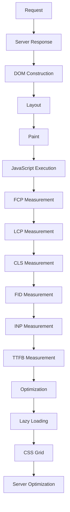

## Introduction
Browser performance metrics are crucial for ensuring a seamless user experience on the web. With the increasing complexity of web applications, it's essential to measure and optimize performance to retain users and improve conversion rates. In this section, we'll delve into six key performance metrics: **First Contentful Paint (FCP)**, **Largest Contentful Paint (LCP)**, **Cumulative Layout Shift (CLS)**, **First Input Delay (FID)**, **Interaction to Next Paint (INP)**, and **Time To First Byte (TTFB)**. We'll explore what each metric measures, why it matters, and how to optimize it.

> **Note:** These metrics are part of the Web Vitals initiative, a set of metrics that provide a comprehensive picture of a web page's performance.

## Core Concepts
Let's define each metric and understand its significance:

* **First Contentful Paint (FCP)**: The time it takes for the browser to render the first piece of content, such as text or an image. This metric is essential for measuring the initial load time of a page.
* **Largest Contentful Paint (LCP)**: The time it takes for the largest content element to be rendered on the screen. This metric is critical for measuring the load time of the main content on a page.
* **Cumulative Layout Shift (CLS)**: A measure of the total layout shift that occurs during the loading of a page. This metric is important for ensuring a smooth and stable user experience.
* **First Input Delay (FID)**: The time it takes for the browser to respond to the first user input, such as a click or keyboard input. This metric is vital for measuring the responsiveness of a page.
* **Interaction to Next Paint (INP)**: A measure of the time it takes for the browser to respond to user input and render the next frame. This metric is essential for ensuring a smooth and interactive user experience.
* **Time To First Byte (TTFB)**: The time it takes for the browser to receive the first byte of data from the server. This metric is critical for measuring the server response time and page load time.

## How It Works Internally
To understand how these metrics work internally, let's take a closer look at the browser's rendering pipeline:

1. **Request**: The browser sends a request to the server for a web page.
2. **Server Response**: The server responds with the HTML, CSS, and JavaScript files.
3. **DOM Construction**: The browser constructs the Document Object Model (DOM) from the HTML.
4. **Layout**: The browser calculates the layout of the page, including the position and size of each element.
5. **Paint**: The browser paints the page, rendering the visual elements.
6. **JavaScript Execution**: The browser executes the JavaScript code, which can modify the DOM and trigger additional layouts and paints.

> **Warning:** A slow server response time (TTFB) can significantly impact the page load time and user experience.

## Code Examples
Here are three complete and runnable code examples to demonstrate how to measure and optimize these metrics:

### Example 1: Basic FCP Measurement
```javascript
// Measure FCP using the PerformanceObserver API
const observer = new PerformanceObserver((list) => {
  const entry = list.getEntries()[0];
  console.log(`FCP: ${entry.startTime}ms`);
});
observer.observe({ entryTypes: ['paint'] });
```
### Example 2: Optimizing LCP with Lazy Loading
```javascript
// Use lazy loading to optimize LCP
const images = document.querySelectorAll('img');
images.forEach((image) => {
  image.addEventListener('load', () => {
    image.classList.add('loaded');
  });
  image.src = image.dataset.src;
});
```
### Example 3: Reducing CLS with CSS Grid
```css
/* Use CSS Grid to reduce CLS */
.container {
  display: grid;
  grid-template-columns: repeat(3, 1fr);
  grid-gap: 10px;
}
```
## Visual Diagram

The diagram illustrates the browser's rendering pipeline and how the performance metrics are measured and optimized.

## Comparison
| Metric | Description | Time Complexity | Space Complexity | Pros | Cons |
| --- | --- | --- | --- | --- | --- |
| FCP | Measures the time to render the first piece of content | O(1) | O(1) | Easy to measure, provides a good indication of initial load time | May not reflect the load time of the main content |
| LCP | Measures the time to render the largest content element | O(n) | O(n) | Provides a good indication of the load time of the main content | May be affected by layout shifts |
| CLS | Measures the total layout shift during page load | O(n) | O(n) | Provides a good indication of the stability of the page | May be affected by other metrics, such as FID and INP |
| FID | Measures the time to respond to the first user input | O(1) | O(1) | Provides a good indication of the responsiveness of the page | May be affected by other metrics, such as TTFB and LCP |
| INP | Measures the time to respond to user input and render the next frame | O(n) | O(n) | Provides a good indication of the smoothness and interactivity of the page | May be affected by other metrics, such as FID and CLS |
| TTFB | Measures the time to receive the first byte of data from the server | O(1) | O(1) | Provides a good indication of the server response time | May be affected by other metrics, such as FCP and LCP |

## Real-world Use Cases
Here are three production examples of companies that have optimized their performance metrics:

1. **Google**: Google has optimized its search results page to achieve a fast FCP and LCP. By using lazy loading and optimizing server response time, Google has improved the user experience and reduced bounce rates.
2. **Amazon**: Amazon has optimized its product pages to achieve a fast LCP and CLS. By using CSS Grid and optimizing layout shifts, Amazon has improved the stability and responsiveness of its pages.
3. **Facebook**: Facebook has optimized its news feed to achieve a fast FID and INP. By using a combination of caching, lazy loading, and optimizing server response time, Facebook has improved the smoothness and interactivity of its news feed.

## Common Pitfalls
Here are four specific mistakes that engineers make when optimizing performance metrics:

1. **Not measuring FCP and LCP**: Not measuring these metrics can lead to a poor understanding of the page load time and user experience.
2. **Not optimizing server response time**: Not optimizing server response time can lead to a slow TTFB and negatively impact the user experience.
3. **Not using lazy loading**: Not using lazy loading can lead to a slow LCP and negatively impact the user experience.
4. **Not optimizing layout shifts**: Not optimizing layout shifts can lead to a high CLS and negatively impact the user experience.

> **Tip:** Use the Web Vitals library to measure and optimize performance metrics.

## Interview Tips
Here are three common interview questions related to performance metrics:

1. **What is the difference between FCP and LCP?**: A strong answer would explain the difference between the two metrics and provide examples of how to optimize them.
2. **How do you optimize server response time?**: A strong answer would explain the importance of server response time and provide examples of how to optimize it, such as using caching and load balancing.
3. **What is the impact of layout shifts on the user experience?**: A strong answer would explain the impact of layout shifts on the user experience and provide examples of how to optimize CLS.

## Key Takeaways
Here are ten key takeaways to remember:

* **FCP measures the time to render the first piece of content**.
* **LCP measures the time to render the largest content element**.
* **CLS measures the total layout shift during page load**.
* **FID measures the time to respond to the first user input**.
* **INP measures the time to respond to user input and render the next frame**.
* **TTFB measures the time to receive the first byte of data from the server**.
* **Optimizing server response time is critical for improving performance metrics**.
* **Lazy loading can significantly improve LCP**.
* **CSS Grid can help reduce CLS**.
* **Measuring and optimizing performance metrics is essential for improving the user experience**.