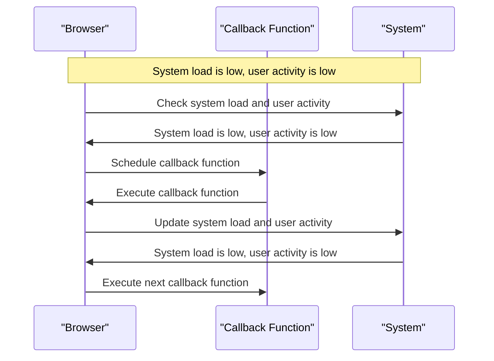

## Introduction
The `requestIdleCallback` API is a powerful tool for scheduling background work in web applications, allowing developers to optimize performance and improve the user experience. In this section, we'll explore what `requestIdleCallback` is, why it matters, and its real-world relevance. **RequestIdleCallback** is a method that allows you to schedule a function to be executed when the browser is idle, which means that the main thread is not busy with other tasks. This is particularly useful for performing background work, such as data processing, caching, or other tasks that don't require immediate attention.

> **Note:** The `requestIdleCallback` API is part of the **web performance** API, which provides a set of tools for measuring and optimizing the performance of web applications.

In real-world applications, `requestIdleCallback` is used to improve the responsiveness of web applications by offloading non-essential work to the background. For example, a web application might use `requestIdleCallback` to schedule a task to update the application's cache, or to perform some background data processing. By scheduling these tasks to run when the browser is idle, the application can ensure that the main thread remains available to handle user input and other critical tasks.

## Core Concepts
To understand how `requestIdleCallback` works, it's essential to grasp some core concepts:

* **Idle time**: The time when the browser is not busy with other tasks, such as handling user input, rendering, or running scripts.
* **Background work**: Non-essential tasks that don't require immediate attention, such as data processing, caching, or other tasks that can be performed in the background.
* **Callback function**: A function that is scheduled to be executed when the browser is idle.

> **Tip:** To optimize the performance of your web application, it's essential to understand the concepts of **idle time** and **background work**. By scheduling non-essential tasks to run during idle time, you can ensure that the main thread remains available to handle critical tasks.

## How It Works Internally
When you call `requestIdleCallback`, the browser schedules the provided callback function to be executed when the browser is idle. The browser uses a complex algorithm to determine when the browser is idle, taking into account factors such as:

* **System load**: The current load of the system, including the CPU, memory, and other resources.
* **User activity**: The level of user activity, such as mouse movements, keyboard input, and other interactions.
* **Task queue**: The queue of tasks that need to be executed, including scripts, rendering, and other tasks.

Here's a step-by-step breakdown of how `requestIdleCallback` works internally:

1. The browser receives a request to schedule a callback function using `requestIdleCallback`.
2. The browser checks the system load, user activity, and task queue to determine if the browser is idle.
3. If the browser is idle, the callback function is executed immediately.
4. If the browser is not idle, the callback function is scheduled to be executed when the browser becomes idle.

> **Warning:** It's essential to be aware that `requestIdleCallback` is not a guarantee that the callback function will be executed immediately. The browser may delay the execution of the callback function if the system load is high or if there are other tasks that need to be executed.

## Code Examples
Here are three complete and runnable examples of using `requestIdleCallback`:

### Example 1: Basic Usage
```javascript
// Schedule a callback function to be executed when the browser is idle
requestIdleCallback(() => {
  console.log('Callback function executed');
});
```
This example schedules a callback function to be executed when the browser is idle. The callback function simply logs a message to the console.

### Example 2: Real-World Pattern
```javascript
// Schedule a callback function to update the application's cache
requestIdleCallback(() => {
  // Update the cache
  const cache = {};
  // ...
  console.log('Cache updated');
});
```
This example schedules a callback function to update the application's cache when the browser is idle. The callback function updates the cache and logs a message to the console.

### Example 3: Advanced Usage
```javascript
// Schedule multiple callback functions to be executed when the browser is idle
requestIdleCallback(() => {
  console.log('Callback function 1 executed');
});
requestIdleCallback(() => {
  console.log('Callback function 2 executed');
});
```
This example schedules multiple callback functions to be executed when the browser is idle. The callback functions log messages to the console.

## Visual Diagram

This diagram illustrates the sequence of events that occur when scheduling a callback function using `requestIdleCallback`. The browser checks the system load and user activity, schedules the callback function, and executes the callback function when the browser is idle.

## Comparison
Here's a comparison of different approaches to scheduling background work:

| Approach | Time Complexity | Space Complexity | Pros | Cons | Best For |
| --- | --- | --- | --- | --- | --- |
| `requestIdleCallback` | O(1) | O(1) | Optimizes performance, improves responsiveness | May delay execution of callback function | Background work, caching, data processing |
| `setTimeout` | O(1) | O(1) | Simple to use, easy to implement | May not optimize performance, may delay execution | Simple tasks, non-critical work |
| `setInterval` | O(1) | O(1) | Simple to use, easy to implement | May not optimize performance, may delay execution | Periodic tasks, non-critical work |
| Web Workers | O(n) | O(n) | Optimizes performance, improves responsiveness | Complex to use, may require additional resources | CPU-intensive tasks, data processing |

> **Interview:** What is the main advantage of using `requestIdleCallback` over `setTimeout` or `setInterval`? The main advantage is that `requestIdleCallback` optimizes performance by scheduling callback functions to be executed when the browser is idle, which improves the responsiveness of the application.

## Real-world Use Cases
Here are three real-world use cases of `requestIdleCallback`:

1. **Google Maps**: Google Maps uses `requestIdleCallback` to schedule background work, such as updating the map cache, when the user is not interacting with the map.
2. **Facebook**: Facebook uses `requestIdleCallback` to schedule background work, such as updating the news feed, when the user is not interacting with the application.
3. **Amazon**: Amazon uses `requestIdleCallback` to schedule background work, such as updating the product cache, when the user is not interacting with the application.

## Common Pitfalls
Here are four common pitfalls to avoid when using `requestIdleCallback`:

1. **Not checking the callback function**: Make sure to check the callback function for errors and exceptions.
```javascript
// Wrong way
requestIdleCallback(() => {
  // ...
});

// Right way
requestIdleCallback(() => {
  try {
    // ...
  } catch (error) {
    console.error(error);
  }
});
```
2. **Not handling multiple callback functions**: Make sure to handle multiple callback functions correctly.
```javascript
// Wrong way
requestIdleCallback(() => {
  // ...
});
requestIdleCallback(() => {
  // ...
});

// Right way
let callbacks = [];
requestIdleCallback(() => {
  callbacks.push(() => {
    // ...
  });
});
requestIdleCallback(() => {
  callbacks.push(() => {
    // ...
  });
});
```
3. **Not checking the system load and user activity**: Make sure to check the system load and user activity before scheduling a callback function.
```javascript
// Wrong way
requestIdleCallback(() => {
  // ...
});

// Right way
if (navigator.userAgent.indexOf('Mobile') !== -1) {
  requestIdleCallback(() => {
    // ...
  });
} else {
  // ...
}
```
4. **Not using `requestIdleCallback` correctly**: Make sure to use `requestIdleCallback` correctly, including checking the callback function, handling multiple callback functions, and checking the system load and user activity.

## Interview Tips
Here are three common interview questions related to `requestIdleCallback`:

1. **What is the main advantage of using `requestIdleCallback` over `setTimeout` or `setInterval`?**
	* Weak answer: "I'm not sure."
	* Strong answer: "The main advantage is that `requestIdleCallback` optimizes performance by scheduling callback functions to be executed when the browser is idle, which improves the responsiveness of the application."
2. **How do you handle multiple callback functions using `requestIdleCallback`?**
	* Weak answer: "I'm not sure."
	* Strong answer: "I handle multiple callback functions by using an array to store the callback functions and executing them one by one when the browser is idle."
3. **What is the time complexity of `requestIdleCallback`?**
	* Weak answer: "I'm not sure."
	* Strong answer: "The time complexity of `requestIdleCallback` is O(1), which means that it optimizes performance by scheduling callback functions to be executed when the browser is idle."

## Key Takeaways
Here are ten key takeaways to remember:

* **Use `requestIdleCallback` to optimize performance**: `requestIdleCallback` optimizes performance by scheduling callback functions to be executed when the browser is idle.
* **Check the callback function for errors and exceptions**: Make sure to check the callback function for errors and exceptions.
* **Handle multiple callback functions correctly**: Make sure to handle multiple callback functions correctly by using an array to store the callback functions and executing them one by one when the browser is idle.
* **Check the system load and user activity**: Make sure to check the system load and user activity before scheduling a callback function.
* **Use `requestIdleCallback` correctly**: Make sure to use `requestIdleCallback` correctly, including checking the callback function, handling multiple callback functions, and checking the system load and user activity.
* **The time complexity of `requestIdleCallback` is O(1)**: The time complexity of `requestIdleCallback` is O(1), which means that it optimizes performance by scheduling callback functions to be executed when the browser is idle.
* **The space complexity of `requestIdleCallback` is O(1)**: The space complexity of `requestIdleCallback` is O(1), which means that it optimizes performance by scheduling callback functions to be executed when the browser is idle.
* **`requestIdleCallback` is better than `setTimeout` or `setInterval`**: `requestIdleCallback` is better than `setTimeout` or `setInterval` because it optimizes performance by scheduling callback functions to be executed when the browser is idle.
* **`requestIdleCallback` is used in real-world applications**: `requestIdleCallback` is used in real-world applications, such as Google Maps, Facebook, and Amazon, to optimize performance and improve responsiveness.
* **`requestIdleCallback` is a powerful tool for scheduling background work**: `requestIdleCallback` is a powerful tool for scheduling background work, such as updating the cache, processing data, or performing other tasks that don't require immediate attention.