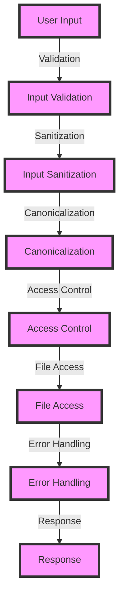

## Introduction
Path traversal prevention is a crucial aspect of web security that refers to the techniques used to prevent attackers from accessing unauthorized files and directories on a web server. This is achieved by ensuring that user input is properly validated and sanitized to prevent malicious requests from being executed. Path traversal attacks can have severe consequences, including data breaches, code injection, and complete system compromise. Every engineer should understand the importance of path traversal prevention, as it is a fundamental concept in web security.

> **Note:** Path traversal prevention is often overlooked, but it is a critical component of a web application's security posture. A single vulnerability can lead to catastrophic consequences.

## Core Concepts
To understand path traversal prevention, it is essential to grasp the following core concepts:
* **Path traversal**: The act of accessing files and directories on a web server by manipulating the URL or file system.
* **Directory traversal**: A type of path traversal that involves accessing directories above the current working directory.
* **File inclusion vulnerability**: A vulnerability that allows an attacker to include arbitrary files on the web server.
* **Input validation**: The process of verifying that user input conforms to expected formats and patterns.
* **Input sanitization**: The process of removing or escaping malicious characters from user input.

> **Warning:** Failing to validate and sanitize user input can lead to severe security vulnerabilities, including path traversal attacks.

## How It Works Internally
Path traversal prevention involves a combination of techniques, including:
1. **Input validation**: Verifying that user input conforms to expected formats and patterns.
2. **Input sanitization**: Removing or escaping malicious characters from user input.
3. **Canonicalization**: Converting file paths to a standardized format to prevent directory traversal attacks.
4. **Access control**: Implementing strict access controls to prevent unauthorized access to files and directories.

> **Tip:** Using a whitelist approach to input validation can help prevent path traversal attacks by only allowing specific, expected input formats.

## Code Examples
### Example 1: Basic Path Traversal Prevention
```python
import os

def prevent_path_traversal(file_path):
    # Canonicalize the file path
    canonical_path = os.path.abspath(file_path)
    
    # Check if the file is within the expected directory
    if not canonical_path.startswith('/expected/directory/'):
        raise ValueError("Invalid file path")
    
    # Return the canonicalized file path
    return canonical_path

# Test the function
file_path = '/expected/directory/example.txt'
print(prevent_path_traversal(file_path))
```
### Example 2: Real-World Path Traversal Prevention
```java
import java.io.File;
import java.util.regex.Pattern;

public class PathTraversalPrevention {
    private static final Pattern INVALID_CHARS = Pattern.compile("[^a-zA-Z0-9_/\\-]");

    public static String preventPathTraversal(String filePath) {
        // Remove invalid characters from the file path
        String sanitizedPath = INVALID_CHARS.matcher(filePath).replaceAll("");
        
        // Canonicalize the file path
        File canonicalFile = new File(sanitizedPath);
        String canonicalPath = canonicalFile.getAbsolutePath();
        
        // Check if the file is within the expected directory
        if (!canonicalPath.startsWith("/expected/directory/")) {
            throw new RuntimeException("Invalid file path");
        }
        
        // Return the canonicalized file path
        return canonicalPath;
    }

    public static void main(String[] args) {
        String filePath = "/expected/directory/example.txt";
        System.out.println(preventPathTraversal(filePath));
    }
}
```
### Example 3: Advanced Path Traversal Prevention
```javascript
const path = require('path');
const fs = require('fs');

function preventPathTraversal(filePath) {
    // Canonicalize the file path
    const canonicalPath = path.resolve(filePath);
    
    // Check if the file is within the expected directory
    if (!canonicalPath.startsWith('/expected/directory/')) {
        throw new Error('Invalid file path');
    }
    
    // Check if the file exists and is readable
    if (!fs.existsSync(canonicalPath) || !fs.accessSync(canonicalPath, fs.constants.R_OK)) {
        throw new Error('File not found or not readable');
    }
    
    // Return the canonicalized file path
    return canonicalPath;
}

// Test the function
const filePath = '/expected/directory/example.txt';
console.log(preventPathTraversal(filePath));
```
## Visual Diagram

The visual diagram illustrates the path traversal prevention process, which involves input validation, sanitization, canonicalization, access control, file access, error handling, and response.

> **Interview:** Can you explain the difference between input validation and input sanitization? How do they relate to path traversal prevention?

## Comparison
| Approach | Time Complexity | Space Complexity | Pros | Cons | Best For |
| --- | --- | --- | --- | --- | --- |
| Whitelisting | O(1) | O(1) | Prevents path traversal attacks, easy to implement | May not cover all possible input formats | Simple web applications |
| Blacklisting | O(n) | O(n) | Can cover a wide range of input formats | May not prevent all path traversal attacks, complex to maintain | Complex web applications |
| Canonicalization | O(1) | O(1) | Prevents directory traversal attacks, easy to implement | May not prevent all path traversal attacks | Web applications with simple file systems |
| Access Control | O(1) | O(1) | Prevents unauthorized access to files and directories, easy to implement | May not prevent all path traversal attacks | Web applications with complex access control requirements |

## Real-world Use Cases
1. **Dropbox**: Dropbox uses a combination of input validation, sanitization, and canonicalization to prevent path traversal attacks on their file sharing platform.
2. **Google Drive**: Google Drive uses a whitelist approach to input validation to prevent path traversal attacks on their file storage platform.
3. **Amazon S3**: Amazon S3 uses a combination of access control and canonicalization to prevent path traversal attacks on their object storage platform.

> **Tip:** Using a combination of techniques, such as input validation, sanitization, and canonicalization, can provide robust protection against path traversal attacks.

## Common Pitfalls
1. **Failing to validate user input**: Not validating user input can lead to path traversal attacks.
2. **Using blacklisting instead of whitelisting**: Using blacklisting instead of whitelisting can lead to vulnerabilities in path traversal prevention.
3. **Not canonicalizing file paths**: Not canonicalizing file paths can lead to directory traversal attacks.
4. **Not implementing access control**: Not implementing access control can lead to unauthorized access to files and directories.

> **Warning:** Failing to address these common pitfalls can lead to severe security vulnerabilities, including path traversal attacks.

## Interview Tips
1. **What is the difference between input validation and input sanitization?**: The candidate should explain that input validation checks if the input conforms to expected formats, while input sanitization removes or escapes malicious characters from the input.
2. **How do you prevent path traversal attacks?**: The candidate should explain that a combination of techniques, such as input validation, sanitization, and canonicalization, can prevent path traversal attacks.
3. **What is the importance of access control in path traversal prevention?**: The candidate should explain that access control is essential to prevent unauthorized access to files and directories.

> **Interview:** Can you explain how you would implement path traversal prevention in a web application? What techniques would you use, and why?

## Key Takeaways
* Path traversal prevention is a critical component of web security.
* Input validation, sanitization, and canonicalization are essential techniques in path traversal prevention.
* Access control is crucial to prevent unauthorized access to files and directories.
* A combination of techniques, such as whitelisting, blacklisting, and access control, can provide robust protection against path traversal attacks.
* Failing to address common pitfalls, such as failing to validate user input and not canonicalizing file paths, can lead to severe security vulnerabilities.
* Path traversal prevention is a complex topic that requires a deep understanding of web security, input validation, and access control.
* The time complexity of path traversal prevention techniques can range from O(1) to O(n), depending on the approach used.
* The space complexity of path traversal prevention techniques can range from O(1) to O(n), depending on the approach used.