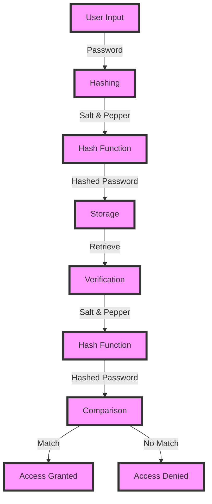

## Introduction
Storing passwords securely is a critical aspect of web development, and two common techniques used to achieve this are **salting** and **peppering**. In this section, we will delve into the world of password storage, exploring why these techniques matter, and their real-world relevance. 
> **Note:** Password storage is a critical aspect of web security, and improper storage can lead to devastating consequences, such as data breaches and unauthorized access.

Password storage is a crucial aspect of web security, and it is essential to understand the differences between salting and peppering. Salting involves adding a random value to the password before hashing, while peppering involves adding a secret key to the password before hashing. Both techniques aim to prevent attackers from using precomputed tables (rainbow tables) to crack passwords. 
> **Warning:** Storing passwords in plain text or using weak hashing algorithms can lead to severe security breaches.

In real-world scenarios, password storage is a common requirement for web applications, and understanding the best practices for storing passwords securely is vital. Companies like **Google**, **Facebook**, and **Amazon** prioritize password security, using a combination of salting, peppering, and other techniques to protect user credentials.

## Core Concepts
To understand salting and peppering, it is essential to grasp the following core concepts:
- **Hashing**: A one-way process that takes input data (password) and produces a fixed-size output (hash).
- **Salting**: Adding a random value (salt) to the password before hashing to prevent rainbow table attacks.
- **Peppering**: Adding a secret key (pepper) to the password before hashing to add an extra layer of security.
- **Password storage**: The process of storing passwords securely in a database or other storage system.

Mental models for understanding salting and peppering include:
- **Salt as a randomizer**: Salting adds randomness to the password, making it harder for attackers to use precomputed tables.
- **Pepper as a secret key**: Peppering adds a secret key to the password, making it harder for attackers to access the password even if they have the salt.

Key terminology includes:
- **Hash function**: A function that takes input data and produces a fixed-size output (hash).
- **Salt**: A random value added to the password before hashing.
- **Pepper**: A secret key added to the password before hashing.

## How It Works Internally
The internal mechanics of salting and peppering involve the following steps:
1. **Password input**: The user enters their password.
2. **Salt generation**: A random salt is generated and added to the password.
3. **Pepper addition**: A secret pepper is added to the password (optional).
4. **Hashing**: The password, salt, and pepper (if used) are hashed using a hash function.
5. **Storage**: The resulting hash is stored in a database or other storage system.

The under-the-hood mechanics of salting and peppering involve the use of hash functions, such as **SHA-256** or **Argon2**, which have a time complexity of O(1) and a space complexity of O(1). 
> **Tip:** Using a sufficient work factor (e.g., iteration count) when generating the salt and pepper can significantly improve password security.

## Code Examples
### Example 1: Basic Salting (Python)
```python
import hashlib
import secrets

def hash_password(password):
    # Generate a random salt
    salt = secrets.token_bytes(16)
    # Hash the password with the salt
    hashed_password = hashlib.pbkdf2_hmac('sha256', password.encode('utf-8'), salt, 100000)
    return salt + hashed_password

def verify_password(stored_password, provided_password):
    # Extract the salt and hashed password
    salt = stored_password[:16]
    stored_hash = stored_password[16:]
    # Hash the provided password with the same salt
    provided_hash = hashlib.pbkdf2_hmac('sha256', provided_password.encode('utf-8'), salt, 100000)
    # Compare the stored hash with the provided hash
    return stored_hash == provided_hash

# Example usage:
password = "mysecretpassword"
stored_password = hash_password(password)
print(verify_password(stored_password, password))  # True
print(verify_password(stored_password, "wrongpassword"))  # False
```

### Example 2: Peppering with a Secret Key (Java)
```java
import java.security.SecureRandom;
import java.security.spec.KeySpec;
import javax.crypto.SecretKeyFactory;
import javax.crypto.spec.PBEKeySpec;
import java.util.Base64;

public class PasswordStorage {
    private static final String ALGORITHM = "PBKDF2WithHmacSHA256";
    private static final int ITERATIONS = 100000;
    private static final int KEY_LENGTH = 256;
    private static final SecureRandom random = new SecureRandom();

    public static String hashPassword(String password, String pepper) {
        // Generate a random salt
        byte[] salt = new byte[16];
        random.nextBytes(salt);
        // Hash the password with the salt and pepper
        KeySpec spec = new PBEKeySpec(password.toCharArray(), salt, ITERATIONS, KEY_LENGTH);
        SecretKeyFactory f = SecretKeyFactory.getInstance(ALGORITHM);
        byte[] hashedPassword = f.generateSecret(spec).getEncoded();
        // Combine the salt, pepper, and hashed password
        byte[] result = new byte[salt.length + pepper.getBytes().length + hashedPassword.length];
        System.arraycopy(salt, 0, result, 0, salt.length);
        System.arraycopy(pepper.getBytes(), 0, result, salt.length, pepper.getBytes().length);
        System.arraycopy(hashedPassword, 0, result, salt.length + pepper.getBytes().length, hashedPassword.length);
        return Base64.getEncoder().encodeToString(result);
    }

    public static boolean verifyPassword(String storedPassword, String providedPassword, String pepper) {
        // Extract the salt, pepper, and hashed password
        byte[] storedBytes = Base64.getDecoder().decode(storedPassword);
        byte[] salt = new byte[16];
        System.arraycopy(storedBytes, 0, salt, 0, salt.length);
        byte[] storedHash = new byte[storedBytes.length - salt.length - pepper.getBytes().length];
        System.arraycopy(storedBytes, salt.length + pepper.getBytes().length, storedHash, 0, storedHash.length);
        // Hash the provided password with the same salt and pepper
        KeySpec spec = new PBEKeySpec(providedPassword.toCharArray(), salt, ITERATIONS, KEY_LENGTH);
        SecretKeyFactory f = SecretKeyFactory.getInstance(ALGORITHM);
        byte[] providedHash = f.generateSecret(spec).getEncoded();
        // Compare the stored hash with the provided hash
        return java.util.Arrays.equals(storedHash, providedHash);
    }

    public static void main(String[] args) {
        String password = "mysecretpassword";
        String pepper = "mysecretpepper";
        String storedPassword = hashPassword(password, pepper);
        System.out.println(verifyPassword(storedPassword, password, pepper));  // true
        System.out.println(verifyPassword(storedPassword, "wrongpassword", pepper));  // false
    }
}
```

### Example 3: Advanced Salting and Peppering with Argon2 (C++)
```cpp
#include <argon2.h>
#include <iostream>
#include <string>

std::string hashPassword(const std::string& password, const std::string& pepper) {
    // Generate a random salt
    unsigned char salt[16];
    argon2_generate_salt(salt, 16);
    // Hash the password with the salt and pepper
    unsigned char hashedPassword[32];
    argon2_hash(1, 65536, 1, (const unsigned char*)password.c_str(), password.size(),
                salt, 16, (const unsigned char*)pepper.c_str(), pepper.size(),
                hashedPassword, 32, Argon2_id);
    // Combine the salt, pepper, and hashed password
    std::string result((const char*)salt, 16);
    result += (const char*)pepper.c_str();
    result += (const char*)hashedPassword;
    return result;
}

bool verifyPassword(const std::string& storedPassword, const std::string& providedPassword, const std::string& pepper) {
    // Extract the salt, pepper, and hashed password
    unsigned char salt[16];
    std::copy(storedPassword.begin(), storedPassword.begin() + 16, salt);
    unsigned char storedHash[32];
    std::copy(storedPassword.begin() + 16 + pepper.size(), storedPassword.begin() + 16 + pepper.size() + 32, storedHash);
    // Hash the provided password with the same salt and pepper
    unsigned char providedHash[32];
    argon2_hash(1, 65536, 1, (const unsigned char*)providedPassword.c_str(), providedPassword.size(),
                salt, 16, (const unsigned char*)pepper.c_str(), pepper.size(),
                providedHash, 32, Argon2_id);
    // Compare the stored hash with the provided hash
    return std::equal(storedHash, storedHash + 32, providedHash);
}

int main() {
    std::string password = "mysecretpassword";
    std::string pepper = "mysecretpepper";
    std::string storedPassword = hashPassword(password, pepper);
    std::cout << std::boolalpha << verifyPassword(storedPassword, password, pepper) << std::endl;  // true
    std::cout << std::boolalpha << verifyPassword(storedPassword, "wrongpassword", pepper) << std::endl;  // false
    return 0;
}
```

## Visual Diagram

The diagram illustrates the password storage and verification process, showcasing the use of salting and peppering to secure passwords.

## Comparison
| Approach | Time Complexity | Space Complexity | Pros | Cons | Best For |
| --- | --- | --- | --- | --- | --- |
| Salting | O(1) | O(1) | Prevents rainbow table attacks, easy to implement | Limited security against brute-force attacks | Simple password storage |
| Peppering | O(1) | O(1) | Adds an extra layer of security, prevents password cracking | Requires a secret key, can be complex to implement | High-security password storage |
| Argon2 | O(n) | O(n) | Highly secure, resistant to brute-force attacks | Computationally expensive, requires significant resources | High-security password storage, password-based authentication |
| PBKDF2 | O(n) | O(1) | Secure, widely adopted | Computationally expensive, vulnerable to side-channel attacks | Password-based authentication, password storage |

## Real-world Use Cases
1. **Google**: Google uses a combination of salting and peppering to secure user passwords. They also employ additional security measures, such as two-factor authentication and password strength requirements.
2. **Facebook**: Facebook uses a variant of the Argon2 algorithm to hash and store user passwords. They also implement additional security measures, such as password strength requirements and two-factor authentication.
3. **Amazon**: Amazon uses a combination of salting, peppering, and the PBKDF2 algorithm to secure user passwords. They also employ additional security measures, such as two-factor authentication and password strength requirements.

## Common Pitfalls
1. **Insufficient salt size**: Using a salt that is too small can make it vulnerable to rainbow table attacks.
```python
# Wrong way: using a small salt
salt = secrets.token_bytes(4)
```
```python
# Right way: using a sufficient salt size
salt = secrets.token_bytes(16)
```
2. **Inadequate pepper security**: Failing to keep the pepper secret can compromise password security.
```java
// Wrong way: storing the pepper in plain text
String pepper = "mysecretpepper";
```
```java
// Right way: storing the pepper securely
byte[] pepper = loadPepperFromSecureStorage();
```
3. **Insecure hash function**: Using an insecure hash function, such as MD5 or SHA-1, can compromise password security.
```cpp
// Wrong way: using an insecure hash function
unsigned char hashedPassword[32];
MD5((const unsigned char*)password.c_str(), password.size(), hashedPassword);
```
```cpp
// Right way: using a secure hash function
unsigned char hashedPassword[32];
argon2_hash(1, 65536, 1, (const unsigned char*)password.c_str(), password.size(),
            salt, 16, (const unsigned char*)pepper.c_str(), pepper.size(),
            hashedPassword, 32, Argon2_id);
```
4. **Inadequate iteration count**: Using an insufficient iteration count can make the hash function vulnerable to brute-force attacks.
```python
# Wrong way: using a low iteration count
hashed_password = hashlib.pbkdf2_hmac('sha256', password.encode('utf-8'), salt, 100)
```
```python
# Right way: using a sufficient iteration count
hashed_password = hashlib.pbkdf2_hmac('sha256', password.encode('utf-8'), salt, 100000)
```

## Interview Tips
1. **What is the purpose of salting and peppering in password storage?**
	* Weak answer: Salting and peppering are used to make passwords more secure.
	* Strong answer: Salting and peppering are used to prevent rainbow table attacks and add an extra layer of security to password storage. Salting randomizes the password, making it harder for attackers to use precomputed tables, while peppering adds a secret key to the password, making it harder for attackers to access the password even if they have the salt.
2. **How do you implement salting and peppering in a password storage system?**
	* Weak answer: I would use a library or framework to implement salting and peppering.
	* Strong answer: I would use a secure hash function, such as Argon2 or PBKDF2, and generate a random salt and pepper. I would then combine the salt, pepper, and password, and hash the result using the chosen hash function. The resulting hash would be stored in a secure database or storage system.
3. **What are some common pitfalls to avoid when implementing salting and peppering?**
	* Weak answer: I would avoid using a small salt size and an insecure hash function.
	* Strong answer: I would avoid using a small salt size, an insecure hash function, and inadequate iteration count. I would also ensure that the pepper is kept secret and stored securely, and that the hash function is implemented correctly to prevent side-channel attacks.

## Key Takeaways
* **Salting and peppering are essential for secure password storage**: Salting randomizes the password, making it harder for attackers to use precomputed tables, while peppering adds a secret key to the password, making it harder for attackers to access the password even if they have the salt.
* **Use a secure hash function**: Choose a secure hash function, such as Argon2 or PBKDF2, to hash and store passwords.
* **Generate a random salt and pepper**: Use a cryptographically secure pseudo-random number generator to generate a random salt and pepper.
* **Combine the salt, pepper, and password**: Combine the salt, pepper, and password, and hash the result using the chosen hash function.
* **Store the resulting hash securely**: Store the resulting hash in a secure database or storage system, such as a Hardware Security Module (HSM) or a secure key-value store.
* **Avoid common pitfalls**: Avoid using a small salt size, an insecure hash function, and inadequate iteration count. Ensure that the pepper is kept secret and stored securely, and that the hash function is implemented correctly to prevent side-channel attacks.
* **Use a sufficient iteration count**: Use a sufficient iteration count, such as 100,000, to make the hash function computationally expensive and resistant to brute-force attacks.
* **Implement additional security measures**: Implement additional security measures, such as two-factor authentication and password strength requirements, to further secure password storage and authentication.